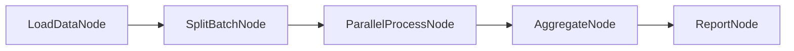

# KayGraph Parallel Batch Processing

This workbook demonstrates parallel batch processing using KayGraph, showing how to process large datasets efficiently with concurrent execution.

## Overview

Parallel batch processing system that:
- Processes multiple items concurrently
- Demonstrates speedup over sequential processing
- Handles I/O-bound operations efficiently
- Provides progress tracking and error handling

## Design

### Processing Graphs



### Comparison Graphs

Sequential vs Parallel execution paths for benchmarking.

### Node Descriptions

- **LoadDataNode**: Loads items to process (files, URLs, data records)
- **SplitBatchNode**: Divides data into optimal batch sizes
- **ParallelProcessNode**: Processes batches concurrently
- **AggregateNode**: Combines results from all batches
- **ReportNode**: Generates performance report

### Key Features

1. **Automatic Batching**: Optimal batch size calculation
2. **Progress Tracking**: Real-time progress updates
3. **Error Resilience**: Handles individual item failures
4. **Performance Metrics**: Detailed timing and throughput stats

### Shared State Structure

```python
{
    "items": List[Any],              # Items to process
    "batch_size": int,               # Optimal batch size
    "batches": List[List[Any]],      # Split batches
    "results": List[Dict[str, Any]], # Processing results
    "metrics": {
        "total_items": int,
        "processed": int,
        "failed": int,
        "start_time": float,
        "end_time": float,
        "throughput": float
    }
}
```

### KayGraph Features Used

- **ParallelBatchNode**: Concurrent batch processing
- **AsyncParallelBatchNode**: Async I/O operations
- **MetricsNode**: Performance tracking
- **ThreadPoolExecutor**: Configurable parallelism