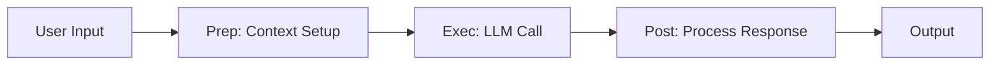

# KayGraph Agent Intelligence

## Overview

This example demonstrates the fundamental "Intelligence" building block - the core LLM interaction pattern. This is the only truly "AI" component in an agent system. Everything else is traditional software engineering.

Based on the AI Cookbook's agent building blocks pattern, this shows how to:
- Make basic LLM calls with multiple providers (OpenAI, Anthropic, Groq, Ollama)
- Use KayGraph's node structure to separate concerns
- Handle context preparation and response processing

## Key Concepts

**Intelligence** is simply sending text to an LLM and getting text back. The challenge isn't the LLM call itself - it's everything you build around it:
- Context preparation (prep phase)
- Making the expensive LLM call (exec phase) 
- Processing and routing the response (post phase)

## Usage

```bash
# Basic usage
python main.py "What is artificial intelligence?"

# With specific provider
OPENAI_API_KEY=sk-... python main.py "Explain quantum computing"

# With local Ollama
OLLAMA_API_BASE=http://localhost:11434/v1 python main.py "Write a haiku"

# Interactive mode
python main.py --interactive
```

## Examples

The workbook includes several examples:

1. **Basic Intelligence Node** - Simple question answering
2. **Context-Aware Intelligence** - Includes system prompts and context
3. **Multi-Provider Intelligence** - Supports OpenAI, Anthropic, Groq, Ollama
4. **Streaming Intelligence** - Real-time response streaming
5. **Temperature Control** - Creativity vs determinism

## Requirements

- Python 3.8+
- KayGraph framework
- One of: OpenAI API key, Anthropic API key, Groq API key, or Ollama running locally

## Key Learnings

1. **LLM calls are expensive** - Make them count by preparing good context
2. **Keep it simple** - This is just text in, text out
3. **Provider agnostic** - Don't lock yourself to one LLM provider
4. **Separate concerns** - Use KayGraph's phases to organize your logic

## Architecture



This forms the foundation for all other agent patterns - memory, tools, validation, etc. are all built on top of this basic intelligence component.