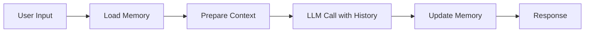

# KayGraph Agent Memory

## Overview

This example demonstrates the "Memory" building block - context persistence across interactions. LLMs are stateless and don't remember anything from previous messages. Memory is simply storing and passing conversation state - something we've been doing in web apps forever.

Based on the AI Cookbook's agent building blocks pattern, this shows how to:
- Maintain conversation history across multiple interactions
- Implement different memory strategies (full, windowed, summarized)
- Use KayGraph's shared state for memory management
- Handle memory overflow and context limits

## Key Concepts

**Memory** enables multi-turn conversations by:
- Storing previous messages (user and assistant)
- Including relevant history in each LLM call
- Managing context window limits
- Optionally summarizing old conversations

Without memory, each LLM interaction starts from scratch, making coherent conversations impossible.

## Usage

```bash
# Basic conversation with memory
python main.py --interactive

# Test memory patterns
python main.py --example all

# Specific memory strategy
python main.py --memory-type windowed --window-size 10

# Memory with summarization
python main.py --memory-type summarized --max-messages 20
```

## Examples

The workbook includes several memory patterns:

1. **Basic Memory Node** - Simple conversation history
2. **Windowed Memory Node** - Keep only recent N messages
3. **Summarized Memory Node** - Compress old conversations
4. **Semantic Memory Node** - Store and retrieve by relevance
5. **Persistent Memory Node** - Save/load from disk

## Memory Strategies

### Full Memory
Stores complete conversation history. Simple but can exceed context limits.

### Windowed Memory
Keeps only the most recent N messages. Prevents overflow but loses old context.

### Summarized Memory
Periodically summarizes old messages to compress history while retaining key information.

### Semantic Memory
Stores messages with embeddings and retrieves based on relevance to current query.

## Architecture



## Key Learnings

1. **Memory is just state management** - No magic, just storing messages
2. **Context windows are limited** - Plan for overflow
3. **Not all history is relevant** - Consider selective memory
4. **Memory affects cost** - More context = higher API costs
5. **Different strategies for different uses** - Chat vs analysis vs creative

## Requirements

- Python 3.8+
- KayGraph framework
- LLM provider (OpenAI, Anthropic, Groq, or Ollama)
- Optional: JSON for persistence, pickle for semantic memory