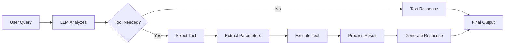

# KayGraph Agent Tools

## Overview

This example demonstrates the "Tools" building block - external system integration capabilities. Pure text generation is limited. Tools let the LLM say "I need to call this function with these parameters" and your code handles the actual execution.

Based on the AI Cookbook's agent building blocks pattern, this shows how to:
- Define tools with clear descriptions and parameters
- Let LLMs decide when and how to use tools
- Execute tool calls safely and handle results
- Chain tool usage with conversation flow
- Build complex workflows with multiple tools

## Key Concepts

**Tools** enable LLMs to interact with the real world by:
- Calling APIs (weather, search, databases)
- Performing calculations
- Reading/writing files
- Triggering actions
- Accessing real-time data

Without tools, LLMs can only generate text. With tools, they become capable of taking actions.

## Usage

```bash
# Basic tool usage
python main.py "What's the weather in Paris?"

# Multiple tools
python main.py "Compare the weather in Paris and London"

# Calculator example
python main.py "What's 2549 * 7823?"

# Time-aware example
python main.py "What time is it in Tokyo?"

# Interactive mode with tools
python main.py --interactive

# Test specific examples
python main.py --example all
```

## Examples

The workbook includes several tool patterns:

1. **Weather Tool Node** - Real weather API integration
2. **Calculator Tool Node** - Math operations
3. **Time Tool Node** - Timezone-aware time queries
4. **Multi-Tool Node** - Multiple tools in one node
5. **Tool Chain Node** - Tools that trigger other tools

## Tool Design Principles

### Good Tool Design
- Clear, specific function names
- Well-documented parameters
- Single responsibility
- Predictable behavior
- Proper error messages

### Tool Safety
- Validate all inputs
- Limit scope of actions
- Add confirmation for dangerous operations
- Log all tool usage
- Handle failures gracefully

## Architecture



## Available Tools

### Weather Tool
Gets current weather for any location using Open-Meteo API (no key required).

### Calculator Tool
Performs basic and advanced math operations.

### Time Tool
Gets current time in different timezones.

### Search Tool (Mock)
Demonstrates search functionality pattern.

### Database Tool (Mock)
Shows database query patterns.

## Key Learnings

1. **Tools are just functions** - Nothing magical, just function calls
2. **LLM picks what to call** - Based on descriptions and context
3. **Parameters matter** - Clear schemas prevent errors
4. **Chain tools carefully** - One tool's output can trigger another
5. **Always validate** - Never trust LLM-generated parameters blindly

## Requirements

- Python 3.8+
- KayGraph framework
- requests (for API calls)
- No API keys needed (uses free APIs)