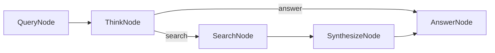

# KayGraph Agent Implementation

This workbook demonstrates how to build an autonomous research agent using KayGraph that can search the web and answer questions.

## Overview

An intelligent agent that:
- Understands user queries
- Decides when to search for information
- Synthesizes search results
- Provides comprehensive answers

## Design

### Graph Structure



### Node Descriptions

- **QueryNode**: Processes and validates user query
- **ThinkNode**: Decides whether to search or answer directly
- **SearchNode**: Performs web search when needed
- **SynthesizeNode**: Processes and summarizes search results
- **AnswerNode**: Generates final response

### Key Features

1. **Autonomous Decision Making**: Agent decides when to search
2. **Search Integration**: Web search capability for current information
3. **Result Synthesis**: Intelligent summarization of findings
4. **Context Awareness**: Maintains query context throughout

### Shared State Structure

```python
{
    "query": str,                      # User's question
    "thought_process": str,            # Agent's reasoning
    "needs_search": bool,              # Whether search is needed
    "search_query": str,               # Refined search query
    "search_results": List[Dict],      # Search results
    "synthesized_info": str,           # Processed information
    "final_answer": str                # Final response
}
```

### KayGraph Features Used

- **ValidatedNode**: Input validation for queries
- **Node branching**: Conditional execution paths
- **Error handling**: Robust search failure recovery
- **Logging**: Detailed decision tracking