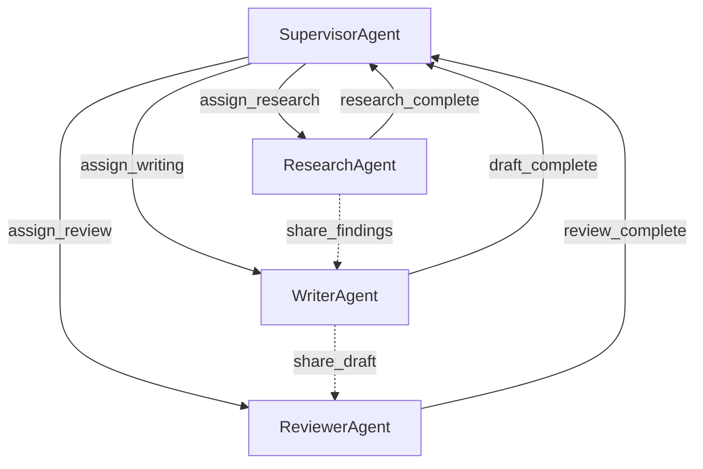

# KayGraph Multi-Agent Implementation

This workbook demonstrates how to build a multi-agent system using KayGraph where multiple specialized agents collaborate through asynchronous communication.

## Overview

A multi-agent system with:
- Multiple specialized agents with different roles
- Asynchronous message passing between agents
- Coordination through a supervisor agent
- Shared workspace for collaboration

## Design

### Agent Communication Graph



### Agent Types

1. **SupervisorAgent**: Coordinates tasks and manages workflow
2. **ResearchAgent**: Gathers information on topics
3. **WriterAgent**: Creates content based on research
4. **ReviewerAgent**: Reviews and improves content

### Key Features

1. **Agent Specialization**: Each agent has specific capabilities
2. **Message Queue**: Asynchronous communication system
3. **Shared Workspace**: Common area for collaboration
4. **Task Tracking**: Monitor progress across agents

### Shared State Structure

```python
{
    "task": str,                          # Main task description
    "agents": Dict[str, Agent],           # Active agents
    "message_queue": List[Message],       # Pending messages
    "workspace": Dict[str, Any],          # Shared data
    "task_status": Dict[str, str],        # Task completion status
    "final_output": str                   # Final result
}
```

### Message Structure

```python
{
    "from_agent": str,      # Sender agent ID
    "to_agent": str,        # Recipient agent ID
    "message_type": str,    # Type of message
    "content": Any,         # Message payload
    "timestamp": float      # Message timestamp
}
```

### KayGraph Features Used

- **AsyncNode**: Asynchronous agent execution
- **AsyncGraph**: Coordinate async agents
- **Node communication**: Message passing patterns
- **Shared state**: Collaborative workspace