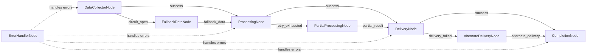

# Fault-Tolerant Workflow Design

## High-Level Requirements

Build a workflow that demonstrates KayGraph's fault tolerance capabilities through execution hooks, circuit breakers, retry patterns, and graceful degradation. Show how robust workflows handle various failure scenarios.

## Graph Structure



## Node Descriptions

1. **DataCollectorNode**: Collects data with circuit breaker pattern
2. **ProcessingNode**: Processes data with retry and fallback mechanisms
3. **DeliveryNode**: Delivers results with multiple channel support
4. **CompletionNode**: Finalizes workflow with validation
5. **FallbackDataNode**: Provides cached/default data when primary fails
6. **PartialProcessingNode**: Handles partial processing scenarios
7. **AlternateDeliveryNode**: Alternative delivery mechanism
8. **ErrorHandlerNode**: Centralized error management

## Fault Tolerance Patterns

### Circuit Breaker Pattern
```python
class CircuitBreaker:
    def __init__(self, failure_threshold=5, timeout=60):
        self.failure_threshold = failure_threshold
        self.timeout = timeout
        self.failure_count = 0
        self.last_failure_time = None
        self.state = "CLOSED"  # CLOSED, OPEN, HALF_OPEN
```

### Retry with Exponential Backoff
```python
def retry_with_backoff(func, max_retries=3, base_delay=1):
    for attempt in range(max_retries):
        try:
            return func()
        except Exception as e:
            if attempt == max_retries - 1:
                raise
            delay = base_delay * (2 ** attempt)
            time.sleep(delay)
```

### Graceful Degradation
- Primary service fails → Use cached data
- Processing fails → Return partial results
- Delivery fails → Use alternate channels
- Critical errors → Fail gracefully with cleanup