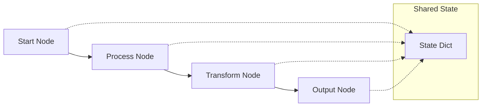

# KayGraph Workflow Basic

## Overview

This example demonstrates basic workflow patterns - simple task orchestration and linear flows. Workflows connect multiple operations in a structured way, enabling complex processes through simple building blocks.

Based on the AI Cookbook's workflow introduction, this shows how to:
- Build linear workflows with KayGraph nodes
- Pass data between workflow steps  
- Create reusable workflow patterns
- Handle workflow state management
- Implement common patterns like data processing pipelines

## Key Concepts

**Workflows** enable complex processes by:
- Connecting multiple operations sequentially
- Managing state across steps
- Handling data transformations
- Providing clear execution flow
- Enabling error propagation

Basic workflows form the foundation for more complex patterns like routing and parallelization.

## Usage

```bash
# Run simple limerick workflow
python main.py "Write a limerick about Python"

# Run data processing workflow
python main.py --example processing "Process this text data"

# Run multi-step workflow
python main.py --example multi-step

# Run all examples
python main.py --example all

# Interactive mode
python main.py --interactive
```

## Examples

The workbook includes several workflow patterns:

1. **Simple Workflow** - Basic linear flow (input → process → output)
2. **Data Processing Workflow** - Transform data through multiple stages
3. **Multi-Step Workflow** - Complex flows with multiple operations
4. **Stateful Workflow** - Workflows that maintain state between steps
5. **Error Handling Workflow** - Graceful failure management

## Workflow Patterns

### Linear Flow
```
Input → Process → Enhance → Output
```

### Data Pipeline
```
Raw Data → Clean → Transform → Enrich → Store
```

### Multi-Stage Processing
```
Document → Extract → Analyze → Summarize → Report
```

## Key Learnings

1. **Keep workflows simple** - Each step should have a clear purpose
2. **Use shared state wisely** - Pass only necessary data between steps
3. **Make steps reusable** - Design nodes for multiple workflows
4. **Handle errors gracefully** - Each step should handle failures
5. **Document the flow** - Clear names and logging help debugging

## Architecture



## Requirements

- Python 3.8+
- KayGraph framework
- LLM provider (OpenAI, Anthropic, Groq, or Ollama)