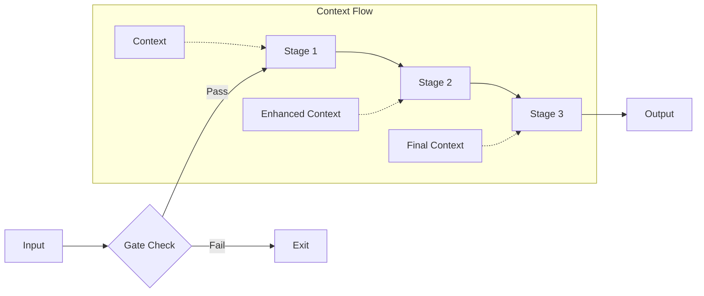

# KayGraph Workflow Prompt Chaining

## Overview

This example demonstrates prompt chaining - sequential processing where each step's output feeds into the next. Prompt chaining enables complex multi-stage reasoning by breaking down tasks into focused steps with gate checks.

Based on the AI Cookbook's prompt chaining pattern, this shows how to:
- Chain multiple LLM calls sequentially
- Pass context between processing stages
- Implement gate checks to validate flow
- Build event extraction pipelines
- Handle conditional processing paths

## Key Concepts

**Prompt Chaining** enables sophisticated processing by:
- Breaking complex tasks into focused steps
- Each step has a specific purpose and output
- Gate checks ensure quality before proceeding
- Context flows through the chain
- Failed gates can short-circuit processing

This pattern is ideal for multi-stage analysis, extraction, and transformation tasks.

## Usage

```bash
# Process calendar event
python main.py "Schedule a meeting with Alice tomorrow at 2pm"

# Process non-calendar text (gate check demo)
python main.py "Send an email to Bob about the project"

# Run specific examples
python main.py --example calendar
python main.py --example document
python main.py --example analysis

# Run all examples
python main.py --example all

# Interactive mode
python main.py --interactive
```

## Examples

The workbook includes several chaining patterns:

1. **Event Extraction Chain** - Extract → Parse → Confirm calendar events
2. **Document Processing Chain** - Read → Extract → Summarize → Format
3. **Analysis Chain** - Analyze → Categorize → Score → Report
4. **Translation Chain** - Detect → Translate → Verify → Polish
5. **Research Chain** - Query → Search → Synthesize → Cite

## Chain Patterns

### Event Processing
```
Input → Is Calendar Event? → Extract Details → Generate Confirmation
              ↓ (No)
            Exit
```

### Document Analysis
```
Document → Extract Text → Identify Topics → Generate Summary → Format Output
```

### Multi-Stage Analysis
```
Data → Initial Analysis → Deep Dive → Synthesis → Final Report
```

## Key Learnings

1. **Clear stage boundaries** - Each step should have one clear purpose
2. **Use gate checks** - Validate before expensive operations
3. **Pass minimal context** - Only forward necessary data
4. **Design for failure** - Handle gate check failures gracefully
5. **Log stage transitions** - Track flow for debugging

## Architecture



## Requirements

- Python 3.8+
- KayGraph framework
- pydantic>=2.0
- LLM provider (OpenAI, Anthropic, Groq, or Ollama)