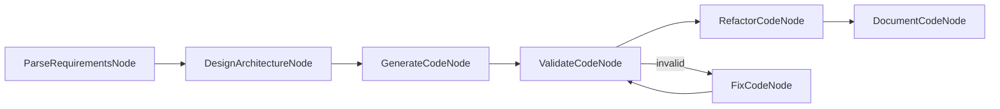

# KayGraph Code Generator Design

## Overview
Build a code generation system that creates code from natural language descriptions using KayGraph's node-based architecture.

## Graph Structure

## Node Descriptions

1. **ParseRequirementsNode**: Extract requirements from natural language
2. **DesignArchitectureNode**: Design code structure and components
3. **GenerateCodeNode**: Generate initial code implementation
4. **ValidateCodeNode**: Validate syntax and logic
5. **FixCodeNode**: Fix validation errors
6. **RefactorCodeNode**: Apply best practices and optimizations
7. **DocumentCodeNode**: Add docstrings and comments

## Utility Functions

- `utils/code_parser.py`: Parse requirements and extract specifications
- `utils/code_templates.py`: Code generation templates
- `utils/code_validator.py`: Syntax and logic validation
- `utils/code_formatter.py`: Code formatting and styling