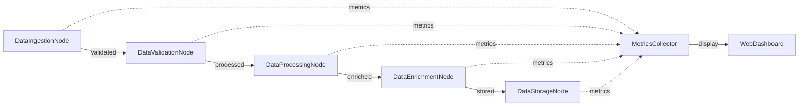

# Metrics Dashboard Design

## High-Level Requirements

Build a production-ready workflow that demonstrates KayGraph's observability features through automatic metrics collection and real-time monitoring.

## Graph Structure

## Node Descriptions

1. **DataIngestionNode**: Simulates data ingestion with random delays (MetricsNode)
2. **DataValidationNode**: Validates data with occasional failures (MetricsNode)
3. **DataProcessingNode**: Heavy processing with retry logic (MetricsNode)
4. **DataEnrichmentNode**: Enriches data with external calls (MetricsNode)
5. **DataStorageNode**: Simulates storage operations (MetricsNode)
6. **MetricsCollector**: Aggregates metrics from all nodes
7. **WebDashboard**: FastAPI server with real-time metrics display

## Utility Functions

1. **simulate_work**: Simulates various workload patterns
2. **collect_metrics**: Aggregates metrics from MetricsNodes
3. **format_metrics**: Formats metrics for dashboard display
4. **create_dashboard**: FastAPI app with WebSocket updates

## Key Features

- Each node inherits from MetricsNode for automatic tracking
- Simulated failures to demonstrate retry metrics
- Variable execution times to show performance patterns
- Real-time WebSocket updates to dashboard
- Historical metrics storage in shared context