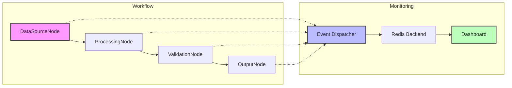

# Real-time Monitoring Design

## Overview

This example implements a real-time monitoring system for KayGraph workflows that provides complete visibility into the execution state without impacting performance.

## High-Level Requirements

1. Track node execution states in real-time
2. Monitor data flow between nodes
3. Capture success/failure events as they happen
4. Maintain <1% performance overhead
5. Support multiple monitoring backends
6. Provide live visualization dashboard

## Architecture

### MonitoringNode
- Extends base Node class with monitoring capabilities
- Intercepts lifecycle events using existing hooks
- Sends events asynchronously to avoid blocking

### Event Dispatcher
- Manages async event queue with batching
- Connection pooling for efficiency
- Circuit breaker for resilience
- Configurable sampling and filtering

### Monitoring Backends
- **Redis**: Pub/Sub for real-time streaming
- **HTTP**: Webhooks for integration
- **Mock**: In-memory for testing

### Dashboard
- FastAPI WebSocket server
- Real-time event streaming
- Network visualization
- Performance metrics

## Workflow Diagram



## Node Descriptions

- **DataSourceNode**: Generates or fetches data (monitored)
- **ProcessingNode**: Transforms data with monitoring
- **ValidationNode**: Validates results with event tracking
- **OutputNode**: Stores results and sends completion events

## Event Schema

```json
{
    "event_id": "uuid",
    "timestamp": "iso8601",
    "node_id": "string",
    "node_type": "string",
    "event_type": "lifecycle|data|error|metric",
    "event_name": "string",
    "data": {
        "state": "string",
        "input_snapshot": "optional",
        "output_snapshot": "optional",
        "error": "optional",
        "metrics": "optional"
    },
    "correlation_id": "string",
    "workflow_id": "string"
}
```

## Performance Optimization

1. **Async Fire-and-Forget**: Events queued, not awaited
2. **Connection Pooling**: Reuse connections
3. **Batching**: Send multiple events together
4. **Sampling**: Configurable event sampling
5. **Circuit Breaker**: Prevent cascade failures
6. **Lightweight Serialization**: Minimal data transfer

## Implementation Notes

- MonitoringNode uses context managers for automatic cleanup
- Event dispatcher runs in separate thread/process
- Dashboard uses WebSockets for push updates
- Redis Pub/Sub for scalable event distribution
- Monitoring can be completely disabled via config