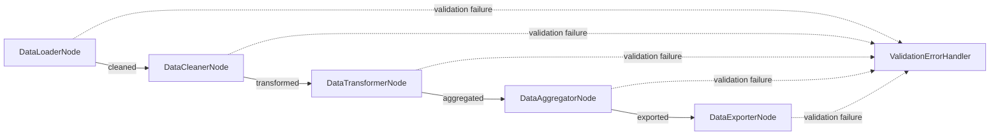

# Validated Pipeline Design

## High-Level Requirements

Build a data processing pipeline that demonstrates strict validation at each stage, preventing bad data propagation and ensuring data quality throughout the workflow.

## Graph Structure



## Node Descriptions

1. **DataLoaderNode**: Loads raw data with schema validation (ValidatedNode)
2. **DataCleanerNode**: Cleans data with quality checks (ValidatedNode)
3. **DataTransformerNode**: Transforms data with business rule validation (ValidatedNode)
4. **DataAggregatorNode**: Aggregates data with statistical validation (ValidatedNode)
5. **DataExporterNode**: Exports data with output contract validation (ValidatedNode)
6. **ValidationErrorHandler**: Handles validation failures gracefully

## Utility Functions

1. **validate_schema**: Validates data structure and types
2. **validate_quality**: Checks data quality metrics
3. **validate_business_rules**: Applies domain-specific rules
4. **generate_validation_report**: Creates detailed validation reports

## Validation Examples

### Schema Validation
```python
def validate_input(self, data):
    required_fields = ["id", "timestamp", "value", "category"]
    for field in required_fields:
        if field not in data:
            raise ValueError(f"Missing required field: {field}")
    return data
```

### Quality Validation
```python
def validate_output(self, data):
    if data["value"] < 0 or data["value"] > 1000:
        raise ValueError(f"Value {data['value']} out of valid range [0, 1000]")
    return data
```