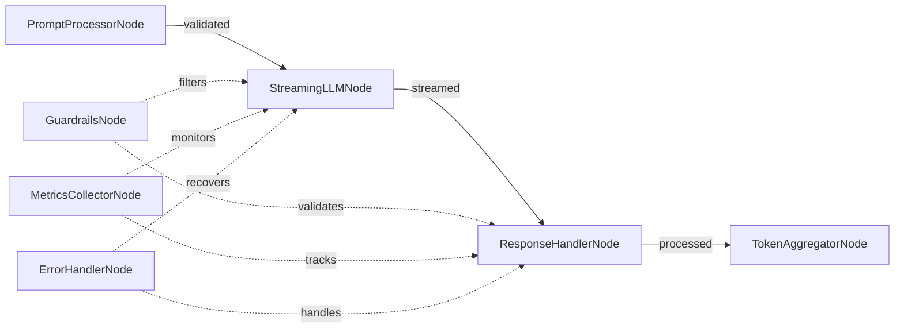

# Streaming LLM Design

## High-Level Requirements

Enhance PocketFlow's streaming LLM concept with KayGraph's production features: metrics collection during streaming, real-time validation, content guardrails, and robust error handling for enterprise LLM applications.

## Graph Structure



## Node Descriptions

1. **PromptProcessorNode**: Processes and validates input prompts (ValidatedNode)
2. **StreamingLLMNode**: Streams LLM responses with metrics collection (MetricsNode)
3. **ResponseHandlerNode**: Handles streaming tokens with real-time validation
4. **TokenAggregatorNode**: Aggregates and analyzes streaming results
5. **GuardrailsNode**: Provides content safety and filtering
6. **MetricsCollectorNode**: Collects streaming performance metrics
7. **ErrorHandlerNode**: Handles streaming failures and recovery

## Streaming Enhancements

### Real-time Metrics
```python
class StreamingMetrics:
    def __init__(self):
        self.token_count = 0
        self.start_time = time.time()
        self.token_times = []
        self.quality_scores = []
    
    def track_token(self, token, quality_score=None):
        self.token_count += 1
        current_time = time.time()
        self.token_times.append(current_time)
        if quality_score:
            self.quality_scores.append(quality_score)
```

### Streaming Guardrails
```python
class StreamingGuardrails:
    def __init__(self):
        self.safety_filters = ["toxicity", "bias", "privacy"]
        self.accumulated_text = ""
    
    def validate_token(self, token):
        self.accumulated_text += token
        # Check for safety issues in real-time
        return self.is_safe(token, self.accumulated_text)
```

### Error Recovery
- Resume streaming from last successful token
- Fallback to cached responses
- Graceful degradation with partial responses
- Circuit breaker for API protection