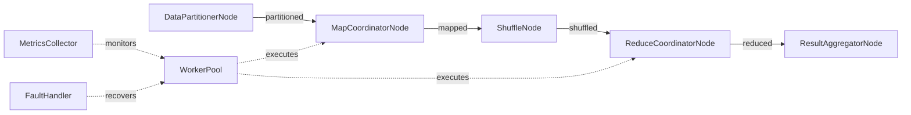

# Distributed MapReduce Design

## High-Level Requirements

Demonstrate KayGraph's distributed execution capabilities through a production-ready MapReduce implementation that can coordinate work across multiple workers with fault tolerance, metrics collection, and result validation.

## Graph Structure



## Node Descriptions

1. **DataPartitionerNode**: Splits input data into worker-sized partitions (ValidatedNode)
2. **MapCoordinatorNode**: Coordinates map tasks across workers (MetricsNode)
3. **ShuffleNode**: Shuffles and sorts intermediate results
4. **ReduceCoordinatorNode**: Coordinates reduce tasks across workers (MetricsNode)
5. **ResultAggregatorNode**: Aggregates final results with validation
6. **WorkerPool**: Manages distributed worker processes
7. **MetricsCollector**: Collects metrics from all workers
8. **FaultHandler**: Handles worker failures and recovery

## Distribution Patterns

### Work Partitioning
```python
class DataPartitioner:
    def partition_data(self, data, num_workers):
        chunk_size = len(data) // num_workers
        partitions = []
        for i in range(num_workers):
            start = i * chunk_size
            end = start + chunk_size if i < num_workers - 1 else len(data)
            partitions.append(data[start:end])
        return partitions
```

### Worker Coordination
```python
class WorkerCoordinator:
    def __init__(self, num_workers):
        self.workers = [Worker(i) for i in range(num_workers)]
        self.task_queue = Queue()
        self.result_queue = Queue()
    
    async def distribute_tasks(self, tasks):
        # Distribute tasks across workers
        for task in tasks:
            await self.task_queue.put(task)
```

### Fault Tolerance
- Worker health monitoring
- Task redistribution on failure
- Checkpoint-based recovery
- Graceful worker replacement