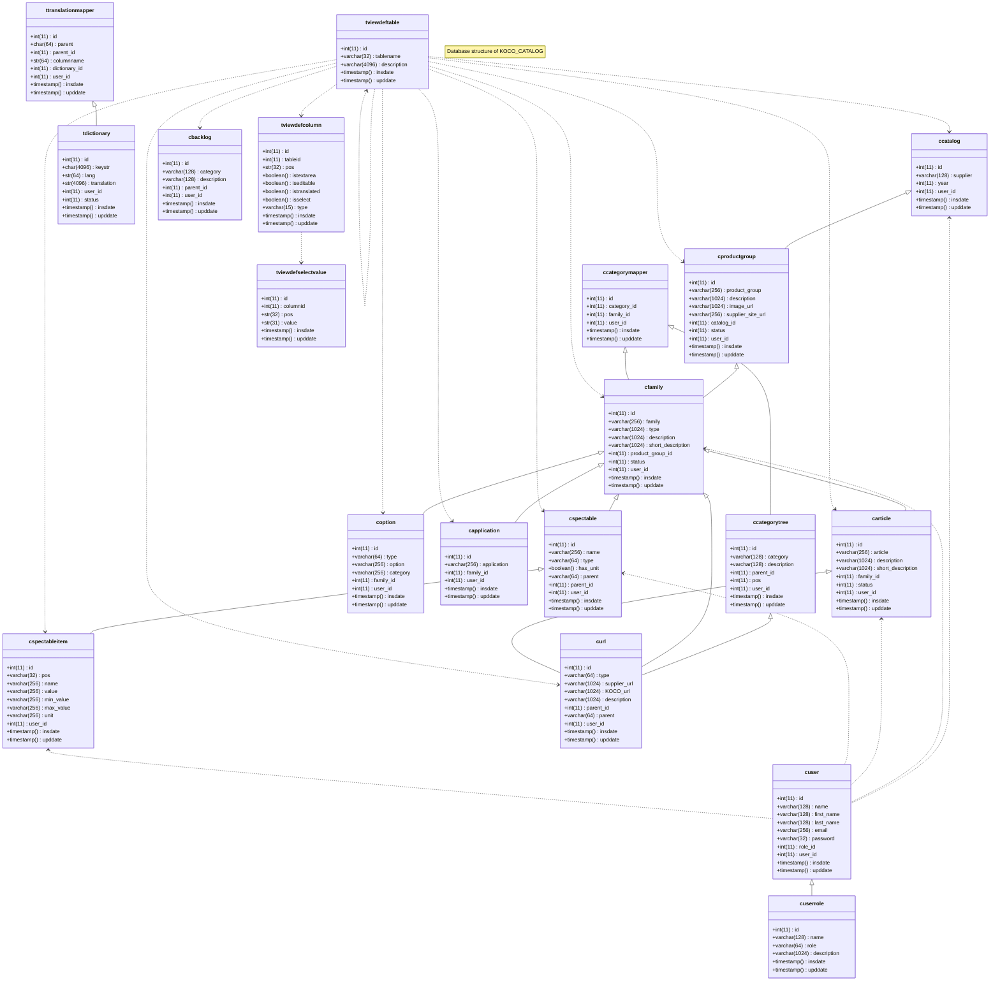

# Database Structure

```mermaid
classDiagram
   note "Database structure of KOCO_CATALOG"
   ccatalog <|-- cproductgroup
   cproductgroup <|-- cfamily
   cfamily <|-- carticle
   cfamily <|-- cspectable
   cfamily <|-- coption
   cfamily <|-- capplication
   cspectable <|-- cspectableitem
   cuser <|-- cuserrole
   ccatalog <.. cuser
   cfamily <.. cuser
   carticle <.. cuser
   cspectable <.. cuser
   cspectableitem <.. cuser
   ccategorymapper <|-- cfamily
   ccategorymapper <|-- ccategorytree
   ccategorytree <|-- curl
   cfamily <|--curl
   carticle <|-- curl
   ttranslationmapper <|-- tdictionary
   tviewdeftable ..> tviewdeftable
   tviewdeftable ..> tviewdefcolumn
   tviewdefcolumn ..> tviewdefselectvalue
   tviewdeftable ..> ccatalog
   tviewdeftable ..> cproductgroup
   tviewdeftable ..> cfamily
   tviewdeftable ..> carticle
   tviewdeftable ..> cspectable
   tviewdeftable ..> cspectableitem
   tviewdeftable ..> curl
   tviewdeftable ..> coption
   tviewdeftable ..> capplication
   tviewdeftable ..> cbacklog


   class ccatalog
   ccatalog: +int(11) id
   ccatalog: +varchar(128) supplier
   ccatalog: +int(11) year
   ccatalog: +int(11) user_id
   ccatalog: +timestamp() insdate
   ccatalog: +timestamp() upddate

   class cuser
   cuser: +int(11) id
   cuser: +varchar(128) name
   cuser: +varchar(128) first_name
   cuser: +varchar(128) last_name
   cuser: +varchar(256) email
   cuser: +varchar(32) password
   cuser: +int(11) role_id
   cuser: +int(11) user_id
   cuser: +timestamp() insdate
   cuser: +timestamp() upddate
   
   class cuserrole
   cuserrole: +int(11) id
   cuserrole: +varchar(128) name
   cuserrole: +varchar(64) role
   cuserrole: +varchar(1024) description
   cuserrole: +timestamp() insdate
   cuserrole: +timestamp() upddate

   class cproductgroup
   cproductgroup: +int(11) id
   cproductgroup: +varchar(256) product_group
   cproductgroup: +varchar(1024) description
   cproductgroup: +varchar(1024) image_url
   cproductgroup: +varchar(256) supplier_site_url
   cproductgroup: +int(11) catalog_id
   cproductgroup: +int(11) status
   cproductgroup: +int(11) user_id
   cproductgroup: +timestamp() insdate
   cproductgroup: +timestamp() upddate

   class cfamily
   cfamily: +int(11) id
   cfamily: +varchar(256) family
   cfamily: +varchar(1024) type
   cfamily: +varchar(1024) description
   cfamily: +varchar(1024) short_description
   cfamily: +int(11) product_group_id
   cfamily: +int(11) status
   cfamily: +int(11) user_id
   cfamily: +timestamp() insdate
   cfamily: +timestamp() upddate

   class carticle
   carticle: +int(11) id
   carticle: +varchar(256) article
   carticle: +varchar(1024) description
   carticle: +varchar(1024) short_description
   carticle: +int(11) family_id
   carticle: +int(11) status
   carticle: +int(11) user_id
   carticle: +timestamp() insdate
   carticle: +timestamp() upddate

   class capplication
   capplication: +int(11) id
   capplication: +varchar(256) application
   capplication: +int(11) family_id
   capplication: +int(11) user_id
   capplication: +timestamp() insdate
   capplication: +timestamp() upddate

   class coption
   coption: +int(11) id
   coption: +varchar(64) type
   coption: +varchar(256) option
   coption: +varchar(256) category
   coption: +int(11) family_id
   coption: +int(11) user_id
   coption: +timestamp() insdate
   coption: +timestamp() upddate

   class curl
   curl: +int(11) id
   curl: +varchar(64) type
   curl: +varchar(1024) supplier_url
   curl: +varchar(1024) KOCO_url
   curl: +varchar(1024) description
   curl: +int(11) parent_id
   curl: +varchar(64) parent
   curl: +int(11) user_id
   curl: +timestamp() insdate
   curl: +timestamp() upddate

   class cspectable
   cspectable: +int(11) id
   cspectable: +varchar(256) name
   cspectable: +varchar(64) type
   cspectable: +boolean() has_unit
   cspectable: +varchar(64) parent
   cspectable: +int(11) parent_id
   cspectable: +int(11) user_id
   cspectable: +timestamp() insdate
   cspectable: +timestamp() upddate

   class cspectableitem
   cspectableitem: +int(11) id
   cspectableitem: +varchar(32) pos
   cspectableitem: +varchar(256) name
   cspectableitem: +varchar(256) value
   cspectableitem: +varchar(256) min_value
   cspectableitem: +varchar(256) max_value
   cspectableitem: +varchar(256) unit
   cspectableitem: +int(11) user_id
   cspectableitem: +timestamp() insdate
   cspectableitem: +timestamp() upddate

   class cbacklog
   cbacklog: +int(11) id
   cbacklog: +varchar(128) category
   cbacklog: +varchar(128) description
   cbacklog: +int(11) parent_id
   cbacklog: +int(11) user_id
   cbacklog: +timestamp() insdate
   cbacklog: +timestamp() upddate

   class ccategorytree
   ccategorytree: +int(11) id
   ccategorytree: +varchar(128) category
   ccategorytree: +varchar(128) description
   ccategorytree: +int(11) parent_id
   ccategorytree: +int(11) pos
   ccategorytree: +int(11) user_id
   ccategorytree: +timestamp() insdate
   ccategorytree: +timestamp() upddate

   class ccategorymapper
   ccategorymapper: +int(11) id
   ccategorymapper: +int(11) category_id
   ccategorymapper: +int(11) family_id
   ccategorymapper: +int(11) user_id
   ccategorymapper: +timestamp() insdate
   ccategorymapper: +timestamp() upddate

   class tviewdeftable
   tviewdeftable: +int(11) id
   tviewdeftable: +varchar(32) tablename
   tviewdeftable: +varchar(4096) description
   tviewdeftable: +timestamp() insdate
   tviewdeftable: +timestamp() upddate

   class tviewdefcolumn
   tviewdefcolumn: +int(11) id
   tviewdefcolumn: +int(11) tableid
   tviewdefcolumn: +str(32) pos
   tviewdefcolumn: +boolean() istextarea
   tviewdefcolumn: +boolean() iseditable
   tviewdefcolumn: +boolean() istranslated
   tviewdefcolumn: +boolean() isselect
   tviewdefcolumn: +varchar(15) type
   tviewdefcolumn: +timestamp() insdate
   tviewdefcolumn: +timestamp() upddate

   class tviewdefselectvalue
   tviewdefselectvalue: +int(11) id
   tviewdefselectvalue: +int(11) columnid
   tviewdefselectvalue: +str(32) pos
   tviewdefselectvalue: +str(31) value
   tviewdefselectvalue: +timestamp() insdate
   tviewdefselectvalue: +timestamp() upddate

   class tdictionary
   tdictionary: +int(11) id
   tdictionary: +char(4096) keystr
   tdictionary: +str(64) lang
   tdictionary: +str(4096) translation
   tdictionary: +int(11) user_id
   tdictionary: +int(11) status
   tdictionary: +timestamp() insdate
   tdictionary: +timestamp() upddate

   class ttranslationmapper
   ttranslationmapper: +int(11) id
   ttranslationmapper: +char(64) parent
   ttranslationmapper: +int(11) parent_id
   ttranslationmapper: +str(64) columnname
   ttranslationmapper: +int(11) dictionary_id
   ttranslationmapper: +int(11) user_id
   ttranslationmapper: +timestamp() insdate
   ttranslationmapper: +timestamp() upddate
```