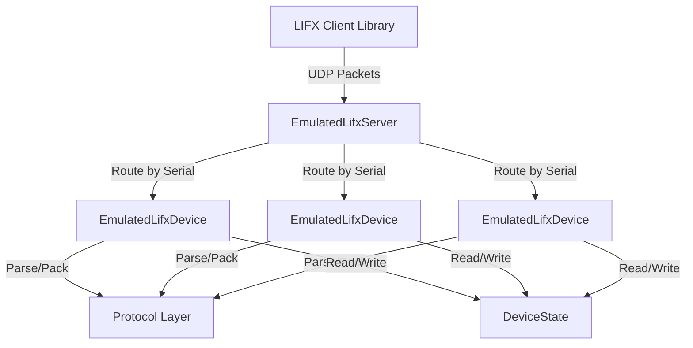
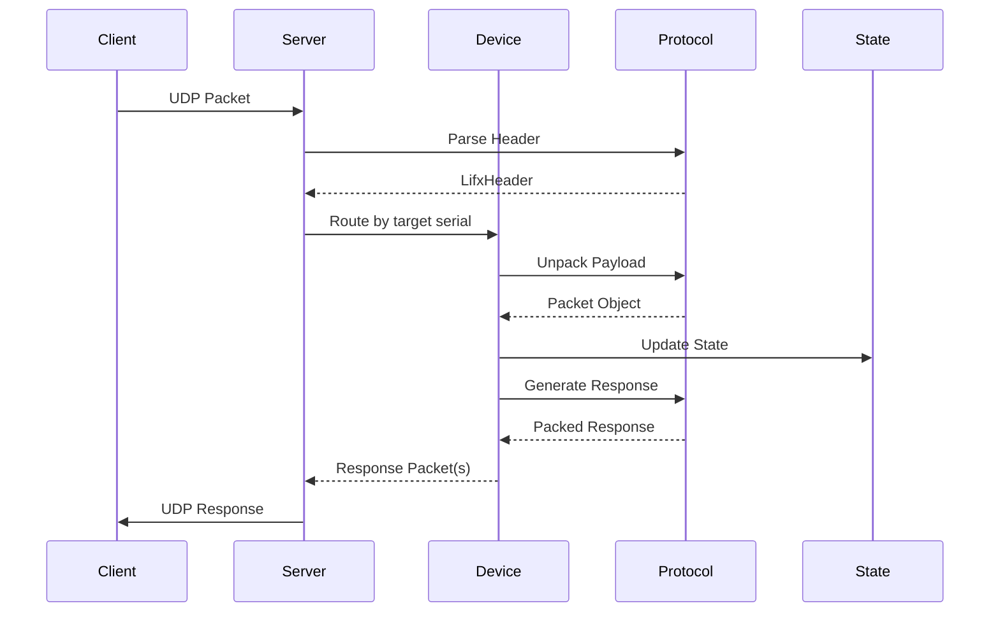

# Architecture Overview

The LIFX Emulator is built with a layered architecture that mirrors real LIFX devices.

## High-Level Architecture



## Core Components

### 1. Server Layer (`EmulatedLifxServer`)

The server layer handles:

- UDP socket management
- Packet reception and sending
- Device routing by serial (encoded in target field)
- Broadcast packet distribution

**Key Responsibilities:**
- Listen on configured IP and port
- Parse packet headers to determine routing
- Forward packets to appropriate devices
- Send responses back to clients

### 2. Device Layer (`EmulatedLifxDevice`)

Each device instance represents a virtual LIFX device:

- Maintains device state
- Processes incoming packets
- Generates response packets
- Handles device-specific logic

**Key Responsibilities:**
- Process packet type routing
- Update state based on commands
- Generate appropriate responses
- Implement device capabilities

### 3. Protocol Layer

The protocol layer implements LIFX LAN protocol:

- Binary packet serialization/deserialization
- Header parsing and generation
- Packet type definitions
- Type conversions

**Components:**
- `LifxHeader` - 36-byte header structure
- Packet classes - 44+ packet type definitions
- `Serializer` - Binary packing/unpacking
- Protocol types - `LightHsbk`, `TileStateDevice`, etc.

### 4. State Layer (`DeviceState`)

Device state is stored in a dataclass:

- Device identity (serial, label, product)
- Capability flags (color, infrared, multizone, etc.)
- Light state (power, color, zones, tiles)
- Firmware version
- Network configuration

## Packet Flow



### Detailed Flow

1. **Reception**
   - Client sends UDP packet to server
   - Server receives bytes on socket

2. **Header Parsing**
   - Extract 36-byte header
   - Parse: target (serial + padding), packet type, flags
   - Determine if broadcast or targeted

3. **Device Routing**
   - If broadcast (tagged=True or target=000000000000): forward to all devices
   - If targeted: find device by serial (encoded in target field)
   - If not found: ignore packet

4. **Packet Processing**
   - Device unpacks payload using packet class
   - Determines packet type (e.g., LightSetColor)
   - Routes to specific handler method

5. **State Update**
   - Handler reads current state
   - Applies command logic
   - Updates state fields

6. **Response Generation**
   - If `res_required=True`: generate state response
   - If `ack_required=True`: generate acknowledgment
   - Create response header with sequence number

7. **Response Sending**
   - Pack response packets to bytes
   - Send back to client via UDP

## Layer Details

### Server Layer

```python
class EmulatedLifxServer:
    """UDP server that routes packets to devices."""

    def __init__(self, devices, bind_address, port):
        self._devices = {d.state.serial: d for d in devices}
        self._bind_address = bind_address
        self._port = port

    async def start(self):
        """Start UDP server."""
        pass

    def handle_packet(self, data, addr):
        """Route incoming packet to device(s)."""
        # Parse header
        # Find target device(s)
        # Process and send responses
        pass
```

### Device Layer

```python
class EmulatedLifxDevice:
    """Virtual LIFX device with stateful behavior."""

    def __init__(self, state: DeviceState):
        self.state = state
        self.scenarios = {}  # Testing scenarios

    def process_packet(self, header, packet):
        """Process incoming packet and generate responses."""
        # Handle acknowledgments
        # Route to packet-specific handler
        # Generate response packets
        pass

    def _handle_light_set_color(self, packet):
        """Handle LightSetColor command."""
        # Update self.state.color
        # Return response if needed
        pass
```

### Protocol Layer

```python
class LifxHeader:
    """36-byte LIFX packet header."""

    def __init__(self, ...):
        self.target = target        # 6-byte serial + 2 null bytes
        self.source = source        # 4-byte identifier
        self.sequence = sequence    # 1-byte sequence number
        self.pkt_type = pkt_type    # Packet type number
        self.tagged = tagged        # tagged
        # ... more fields

    def pack(self) -> bytes:
        """Pack header to 36 bytes."""
        pass

    @classmethod
    def unpack(cls, data: bytes):
        """Parse 36 bytes to header."""
        pass
```

### State Layer

```python
@dataclass
class DeviceState:
    """Device state storage."""

    # Identity
    serial: str
    label: str
    vendor: int
    product: int

    # Capabilities
    has_color: bool
    has_infrared: bool
    has_multizone: bool
    has_matrix: bool
    has_hev: bool

    # Light state
    power_level: int
    color: LightHsbk
    zone_colors: list[LightHsbk]
    tile_devices: list[TileState]

    # ... more fields
```

## Capability Flags

Devices advertise capabilities through boolean flags:

| Flag | Capability | Example Products |
|------|------------|------------------|
| `has_color` | Full RGB color | LIFX A19, LIFX Beam |
| `has_infrared` | IR brightness | LIFX A19 Night Vision |
| `has_multizone` | Linear zones | LIFX Z, LIFX Beam |
| `has_extended_multizone` | >16 zones | LIFX Beam |
| `has_matrix` | 2D pixel grid | LIFX Tile, LIFX Candle |
| `has_hev` | HEV cleaning | LIFX Clean |

## Packet Types

The emulator implements 44+ packet types across multiple domains:

### Device Domain (1-45)

- GetService (2) / StateService (3)
- GetVersion (32) / StateVersion (33)
- GetLabel (23) / StateLabel (25)
- SetLabel (24)
- GetPower (20) / StatePower (22)
- SetPower (21)

### Light Domain (100-122)

- LightGet (101) / LightState (107)
- LightSetColor (102)
- LightSetWaveform (103)
- LightGetInfrared (120) / LightStateInfrared (121)
- LightSetInfrared (122)

### MultiZone Domain (500-512)

- GetColorZones (502) / StateZone (503)
- StateMultiZone (506)
- SetColorZones (501)
- GetMultiZoneEffect (507) / StateMultiZoneEffect (508)
- SetMultiZoneEffect (509)
- SetExtendedColorZones (510)
- GetExtendedColorZones (511) / StateExtendedColorZones (512)

### Tile Domain (700-719)

- GetDeviceChain (701) / StateDeviceChain (702)
- SetUserPosition (703)
- GetTileState64 (707) / StateTileState64 (711)
- SetTileState64 (715)
- GetTileEffect (718) / StateTileEffect (719)

See [Protocol Layer](protocol.md) for complete packet documentation.

## Design Patterns

### Factory Pattern

Factory functions encapsulate device creation:

```python
def create_color_light(serial=None):
    """Create LIFX A19 with sensible defaults."""
    return create_device(27, serial=serial)
```

### Strategy Pattern

Packet handlers implement strategy pattern:

```python
def process_packet(self, header, packet):
    handler_map = {
        LightSetColor: self._handle_light_set_color,
        LightSetPower: self._handle_light_set_power,
        # ... more handlers
    }
    handler = handler_map.get(type(packet))
    if handler:
        return handler(packet)
```

### State Pattern

Device state changes based on received commands:

```python
def _handle_light_set_color(self, packet):
    self.state.color = packet.color
    self.state.power_level = packet.color.brightness
```

## Concurrency Model

The emulator uses Python's asyncio:

- **Single-threaded**: All operations run in the event loop
- **Non-blocking**: Uses async/await for I/O
- **Datagram protocol**: UDP doesn't maintain connections
- **Stateful devices**: Each device maintains independent state

```python
async with EmulatedLifxServer(devices, "127.0.0.1", 56700) as server:
    # Server runs in background tasks
    # Your test code runs concurrently
    await asyncio.sleep(1)
```

## Testing Architecture

The emulator supports advanced testing scenarios:

```python
device.scenarios = {
    'drop_packets': {101: 1.0},      # Drop all LightGet packets
    'response_delays': {102: 0.5},   # Delay SetColor by 500ms
    'malformed_packets': [107],      # Truncate StateLight
    'invalid_field_values': [22],    # Send invalid StatePower
    'partial_responses': [506],      # Incomplete multizone response
}
```

## Next Steps

- [Packet Flow](packet-flow.md) - Detailed packet processing
- [Protocol Layer](protocol.md) - Protocol implementation details
- [Device State](device-state.md) - State management
- [Server API](../api/server.md) - Server documentation
