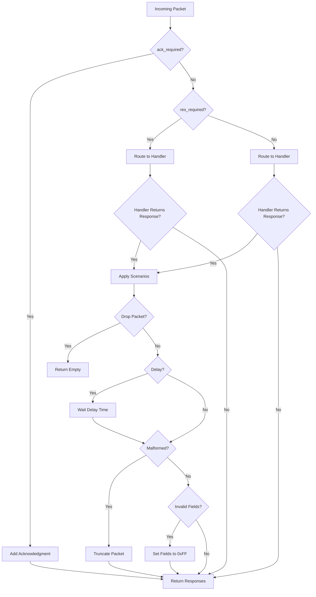

# Device API Reference

> Device state management and emulated device implementation.

The device module provides the core classes for emulating LIFX devices: `DeviceState` holds all stateful information, and `EmulatedLifxDevice` processes incoming LIFX protocol packets and generates appropriate responses.

---

## Table of Contents

### Classes

- [DeviceState](#devicestate)
- [EmulatedLifxDevice](#emulatedlifxdevice)

### Key Concepts

- [Capability Flags](#capability-flags)
- [Testing Scenarios](#testing-scenarios)
- [State Access Patterns](#state-access-patterns)
- [Packet Processing Flow](#packet-processing-flow)

---

## DeviceState

Dataclass holding all stateful information for an emulated LIFX device.

`DeviceState` represents the complete state of a virtual LIFX device, including identity (serial, product ID), current settings (color, power, label), capabilities (color, multizone, matrix, etc.), and feature-specific state (zones, tiles, HEV cycle status).

### Fields

#### Identity

- **`serial`** (`str` = `'d073d5123456'`) - 12-character hexadecimal device serial number
- **`mac_address`** (`bytes` = `bytes.fromhex('d073d5123456')`) - 6-byte MAC address (derived from serial)
- **`vendor`** (`int` = `1`) - LIFX vendor ID (always 1)
- **`product`** (`int` = `27`) - Product ID (e.g., 27 for A19, 32 for Z strip)
- **`version_major`** (`int` = `3`) - Firmware major version
- **`version_minor`** (`int` = `70`) - Firmware minor version

#### Basic State

- **`port`** (`int` = `56700`) - UDP port for communication
- **`label`** (`str` = `'Emulated LIFX'`) - Device label (max 32 bytes)
- **`power_level`** (`int` = `0`) - Power state (0=off, 65535=on)
- **`color`** (`LightHsbk`) - Current HSBK color
- **`uptime_ns`** (`int` = `0`) - Device uptime in nanoseconds
- **`build_timestamp`** (`int`) - Firmware build timestamp (Unix epoch)

#### Capability Flags

- **`has_color`** (`bool` = `True`) - Supports full RGB color
- **`has_infrared`** (`bool` = `False`) - Supports infrared (night vision)
- **`has_multizone`** (`bool` = `False`) - Supports multizone (linear strips)
- **`has_matrix`** (`bool` = `False`) - Supports matrix (2D tiles)
- **`has_hev`** (`bool` = `False`) - Supports HEV (germicidal light)

#### Location & Group

- **`location_id`** (`bytes`) - 16-byte location UUID
- **`location_label`** (`str` = `'Test Location'`) - Location name
- **`location_updated_at`** (`int`) - Location update timestamp (nanoseconds)
- **`group_id`** (`bytes`) - 16-byte group UUID
- **`group_label`** (`str` = `'Test Group'`) - Group name
- **`group_updated_at`** (`int`) - Group update timestamp (nanoseconds)

#### Network

- **`wifi_signal`** (`float` = `-45.0`) - WiFi signal strength in dBm

#### Infrared (Night Vision)

- **`infrared_brightness`** (`int` = `0`) - IR brightness (0-65535)

#### HEV (Germicidal Light)

- **`hev_cycle_duration_s`** (`int` = `7200`) - HEV cycle duration in seconds
- **`hev_cycle_remaining_s`** (`int` = `0`) - Remaining time in current cycle
- **`hev_cycle_last_power`** (`bool` = `False`) - Last power state before cycle
- **`hev_indication`** (`bool` = `True`) - Enable visual indication during cycle
- **`hev_last_result`** (`int` = `0`) - Result of last HEV cycle

#### Multizone (Linear Strips)

- **`zone_count`** (`int` = `0`) - Number of zones (0 if not multizone)
- **`zone_colors`** (`list[LightHsbk]` = `[]`) - Color for each zone

#### Matrix (Tiles)

- **`tile_count`** (`int` = `0`) - Number of tiles in chain
- **`tile_devices`** (`list[dict]` = `[]`) - Per-tile state (position, colors)
- **`tile_width`** (`int` = `8`) - Width of each tile in pixels
- **`tile_height`** (`int` = `8`) - Height of each tile in pixels

#### Effects (Waveforms & Animations)

- **`waveform_active`** (`bool` = `False`) - Whether a waveform is running
- **`waveform_type`** (`int` = `0`) - Waveform type (saw, sine, etc.)
- **`waveform_transient`** (`bool` = `False`) - Return to original color after waveform
- **`waveform_color`** (`LightHsbk`) - Target waveform color
- **`waveform_period_ms`** (`int` = `0`) - Waveform period in milliseconds
- **`waveform_cycles`** (`float` = `0`) - Number of cycles (0 = infinite)
- **`waveform_duty_cycle`** (`int` = `0`) - Duty cycle for pulse waveform
- **`waveform_skew_ratio`** (`int` = `0`) - Skew ratio for waveform
- **`multizone_effect_type`** (`int` = `0`) - Multizone effect type (move, etc.)
- **`multizone_effect_speed`** (`int` = `5`) - Multizone effect speed
- **`tile_effect_type`** (`int` = `0`) - Tile effect type
- **`tile_effect_speed`** (`int` = `5`) - Tile effect speed
- **`tile_effect_palette_count`** (`int` = `0`) - Number of colors in effect palette
- **`tile_effect_palette`** (`list[LightHsbk]` = `[]`) - Effect palette colors

### Methods

#### `get_target_bytes() -> bytes`

Get the 8-byte target field for this device (6-byte serial + 2 null bytes).

**Returns:** `bytes` - Target bytes for packet header

**Example:**
```python
device_state = DeviceState(serial="d073d5000001")
target = device_state.get_target_bytes()
# Returns: b'\xd0\x73\xd5\x00\x00\x01\x00\x00'
```

---

## EmulatedLifxDevice

Emulated LIFX device that processes protocol packets and manages state.

`EmulatedLifxDevice` is the main class for emulating a LIFX device. It receives LIFX protocol packets via `process_packet()`, updates internal state, and returns appropriate response packets. It supports configurable testing scenarios for error injection, delays, and malformed responses.

### Constructor

#### `EmulatedLifxDevice(device_state, scenarios=None, storage=None, handler_registry=None)`

Create a new emulated LIFX device.

**Parameters:**

- **`device_state`** (`DeviceState`) - Initial device state
- **`scenarios`** (`dict | None`) - Optional testing scenarios configuration (see [Testing Scenarios](#testing-scenarios))
- **`storage`** (`AsyncDeviceStorage | None`) - Optional async persistent storage for state
- **`handler_registry`** (`HandlerRegistry | None`) - Optional custom packet handler registry

**Example:**
```python
from lifx_emulator.devices import DeviceState, EmulatedLifxDevice

# Create basic device
state = DeviceState(serial="d073d5000001", product=27, label="Living Room")
device = EmulatedLifxDevice(state)

# Create device with testing scenarios
scenarios = {
    "drop_packets": {116: 1.0},  # Drop all SetColor packets (100% drop rate)
    "response_delays": {2: 0.5},  # Delay GetService responses by 500ms
}
device = EmulatedLifxDevice(state, scenarios=scenarios)
```

### Methods

#### `get_uptime_ns() -> int`

Calculate current uptime in nanoseconds since device creation.

**Returns:** `int` - Uptime in nanoseconds

#### `should_respond(packet_type: int) -> bool`

Check if device should respond to a packet (for testing packet drop scenarios).

**Parameters:**
- **`packet_type`** (`int`) - LIFX packet type number

**Returns:** `bool` - `False` if packet should be dropped, `True` otherwise

#### `get_response_delay(packet_type: int) -> float`

Get configured response delay for a packet type (for testing timeout scenarios).

**Parameters:**
- **`packet_type`** (`int`) - LIFX packet type number

**Returns:** `float` - Delay in seconds (0.0 if no delay configured)

#### `should_send_malformed(packet_type: int) -> bool`

Check if response packet should be malformed (for testing error handling).

**Parameters:**
- **`packet_type`** (`int`) - LIFX packet type number

**Returns:** `bool` - `True` if response should be truncated/corrupted

#### `should_send_invalid_fields(packet_type: int) -> bool`

Check if response packet should have invalid field values (all 0xFF bytes).

**Parameters:**
- **`packet_type`** (`int`) - LIFX packet type number

**Returns:** `bool` - `True` if response fields should be invalid

#### `get_firmware_version_override() -> tuple[int, int] | None`

Get firmware version override from scenarios configuration.

**Returns:** `tuple[int, int] | None` - (major, minor) version tuple or `None`

#### `should_send_partial_response(packet_type: int) -> bool`

Check if multizone/tile response should be partial (incomplete data for testing).

**Parameters:**
- **`packet_type`** (`int`) - LIFX packet type number

**Returns:** `bool` - `True` if response should be incomplete

#### `process_packet(header: LifxHeader, packet: Any | None) -> list[tuple[LifxHeader, Any]]`

Process an incoming LIFX protocol packet and generate response packets.

This is the main entry point for packet processing. It:

1. Checks if an acknowledgment is required (`ack_required` flag)
2. Routes the packet to the appropriate handler based on packet type
3. Applies testing scenarios (delays, drops, malformed responses)
4. Returns a list of response packets (header, payload) tuples

**Parameters:**
- **`header`** (`LifxHeader`) - Parsed packet header
- **`packet`** (`Any | None`) - Parsed packet payload (None for header-only packets)

**Returns:** `list[tuple[LifxHeader, Any]]` - List of response packets to send

**Example:**
```python
from lifx_emulator.protocol.header import LifxHeader
from lifx_emulator.protocol.packets import Light

# Parse incoming packet
header = LifxHeader.unpack(raw_header)
packet = Light.SetColor.unpack(raw_payload)

# Process and get responses
responses = device.process_packet(header, packet)

# Send each response
for resp_header, resp_packet in responses:
    raw_response = resp_header.pack() + resp_packet.pack()
    sock.sendto(raw_response, client_address)
```

---

## Capability Flags

Capability flags in `DeviceState` determine which features the device supports and which packet types it can handle.

| Flag | Description | Example Products | Supported Packets |
|------|-------------|------------------|-------------------|
| `has_color` | Full RGB color control | A19 (27), BR30 (43), GU10 (66) | `Light.Get`, `Light.SetColor`, `Light.State` |
| `has_infrared` | Night vision IR capability | A19 Night Vision (29), BR30 NV (44) | `Light.GetInfrared`, `Light.SetInfrared`, `Light.StateInfrared` |
| `has_multizone` | Linear zone control (strips) | LIFX Z (32), Beam (38) | `MultiZone.GetColorZones`, `MultiZone.SetColorZones`, `MultiZone.StateZone`, `MultiZone.StateMultiZone` |
| `has_matrix` | 2D tile/matrix control | Tile (55), Candle (57), Ceiling (176) | `Tile.GetDeviceChain`, `Tile.Get64`, `Tile.Set64`, `Tile.StateDeviceChain`, `Tile.State64` |
| `has_hev` | Germicidal UV-C light | LIFX Clean (90) | `Hev.GetCycle`, `Hev.SetCycle`, `Hev.StateCycle` |

**Notes:**
- Devices without a capability flag will ignore related packets
- Most devices have `has_color=True` (except switches and relays)
- Extended multizone (>16 zones) is indicated by `zone_count > 16`
- Matrix devices store tile data in `tile_devices` list

**Example:**
```python
# Create a multizone device
state = DeviceState(
    serial="d073d5000002",
    product=32,  # LIFX Z
    has_multizone=True,
    zone_count=16,
    zone_colors=[LightHsbk(hue=0, saturation=65535, brightness=32768, kelvin=3500) for _ in range(16)]
)

# Create a tile device
state = DeviceState(
    serial="d073d5000003",
    product=55,  # LIFX Tile
    has_matrix=True,
    tile_count=5,
    tile_width=8,
    tile_height=8,
)
```

---

## Testing Scenarios

The `scenarios` parameter allows you to configure error injection and testing behaviors for emulated devices. This is useful for testing client library error handling, timeouts, and edge cases.

### Available Scenarios

| Scenario | Type | Description | Example |
|----------|------|-------------|---------|
| `drop_packets` | `dict[int, float]` | Packet types to drop with rates (0.0-1.0) | `{116: 1.0, 117: 0.5}` - Always drop 116, drop 117 50% |
| `response_delays` | `dict[int, float]` | Delay (seconds) before responding to packet type | `{2: 1.5}` - Delay GetService by 1.5s |
| `malformed_packets` | `list[int]` | Packet types to send truncated/corrupted | `[107]` - Corrupt State packets |
| `invalid_field_values` | `list[int]` | Packet types to send with invalid fields (0xFF) | `[107]` - Invalid State values |
| `partial_responses` | `list[int]` | Multizone/tile packets to send incomplete | `[506]` - Partial zone data |
| `firmware_version` | `tuple[int, int]` | Override firmware version | `(2, 80)` - Report v2.80 |

### Examples

**Simulate network issues:**
```python
scenarios = {
    "drop_packets": {2: 1.0},  # Drop all GetService packets - simulate discovery failure
    "response_delays": {116: 2.0},  # Delay SetColor by 2 seconds
}
device = EmulatedLifxDevice(state, scenarios=scenarios)
```

**Test error handling:**
```python
scenarios = {
    "malformed_packets": [107],  # Corrupt Light.State responses
    "invalid_field_values": [118],  # Invalid Light.StatePower values
}
device = EmulatedLifxDevice(state, scenarios=scenarios)
```

**Test multizone edge cases:**
```python
scenarios = {
    "partial_responses": [506],  # Send incomplete StateMultiZone packets
}
device = EmulatedLifxDevice(state, scenarios=scenarios)
```

**Test firmware compatibility:**
```python
scenarios = {
    "firmware_version": (2, 77),  # Report older firmware version
}
device = EmulatedLifxDevice(state, scenarios=scenarios)
```

---

## State Access Patterns

### Reading State

Access device state directly through the `state` attribute:

```python
device = EmulatedLifxDevice(state)

# Check power
if device.state.power_level == 65535:
    print("Device is on")

# Check color
print(f"Hue: {device.state.color.hue}")
print(f"Brightness: {device.state.color.brightness}")

# Check zones (multizone)
if device.state.has_multizone:
    for i, color in enumerate(device.state.zone_colors):
        print(f"Zone {i}: {color}")
```

### Modifying State

Modify state fields directly and optionally save to persistent storage:

```python
# Change color
device.state.color = LightHsbk(hue=21845, saturation=65535, brightness=32768, kelvin=3500)

# Change label
device.state.label = "Kitchen Light"

# Power on
device.state.power_level = 65535

# Save to persistent storage (if configured)
# State changes are automatically queued for async save
# If needed, manually queue a save:
# await device.storage.save_device_state(device.state)
```

### Persistent Storage Integration

Use `AsyncDeviceStorage` to persist state across restarts:

```python
import asyncio
from lifx_emulator.async_storage import AsyncDeviceStorage

async def main():
    storage = AsyncDeviceStorage()  # Uses ~/.lifx-emulator by default
    device = EmulatedLifxDevice(state, storage=storage)

    # State changes are automatically queued for async save
    # Manual async save:
    await storage.save_device_state(device.state)

    # On next run, state is automatically restored

asyncio.run(main())
restored_device = EmulatedLifxDevice(DeviceState(serial=state.serial), storage=storage)
# restored_device.state.label == "Kitchen Light"
```

---

## Packet Processing Flow

The packet processing flow in `EmulatedLifxDevice.process_packet()` follows these steps:



**Key Points:**
- Acknowledgments (packet type 45) are sent when `ack_required=True` in header
- Response packets are sent when `res_required=True` in header
- Handlers are registered by packet type and dispatched via `HandlerRegistry`
- Testing scenarios are applied after handler execution, before returning responses
- Multiple response packets may be returned (e.g., multizone queries return multiple `StateMultiZone` packets)

**See Also:**
- [EmulatedLifxServer](server.md) - UDP server that routes packets to devices
- [Protocol Packets](protocol.md) - LIFX protocol packet definitions
- [Factories](factories.md) - Helper functions for creating pre-configured devices
- [Storage](storage.md) - Persistent state storage API

---

## References

**Source:** `src/lifx_emulator/device.py`

**Related Documentation:**
- [Getting Started](../getting-started/quickstart.md) - Quick start guide
- [Device Types](../guide/device-types.md) - Supported device types and capabilities
- [Testing Scenarios](../guide/testing-scenarios.md) - Detailed testing scenario guide
- [Architecture Overview](../architecture/overview.md) - System architecture
