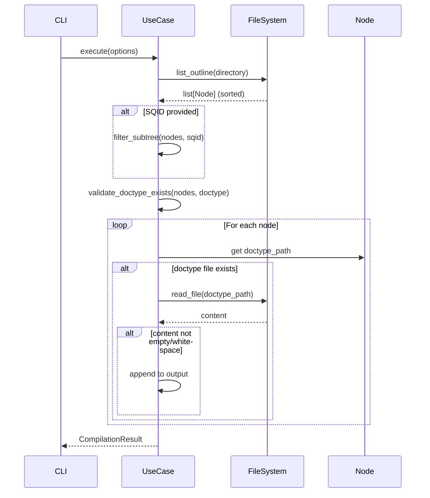

# Data Model: Compile Doctype Command

**Feature**: `001-compile-doctype`
**Date**: 2025-11-13
**Phase**: 1 - Design & Contracts

## Overview

The compile doctype feature leverages existing domain entities and introduces minimal new structures. Primary focus is on orchestrating existing components rather than defining new data models.

## Existing Domain Entities (Reused)

### MaterializedPath

**Source**: `src/linemark/domain/entities.py`

**Purpose**: Hierarchical ordering of nodes

```python
class MaterializedPath(BaseModel):
    segments: tuple[int, ...]  # e.g., (1, 100, 50) for "001-100-050"

    @property
    def as_string(self) -> str:
        """Returns '001-100-050' format"""

    @property
    def depth(self) -> int:
        """Nesting level (1 for root, 2 for child, etc.)"""
```

**Usage in Feature**:
- Nodes sorted by `materialized_path.as_string` provide depth-first traversal order
- No modifications needed

### Node

**Source**: `src/linemark/domain/entities.py` (assumed structure based on codebase)

**Purpose**: Represents a single outline node

```python
class Node:
    sqid: str                      # Unique identifier (e.g., "Gxn7qZp")
    slug: str                      # URL-safe title (e.g., "chapter-one")
    title: str                     # Human-readable title
    materialized_path: MaterializedPath
    directory: Path                # File system location
```

**Usage in Feature**:
- Directory path used to locate doctype files: `node.directory / f"{doctype}.md"`
- SQID used for optional subtree filtering
- Materialized path used for ordering
- No modifications needed

## New Value Objects

### CompilationOptions

**Purpose**: Configuration for a single compilation operation

```python
@dataclass(frozen=True)
class CompilationOptions:
    """Options for doctype compilation operation."""

    doctype: str
    """Doctype to compile (e.g., 'draft', 'notes')"""

    sqid: str | None = None
    """Optional SQID to limit to subtree. None = entire forest"""

    separator: str = '\n\n---\n\n'
    """Separator between documents (escape sequences interpreted)"""

    directory: Path = Field(default_factory=Path.cwd)
    """Working directory containing the forest"""

    def get_processed_separator(self) -> str:
        """Return separator with escape sequences interpreted."""
        return self.separator.encode().decode('unicode_escape')
```

**Validation Rules**:
- `doctype`: Non-empty string, no path separators
- `sqid`: If provided, must be valid SQID format (alphanumeric)
- `separator`: Any string (including empty)
- `directory`: Must be valid Path

### CompilationResult

**Purpose**: Output of compilation operation

```python
@dataclass(frozen=True)
class CompilationResult:
    """Result of doctype compilation."""

    content: str
    """Compiled content with separators"""

    node_count: int
    """Number of nodes included (for logging/debugging)"""

    doctype: str
    """Doctype that was compiled"""

    is_empty: bool = False
    """True if no content found (all files empty or missing)"""

    @classmethod
    def empty(cls, doctype: str) -> CompilationResult:
        """Create an empty result."""
        return cls(content='', node_count=0, doctype=doctype, is_empty=True)
```

## Domain Exceptions

### New Exception: DoctypeNotFoundError

**Purpose**: Raised when specified doctype doesn't exist in compilation scope

```python
class DoctypeNotFoundError(DomainException):
    """Raised when doctype not found in forest/subtree."""

    def __init__(self, doctype: str, sqid: str | None = None) -> None:
        scope = f"subtree @{sqid}" if sqid else "forest"
        super().__init__(
            f"Doctype '{doctype}' not found in {scope}. "
            f"Check doctype name and ensure at least one node has this file."
        )
        self.doctype = doctype
        self.sqid = sqid
```

### Existing Exceptions (Reused)

- `NodeNotFoundError`: Raised when SQID doesn't exist (for subtree compilation)
- `InvalidPathError`: Raised for invalid directory paths
- `FileSystemError`: Raised for file I/O errors

## Port Protocols

### FileSystem (Existing)

**Source**: `src/linemark/ports/filesystem.py`

**Methods Used**:
```python
class FileSystem(Protocol):
    def list_outline(self, directory: Path) -> list[Node]:
        """List all nodes in forest, sorted by materialized path"""
        ...

    def read_file(self, file_path: Path) -> str:
        """Read file content as UTF-8 string"""
        ...

    def file_exists(self, file_path: Path) -> bool:
        """Check if file exists"""
        ...
```

**New Methods** (if needed - to be determined during implementation):
```python
def get_file_size(self, file_path: Path) -> int:
    """Get file size in bytes for empty check optimization"""
    ...
```

## Data Flow

### Compilation Process



### Data Transformations

1. **Input** (from CLI):
   ```
   doctype="draft", sqid="Gxn7qZp", separator="\\n---\\n"
   ```

2. **After Validation**:
   ```python
   CompilationOptions(
       doctype="draft",
       sqid="Gxn7qZp",
       separator="\n---\n"  # escape sequences processed
   )
   ```

3. **Node Collection**:
   ```python
   [
       Node(sqid="Gxn7qZp", path="001", ...),
       Node(sqid="abc123", path="001-001", ...),
       Node(sqid="def456", path="001-002", ...)
   ]
   ```

4. **Content Collection**:
   ```python
   [
       "Content from 001/draft.md",
       "Content from 001-001/draft.md",
       # 001-002/draft.md is empty - skipped
   ]
   ```

5. **Final Output**:
   ```
   "Content from 001/draft.md\n---\nContent from 001-001/draft.md"
   ```

## State Transitions

**Not applicable** - this feature has no stateful entities. All operations are functional transformations: Options → Nodes → Content → Result.

## Validation Rules Summary

| Entity | Rule | Enforcement Point |
|--------|------|------------------|
| CompilationOptions.doctype | Non-empty, no path separators | Use case input validation |
| CompilationOptions.sqid | Valid SQID format if provided | Use case input validation |
| Doctype existence | Must exist in at least 1 node | Pre-compilation scan |
| SQID existence | Must exist in forest | Pre-compilation lookup |
| File encoding | UTF-8 (with graceful fallback) | File reading adapter |
| Content emptiness | Only whitespace = skip | Content collection |

## Persistence

**Not applicable** - this feature is read-only. No data modifications, no persistence layer needed.

## Indexing / Performance

### Current Approach (No Indexing)

- **Strategy**: Linear scan through nodes
- **Performance**: O(n) where n = number of nodes
- **Acceptable for**: < 10,000 nodes (target scale)

### Future Optimization Options (if needed)

1. **Doctype Index**: Cache available doctypes per directory scan
2. **Parallel Reading**: Read doctype files concurrently
3. **Streaming Output**: Yield content instead of accumulating in memory

**Current Decision**: No indexing or caching. Keep implementation simple until performance issues arise.

## Dependencies Between Entities

```
MaterializedPath ←──── Node
                       ↓
                   Directory Path
                       ↓
                   Doctype File (draft.md, notes.md, etc.)
                       ↓
                   Content String
                       ↓
                   CompilationResult
```

**Key Insight**: Feature composes existing entities without creating complex interdependencies. This maintains architectural simplicity and testability.
