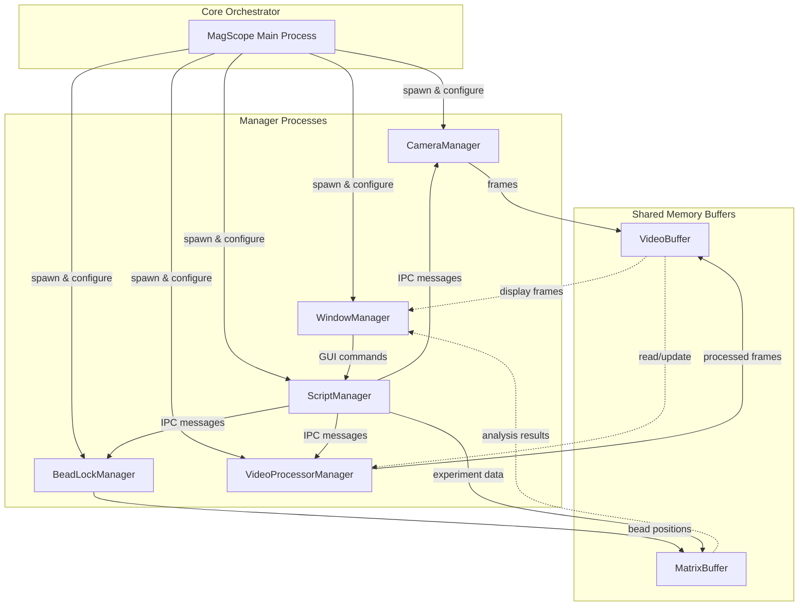

<h1 align="center">

</h1><br>

[](https://pypi.org/project/magscope/)
[](https://magscope.readthedocs.io)
[](https://github.com/7jameslondon/MagScope/actions/workflows/python-package.yml)
[](https://doi.org/10.1101/2025.10.31.685671)

[MagScope](https://github.com/7jameslondon/MagScope) is a Python framework for live data acquisition and analysis in [magnetic tweezers microscopy](https://doi.org/10.1007/978-1-0716-3377-9_18).

* Fast, high-throughput, and high-resolution
* GUI - includes a clean simple GUI (Graphical User Interface)
* Demo - Launches by default with a simulated camera so you can try it without microscope hardware connected
* Automation - Create simple Python scripts to automate data-collection and motor movement for long/complex experiments.
* XYZ-Lock - Enable XY- and/or Z-Lock to keep beads centered and in focus for long experiments
* Customizable - Easily add your lab's hardware and implement custom features
* CPU or GPU tracking of beads via [MagTrack](https://github.com/7jameslondon/MagTrack)

## ⏳ Install
### Pre-requisites
* Operating System: We recommend using **Windows**. While MagScope can run on Linux and MacOS, it has been thoroughly tested on Windows.
* [Python](https://www.python.org/downloads/) >=3.11
* [MagTrack](https://github.com/7jameslondon/MagTrack)
* [NumPy](https://numpy.org) >=1.26
* [SciPy](https://scipy.org) >=1.11.1
* [matplotlib](https://matplotlib.org)
* [tifffile](https://github.com/cgohlke/tifffile/)
* [PyYAML](https://pyyaml.org/)
* [PyQt6](https://www.riverbankcomputing.com/software/pyqt/)
* (Optional, GPU acceleration) [CuPy-CUDA12x](https://cupy.dev) >=13.0
* (Optional, GPU acceleration) [CUDA Toolkit](https://developer.nvidia.com/cuda-toolkit). This is free and easy to install for computers with most NVIDIA GPUs.

### Instructions
```
pip install magscope[cpu]
```
Or
```
pip install magscope[gpu]
```
## ⚒ Usage
MagScope starts by default with a simulated camera so you can try 
the full user interface without connecting lab hardware. 
Launch it with:
```
import magscope

scope = magscope.MagScope()
scope.start()
```
### More Examples
Coming soon

## 📖 Documentation
View the full documentation at [magscope.readthedocs.io](https://magscope.readthedocs.io)

## 💬 Support
Report issues, make requests, and ask questions on the [GitHub issue tracker](https://github.com/7jameslondon/MagScope/issues)<br>
Or email us at magtrackandmagscope@gmail.com


<br>
<br>
<br>
# OLD
<br>
<br>
<br>

## Project Overview

MagScope is a modular control and analysis environment for magnetic tweezer
and microscopy experiments. It coordinates camera acquisition, bead tracking,
and hardware automation so researchers can run reproducible experiments from a
single desktop application. The toolkit is built to be extended – new cameras,
actuators, and analysis routines can plug into the same orchestration layer
without rewriting the core system.

**Key features**

* Multi-process managers for the camera, bead locking, video processing, GUI,
  and scripting keep latency low while sharing data through high-performance
  buffers.
* Shared-memory `VideoBuffer` and `MatrixBuffer` structures make it easy to
  stream image stacks and time-series telemetry between producers and
  consumers.
* A lightweight scripting runtime allows repeatable experiment protocols and
  automated GUI interactions.
* Extensible hardware and control panel base classes simplify adding custom
  instruments or user interface panels.

**High-level architecture**

At runtime `MagScope` instantiates manager processes for each subsystem,
including the `CameraManager`, `BeadLockManager`, `VideoProcessorManager`,
`ScriptManager`, and `WindowManager`. The core `MagScope` orchestrator loads
settings, allocates shared locks and buffers, and wires up inter-process pipes
before launching the managers. Managers exchange work and status updates via a
message-passing API and shared memory, while the GUI presents controls built on
`ControlPanelBase` widgets and time-series plots. Hardware integrations derive
from `HardwareManagerBase`, letting custom devices participate in the same
event loop and scripting hooks.




## Settings

The `settings.py` module provides a convenient location for storing key user
preferences. Two notable parameters are `OBJECTIVE_MAG`, which determines how
pixels are converted to nanometers, and `ROI_WIDTH`, which defines the width of
the region of interest.

## Configuring a Camera

Verify your camera integration by running `test_camera.py` in the `tests`
directory. To add a camera, create a subclass of `CameraABC` (see
`camera.py`) and implement the required attributes and methods. Finally, set
the `ImplementedCamera` variable in `camera.py` to reference your new class.

## Shared-memory data buffers

The ``magscope.datatypes`` module defines the shared-memory-backed buffers that
processes use to exchange data efficiently.

* ``VideoBuffer`` stores image stacks and their capture timestamps. Create it in
  the producer process with the desired shape information and share the
  resulting metadata with consumer processes that instantiate the class with
  ``create=False``.
* ``MatrixBuffer`` stores 2D numeric data such as bead positions or motor
  telemetry. The number of columns is fixed when the buffer is created, while
  the number of rows written at a time can vary up to the buffer capacity.

Both buffers expect locks from ``multiprocessing`` so reads and writes can be
coordinated safely. See ``magscope/datatypes.py`` for detailed docstrings
covering their parameters and usage patterns.

## Force Calibrants (optional)

Provide force calibrants as plain-text files (for example, `force cal.txt`). You
may comment out the header line with `#`. Each subsequent line should map the
motor position in millimeters to the force in piconewtons. Include as many
interpolated data points as possible for the most accurate fit, e.g.:

```
# Motor Position (mm) Force (pN)
1.000 5.000
1.010 5.053
1.020 5.098
1.030 5.156
...
```

## Adding custom hardware

To add hardware, create a subclass of `HardwareManagerBase`.

* Set `buffer_shape` in `__init__`. Each row represents a time point. For
  example, a shape of `(100000, 3)` stores 100,000 time points with three values
  per sample (for example, time, position, and speed).
* Implement `connect`, which should set `self._is_connected` to `True` when the
  connection succeeds.
* Implement `disconnect`.
* Implement `fetch`, which appends an entry to the buffer whenever the
  program automatically polls the device.

## Scripting

MagScope ships with a lightweight scripting runtime that allows you to queue up
GUI interactions and hardware commands for repeatable experiments. A script is
an instance of `magscope.Script` where each call records a step to be executed
by the `ScriptManager` process:

```python
import magscope

script = magscope.Script()
script('set_acquisition_mode', magscope.AcquisitionMode.CROP_VIDEO)
script('sleep', 2.0)  # wait for 2 seconds before running the next command
script('print', 'Ready for capture!')
```

Save the script to a `.py` file and load it from the GUI to run it. The manager
validates each step to ensure the referenced method exists and that the
provided arguments match the registered callable.

Built-in scriptable functions include:

* `print` – display a message in the GUI log
* `sleep` – pause script execution for a fixed number of seconds
* `set_acquisition_on` – toggle processing of incoming frames
* `set_acquisition_dir` – choose the directory used to save acquisitions
* `set_acquisition_dir_on` – enable or disable saving data to disk
* `set_acquisition_mode` – switch between modes such as tracking or video
  recording

See `example_script.py` for a minimal working example.

Expose additional methods to scripts by decorating a manager method with
`@registerwithscript('my_method_name')`. The string you provide becomes the
first argument when adding the step to a script, for example
`script('my_method_name', ...)`.

## Adding a custom process

You can extend `ManagerProcessBase` to create a separate process that manages
logic more complex than a single hardware device. Implement the following
abstract methods:

* `setup` – called when the process starts on its dedicated worker. Initialize
  long-lived resources such as timers or hardware connections here. If no setup
  work is required, use `pass`.
* `do_main_loop` – invoked repeatedly for the lifetime of the process. Place
  autonomous process logic here. If no actions are needed, use `pass`.

## Adding a control panel

Subclass `ControlPanelBase` and implement an `__init__` method to construct the
PyQt6 widgets. The initializer must accept a `manager` argument and pass it to
`super().__init__`. Later, access `self.manager` to invoke `WindowManager`
functions. `ControlPanelBase` derives from `QWidget` and provides a default
`QVBoxLayout`. Replace the layout with `setLayout` if needed, or add elements
via `self.layout().addWidget()` and `self.layout().addLayout()`.

Example:

```
import magscope

class MyNewControlPanel(magscope.ControlPanelBase):
    def __init__(self, manager: 'WindowManager'):
        super().__init__(manager=manager, title='New Panel')
        self.layout().addWidget(QLabel('This is my new panel'))

        row = QHBoxLayout()
        self.layout().addLayout(row)

        row.addWidget(QLabel('A Button'))
        button = QPushButton('Press Me')
        button.clicked.connect(self.button_callback)
        row.addWidget(button)

    def button_callback(self):
        print('The button was pressed')
```

## Sending interprocess calls (IPC)

Start by creating a `magscope.Message`. Provide at least two arguments: `to`,
which specifies the destination process (for example `CameraManager` or the
base `ManagerProcessBase` to broadcast to all managers), and `meth`, which is
the uninvoked method object that should be executed (for example
`CameraManager.set_camera_setting`). Do not call the method when constructing
the message. Supply positional or keyword arguments as additional parameters, or
explicitly pass tuples and dictionaries through the `args` and `kwargs`
keywords.

Send the message with `send_ipc()`. To avoid circular imports, perform local
imports of the destination process class immediately before use.

Example:

```
import magscope

class MyProcesses(magscope.ManagerProcessBase):
    def send_camera_setting(self, setting_name, setting_value):
        message = magscope.Message(
            to=magscope.CameraManager,
            meth=magscope.CameraManager.set_camera_setting,
            args=(setting_name, setting_value),
        )
        self.send_ipc(message)
```

