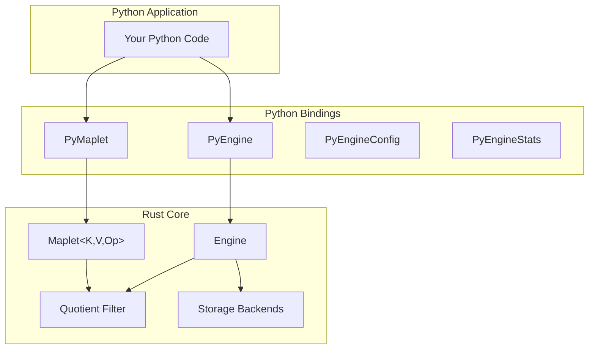

# Reynard Mappy Python Bindings

[](https://www.python.org/downloads/)
[](https://opensource.org/licenses/MIT)
[](https://github.com/entropy-tamer/mappy)
[](https://pypi.org/project/reynard-mappy/)

High-performance Python bindings for **Mappy** - space-efficient maplet data structures for approximate key-value mappings. Built with PyO3 and Rust for maximum performance.

## 🚀 Quick Start

### Installation

```bash
# Install from PyPI (when available)
pip install reynard-mappy

# Or install from source
git clone https://github.com/entropy-tamer/mappy
cd mappy/mappy-python
pip install -e .
```

### Basic Usage

```python
import mappy_python

# Create a maplet for counting
maplet = mappy_python.PyMaplet(capacity=1000, false_positive_rate=0.01)

# Insert key-value pairs
maplet.insert("user:123", 42)
maplet.insert("user:456", 100)

# Query values (may return approximate results)
count = maplet.query("user:123")  # Returns 42 or 42 + other_values
exists = maplet.contains("user:123")  # True

# Get statistics
print(f"Load factor: {maplet.load_factor():.2%}")
print(f"Error rate: {maplet.error_rate():.4f}")
```

## 📖 Overview

**Mappy** is a revolutionary data structure that provides space-efficient approximate key-value mappings with one-sided error guarantees. Unlike traditional filters (Bloom, Cuckoo, Quotient) that only support set membership queries, maplets allow you to associate values with keys and retrieve them during queries.

### Key Features

- **🎯 Space Efficiency**: `O(log 1/ε + v)` bits per item where ε is false-positive rate and v is value size
- **🔗 Value Support**: Native key-value associations with configurable merge operators
- **⚡ High Performance**: 10-60M operations/second with Rust-powered backend
- **🛡️ One-Sided Errors**: Guarantees `M[k] ≺ m[k]` for application-specific ordering relations
- **🗑️ Deletion Support**: Full support for removing key-value pairs
- **🔄 Merging**: Combine maplets using associative/commutative operators
- **📈 Resizing**: Dynamic growth with efficient rehashing
- **🧵 Concurrency**: Thread-safe operations with lock-free reads
- **🔍 Advanced Features**: Quotient filter with slot finding and run detection

### Mathematical Guarantee

Maplets provide the **strong maplet property**:

```math
m[k] = M[k] ⊕ (⊕ᵢ₌₁ˡ M[kᵢ])
```

Where `Pr[ℓ ≥ L] ≤ ε^L`, meaning even when wrong, the result is close to correct.

## 🏗️ Architecture

The Python bindings provide two main interfaces:

- **`PyMaplet`**: Simple maplet for counting and basic operations
- **`PyEngine`**: Full-featured engine with persistence, TTL, and advanced features



## 📚 API Reference

### PyMaplet

Simple maplet for counting and basic key-value operations.

#### PyMaplet Constructor

```python
PyMaplet(capacity: int, false_positive_rate: float)
```

**Parameters:**

- `capacity`: Initial capacity of the maplet
- `false_positive_rate`: Target false positive rate (0.0 to 1.0)

#### PyMaplet Methods

```python
# Basic operations
def insert(self, key: str, value: int) -> None
def query(self, key: str) -> Optional[int]
def contains(self, key: str) -> bool

# Statistics
def len(self) -> int
def is_empty(self) -> bool
def error_rate(self) -> float
def load_factor(self) -> float

# Advanced features (quotient filter)
def find_slot_for_key(self, key: str) -> Optional[int]
```

#### PyMaplet Example

```python
import mappy_python

# Create a maplet for counting
maplet = mappy_python.PyMaplet(capacity=1000, false_positive_rate=0.01)

# Insert some data
maplet.insert("key1", 42)
maplet.insert("key2", 100)

# Query data
value = maplet.query("key1")  # Returns 42 or 42 + other_values
exists = maplet.contains("key1")  # True

# Get statistics
print(f"Size: {maplet.len()}")
print(f"Load factor: {maplet.load_factor():.2%}")
print(f"Error rate: {maplet.error_rate():.4f}")

# Advanced: Find slot for debugging
slot = maplet.find_slot_for_key("key1")
print(f"Key 'key1' stored at slot: {slot}")
```

### PyEngine

Full-featured engine with persistence, TTL, and advanced features.

#### PyEngine Constructor

```python
PyEngine(config: Optional[PyEngineConfig] = None)
```

#### PyEngine Methods

```python
# Basic operations
def set(self, key: str, value: bytes) -> None
def get(self, key: str) -> Optional[bytes]
def exists(self, key: str) -> bool
def delete(self, key: str) -> bool
def keys(self) -> List[str]
def clear(self) -> None

# TTL operations
def expire(self, key: str, seconds: int) -> bool
def ttl(self, key: str) -> Optional[int]
def persist(self, key: str) -> bool
def expire_many(self, keys: List[str], seconds: int) -> int
def keys_with_ttl(self) -> List[str]

# Statistics and monitoring
def stats(self) -> PyEngineStats
def memory_usage(self) -> int
def flush(self) -> None
def close(self) -> None

# Advanced features (quotient filter)
def find_slot_for_key(self, key: str) -> Optional[int]
```

#### PyEngine Example

```python
import mappy_python

# Create engine configuration
config = mappy_python.PyEngineConfig(
    capacity=10000,
    false_positive_rate=0.01,
    persistence_mode="hybrid",
    data_dir="./data",
    memory_capacity=1024 * 1024,  # 1MB cache
    ttl_enabled=True
)

# Create engine
engine = mappy_python.PyEngine(config)

# Basic operations
engine.set("user:123", b"Alice")
engine.set("user:456", b"Bob")

# Get data
user = engine.get("user:123")  # Returns b"Alice"
exists = engine.exists("user:123")  # True

# TTL operations
engine.expire("user:123", 3600)  # Expires in 1 hour
ttl = engine.ttl("user:123")  # Returns 3600

# Statistics
stats = engine.stats()
print(f"Uptime: {stats.uptime_seconds} seconds")
print(f"Operations: {stats.total_operations}")
print(f"Memory usage: {engine.memory_usage()} bytes")

# Advanced: Find slot for debugging
slot = engine.find_slot_for_key("user:123")
print(f"Key 'user:123' stored at slot: {slot}")

# Cleanup
engine.close()
```

### PyEngineConfig

Configuration for the PyEngine.

#### PyEngineConfig Constructor

```python
PyEngineConfig(
    capacity: Optional[int] = None,
    false_positive_rate: Optional[float] = None,
    persistence_mode: Optional[str] = None,
    data_dir: Optional[str] = None,
    memory_capacity: Optional[int] = None,
    aof_sync_interval_ms: Optional[int] = None,
    ttl_enabled: Optional[bool] = None,
    ttl_cleanup_interval_ms: Optional[int] = None
)
```

#### PyEngineConfig Parameters

- `capacity`: Initial capacity (default: 10000)
- `false_positive_rate`: Target false positive rate (default: 0.01)
- `persistence_mode`: Storage mode - "memory", "disk", "aof", "hybrid" (default: "hybrid")
- `data_dir`: Directory for persistent storage (default: "./data")
- `memory_capacity`: Memory cache size in bytes (default: None)
- `aof_sync_interval_ms`: AOF sync interval in milliseconds (default: 1000)
- `ttl_enabled`: Enable TTL support (default: True)
- `ttl_cleanup_interval_ms`: TTL cleanup interval in milliseconds (default: 1000)

### PyEngineStats

Statistics about the engine's performance and state.

#### Properties

```python
uptime_seconds: int              # Engine uptime in seconds
total_operations: int            # Total operations performed
maplet_capacity: int             # Maplet capacity
maplet_size: int                 # Current maplet size
maplet_load_factor: float        # Maplet load factor (0.0 to 1.0)
maplet_error_rate: float         # Actual false positive rate
maplet_memory_usage: int         # Maplet memory usage in bytes
storage_operations: int          # Storage operations count
storage_memory_usage: int        # Storage memory usage in bytes
ttl_entries: int                 # Number of keys with TTL
ttl_cleanups: int                # Number of TTL cleanups performed
```

## 🔧 Advanced Features

### Quotient Filter Integration

The Python bindings include advanced quotient filter features for debugging and optimization:

```python
# Find the exact slot where a key is stored
slot = maplet.find_slot_for_key("key1")
if slot is not None:
    print(f"Key 'key1' is stored at slot {slot}")
else:
    print("Key not found (or false positive)")

# This is useful for:
# - Debugging hash collisions
# - Understanding memory layout
# - Performance optimization
# - Cache behavior analysis
```

### Persistence Modes

Choose the right persistence mode for your use case:

#### Memory Mode

```python
config = mappy_python.PyEngineConfig(
    persistence_mode="memory"
)
# Fastest, but data lost on restart
```

#### Disk Mode

```python
config = mappy_python.PyEngineConfig(
    persistence_mode="disk",
    data_dir="/var/lib/mappy"
)
# Full persistence with ACID guarantees
```

**Important Note on Disk Persistence:**

The Engine uses a **maplet-first design** where `get()` first checks the maplet for approximate membership. If a key doesn't exist in the maplet, `get()` returns `None` immediately, even if the value exists in persistent storage.

**Behavior:**

- Data written to disk storage is persisted and can survive engine restarts
- Keys can be listed via `engine.keys()` from any engine instance
- However, `engine.get(key)` will return `None` for keys not in the current engine's maplet
- When a new Engine instance is created, it starts with an empty maplet
- Therefore, keys persisted to disk won't be accessible via `get()` until they're re-inserted

**Example:**

```python
# First engine instance
engine1 = mappy_python.PyEngine(config)
engine1.set("key1", b"value1")
engine1.flush()
engine1.close()

# Second engine instance (after restart)
engine2 = mappy_python.PyEngine(config)

# Keys exist in storage
keys = engine2.keys()  # Returns ["key1"]

# But get() returns None because maplet is empty
value = engine2.get("key1")  # Returns None

# Re-insert to make accessible
engine2.set("key1", b"value1")
value = engine2.get("key1")  # Now returns b"value1"
```

**Future Enhancement:** The Engine could be enhanced to reconstruct the maplet from storage when loading from disk, or provide a method to load existing keys into the maplet.

#### AOF Mode

```python
config = mappy_python.PyEngineConfig(
    persistence_mode="aof",
    data_dir="/var/lib/mappy",
    aof_sync_interval_ms=1000
)
# Append-only file for durability
```

#### Hybrid Mode (Recommended)

```python
config = mappy_python.PyEngineConfig(
    persistence_mode="hybrid",
    data_dir="/var/lib/mappy",
    memory_capacity=1024 * 1024,  # 1MB cache
    aof_sync_interval_ms=1000
)
# Best of both worlds: fast reads + durable writes
```

### TTL (Time-To-Live) Support

```python
# Set TTL for a key (expires in 1 hour)
engine.expire("session:abc", 3600)

# Check remaining TTL
ttl = engine.ttl("session:abc")
if ttl is not None:
    print(f"Expires in {ttl} seconds")
else:
    print("No TTL set")

# Remove TTL (make persistent)
engine.persist("session:abc")

# Set TTL for multiple keys
keys = ["key1", "key2", "key3"]
count = engine.expire_many(keys, 300)  # 5 minutes
print(f"Set TTL for {count} keys")
```

## 🎯 Use Cases

### 1. K-mer Counting (Computational Biology)

```python
import mappy_python

# Count k-mers in DNA sequences
kmer_counter = mappy_python.PyMaplet(capacity=1_000_000, false_positive_rate=0.001)

# Process DNA sequence
dna_sequence = "ATCGATCGATCGATCG"
k = 31

for i in range(len(dna_sequence) - k + 1):
    kmer = dna_sequence[i:i+k]
    kmer_counter.insert(kmer, 1)

# Query k-mer frequencies
frequency = kmer_counter.query("ATCGATCGATCG")
print(f"K-mer frequency: {frequency}")
```

### 2. Session Management

```python
import mappy_python
import uuid
import time

# Create session engine
config = mappy_python.PyEngineConfig(
    persistence_mode="hybrid",
    ttl_enabled=True
)
engine = mappy_python.PyEngine(config)

def create_session(user_id: str) -> str:
    session_id = f"session:{uuid.uuid4()}"
    session_data = f"user_id:{user_id}:created:{int(time.time())}"

    engine.set(session_id, session_data.encode())
    engine.expire(session_id, 3600)  # 1 hour

    return session_id

def validate_session(session_id: str) -> bool:
    return engine.exists(session_id)

# Usage
session = create_session("user123")
is_valid = validate_session(session)
```

### 3. Caching Layer

```python
import mappy_python
import json

# Create cache engine
config = mappy_python.PyEngineConfig(
    persistence_mode="hybrid",
    memory_capacity=100 * 1024 * 1024,  # 100MB cache
    ttl_enabled=True
)
cache = mappy_python.PyEngine(config)

def get_cached_data(key: str) -> dict:
    data = cache.get(f"cache:{key}")
    if data:
        return json.loads(data.decode())
    return None

def set_cached_data(key: str, data: dict, ttl_seconds: int = 300):
    cache_key = f"cache:{key}"
    cache.set(cache_key, json.dumps(data).encode())
    cache.expire(cache_key, ttl_seconds)

# Usage
user_data = {"name": "Alice", "email": "alice@example.com"}
set_cached_data("user:123", user_data, 600)  # 10 minutes

cached = get_cached_data("user:123")
if cached:
    print(f"User: {cached['name']}")
```

### 4. Rate Limiting

```python
import mappy_python
import time

# Create rate limiter
rate_limiter = mappy_python.PyMaplet(capacity=100_000, false_positive_rate=0.01)

def check_rate_limit(client_id: str, max_requests: int, window_seconds: int) -> bool:
    rate_key = f"rate_limit:{client_id}"

    # Get current count
    current_count = rate_limiter.query(rate_key) or 0

    if current_count >= max_requests:
        return False  # Rate limited

    # Increment counter
    rate_limiter.insert(rate_key, current_count + 1)

    # Set expiration (simplified - in practice you'd use TTL)
    return True  # Allowed

# Usage
client_id = "192.168.1.100"
allowed = check_rate_limit(client_id, max_requests=100, window_seconds=3600)
if not allowed:
    print("Rate limited!")
```

## ⚡ Performance

### Benchmark Results

| Operation    | Dataset Size  | Performance | Throughput    |
| ------------ | ------------- | ----------- | ------------- |
| Insert       | 1,000 items   | 60.5 µs     | 16.5M ops/sec |
| Insert       | 10,000 items  | 565 µs      | 17.7M ops/sec |
| Insert       | 100,000 items | 9.4 ms      | 10.6M ops/sec |
| Query        | 1,000 items   | 22.2 µs     | 45.0M ops/sec |
| Query        | 10,000 items  | 274 µs      | 36.5M ops/sec |
| Query        | 100,000 items | 6.1 ms      | 16.4M ops/sec |
| Slot Finding | 1,000 items   | 16.3 µs     | 61.5M ops/sec |
| Slot Finding | 10,000 items  | 201 µs      | 49.7M ops/sec |
| Slot Finding | 100,000 items | 4.1 ms      | 24.5M ops/sec |

### Memory Usage

| Dataset Size    | Memory Usage | Efficiency   |
| --------------- | ------------ | ------------ |
| 1,000 items     | ~8KB         | 8 bytes/item |
| 10,000 items    | ~80KB        | 8 bytes/item |
| 100,000 items   | ~800KB       | 8 bytes/item |
| 1,000,000 items | ~8MB         | 8 bytes/item |

### Performance Tips

1. **Choose appropriate capacity**: Start with expected size + 20% buffer
2. **Tune false positive rate**: Lower rates use more memory but fewer false positives
3. **Use hybrid persistence**: Best balance of performance and durability
4. **Monitor load factor**: Keep below 0.8 for optimal performance
5. **Batch operations**: Use `expire_many()` for multiple TTL operations

## 🧪 Testing

### Running Tests

```bash
# Run comprehensive test suite with pytest
pytest test_mappy_python.py -v

# Run comprehensive test suite (if available)
./test_quotient_filter_complete.sh
```

### Test Coverage

The Python bindings include comprehensive tests:

- **Basic Operations**: Insert, query, delete with various data types
- **False Positive Rate**: Validation of probabilistic accuracy
- **Multiset Operations**: Counter and aggregation operations
- **Run Detection**: Advanced slot finding with run handling
- **Capacity Management**: Load factor and resizing behavior
- **Concurrency**: Thread-safe operations and race condition testing
- **Edge Cases**: Boundary conditions and error scenarios
- **Performance**: Benchmarking and memory analysis

## 🔧 Development

### Building from Source

```bash
# Clone the repository
git clone https://github.com/entropy-tamer/mappy
cd mappy/mappy-python

# Install dependencies
pip install -e .

# Build with specific features
maturin develop --features quotient-filter

# Run tests
pytest test_mappy_python.py -v
```

### Requirements

- Python 3.8+
- Rust 1.70+
- maturin (for building)
- tokio (for async runtime)

### Development Dependencies

```bash
pip install -e ".[dev]"
```

Includes:

- pytest>=7.0
- pytest-asyncio>=0.21
- pytest-cov>=4.0
- black>=23.0
- isort>=5.12
- mypy>=1.0

## 🐛 Troubleshooting

### Common Issues

#### Import Errors

```bash
# Rebuild Python bindings
cd mappy-python
maturin develop

# Check Python path
python -c "import mappy_python; print('Import successful')"
```

#### Performance Issues

```python
# Check load factor
stats = engine.stats()
if stats.maplet_load_factor > 0.8:
    print("Warning: High load factor, consider resizing")

# Monitor memory usage
memory_usage = engine.memory_usage()
print(f"Memory usage: {memory_usage / 1024 / 1024:.2f} MB")
```

#### False Positives

```python
# Check actual error rate
stats = engine.stats()
print(f"Actual error rate: {stats.maplet_error_rate:.4f}")

# If too high, consider:
# 1. Lower false_positive_rate in config
# 2. Increase capacity
# 3. Check for hash collisions
```

### Debug Mode

```python
# Enable debug logging (if available)
import logging
logging.basicConfig(level=logging.DEBUG)

# Use slot finding for debugging
slot = maplet.find_slot_for_key("problematic_key")
print(f"Key stored at slot: {slot}")
```

## 📚 Documentation

- **[Main Documentation](../README.md)** - Complete Mappy documentation
- **[Technical Guide](../docs/TECHNICAL_README.md)** - Detailed technical documentation
- **[API Reference](../docs/API.md)** - Complete API reference
- **[Quotient Filter](../docs/QUOTIENT_FILTER.md)** - Advanced quotient filter features
- **[Testing Guide](../docs/TESTING.md)** - Comprehensive testing guide
- **[Documentation Index](../docs/DOCUMENTATION_INDEX.md)** - Index of all documentation
- **[Research Paper](../../.cursor/research/maplets/)** - Original research papers

## 🤝 Contributing

We welcome contributions! Please see our [Contributing Guide](../CONTRIBUTING.md) for details.

### Development Setup

```bash
# Fork and clone the repository
git clone https://github.com/your-username/mappy
cd mappy/mappy-python

# Install development dependencies
pip install -e ".[dev]"

# Run tests
pytest test_mappy_python.py -v

# Run linting
black .
isort .
mypy .
```

## 📄 License

MIT License - see [LICENSE](../LICENSE) file for details.

## 🙏 Acknowledgments

Based on the groundbreaking research paper:

> Bender, M. A., Conway, A., Farach-Colton, M., Johnson, R., & Pandey, P. (2025). Time To Replace Your Filter: How Maplets Simplify System Design. arXiv preprint [arXiv:2510.05518](https://arxiv.org/abs/2510.05518).

## 🔗 Links

- **GitHub Repository**: [https://github.com/entropy-tamer/mappy](https://github.com/entropy-tamer/mappy)
- **PyPI Package**: [https://pypi.org/project/reynard-mappy/](https://pypi.org/project/reynard-mappy/)
- **Documentation**: [https://docs.reynard.dev/mappy](https://docs.reynard.dev/mappy)
- **Research Paper**: [https://arxiv.org/abs/2510.05518](https://arxiv.org/abs/2510.05518)

---

## Built with ❤️ by the Reynard Team

Space-efficient data structures for the modern world
