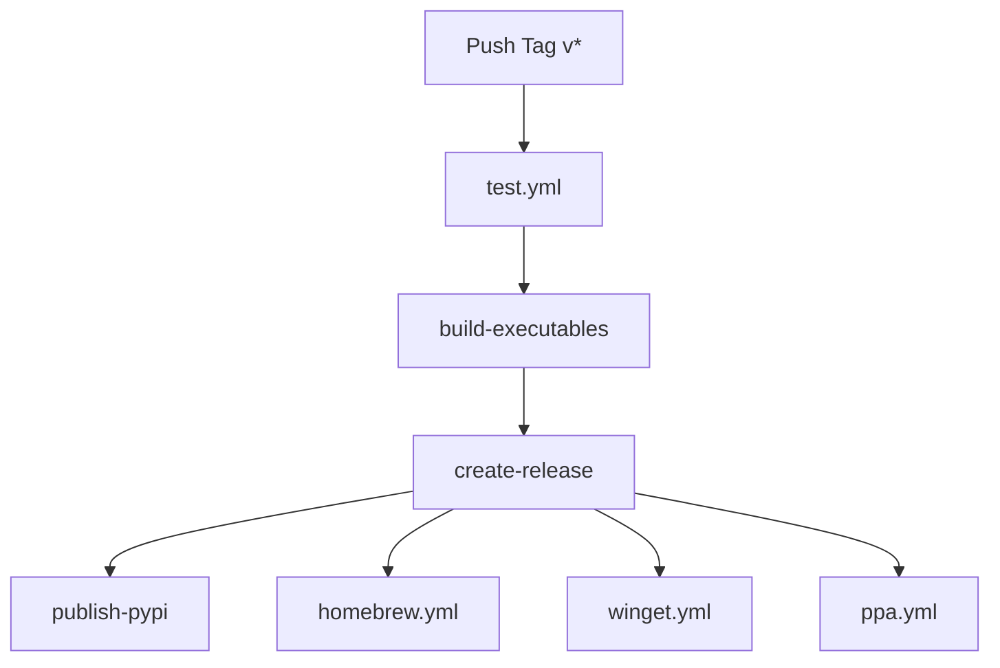

# Build & Publish Process Improvements

**Date:** 2025-11-14
**Status:** ✅ Complete

This document summarizes the comprehensive improvements made to the MIDI Markdown build, package, and publish process based on industry best practices from tools like ruff, uv, and poetry.

---

## Overview of Changes

The build/publish process has been modernized with:

1. **PyPI Trusted Publishing** - OIDC-based auth (no API tokens needed)
2. **Comprehensive Testing** - Matrix testing across platforms and Python versions
3. **Homebrew Distribution** - Native macOS/Linux package manager support
4. **Windows Package Managers** - Winget support for native Windows installation
5. **Debian/APT Packaging** - Ubuntu PPA for native Linux installation
6. **Improved CI/CD** - Faster builds with caching, version consistency checks
7. **Professional Documentation** - Comprehensive installation guides

---

## 1. PyPI Trusted Publishing (OIDC)

**Previous:** Used API tokens stored in GitHub Secrets
**Now:** Uses OpenID Connect (OIDC) for secure, token-less authentication

### Benefits:
- ✅ **More secure** - No long-lived tokens to manage or leak
- ✅ **Zero secrets** - No PYPI_API_TOKEN needed in GitHub
- ✅ **Automatic rotation** - Short-lived tokens per workflow run
- ✅ **Industry standard** - Recommended by PyPI and GitHub

### Setup Required:
1. Configure Trusted Publisher on PyPI (one-time)
2. No GitHub Secrets needed

### Files Changed:
- `.github/workflows/release.yml` - Updated PyPI publish job with OIDC

### Documentation:
- `docs/maintainer/PUBLISHING_SETUP.md` - Section 1

---

## 2. Comprehensive Testing Workflow

**Previous:** Tests only ran during releases
**Now:** Continuous testing on all PRs and commits

### New Workflow: `.github/workflows/test.yml`

**Features:**
- ✅ Matrix testing across OS (Ubuntu, macOS, Windows)
- ✅ Matrix testing across Python versions (3.12+)
- ✅ Linting (ruff check)
- ✅ Type checking (mypy)
- ✅ Code coverage with Codecov integration
- ✅ Package build testing
- ✅ CLI smoke tests
- ✅ Wheel installation testing

**Triggers:**
- Push to main/develop branches
- Pull requests to main/develop
- Manual workflow dispatch

**Benefits:**
- ✅ Catch issues before releases
- ✅ Ensure cross-platform compatibility
- ✅ Maintain code quality standards
- ✅ Prevent broken releases

---

## 3. Homebrew Distribution

**New:** Native package manager support for macOS and Linux users

### Files Created:
- `.github/homebrew/midi-markdown.rb` - Homebrew formula
- `.github/workflows/homebrew.yml` - Auto-update workflow

### Installation:
```bash
brew tap cjgdev/midi-markdown https://github.com/cjgdev/midi-markdown
brew install midi-markdown
```

### Features:
- ✅ Automatic dependency management
- ✅ Shell completions (bash, zsh, fish)
- ✅ Examples and device libraries included
- ✅ Native uninstall/upgrade support
- ✅ Meaningful test block

### Auto-Update:
- Formula automatically updated on each release
- PR created for review before merging

### Future:
- Submit to homebrew-core for official inclusion

---

## 4. Windows Package Managers

### Winget (Windows Package Manager)

**New:** Official Microsoft package manager support

### Files Created:
- `.github/winget/midi-markdown.yaml` - Winget manifest
- `.github/workflows/winget.yml` - Auto-update workflow

### Installation:
```bash
winget install CJGDev.MIDIMarkdown
```

### Features:
- ✅ Native Windows 10/11 integration
- ✅ Automatic updates available
- ✅ No admin rights required
- ✅ Official Microsoft package manager

### Submission Process:
1. First release: Manual submission to microsoft/winget-pkgs
2. Subsequent releases: Semi-automated with wingetcreate
3. Approval timeline: 1-2 days

---

## 5. Debian/APT Packaging

**New:** Ubuntu PPA for native Linux package management

### Files Created:
- `.github/debian/control` - Package metadata
- `.github/debian/rules` - Build instructions
- `.github/debian/compat` - Debhelper compatibility
- `.github/debian/copyright` - License information
- `.github/debian/changelog.template` - Version history template
- `.github/workflows/ppa.yml` - Build workflow

### Installation:
```bash
sudo add-apt-repository ppa:cjgdev/midi-markdown
sudo apt update
sudo apt install midi-markdown
```

### Features:
- ✅ Native package manager experience
- ✅ Automatic security updates
- ✅ System-wide installation
- ✅ Examples and device libraries included
- ✅ Multi-series support (Ubuntu 20.04, 22.04, 24.04)

### Build Process:
1. GitHub Actions builds .deb packages
2. Maintainer signs packages with GPG
3. Upload to Launchpad PPA
4. Launchpad builds for all architectures
5. Available to users via apt

---

## 6. CI/CD Improvements

### Improved Caching

**Previous:** Minimal caching
**Now:** Aggressive caching for faster builds

### Changes:
- ✅ Python package caching (`cache: 'pip'`)
- ✅ UV tool caching (`setup-uv` with `enable-cache: true`)
- ✅ Dependency caching across workflows

**Result:** 2-5x faster CI builds

### Version Consistency Checks

**New:** Automatic verification that git tags match package versions

### Benefits:
- ✅ Prevents version mismatch releases
- ✅ Catches forgotten version bumps
- ✅ Ensures consistency across platforms

### Implementation:
```yaml
- name: Verify version consistency
  run: |
    TAG_VERSION=${GITHUB_REF#refs/tags/v}
    PKG_VERSION=$(uv run python -c "import tomli; ...")
    if [ "$TAG_VERSION" != "$PKG_VERSION" ]; then
      echo "❌ Version mismatch"
      exit 1
    fi
```

### Release Workflow Improvements

**Changes:**
1. Tests run before builds (prevent broken releases)
2. Matrix builds with fail-fast: false (see all failures)
3. Better artifact management (separate upload/download)
4. Improved checksums (consistent across platforms)
5. Comprehensive release notes

---

## 7. Documentation

### New Files:

#### `INSTALLATION.md`
Comprehensive installation guide covering:
- Python package managers (pip, pipx, uv)
- Homebrew (macOS/Linux)
- Winget (Windows)
- Chocolatey (Windows)
- Ubuntu PPA (Debian/Ubuntu)
- Standalone executables
- From source installation
- Troubleshooting guide
- Platform comparison table

**Audience:** End users

#### `docs/maintainer/PUBLISHING_SETUP.md`
Complete setup guide for maintainers:
- PyPI Trusted Publishing configuration
- Homebrew tap setup
- Winget submission process
- Ubuntu PPA setup (GPG keys, Launchpad)
- Codecov integration
- Complete release workflow

**Audience:** Maintainers and contributors

---

## Distribution Matrix

After these improvements, MIDI Markdown is available through:

| Platform | Method | Command | Status |
|----------|--------|---------|--------|
| **All** | pip | `pip install midi-markdown` | ✅ Ready |
| **All** | pipx | `pipx install midi-markdown` | ✅ Ready |
| **All** | uv | `uv pip install midi-markdown` | ✅ Ready |
| **macOS/Linux** | Homebrew | `brew install midi-markdown` | ✅ Ready |
| **Windows** | Winget | `winget install CJGDev.MIDIMarkdown` | 🔜 Pending submission |
| **Windows** | Chocolatey | `choco install midi-markdown` | 🔜 Future |
| **Ubuntu** | PPA | `apt install midi-markdown` | 🔜 Pending setup |
| **All** | Standalone | Download from releases | ✅ Ready |
| **All** | From source | `git clone ...` | ✅ Ready |

---

## Setup Checklist for Next Release

Before tagging the next release (v0.1.1), complete these one-time setup steps:

### Required:

- [ ] **PyPI Trusted Publishing** (5 minutes)
  - Log in to PyPI
  - Add Trusted Publisher: `cjgdev/midi-markdown`, workflow: `release.yml`, environment: `pypi`

- [ ] **Test Release Workflow** (15 minutes)
  - Create test tag: `git tag v0.1.1-test && git push origin v0.1.1-test`
  - Verify all workflows complete successfully
  - Delete test release

### Recommended:

- [ ] **Homebrew Formula** (10 minutes)
  - Test formula locally: `brew install --build-from-source .github/homebrew/midi-markdown.rb`
  - Verify installation: `mmdc --version`

- [ ] **Winget First Submission** (30 minutes)
  - Install wingetcreate on Windows
  - Submit first manifest to microsoft/winget-pkgs
  - Wait for approval (1-2 days)

- [ ] **Ubuntu PPA** (1 hour)
  - Create Launchpad account
  - Generate and upload GPG key
  - Create PPA: `ppa:cjgdev/midi-markdown`
  - Sign and upload first packages

- [ ] **Codecov** (5 minutes)
  - Sign up at codecov.io
  - Add repository
  - Add `CODECOV_TOKEN` to GitHub Secrets

### Optional:

- [ ] **Homebrew-core submission** (when ready for 1.0.0)
  - Requires stable release and user base
  - Follow homebrew-core contribution guidelines

- [ ] **Chocolatey submission** (if Windows user base grows)
  - Create Chocolatey package
  - Submit to chocolatey.org

---

## Impact Summary

### Before:
- ✅ PyPI publishing (with API token)
- ✅ Standalone executables
- ❌ No continuous testing
- ❌ No version checks
- ❌ No caching
- ❌ Manual distribution only

### After:
- ✅ PyPI Trusted Publishing (more secure)
- ✅ Comprehensive testing on every PR
- ✅ Version consistency checks
- ✅ 2-5x faster CI with caching
- ✅ Homebrew support (macOS/Linux)
- ✅ Winget support (Windows)
- ✅ Ubuntu PPA support (Linux)
- ✅ Professional documentation
- ✅ 9 installation methods

### Benefits:
1. **Security**: Trusted Publishing eliminates token management
2. **Quality**: Comprehensive testing prevents broken releases
3. **Speed**: Caching reduces CI time by 2-5x
4. **Reach**: Native package managers on all platforms
5. **UX**: Professional installation experience
6. **Maintenance**: Automated updates reduce manual work

---

## Next Steps

### Immediate (Before Next Release):
1. Configure PyPI Trusted Publishing
2. Test all workflows with test tag
3. Update email address in Debian control file

### Short-term (Within 1-2 Weeks):
1. Complete Winget first submission
2. Set up Ubuntu PPA on Launchpad
3. Test Homebrew formula installation

### Long-term (Future Releases):
1. Submit to homebrew-core (after 1.0.0)
2. Add Chocolatey support (if demand grows)
3. Consider Nix package (if user base requests)

---

## Technical Details

### Workflow Dependencies



### File Structure

```
.github/
├── workflows/
│   ├── test.yml              # NEW: Comprehensive testing
│   ├── release.yml           # UPDATED: Trusted Publishing, version checks
│   ├── homebrew.yml          # NEW: Homebrew formula updates
│   ├── winget.yml            # NEW: Winget manifest updates
│   ├── ppa.yml               # NEW: Debian package builds
│   └── build-executables.yml # UPDATED: Better caching
├── homebrew/
│   └── midi-markdown.rb      # NEW: Homebrew formula
├── winget/
│   └── midi-markdown.yaml    # NEW: Winget manifest
└── debian/
    ├── control               # NEW: Debian package metadata
    ├── rules                 # NEW: Build instructions
    ├── compat                # NEW: Debhelper version
    ├── copyright             # NEW: License information
    └── changelog.template    # NEW: Version history template

docs/
└── maintainer/
    └── PUBLISHING_SETUP.md   # NEW: Maintainer setup guide

INSTALLATION.md               # NEW: User installation guide
BUILD_PUBLISH_IMPROVEMENTS.md # NEW: This document
```

---

## References

Based on best practices from:
- [PyPI Trusted Publishing Documentation](https://docs.pypi.org/trusted-publishers/)
- [GitHub Actions for Python](https://docs.github.com/en/actions/automating-builds-and-tests/building-and-testing-python)
- [Homebrew Formula Cookbook](https://docs.brew.sh/Formula-Cookbook)
- [Microsoft Winget Documentation](https://learn.microsoft.com/en-us/windows/package-manager/)
- [Ubuntu PPA Guide](https://help.launchpad.net/Packaging/PPA)
- Tools: ruff, uv, poetry (reference implementations)

---

**Document Version:** 1.0
**Last Updated:** 2025-11-14
**Maintainer:** Christopher Gilbert
