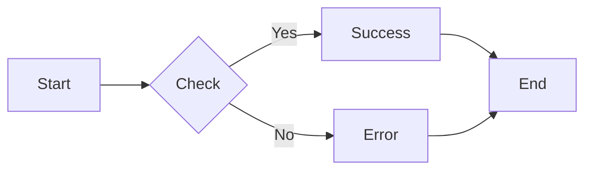
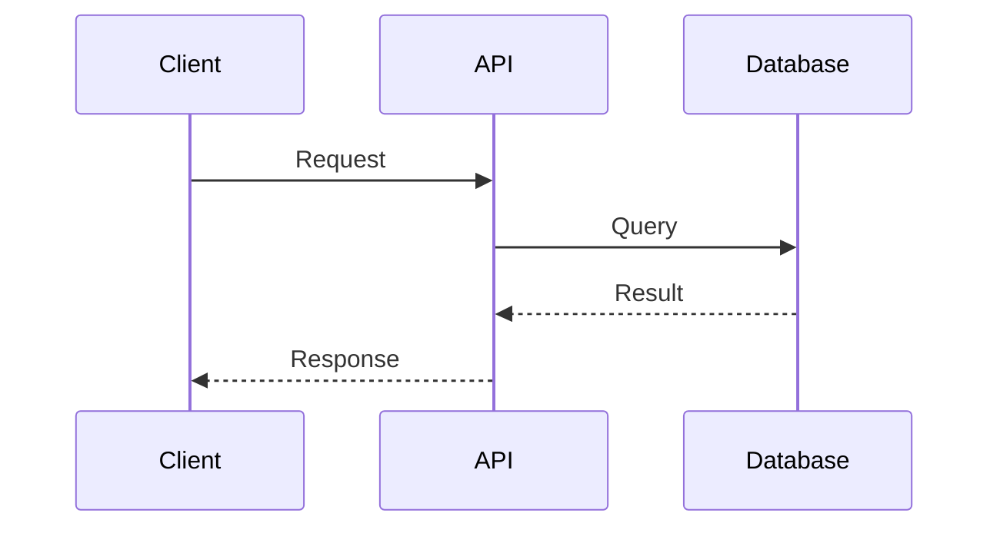
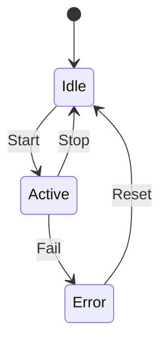
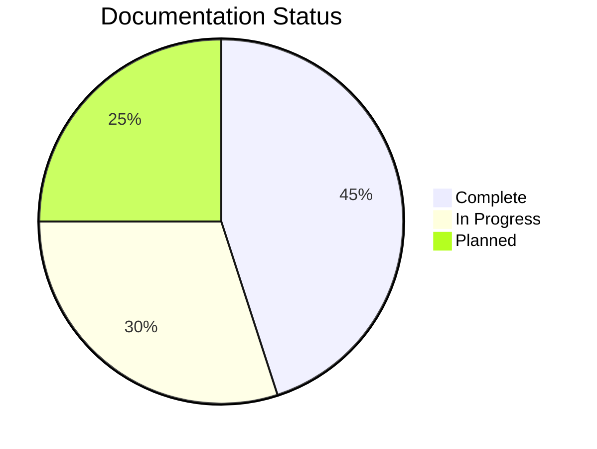
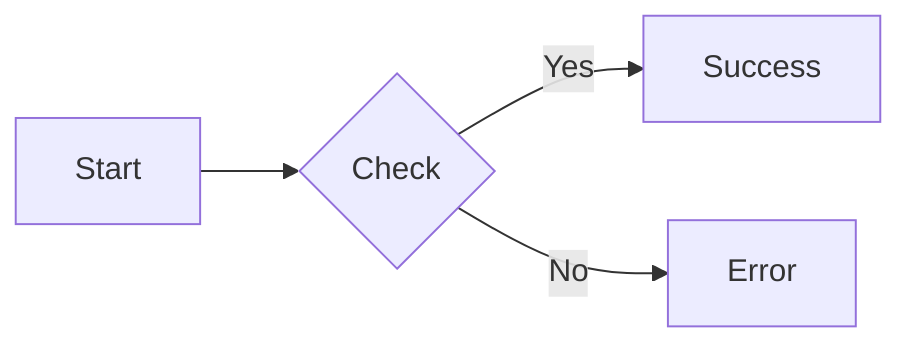
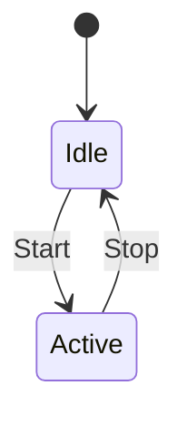
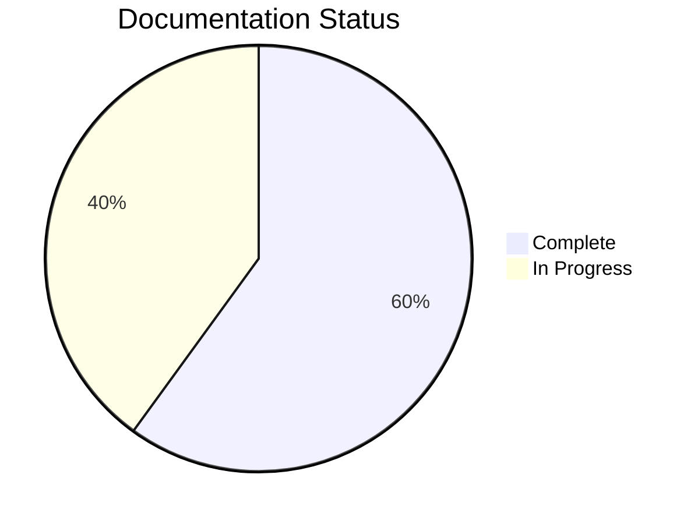
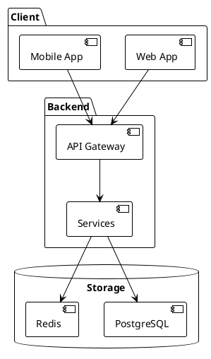
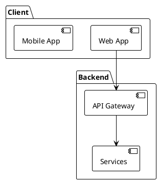

# Markdown Features Showcase

This page demonstrates **all advanced Markdown features** supported by MkDocs Material.

## Table of Contents

- [0. Heading Hierarchy](#0-heading-hierarchy)
- [1. Text Formatting](#1-text-formatting)
- [2. Code Blocks](#2-code-blocks)
- [3. Lists](#3-lists)
- [4. Tables](#4-tables)
- [5. Admonitions](#5-admonitions)
- [6. Mermaid Diagrams](#6-mermaid-diagrams)
- [7. PlantUML Diagrams](#7-plantuml-diagrams)
- [8. Spoilers/Collapsible Sections](#8-spoilerscollapsible-sections)
- [9. Links and Images](#9-links-and-images)
- [10. Blockquotes](#10-blockquotes)
- [11. Footnotes](#11-footnotes)
- [12. Definition Lists](#12-definition-lists)
- [13. Keyboard Keys](#13-keyboard-keys)
- [14. Abbreviations](#14-abbreviations)
- [15. Emoji](#15-emoji)
- [16. Math Equations (LaTeX)](#16-math-equations-latex)
- [17. Horizontal Rules](#17-horizontal-rules)
- [Summary](#summary)

---

## 0. Heading Hierarchy

### Example Heading Hierarchy

Markdown supports six levels of headings, from H1 to H6:

<div style="border-left: 4px solid #2196f3; padding-left: 1rem; margin: 1rem 0;">
  <h1 style="margin-top: 0.5rem;">H1 Heading - Main Title</h1>
  <h2>H2 Heading - Major Section</h2>
  <h3>H3 Heading - Subsection</h3>
  <h4>H4 Heading - Minor Section</h4>
  <h5>H5 Heading - Sub-minor Section</h5>
  <h6>H6 Heading - Lowest Level</h6>
</div>

### Markdown Syntax

```markdown
# H1 Heading
## H2 Heading
### H3 Heading
#### H4 Heading
##### H5 Heading
###### H6 Heading
```

---

## 1. Text Formatting

### Rendered Output

**Bold text** and *italic text* and ***bold italic***

~~Strikethrough text~~ for deprecated content

==Highlighted text== for emphasis

<ins>Inserted text</ins> for new additions

H~2~O for subscript and E=mc^2^ for superscript

### Markdown Syntax

```markdown
**Bold text** and *italic text* and ***bold italic***

~~Strikethrough text~~ for deprecated content

==Highlighted text== for emphasis

<ins>Inserted text</ins> for new additions

H~2~O for subscript and E=mc^2^ for superscript
```

---

## 2. Code Blocks

### Rendered Output

Inline `code` with backticks.

```python
def calculate_distance(x1, y1, x2, y2):
    """Calculate distance between two points."""
    return ((x2 - x1)**2 + (y2 - y1)**2)**0.5
```

### Markdown Syntax

````markdown
Inline `code` with backticks.

```python
def calculate_distance(x1, y1, x2, y2):
    """Calculate distance between two points."""
    return ((x2 - x1)**2 + (y2 - y1)**2)**0.5
```
````

---

## 3. Lists

### Rendered Output

**Unordered:**

- First level
  - Second level
    - Third level

**Ordered:**

1. First step
2. Second step
   1. Sub-step A
   2. Sub-step B

**Task List:**

- [x] Completed task
- [ ] Pending task
  - [x] Nested completed
  - [ ] Nested pending

### Markdown Syntax

```markdown
**Unordered:**

- First level
  - Second level
    - Third level

**Ordered:**

1. First step
2. Second step
   1. Sub-step A
   2. Sub-step B

**Task List:**

- [x] Completed task
- [ ] Pending task
  - [x] Nested completed
  - [ ] Nested pending
```

---

## 4. Tables

### Rendered Output

| Feature   | Status        | Priority |
| --------- | ------------- | -------- |
| REST API  | ✅ Complete    | High     |
| WebSocket | ✅ Complete    | High     |
| CLI Tools | 🚧 In Progress | Medium   |

**With Alignment:**

| Left | Center | Right |
| :--- | :----: | ----: |
| Text |  Text  |   123 |
| More |  Data  |   456 |

### Markdown Syntax

```markdown
| Feature   | Status     | Priority |
| --------- | ---------- | -------- |
| REST API  | ✅ Complete | High     |
| WebSocket | ✅ Complete | High     |

**With Alignment:**

| Left | Center | Right |
| :--- | :----: | ----: |
| Text |  Text  |   123 |
| More |  Data  |   456 |
```

---

## 5. Admonitions

### Rendered Output

!!! note "Information Note"
    This is a note admonition with **formatted text** and `code`.

!!! tip "Pro Tip"
    Use keyboard shortcuts to improve your productivity.

!!! warning "Important Warning"
    Always backup your data before making major changes.

!!! danger "Critical Alert"
    Never commit API keys to version control!

!!! success "Success Message"
    Your changes have been saved successfully.

!!! failure "Error Message"
    Connection failed. Check network connectivity.

!!! question "FAQ Item"
    **Q: How do I get started?**

    A: Follow the quick start guide in the documentation.

!!! example "Example Usage"
    ```bash
    mkdocs build
    ```

!!! info "Additional Information"
    Admonitions are a great way to highlight important content with **visual emphasis** and `styled formatting`.

### Markdown Syntax

```markdown
!!! note "Information Note"
    This is a note admonition with **formatted text** and `code`.

!!! tip "Pro Tip"
    Enable multi-carrier failover for better connectivity.

!!! warning "Important Warning"
    Always perform pre-flight checks.

!!! danger "Critical Alert"
    Never commit API keys!

!!! success "Success Message"
    Operation completed successfully.

!!! failure "Error Message"
    Connection failed.

!!! question "FAQ Item"
    Question and answer format.

!!! example "Example Usage"
    Code or usage example.
```

---

## 6. Mermaid Diagrams

### Rendered Output









### Markdown Syntax

````markdown






````

---

## 7. PlantUML Diagrams

### Rendered Output



### Markdown Syntax

````markdown

````

---

## 8. Spoilers/Collapsible Sections

### Rendered Output

!!! note "Confluence-Specific Feature"
    The spoiler syntax below renders as expandable sections in Confluence.
    In MkDocs, it's shown as code for demonstration purposes.

```text
::: spoiler "Click to expand: Advanced Configuration"

This content is hidden by default and can be expanded by clicking.

---yaml
debug:
  enabled: true
  log_level: verbose
---

You can include **any Markdown** here:
- Lists
- Code blocks
- Tables
- Even diagrams!

:::
```

### Markdown Syntax

````markdown
::: spoiler "Click to expand: Advanced Configuration"

This content is hidden by default.

```yaml
debug:
  enabled: true
```
````

You can include **any Markdown** here.

:::


---

## 9. Links and Images

### Rendered Output

**Internal Link:** [Go to Home](index.md)

**External Link:** [MkDocs Documentation](https://www.mkdocs.org)

**Link with Title:** [Documentation](https://example.com "View documentation")

**Image:**


**Image with Caption:**


*Figure 1: Example application screenshot*

### Markdown Syntax

```markdown
**Internal Link:** [Go to Home](index.md)

**External Link:** [MkDocs Docs](https://www.mkdocs.org)

**Link with Title:** [Dashboard](https://app.example.com "Tooltip text")

**Image:**


**Image with Caption:**


*Figure 1: Dashboard showing real-time metrics*
```

---

## 10. Blockquotes

### Rendered Output

> **Best Practice**: Always write documentation alongside your code.

---

> "Good documentation is like a love letter to your future self."
>
> — Damian Conway

**Nested Blockquotes:**

> Level 1 quote
>
> > Level 2 nested quote
> >
> > > Level 3 deeply nested

### Markdown Syntax

```markdown
> **Best Practice**: Always test in simulation mode first.

> "Quote with attribution."
>
> — Author Name

**Nested:**

> Level 1 quote
>
> > Level 2 nested quote
> >
> > > Level 3 deeply nested
```

---

## 11. Footnotes

### Rendered Output

MkDocs supports multiple deployment methods[^1] including GitHub Pages[^2].

This documentation uses MkDocs Material theme[^3].

[^1]: See Deployment Documentation for details.
[^2]: GitHub Pages is recommended for open-source projects.
[^3]: Material for MkDocs is a powerful documentation framework.

### Markdown Syntax

```markdown
Text with footnote reference[^1] and another[^2].

[^1]: This is the first footnote.
[^2]: This is the second footnote with more details.
```

---

## 12. Definition Lists

### Rendered Output

Markdown
:   A lightweight markup language for creating formatted text

MkDocs
:   A static site generator designed for building project documentation

Python
:   A high-level programming language used to build MkDocs

### Markdown Syntax

```markdown
Markdown
:   A lightweight markup language for creating formatted text

MkDocs
:   A static site generator designed for building project documentation

Python
:   A high-level programming language
```

---

## 13. Keyboard Keys

### Rendered Output

Press ++ctrl+alt+delete++ to restart.

Use ++cmd+k++ on Mac or ++ctrl+k++ on Windows.

Execute: ++shift+enter++

### Markdown Syntax

```markdown
Press ++ctrl+alt+delete++ to restart.

Use ++cmd+k++ on Mac or ++ctrl+k++ on Windows.

Execute: ++shift+enter++
```

---

## 14. Abbreviations

### Rendered Output

The HTML specification is maintained by the W3C. Hover over the abbreviations to see their full meaning.

This documentation uses CSS and JavaScript for enhanced UI features.

*[HTML]: Hyper Text Markup Language
*[W3C]: World Wide Web Consortium
*[CSS]: Cascading Style Sheets
*[JavaScript]: A high-level programming language
*[UI]: User Interface

### Markdown Syntax

```markdown
The HTML specification is maintained by the W3C.

*[HTML]: Hyper Text Markup Language
*[W3C]: World Wide Web Consortium
```

---

## 15. Emoji

### Rendered Output

Using shortcuts: :rocket: :star: :book: :computer:

Status indicators: :white_check_mark: :x: :warning: :information_source:

### Markdown Syntax

```markdown
Using shortcuts: :rocket: :star: :book: :computer:

Status: :white_check_mark: :x: :warning: :information_source:
```

---

## 16. Math Equations (LaTeX)

### Rendered Output

**Inline:** The equation $E = mc^2$ represents energy-mass equivalence.

**Block equation:**

$$
f(x) = \int_{-\infty}^{\infty} e^{-x^2} dx = \sqrt{\pi}
$$

**Complex formula:**

$$
\frac{d}{dx}\left( \int_{0}^{x} f(u)\,du\right)=f(x)
$$

### Markdown Syntax

```markdown
**Inline:** The equation $E = mc^2$ represents energy.

**Block equation:**

$$
f(x) = \int_{-\infty}^{\infty} e^{-x^2} dx = \sqrt{\pi}
$$
```

---

## 17. Horizontal Rules

### Rendered Output

Text above the first horizontal rule.

---

Text between horizontal rules.

***

Text after the second horizontal rule.

### Markdown Syntax

```markdown
Text above the first horizontal rule.

---

Text between horizontal rules.

***

Text after the second horizontal rule.
```

---

## Summary

This showcase demonstrates the full range of Markdown features supported by MkDocs Material, including:

✓ **Text Formatting** - Bold, italic, strikethrough, highlights, and more
✓ **Code Blocks** - Syntax highlighting for multiple languages
✓ **Lists & Tables** - Organized data presentation
✓ **Admonitions** - Styled callout boxes for notes and warnings
✓ **Diagrams** - Mermaid and PlantUML support
✓ **Interactive Elements** - Collapsible sections, footnotes, and task lists
✓ **Rich Media** - Images, links, and embedded content
✓ **Advanced Features** - Math equations, abbreviations, and keyboard shortcuts

For more information, see the [MkDocs Material documentation](https://squidfunk.github.io/mkdocs-material/).
