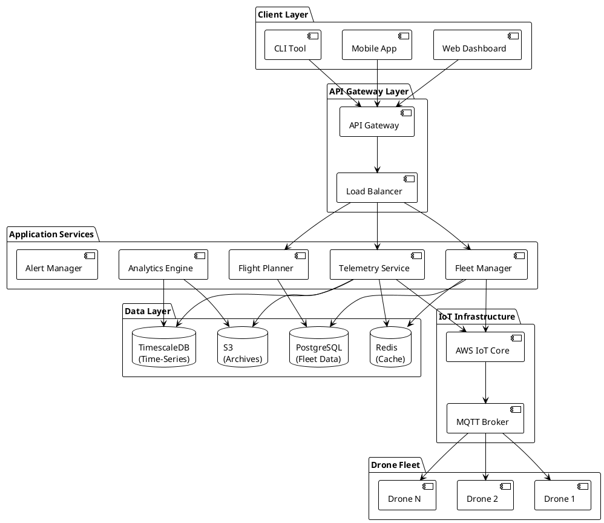
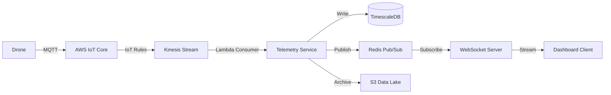
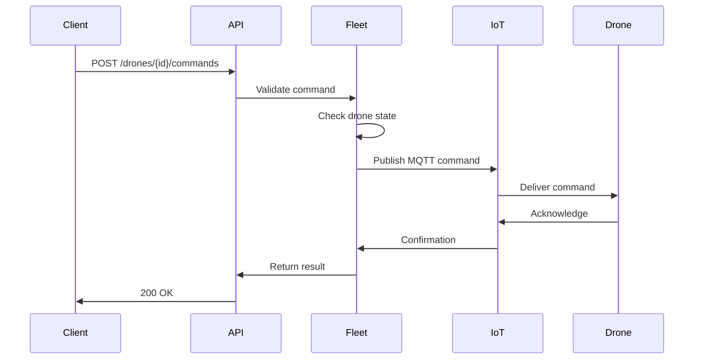

# Architecture Overview

NimbusFleet is built on a ==cloud-native, microservices architecture== designed for reliability, scalability, and real-time performance.

## System Components

## Core Services

### 1. API Gateway

**Purpose**: Unified entry point for all client requests

**Responsibilities**:
- Authentication and authorization
- Rate limiting and throttling
- Request routing and load balancing
- API versioning

**Technology Stack**:
- AWS API Gateway
- Lambda@Edge for authentication
- CloudFront CDN for static assets

### 2. Fleet Manager Service

**Purpose**: ==Central orchestration for drone operations==

**Responsibilities**:
- Drone registration and lifecycle management
- Flight plan validation and scheduling
- Command distribution to drones
- State synchronization

**Key Features**:
- RESTful API for CRUD operations
- Event-driven architecture using SNS/SQS
- <ins>Multi-region active-active deployment</ins>[^1]
- Optimistic locking for concurrent updates

### 3. Telemetry Service

**Purpose**: Real-time data ingestion and streaming

**Responsibilities**:
- MQTT message processing from AWS IoT Core
- WebSocket streaming to clients
- Time-series data storage in TimescaleDB
- Data aggregation and downsampling

**Performance Characteristics**:
- Processes 50,000+ messages/second per instance
- Sub-100ms latency from drone to dashboard
- Automatic data retention policies (raw: 30 days, aggregated: 2 years)

### 4. Flight Planner Service

**Purpose**: AI-powered route optimization

**Responsibilities**:
- Waypoint generation and validation
- Weather integration and risk assessment
- Airspace compliance checking
- Dynamic rerouting during flight

**Algorithms**:
- A* pathfinding with obstacle avoidance
- Machine learning for ETA prediction
- Real-time weather API integration

## Data Flow Architecture

### Telemetry Ingestion Pipeline

### Command Execution Flow

## Optional Modules

::: spoiler "Advanced Features (Click to expand)"

### AI Collision Avoidance

Uses computer vision and LiDAR for obstacle detection:
- Real-time object classification
- Predictive path adjustment
- Emergency brake triggers

**Performance**: Detects obstacles up to 50m away with 99.2% accuracy

### Multi-Region Fleet Management

Coordinate drones across geographic regions:
- Global fleet visibility dashboard
- Cross-region flight handoff
- Compliance with regional regulations

**Availability**: Enterprise plan only

:::

## Security Architecture

### Authentication Flow

1. Client obtains JWT token via OAuth 2.0
2. Token includes scopes and permissions
3. API Gateway validates token signature
4. Services verify permissions via policy engine

### Data Encryption

- **In Transit**: TLS 1.3 for all connections
- **At Rest**: AES-256 encryption for databases
- **Secrets**: AWS Secrets Manager for API keys and certificates

### Network Security

- Private subnets for application services
- VPC peering for IoT Core communication
- Security groups with principle of least privilege
- <ins>DDoS protection via AWS Shield</ins>

## High Availability Design

### Redundancy

- **Multi-AZ Deployment**: All services run in minimum 3 availability zones
- **Database Replication**: PostgreSQL with synchronous replication
- **Cache Failover**: Redis Sentinel for automatic failover

### Disaster Recovery

- **RTO** (Recovery Time Objective): ==15 minutes==
- **RPO** (Recovery Point Objective): ==5 minutes== for critical data
- **Backup Strategy**: Continuous replication to secondary region

## Monitoring and Observability

### Metrics

Key performance indicators tracked:
- API response time (p50, p95, p99)
- Telemetry ingestion rate
- WebSocket connection count
- Database query performance

### Logging

Centralized logging with structured JSON:
- CloudWatch Logs for AWS services
- Application logs with correlation IDs
- Audit logs for compliance

### Tracing

Distributed tracing with AWS X-Ray:
- End-to-end request tracking
- Service dependency mapping
- Performance bottleneck identification

## Technology Stack Summary

| Component | Technology |
|-----------|------------|
| Frontend | React, TypeScript, Tailwind CSS |
| API Gateway | AWS API Gateway, CloudFront |
| Backend Services | Node.js, Python (FastAPI) |
| Message Queue | Amazon SQS, SNS |
| Cache | Redis (ElastiCache) |
| Database (Relational) | PostgreSQL (RDS) |
| Database (Time-Series) | TimescaleDB |
| IoT Platform | AWS IoT Core |
| Object Storage | Amazon S3 |
| Container Orchestration | Amazon ECS with Fargate |
| Monitoring | CloudWatch, Datadog |
| CI/CD | GitHub Actions, AWS CodePipeline |

## Design Principles

### 1. Microservices Architecture

Each service is:
- **Independently deployable**: Zero-downtime deployments
- **Loosely coupled**: Communicates via well-defined APIs
- **Single responsibility**: Focused on one business capability

### 2. Event-Driven Communication

- Asynchronous messaging for non-critical operations
- Eventual consistency where appropriate
- Event sourcing for audit trails

### 3. Scalability First

- Horizontal scaling for all services
- Stateless application tier
- Database sharding for multi-tenancy

### 4. Fail-Fast Philosophy

- Circuit breakers for external dependencies
- Graceful degradation when services unavailable
- Comprehensive health checks

## Footnotes

[^1]: Multi-region active-active deployment added in version 2.4, enabling sub-50ms latency worldwide

## Related Documentation

- [Scaling Principles](scaling-principles.md) - Deep dive into horizontal scaling
- [REST API Reference](../reference/api/rest.md) - API endpoints
- [WebSocket API](../reference/api/websocket.md) - Real-time communication
- [AWS IoT Integration](../how-to/integrate-aws-iot-core.md) - Setup guide

---

**Architecture Version**: 2.4 | **Last Updated**: November 2025
