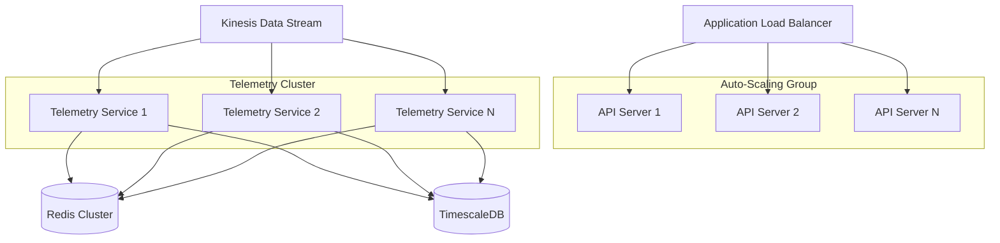
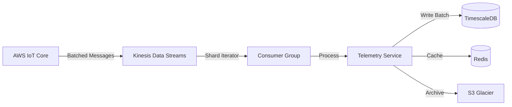

# Scaling Principles

NimbusFleet is designed to scale from managing a single drone to ==orchestrating tens of thousands of drones== simultaneously. This document explains the architectural patterns and strategies that enable this scalability.

## Horizontal Scaling Architecture



## Core Scaling Strategies

### 1. Stateless Service Design

All application services are **completely stateless**, enabling seamless horizontal scaling.

#### Key Principles

- **No local state**: Session data stored in Redis
- **Sticky sessions not required**: Any instance can handle any request
- **Idempotent operations**: Safe to retry requests
- **Immutable deployments**: New instances identical to old ones

#### Benefits

✓ Add capacity by launching more instances
✓ Rolling deployments with zero downtime
✓ Automatic failure recovery
✓ Geographic distribution for low latency

### 2. Database Sharding Strategy

As your fleet grows, data is ==partitioned across multiple database shards== for improved performance.

#### Sharding Key

Drones are partitioned by `drone_id` using consistent hashing:

```python
shard_id = hash(drone_id) % num_shards
```

#### Shard Distribution

| Fleet Size    | Shard Count | Drones per Shard | Query Latency (p95) |
| ------------- | ----------- | ---------------- | ------------------- |
| 1-1,000       | 1           | 1,000            | <50ms               |
| 1,001-10,000  | 4           | 2,500            | <75ms               |
| 10,001-50,000 | 16          | 3,125            | <100ms              |
| 50,001+       | 64+         | <1,000           | <120ms              |

#### Cross-Shard Queries

For operations spanning multiple shards:
- **Map-Reduce pattern**: Parallel queries aggregated at application layer
- **Caching**: Frequently accessed cross-shard data cached in Redis
- **Materialized views**: Pre-computed aggregations for dashboards

### 3. Telemetry Ingestion Pipeline

The telemetry pipeline processes millions of messages per minute using a ==streaming architecture==.

#### Pipeline Stages



#### Throughput Optimization

**Batching**: Messages grouped in 100-500 record batches
**Parallel Processing**: One consumer per Kinesis shard
**Async I/O**: Non-blocking writes to database
**Backpressure Handling**: Queue depth monitoring with adaptive rate limiting

#### Performance Metrics

At scale, NimbusFleet achieves:

- **250,000 messages/second** sustained throughput
- **<100ms end-to-end latency** (drone → dashboard)
- **99.99% message delivery** reliability
- **Auto-scaling** based on queue depth

### 4. Cache-First Architecture

Redis provides a high-performance caching layer that reduces database load by 80%+.

#### Caching Strategy

| Data Type         | TTL        | Invalidation    |
| ----------------- | ---------- | --------------- |
| Drone metadata    | 5 minutes  | On update       |
| Current telemetry | 10 seconds | Time-based      |
| Flight plans      | 1 hour     | On modification |
| API responses     | 30 seconds | Time-based      |
| User sessions     | 24 hours   | On logout       |

#### Cache Patterns

**Read-Through Cache**:
```python
def get_drone(drone_id):
    # Check cache first
    cached = redis.get(f"drone:{drone_id}")
    if cached:
        return cached

    # Cache miss - query database
    drone = db.query(drone_id)
    redis.set(f"drone:{drone_id}", drone, ttl=300)
    return drone
```

**Write-Behind Cache**:
- Updates written to cache immediately
- Asynchronously persisted to database
- ==Reduces write latency by 75%==

## Auto-Scaling Configuration

### Service-Level Scaling Rules

#### API Services

**Scale Up When**:
- CPU utilization > 70% for 2 minutes
- Request queue depth > 100

**Scale Down When**:
- CPU utilization < 30% for 10 minutes
- Request queue depth < 20

#### Telemetry Services

**Scale Up When**:
- Kinesis iterator age > 10 seconds
- Memory utilization > 80%

**Scale Down When**:
- Kinesis iterator age < 2 seconds
- Memory utilization < 40%

### Database Scaling

**Vertical Scaling** (up to limits):
- Automated during low-traffic hours
- Maximum instance size: r6g.16xlarge

**Horizontal Scaling** (read replicas):
- Automated based on read load
- Maximum 15 read replicas per primary

## Scaling Readiness Checklist

Before scaling to production loads:

- [ ] Enable CloudWatch detailed monitoring
- [ ] Configure auto-scaling policies for all service groups
- [ ] Set up database read replicas in multiple AZs
- [ ] Enable Redis cluster mode for cache redundancy
- [ ] Configure Kinesis stream with sufficient shard count
- [ ] Test failover scenarios (chaos engineering)
- [ ] Implement connection pooling (max 100 per instance)
- [ ] Enable query performance insights on databases
- [ ] Set up alerts for scaling events
- [ ] Document runbooks for manual intervention

## Performance Optimization Tips

!!! note "Cost Optimization"

    **Rightsizing**: Use AWS Compute Optimizer to identify oversized instances

    **Reserved Capacity**: ==Save 40-60%== with 1-year commitments for baseline capacity

    **Spot Instances**: Use for non-critical batch processing workloads

    **Data Lifecycle**: Archive telemetry >30 days old to S3 Glacier

### Database Query Optimization

**Indexing Strategy**:
```sql
-- Composite index for frequent queries
CREATE INDEX idx_telemetry_drone_time
ON telemetry(drone_id, timestamp DESC);

-- Partial index for active drones
CREATE INDEX idx_active_drones
ON drones(status)
WHERE status = 'active';
```

**Query Patterns**:
- Use `LIMIT` clauses to prevent unbounded results
- Leverage TimescaleDB hypertables for time-series data
- Implement pagination with cursor-based approach

### API Rate Limiting

Protect services from traffic spikes:

| Plan         | Rate Limit | Burst Limit |
| ------------ | ---------- | ----------- |
| Free         | 10 req/s   | 50          |
| Standard     | 100 req/s  | 500         |
| Professional | 500 req/s  | 2,000       |
| Enterprise   | Custom     | Custom      |

### Connection Pooling

**PgBouncer Configuration**:
```ini
[databases]
nimbusfleet = host=postgres.internal port=5432

[pgbouncer]
pool_mode = transaction
max_client_conn = 10000
default_pool_size = 25
reserve_pool_size = 5
reserve_pool_timeout = 3
```

## Load Testing Recommendations

### Test Scenarios

1. **Steady State**: Baseline load for 24 hours
2. **Ramp Up**: Gradual increase from 0 to peak over 1 hour
3. **Spike Test**: Sudden 10x load increase for 5 minutes
4. **Soak Test**: 2x baseline load for 72 hours

### Key Metrics to Monitor

- **Latency**: p50, p95, p99 response times
- **Throughput**: Requests per second
- **Error Rate**: 4xx and 5xx responses
- **Resource Utilization**: CPU, memory, network
- **Queue Depth**: Message backlog in Kinesis

### Tools

- **k6**: Open-source load testing (recommended)
- **Locust**: Python-based distributed testing
- **AWS CloudWatch Synthetics**: Continuous monitoring

## Regional Scaling

For global deployments, NimbusFleet supports **multi-region active-active** architecture[^1].

### Benefits

- **Low Latency**: <50ms API response times worldwide
- **High Availability**: Automatic failover between regions
- **Data Residency**: Comply with local data protection regulations

### Region Selection Criteria

Choose regions based on:

- **Drone Density**: Where your fleet operates
- **User Location**: Where your team is based
- **Compliance**: Data sovereignty requirements
- **Cost**: Regional pricing variations

## Footnotes

[^1]: Multi-region deployment requires Enterprise plan and professional services engagement

## Related Documentation

- [Architecture Overview](architecture-overview.md) - System design principles
- [AWS IoT Integration](../how-to/integrate-aws-iot-core.md) - Custom infrastructure setup
- [Troubleshooting Guide](../tutorial/troubleshoot-field-issues.md) - Performance debugging

---

**Last Updated**: November 2025 | **Applies to**: NimbusFleet v2.4+
