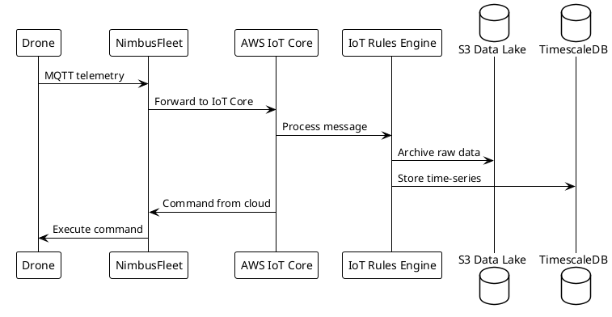

# Integrate NimbusFleet with AWS IoT Core

This guide shows you how to connect NimbusFleet to your existing AWS IoT Core infrastructure for custom telemetry processing and data warehousing.

## Overview

By integrating AWS IoT Core, you can:

- Route telemetry to your own data lake (S3, Redshift)
- Apply custom IoT rules for alerting and anomaly detection
- Maintain data sovereignty and compliance requirements
- ==Reduce egress costs by processing data within your VPC==

## Prerequisites

- AWS account with IoT Core enabled
- NimbusFleet Enterprise plan (required for custom integrations)
- IAM permissions to create IoT policies and things
- Basic knowledge of MQTT and AWS IoT Rules Engine

## Step 1: Configure AWS IoT Thing

### Create IoT Thing

Use the AWS CLI to create a thing for each drone:

```bash
aws iot create-thing --thing-name nimbusfleet-drone-01
```

### Generate Certificates

```bash
aws iot create-keys-and-certificate \
  --set-as-active \
  --certificate-pem-outfile drone-cert.pem \
  --public-key-outfile drone-public.key \
  --private-key-outfile drone-private.key
```

**Save the certificate ARN** from the output—you'll need it in the next step.

## Step 2: Create IoT Policy

### Policy Document

Create `nimbusfleet-iot-policy.json`:

```yaml
policyName: NimbusFleetDronePolicy
policyDocument: |
  {
    "Version": "2012-10-17",
    "Statement": [
      {
        "Effect": "Allow",
        "Action": [
          "iot:Connect"
        ],
        "Resource": "arn:aws:iot:us-west-2:ACCOUNT_ID:client/nimbusfleet-*"
      },
      {
        "Effect": "Allow",
        "Action": [
          "iot:Publish"
        ],
        "Resource": [
          "arn:aws:iot:us-west-2:ACCOUNT_ID:topic/nimbusfleet/telemetry/*",
          "arn:aws:iot:us-west-2:ACCOUNT_ID:topic/nimbusfleet/alerts/*"
        ]
      },
      {
        "Effect": "Allow",
        "Action": [
          "iot:Subscribe",
          "iot:Receive"
        ],
        "Resource": [
          "arn:aws:iot:us-west-2:ACCOUNT_ID:topicfilter/nimbusfleet/commands/*"
        ]
      }
    ]
  }
```

### Apply Policy

```bash
aws iot create-policy --policy-name NimbusFleetDronePolicy \
  --policy-document file://nimbusfleet-iot-policy.json
```

### Attach to Certificate

```bash
aws iot attach-policy --policy-name NimbusFleetDronePolicy \
  --target <CERTIFICATE_ARN>
```

## Step 3: Configure NimbusFleet Integration

### Create Integration Config

Create `iot-integration.yaml`:

```yaml
apiVersion: v2
kind: Integration
metadata:
  name: aws-iot-core-production
  type: aws-iot-core
spec:
  region: us-west-2
  endpoint: a3example5u4t2-ats.iot.us-west-2.amazonaws.com
  authentication:
    certificateArn: arn:aws:iot:us-west-2:123456789012:cert/abc123...
    privateKeySecret: arn:aws:secretsmanager:us-west-2:123456789012:secret:drone-private-key
  topics:
    telemetry: nimbusfleet/telemetry/${drone.id}
    alerts: nimbusfleet/alerts/${drone.id}
    commands: nimbusfleet/commands/${drone.id}
  qos: 1
  <ins>retryPolicy:</ins>
    <ins>maxAttempts: 3</ins>
    <ins>backoffMultiplier: 2</ins>
```

### Apply Configuration

```bash
nimbusfleet integration create -f iot-integration.yaml
```

## Step 4: Data Flow Architecture



## Step 5: Create IoT Rules for Processing

### Rule: Archive Telemetry to S3

```sql
SELECT * FROM 'nimbusfleet/telemetry/+'
WHERE battery.percent < 20
```

Action: Send to S3 bucket `nimbusfleet-telemetry-archive`

### Rule: Alert on Critical Battery

```sql
SELECT drone_id, battery.percent, location
FROM 'nimbusfleet/telemetry/+'
WHERE battery.percent < 15
```

Action: Send to SNS topic `critical-battery-alerts`

## Step 6: Verify Integration

### Test Message Flow

Publish a test message:

```bash
nimbusfleet integration test aws-iot-core-production \
  --drone-id drone-f8a7c2d1 \
  --message-type telemetry
```

Expected output:
```
✓ Message published to AWS IoT Core
  Topic: nimbusfleet/telemetry/drone-f8a7c2d1
  QoS: 1
  Message ID: 0x4f2a1b8c
```

### Monitor IoT Core

View messages in AWS IoT Console:

1. Navigate to **Test** → **MQTT test client**
2. Subscribe to `nimbusfleet/telemetry/#`
3. Start a simulation flight
4. ==Confirm telemetry messages appear in real-time==

## Advanced Configuration

### <ins>Multi-Region Failover</ins>

For global deployments, configure region failover:

```yaml
spec:
  regions:
    - region: us-west-2
      priority: 1
      endpoint: a3example1-ats.iot.us-west-2.amazonaws.com
    - region: eu-central-1
      priority: 2
      endpoint: a3example2-ats.iot.eu-central-1.amazonaws.com
  failover:
    enabled: true
    healthCheckInterval: 30s
```

### Custom Message Transformation

Transform telemetry before sending to IoT Core:

```yaml
spec:
  messageTransform:
    telemetry:
      include:
        - gps
        - battery
        - altitude
      exclude:
        - debug.*
      rename:
        battery.percent: batteryLevel
        altitude.meters: altitudeM
```

## Troubleshooting

### Connection Failures

Check certificate validity:
```bash
aws iot describe-certificate --certificate-id <CERT_ID>
```

### Permission Denied

Verify policy attachment:
```bash
aws iot list-attached-policies --target <CERT_ARN>
```

## Related Documentation

- [REST API Reference](../reference/api/rest.md) - API endpoints for integration management
- [Architecture Overview](../explanation/architecture-overview.md) - System design principles
- [WebSocket API](../reference/api/websocket.md) - Real-time telemetry streaming

## Security Best Practices

!!! warning "Certificate Management"
    - Store private keys in AWS Secrets Manager
    - Rotate certificates every 90 days
    - Use unique certificates per drone
    - Never commit certificates to version control

---

**Last Updated**: November 2025 | **Integration Version**: 2.4
