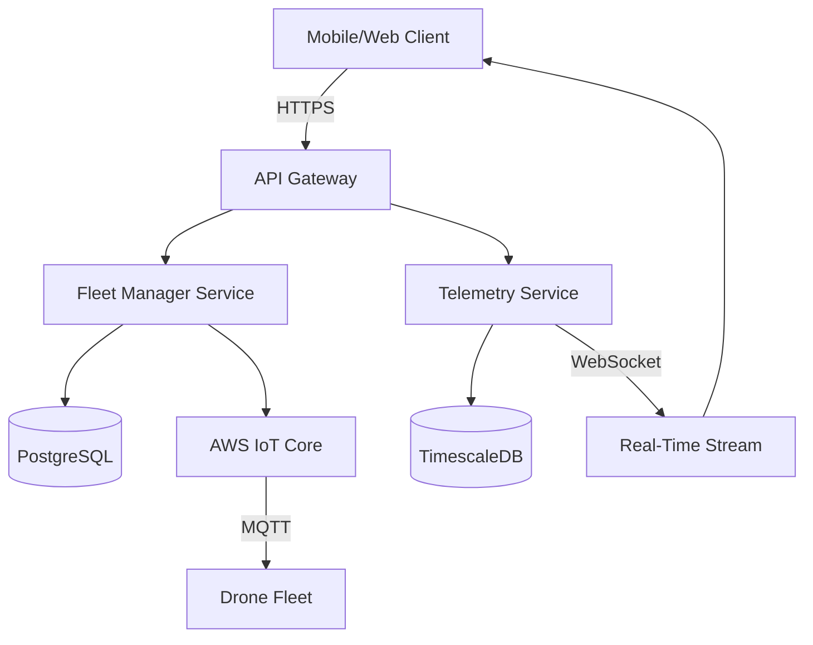

# NimbusFleet – Cloud-Native Drone Management Platform

Welcome to **NimbusFleet**, the comprehensive SaaS platform for deploying, monitoring, and automating commercial delivery drones at scale.

## Overview

NimbusFleet provides enterprise-grade infrastructure for managing autonomous drone fleets in real-time. Our platform handles everything from flight planning and telemetry monitoring to incident response and compliance reporting.

### Key Features

- **Real-Time Telemetry**: Monitor battery, GPS, altitude, and speed across your entire fleet
- **Automated Flight Planning**: AI-powered route optimization with weather integration
- **Cloud-Native Architecture**: Built on AWS with auto-scaling and 99.9% uptime SLA
- **RESTful & WebSocket APIs**: Integrate with existing logistics systems
- **Compliance Ready**: FAA Part 107, EASA, and international airspace regulation support

!!! note "Beta Features Available"
    We're currently offering early access to our **AI Collision Avoidance** and **Multi-Region Fleet Management** modules. Contact sales@nimbusfleet.io to enable these features.

## System Architecture

## Quick Start Checklist

- [ ] [Create an account](https://app.nimbusfleet.io/signup) and obtain API credentials
- [ ] [Deploy your first drone](tutorial/deploy-your-first-drone.md) in simulation mode
- [ ] Configure [AWS IoT Core integration](how-to/integrate-aws-iot-core.md)
- [ ] Review [REST API reference](reference/api/rest.md) for custom integrations
- [ ] Read [architecture overview](explanation/architecture-overview.md) to understand system design

## Documentation Structure

### Tutorials
Step-by-step guides for common workflows:

- [Deploy Your First Drone](tutorial/deploy-your-first-drone.md)
- [Troubleshoot Field Issues](tutorial/troubleshoot-field-issues.md)

### How-To Guides
Task-oriented instructions for specific integrations:

- [Integrate with AWS IoT Core](how-to/integrate-aws-iot-core.md)

### Reference
Complete API and CLI documentation:

- [REST API Reference](reference/api/rest.md)
- [WebSocket API Reference](reference/api/websocket.md)
- [CLI Commands](reference/cli/commands.md)

### Explanation
Deep dives into architecture and concepts:

- [Architecture Overview](explanation/architecture-overview.md)
- [Scaling Principles](explanation/scaling-principles.md)

## Support

- **Documentation Issues**: [GitHub Issues](https://github.com/nimbusfleet/docs/issues)
- **Technical Support**: support@nimbusfleet.io
- **Sales Inquiries**: sales@nimbusfleet.io
- **Status Page**: [status.nimbusfleet.io](https://status.nimbusfleet.io)

---

**Version**: 2.4.0 | **Last Updated**: November 2025
