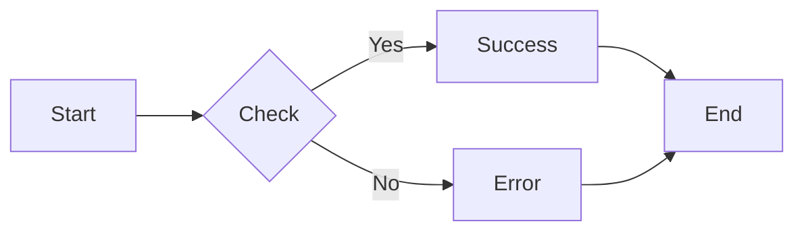
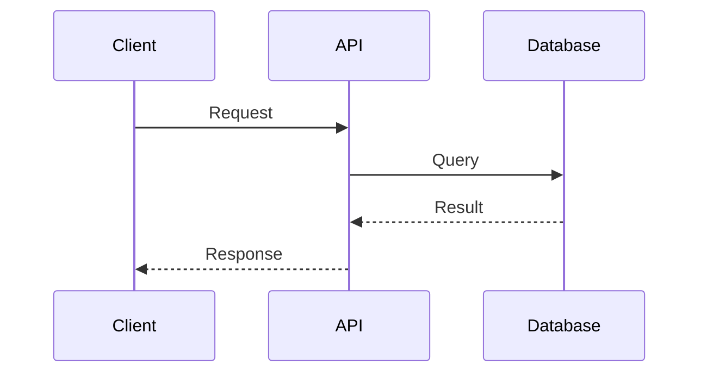
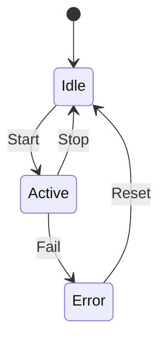
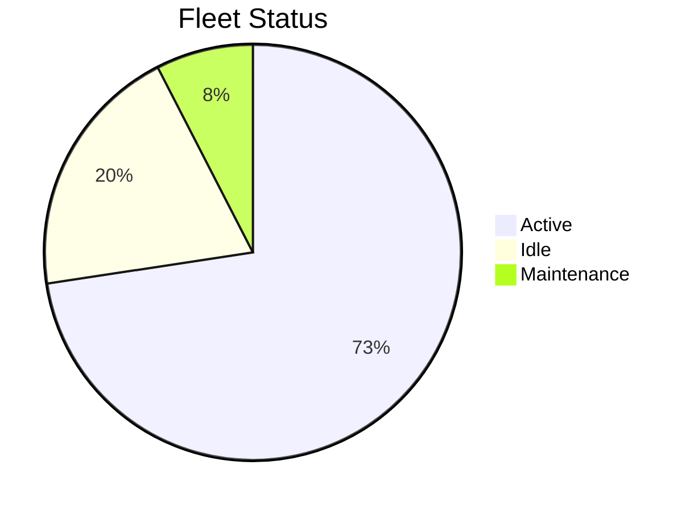
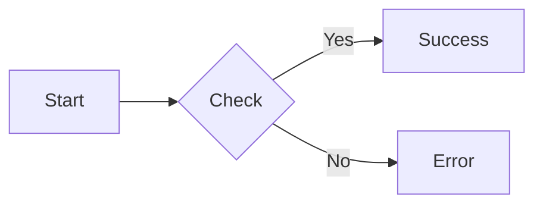
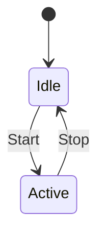
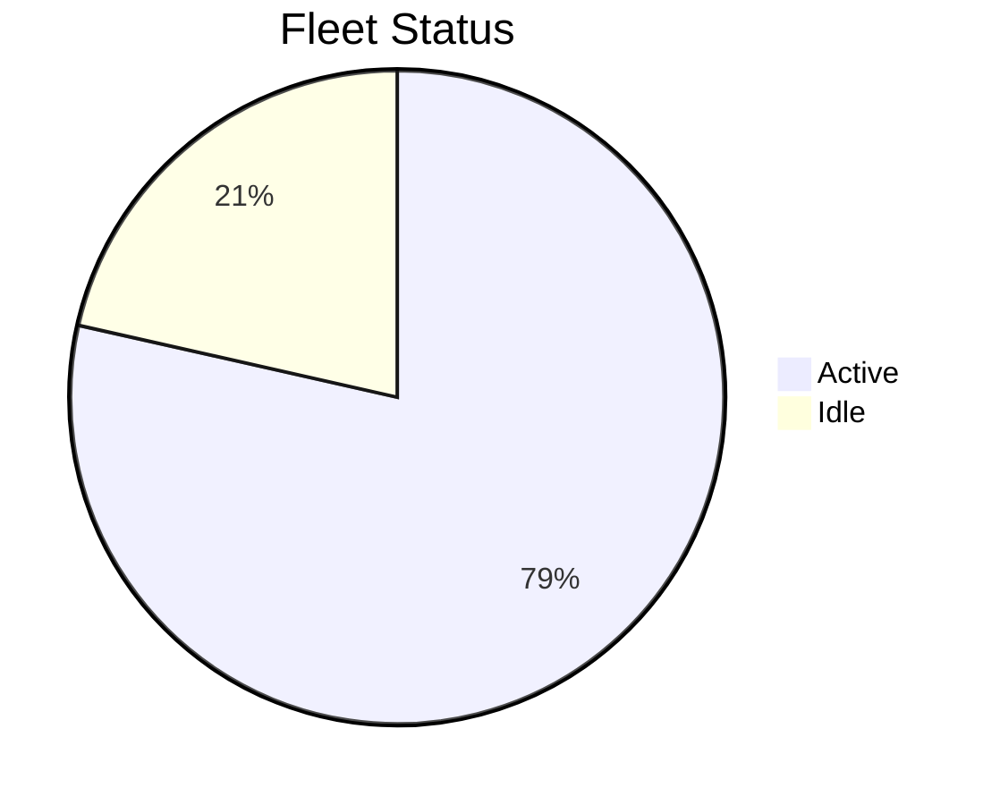
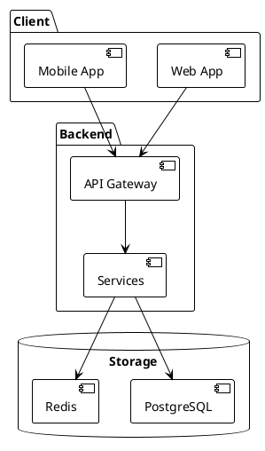
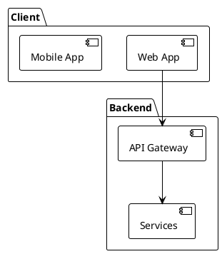

# Markdown Features Showcase

This page demonstrates **all advanced Markdown features** with the **Airbus Design System theme** styling, including colors, typography, and components.

---

## 0. Airbus Design System Showcase

### Heading Hierarchy with Airbus Colors

The Inter font is used throughout with a carefully designed weight hierarchy:

1. **Headers (H1-H3)**: Bold to SemiBold for clear structure
2. **Minor Headers (H4-H6)**: Medium weight for subtle hierarchy
3. **Body Text**: Regular (400) for optimal readability
4. **Interactive Elements**: Medium to SemiBold for visual prominence

**Example Heading Hierarchy:**

<div style="border-left: 4px solid var(--airbus-blue-medium); padding-left: 1rem; margin: 1rem 0;">
  <h1 style="margin-top: 0.5rem;">H1 Heading - Bold (700) - Dark Blue (#00205b)</h1>
  <h2>H2 Heading - SemiBold (600) - Dark Blue (#00205b)</h2>
  <h3>H3 Heading - SemiBold (600) - Dark Blue (#00205b)</h3>
  <h4>H4 Heading - Medium (500) - Medium Blue (#6399ae)</h4>
  <h5>H5 Heading - Medium (500) - Medium Blue (#6399ae)</h5>
  <h6>H6 Heading - Medium (500) - Medium Blue (#6399ae)</h6>
</div>

### Inter Font Weight Demonstration

**Bold text (700)** - Used for emphasis and important information

**SemiBold text (600)** - Used for headings and UI elements (simulate with bold)

Medium text (500) - Used for navigation and links

Regular text (400) - Used for body content and paragraphs

### Airbus Color Palette

The theme uses the official Airbus primary colors:

- **Primary Dark Blue**: #00205b - Headers, tabs, main links
- **Medium Blue**: #6399ae - Buttons, accents, hover states
- **Light Blue**: #b7c9d3 - Lighter accents and highlights

**Functional Colors:**

- **Success Green**: #08875b - Success messages
- **Warning Yellow**: #fbca32 - Warnings and alerts
- **Error Red**: #e4002b - Errors and critical messages


### Code Styling

Inline `code snippets` use Medium (500) weight with Airbus grey background (`#f0f4f6`).

```python
# Code blocks maintain their monospace font (Roboto Mono)
def airbus_function():
    """Example function with Airbus styling"""
    return "Inter font for UI, Roboto Mono for code"
```

---

## 1. Text Formatting

### Rendered Output

**Bold text** and *italic text* and ***bold italic***

~~Strikethrough text~~ for deprecated content

==Highlighted text== for emphasis

<ins>Inserted text</ins> for new additions

H~2~O for subscript and E=mc^2^ for superscript

### Markdown Syntax

```markdown
**Bold text** and *italic text* and ***bold italic***

~~Strikethrough text~~ for deprecated content

==Highlighted text== for emphasis

<ins>Inserted text</ins> for new additions

H~2~O for subscript and E=mc^2^ for superscript
```

---

## 2. Code Blocks

### Rendered Output

Inline `code` with backticks.

```python
def calculate_flight_time(distance_km, speed_mps):
    """Calculate estimated flight time."""
    return (distance_km * 1000) / speed_mps
```

### Markdown Syntax

````markdown
Inline `code` with backticks.

```python
def calculate_flight_time(distance_km, speed_mps):
    """Calculate estimated flight time."""
    return (distance_km * 1000) / speed_mps
```
````

---

## 3. Lists

### Rendered Output

**Unordered:**

- First level
  - Second level
    - Third level

**Ordered:**

1. First step
2. Second step
   1. Sub-step A
   2. Sub-step B

**Task List:**

- [x] Completed task
- [ ] Pending task
  - [x] Nested completed
  - [ ] Nested pending

### Markdown Syntax

```markdown
**Unordered:**

- First level
  - Second level
    - Third level

**Ordered:**

1. First step
2. Second step
   1. Sub-step A
   2. Sub-step B

**Task List:**

- [x] Completed task
- [ ] Pending task
  - [x] Nested completed
  - [ ] Nested pending
```

---

## 4. Tables

### Rendered Output

| Feature   | Status        | Priority |
| --------- | ------------- | -------- |
| REST API  | ✅ Complete    | High     |
| WebSocket | ✅ Complete    | High     |
| CLI Tools | 🚧 In Progress | Medium   |

**With Alignment:**

| Left | Center | Right |
| :--- | :----: | ----: |
| Text |  Text  |   123 |
| More |  Data  |   456 |

### Markdown Syntax

```markdown
| Feature   | Status     | Priority |
| --------- | ---------- | -------- |
| REST API  | ✅ Complete | High     |
| WebSocket | ✅ Complete | High     |

**With Alignment:**

| Left | Center | Right |
| :--- | :----: | ----: |
| Text |  Text  |   123 |
| More |  Data  |   456 |
```

---

## 5. Admonitions

### Rendered Output

!!! note "Information Note"
    This is a note admonition with **formatted text** and `code`.

!!! tip "Pro Tip"
    Enable multi-carrier failover for better connectivity.

!!! warning "Important Warning"
    Always perform pre-flight checks before deployment.

!!! danger "Critical Alert"
    Never commit API keys to version control!

!!! success "Success Message"
    Your drone has been successfully deployed.

!!! failure "Error Message"
    Connection failed. Check network connectivity.

!!! question "FAQ Item"
    **Q: How many drones can I manage?**

    A: Standard supports 100, Enterprise unlimited.

!!! example "Example Usage"
    ```bash
    nimbusfleet drone create -f config.yaml
    ```

!!! info "Airbus Design System"
    Notice how all admonitions feature a **4px left border** in Airbus medium blue (#6399ae), and the titles use **SemiBold (600) Inter font**.

### Markdown Syntax

```markdown
!!! note "Information Note"
    This is a note admonition with **formatted text** and `code`.

!!! tip "Pro Tip"
    Enable multi-carrier failover for better connectivity.

!!! warning "Important Warning"
    Always perform pre-flight checks.

!!! danger "Critical Alert"
    Never commit API keys!

!!! success "Success Message"
    Operation completed successfully.

!!! failure "Error Message"
    Connection failed.

!!! question "FAQ Item"
    Question and answer format.

!!! example "Example Usage"
    Code or usage example.
```

---

## 6. Mermaid Diagrams

### Rendered Output









### Markdown Syntax

````markdown






````

---

## 7. PlantUML Diagrams

### Rendered Output



### Markdown Syntax

````markdown

````

---

## 8. Spoilers/Collapsible Sections

### Rendered Output

::: spoiler "Click to expand: Advanced Configuration"

This content is hidden by default and can be expanded by clicking.

```yaml
debug:
  enabled: true
  log_level: verbose
```

You can include **any Markdown** here:
- Lists
- Code blocks
- Tables
- Even diagrams!

:::

### Markdown Syntax

````markdown
::: spoiler "Click to expand: Advanced Configuration"

This content is hidden by default.

```yaml
debug:
  enabled: true
```
````

You can include **any Markdown** here.

:::


---

## 9. Links and Images

### Rendered Output

**Internal Link:** [Go to Home](index.md)

**External Link:** [MkDocs Documentation](https://www.mkdocs.org)

**Link with Title:** [Dashboard](https://app.nimbusfleet.io "Access dashboard")

**Image:**


**Image with Caption:**


*Figure 1: Real-time telemetry dashboard with GPS tracking*

### Markdown Syntax

```markdown
**Internal Link:** [Go to Home](index.md)

**External Link:** [MkDocs Docs](https://www.mkdocs.org)

**Link with Title:** [Dashboard](https://app.example.com "Tooltip text")

**Image:**


**Image with Caption:**


*Figure 1: Dashboard showing real-time metrics*
```

---

## 10. Blockquotes

### Rendered Output

> **Best Practice**: Always test in simulation mode first.

---

> "The future of logistics is autonomous."
>
> — Engineering Team

**Nested Blockquotes:**

> Level 1 quote
>
> > Level 2 nested quote
> >
> > > Level 3 deeply nested

### Markdown Syntax

```markdown
> **Best Practice**: Always test in simulation mode first.

> "Quote with attribution."
>
> — Author Name

**Nested:**

> Level 1 quote
>
> > Level 2 nested quote
> >
> > > Level 3 deeply nested
```

---

## 11. Footnotes

### Rendered Output

NimbusFleet supports multiple authentication methods[^1] including OAuth 2.0[^2].

Our platform processes over 250,000 messages per second[^3].

[^1]: See Authentication Documentation for details.
[^2]: OAuth 2.0 is recommended for production deployments.
[^3]: Benchmark conducted with 10,000 simulated drones.

### Markdown Syntax

```markdown
Text with footnote reference[^1] and another[^2].

[^1]: This is the first footnote.
[^2]: This is the second footnote with more details.
```

---

## 12. Definition Lists

### Rendered Output

API Key
:   A secret token used to authenticate API requests

Telemetry
:   Real-time data transmitted from drones including GPS and battery readings

WebSocket
:   A bidirectional communication protocol for real-time streaming

### Markdown Syntax

```markdown
API Key
:   A secret token used to authenticate API requests

Telemetry
:   Real-time data transmitted from drones

WebSocket
:   A bidirectional communication protocol
```

---

## 13. Keyboard Keys

### Rendered Output

Press ++ctrl+alt+delete++ to restart.

Use ++cmd+k++ on Mac or ++ctrl+k++ on Windows.

Execute: ++shift+enter++

### Markdown Syntax

```markdown
Press ++ctrl+alt+delete++ to restart.

Use ++cmd+k++ on Mac or ++ctrl+k++ on Windows.

Execute: ++shift+enter++
```

---

## 14. Abbreviations

### Rendered Output

The HTML specification is maintained by the W3C. Hover over the abbreviations to see their full meaning.

NimbusFleet uses AWS IoT Core and supports FAA Part 107 regulations.

*[HTML]: Hyper Text Markup Language
*[W3C]: World Wide Web Consortium
*[AWS]: Amazon Web Services
*[IoT]: Internet of Things
*[FAA]: Federal Aviation Administration

### Markdown Syntax

```markdown
The HTML specification is maintained by the W3C.

*[HTML]: Hyper Text Markup Language
*[W3C]: World Wide Web Consortium
```

---

## 15. Emoji

### Rendered Output

Using shortcuts: :rocket: :airplane: :battery: :satellite:

Status indicators: :white_check_mark: :x: :warning: :information_source:

### Markdown Syntax

```markdown
Using shortcuts: :rocket: :airplane: :battery: :satellite:

Status: :white_check_mark: :x: :warning: :information_source:
```

---

## 16. Math Equations (LaTeX)

### Rendered Output

**Inline:** The equation $E = mc^2$ represents energy-mass equivalence.

**Block equation:**

$$
\text{Flight Time} = \frac{\text{Distance (km)} \times 1000}{\text{Speed (m/s)}}
$$

**Complex formula:**

$$
\text{Battery Life (min)} = \frac{C_{\text{mAh}} \times V}{P_{\text{avg}} \times 60}
$$

### Markdown Syntax

```markdown
**Inline:** The equation $E = mc^2$ represents energy.

**Block equation:**

$$
\text{Flight Time} = \frac{\text{Distance (km)} \times 1000}{\text{Speed (m/s)}}
$$
```

---

## 17. Horizontal Rules

### Rendered Output

Text above the first horizontal rule.

---

Text between horizontal rules.

***

Text after the second horizontal rule.

### Markdown Syntax

```markdown
Text above the first horizontal rule.

---

Text between horizontal rules.

***

Text after the second horizontal rule.
```

---

## 18. Airbus Theme Summary

### Complete Airbus Design System Integration

This documentation site features a custom MkDocs Material theme built on the **Airbus Design System**:

#### Color Palette Reference

| Element                   | Color         | Hex Code  |
| ------------------------- | ------------- | --------- |
| **Headers (H1-H3)**       | Dark Blue     | `#00205b` |
| **Minor Headers (H4-H6)** | Medium Blue   | `#6399ae` |
| **Primary Buttons**       | Medium Blue   | `#6399ae` |
| **Links**                 | Dark Blue     | `#00205b` |
| **Link Hover**            | Medium Blue   | `#6399ae` |
| **Tabs Background**       | Dark Blue     | `#00205b` |
| **Footer**                | Dark Blue     | `#00205b` |
| **Code Background**       | Grey Lightest | `#f0f4f6` |
| **Success**               | Green         | `#08875b` |
| **Warning**               | Yellow        | `#fbca32` |
| **Error**                 | Red           | `#e4002b` |

#### Typography Hierarchy

| Element    | Font        | Weight                    | Usage           |
| ---------- | ----------- | ------------------------- | --------------- |
| Site Title | Inter       | 700 (Bold)                | Header branding |
| H1         | Inter       | 700 (Bold)                | Page titles     |
| H2, H3     | Inter       | 600 (SemiBold)            | Section headers |
| H4, H5, H6 | Inter       | 500 (Medium)              | Minor headers   |
| Navigation | Inter       | 500/600 (Medium/SemiBold) | Sidebar/tabs    |
| Body Text  | Inter       | 400 (Regular)             | Content         |
| Buttons    | Inter       | 600 (SemiBold)            | CTAs            |
| Code       | Roboto Mono | 400 (Regular)             | Code blocks     |

#### Key Features

✓ **Official Airbus Colors** - Primary palette (#00205b, #6399ae, #b7c9d3)
✓ **Inter Font Family** - Modern, readable web font
✓ **Responsive Design** - Works on all screen sizes
✓ **Wide Content** - 80rem (1280px) for optimal readability
✓ **Accessible** - WCAG compliant color contrast
✓ **Maintainable** - CSS variables for easy customization

---

**Version**: 1.0 | **Last Updated**: November 2025 | **Theme**: Airbus Design System
