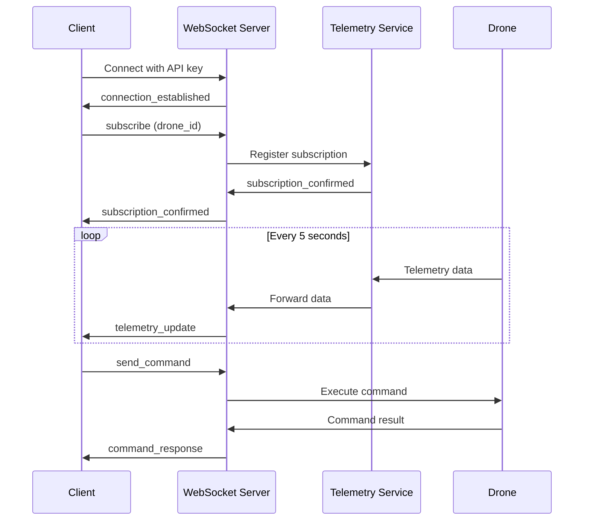

# WebSocket API Reference

The NimbusFleet WebSocket API provides real-time, bidirectional communication for telemetry streaming and instant command execution.

## Connection Endpoint

```
wss://telemetry.nimbusfleet.io/stream
```

## Authentication

Include your API key in the connection query string:

```javascript
const ws = new WebSocket('wss://telemetry.nimbusfleet.io/stream?api_key=nf_live_abc123xyz...');
```

## Connection Lifecycle



## Message Types

### Client → Server

#### 1. Subscribe to Drone

Subscribe to real-time telemetry for a specific drone.

```json
{
  "type": "subscribe",
  "drone_id": "drone-f8a7c2d1",
  "metrics": ["gps", "battery", "altitude", "velocity"],
  "throttle_ms": 1000
}
```

**Parameters**:
- `drone_id`: Unique drone identifier
- `metrics`: Array of metric types to receive
- `throttle_ms` (optional): Minimum milliseconds between updates (default: 1000)

#### 2. Unsubscribe from Drone

```json
{
  "type": "unsubscribe",
  "drone_id": "drone-f8a7c2d1"
}
```

#### 3. Send Command

Execute a command on a drone.

```json
{
  "type": "command",
  "drone_id": "drone-f8a7c2d1",
  "command": "update_waypoint",
  "params": {
    "waypoint_index": 2,
    "altitude": 90
  },
  "request_id": "cmd_8f2a1c3d"
}
```

### Server → Client

#### 1. Connection Established

Sent immediately after successful connection.

```json
{
  "type": "connection_established",
  "session_id": "sess_7a3f2b1e",
  "server_time": "2025-11-08T14:50:00Z"
}
```

#### 2. Subscription Confirmed

```json
{
  "type": "subscription_confirmed",
  "drone_id": "drone-f8a7c2d1",
  "metrics": ["gps", "battery", "altitude", "velocity"],
  "stream_id": "stream_9e2f1d4c"
}
```

#### 3. Telemetry Update

Real-time telemetry data from subscribed drone.

```json
{
  "type": "telemetry_update",
  "drone_id": "drone-f8a7c2d1",
  "timestamp": "2025-11-08T14:50:05.324Z",
  "data": {
    "gps": {
      "lat": 37.7849,
      "lon": -122.4094,
      "altitude": 82.5,
      "satellites": 12
    },
    "battery": {
      "percent": 64,
      "voltage": 22.7
    },
    "altitude": {
      "ground_level": 82.5,
      "sea_level": 124.3
    },
    "velocity": {
      "ground_speed": 12.1,
      "heading": 243
    }
  }
}
```

#### 4. Command Response

```json
{
  "type": "command_response",
  "request_id": "cmd_8f2a1c3d",
  "drone_id": "drone-f8a7c2d1",
  "status": "success",
  "result": {
    "waypoint_updated": true,
    "eta_seconds": 45
  }
}
```

#### 5. Alert

Automated alerts for critical events.

```json
{
  "type": "alert",
  "drone_id": "drone-f8a7c2d1",
  "severity": "warning",
  "code": "LOW_BATTERY",
  "message": "Battery level below 20%",
  "timestamp": "2025-11-08T14:52:18Z",
  "data": {
    "battery_percent": 18,
    "estimated_flight_time_seconds": 420
  }
}
```

## Code Examples

### Python Example

```python
import asyncio
import websockets
import json

async def stream_telemetry():
    uri = "wss://telemetry.nimbusfleet.io/stream?api_key=nf_live_abc123xyz..."

    async with websockets.connect(uri) as websocket:
        # Subscribe to drone
        subscribe_msg = {
            "type": "subscribe",
            "drone_id": "drone-f8a7c2d1",
            "metrics": ["gps", "battery"]
        }
        await websocket.send(json.dumps(subscribe_msg))

        # Receive telemetry
        async for message in websocket:
            data = json.loads(message)
            if data["type"] == "telemetry_update":
                print(f"Battery: {data['data']['battery']['percent']}%")
                print(f"Location: {data['data']['gps']['lat']}, {data['data']['gps']['lon']}")

asyncio.run(stream_telemetry())
```

### JavaScript Example

```javascript
const ws = new WebSocket('wss://telemetry.nimbusfleet.io/stream?api_key=nf_live_abc123xyz...');

ws.onopen = () => {
  // Subscribe to drone
  ws.send(JSON.stringify({
    type: 'subscribe',
    drone_id: 'drone-f8a7c2d1',
    metrics: ['gps', 'battery', 'altitude']
  }));
};

ws.onmessage = (event) => {
  const data = JSON.parse(event.data);

  if (data.type === 'telemetry_update') {
    console.log(`Battery: ${data.data.battery.percent}%`);
    console.log(`Altitude: ${data.data.altitude.ground_level}m`);
  }

  if (data.type === 'alert') {
    console.warn(`⚠️ ${data.message}`);
  }
};

ws.onerror = (error) => {
  console.error('WebSocket error:', error);
};
```

## Advanced Features

::: spoiler "Debug Mode (Click to expand)"

### Enable Debug Mode

For troubleshooting, enable verbose logging:

```json
{
  "type": "configure",
  "debug": true,
  "log_level": "verbose"
}
```

When enabled, you'll receive additional messages:

```json
{
  "type": "debug",
  "event": "message_received",
  "latency_ms": 24,
  "queue_depth": 3
}
```

**Warning**: Debug mode increases bandwidth usage. Only use during development.

:::

### Multi-Drone Subscriptions

Subscribe to multiple drones in a single connection:

```json
{
  "type": "subscribe_batch",
  "drones": [
    {"drone_id": "drone-f8a7c2d1", "metrics": ["gps", "battery"]},
    {"drone_id": "drone-a3f9d2e8", "metrics": ["gps", "battery"]},
    {"drone_id": "drone-b2e8f1c4", "metrics": ["gps", "battery"]}
  ]
}
```

### Filtered Alerts

Receive only alerts matching specific criteria:

```json
{
  "type": "alert_filter",
  "severity": ["critical", "warning"],
  "codes": ["LOW_BATTERY", "GPS_WEAK", "CONNECTIVITY_LOSS"]
}
```

## Connection Limits

| Plan | Concurrent Connections | Subscriptions per Connection |
|------|------------------------|------------------------------|
| Standard | 5 | 10 |
| Professional | 25 | 50 |
| Enterprise | Unlimited | Unlimited |

## Error Handling

### Connection Errors

```json
{
  "type": "error",
  "code": "SUBSCRIPTION_FAILED",
  "message": "Drone 'drone-invalid' not found or offline",
  "request_id": "req_9f3a2c1e"
}
```

### Reconnection Strategy

Implement exponential backoff for reconnections:

```javascript
let reconnectDelay = 1000; // Start at 1 second

function connect() {
  const ws = new WebSocket(wsUrl);

  ws.onerror = () => {
    setTimeout(() => {
      reconnectDelay = Math.min(reconnectDelay * 2, 30000); // Max 30 seconds
      connect();
    }, reconnectDelay);
  };

  ws.onopen = () => {
    reconnectDelay = 1000; // Reset on successful connection
  };
}
```

## Related Resources

- [REST API Reference](rest.md) for HTTP-based operations
- [CLI Commands](../cli/commands.md) for command-line streaming
- [Troubleshooting Guide](../../tutorial/troubleshoot-field-issues.md) for connectivity issues

---

**Protocol Version**: WSS v2.1 | **Last Updated**: November 2025
