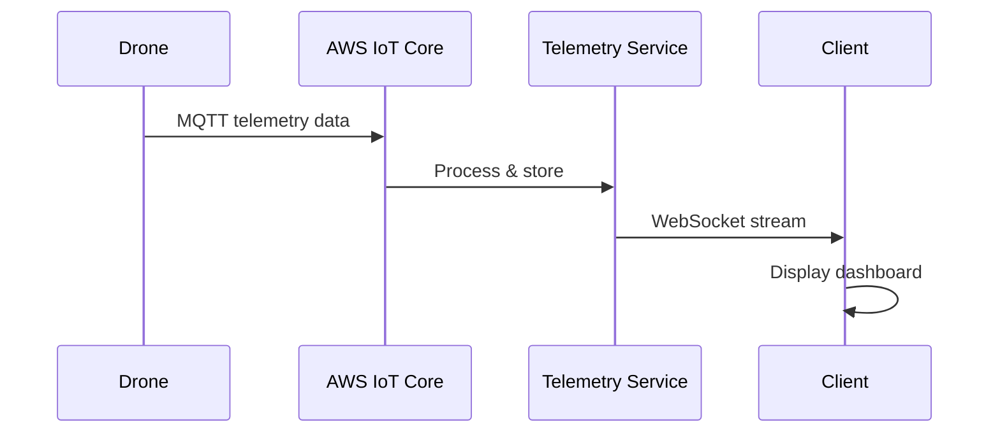

# Deploy Your First Drone

This tutorial walks you through deploying and monitoring your first drone using NimbusFleet's simulation environment.

## Prerequisites

Before you begin, ensure you have:

- A NimbusFleet account with API credentials
- The `nimbusfleet` CLI installed (`pip install nimbusfleet-cli`)
- Basic familiarity with YAML configuration files

## Step 1: Configure Your Drone

### Create Configuration File

Create a file named `drone-config.yaml` with the following configuration:

```yaml
apiVersion: v2
kind: Drone
metadata:
  name: delivery-drone-01
  region: us-west-2
  environment: simulation
spec:
  model: NF-Hawk-X2
  capabilities:
    maxPayload: 5.0  # kg
    maxRange: 15.0   # km
    maxAltitude: 120 # meters
  telemetry:
    reportingInterval: 5s
    metrics:
      - gps
      - battery
      - altitude
      - velocity
  flightPlan:
    waypoints:
      - lat: 37.7749
        lon: -122.4194
        altitude: 50
        action: takeoff
      - lat: 37.7849
        lon: -122.4094
        altitude: 80
        action: deliver
      - lat: 37.7749
        lon: -122.4194
        altitude: 50
        action: land
```

### Configuration Breakdown

#### Metadata Section
- `name`: Unique identifier for your drone
- `region`: AWS region for deployment
- `environment`: Use `simulation` for testing, `production` for live flights

#### Capabilities
Define your drone's physical limits:
- **maxPayload**: Maximum cargo weight in kilograms
- **maxRange**: Maximum flight distance in kilometers
- **maxAltitude**: Maximum altitude in meters (FAA limit: 120m)

## Step 2: Deploy the Drone

### Register with NimbusFleet

Run the following command to register your drone:

```bash
nimbusfleet drone create -f drone-config.yaml
```

Expected output:
```
✓ Drone registered successfully
  ID: drone-f8a7c2d1
  Status: INITIALIZING
  Telemetry Stream: wss://telemetry.nimbusfleet.io/stream/drone-f8a7c2d1
```

### Verify Deployment

Check the drone status:

```bash
nimbusfleet drone get delivery-drone-01
```

## Step 3: Monitor Telemetry

### Real-Time Data Flow



### Access the Dashboard

Navigate to the web dashboard:

```
https://app.nimbusfleet.io/fleet/delivery-drone-01
```

You'll see real-time metrics including:

- GPS coordinates with map visualization
- Battery level (percentage and voltage)
- Current altitude and velocity
- Active flight plan status


## Step 4: Start a Simulated Flight

### Execute Flight Plan

```bash
nimbusfleet flight start delivery-drone-01 --plan delivery-mission-1
```

The drone will:
1. Perform pre-flight checks (30 seconds)
2. Execute takeoff sequence
3. Navigate through waypoints
4. Simulate package delivery
5. Return to launch point
6. Land automatically

### Monitor Progress

Watch the flight in real-time:

```bash
nimbusfleet flight watch delivery-drone-01
```

## Troubleshooting

::: spoiler "Expand for common issues"

### Issue: Drone fails pre-flight checks

**Cause**: Configuration validation error

**Solution**: Verify your YAML syntax and ensure all required fields are present.

### Issue: Telemetry stream not connecting

**Cause**: API credentials expired or invalid

**Solution**: Regenerate your API key:
```bash
nimbusfleet auth refresh
```

### Issue: Flight plan rejected

**Cause**: Waypoint outside of operational range

**Solution**: Check that all waypoints are within `maxRange` of the launch point and below `maxAltitude`.

:::

## Next Steps

Congratulations! You've successfully deployed your first drone. Next, explore:

- [Troubleshoot field issues](troubleshoot-field-issues.md) for real-world deployments
- [AWS IoT Core integration](../how-to/integrate-aws-iot-core.md) for production setup
- [REST API reference](../reference/api/rest.md) for custom automations

---

**Related Topics**: [WebSocket API](../reference/api/websocket.md) | [Architecture Overview](../explanation/architecture-overview.md)
