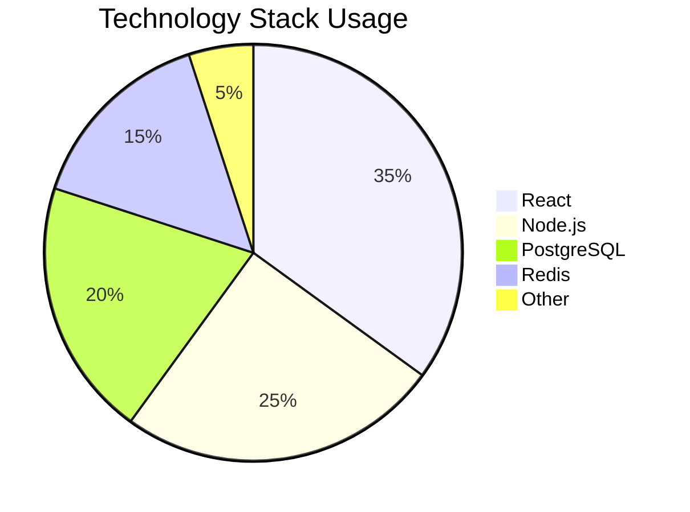
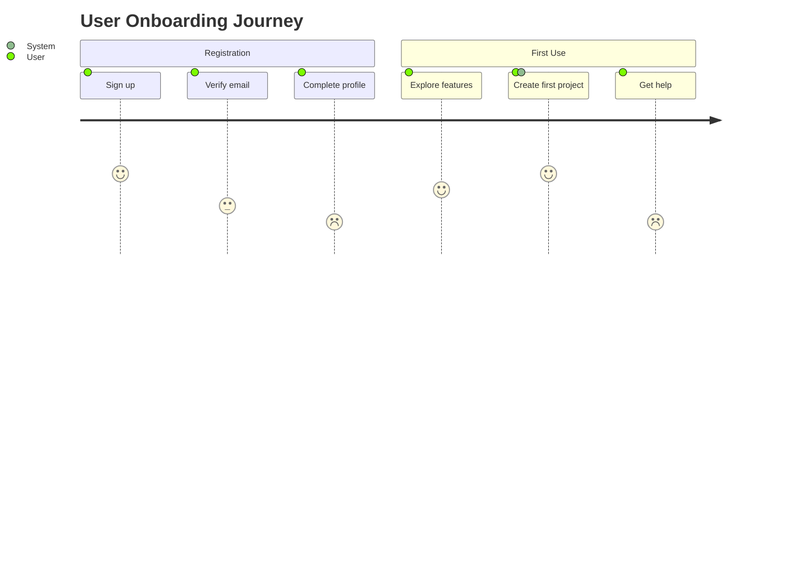
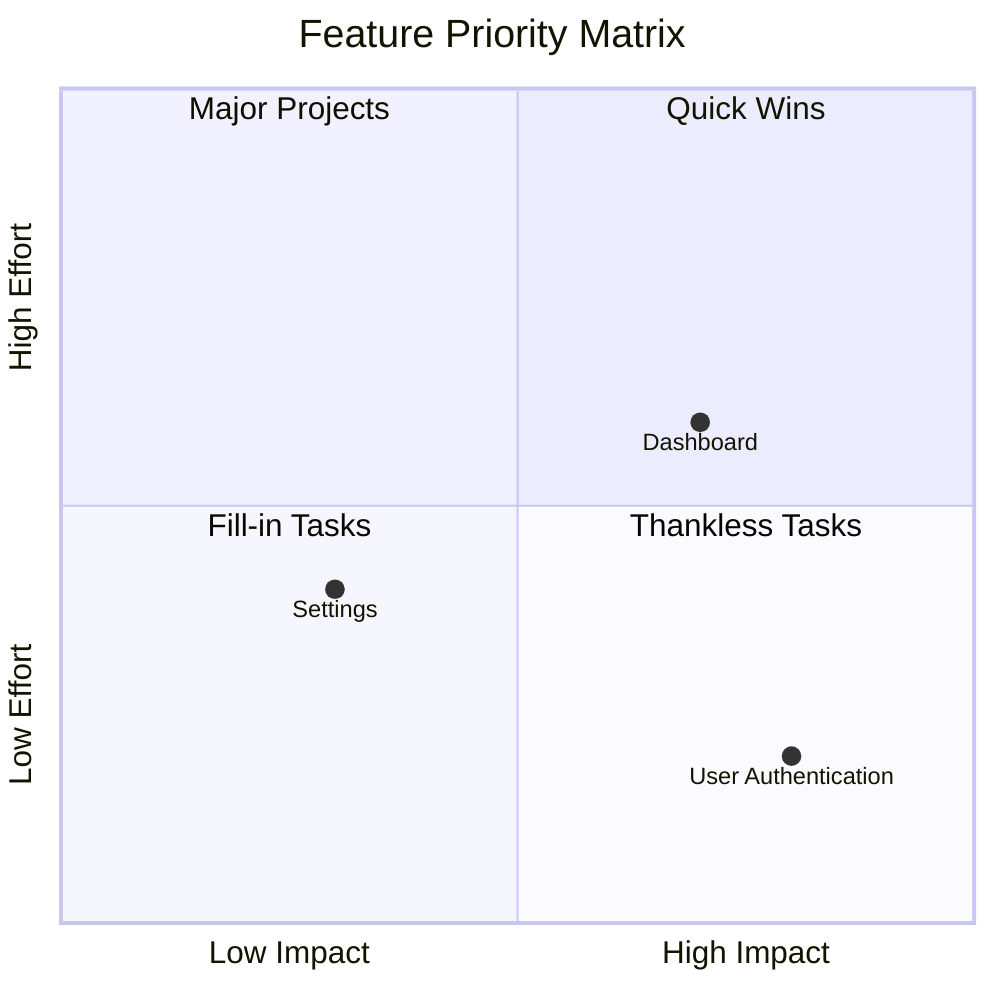
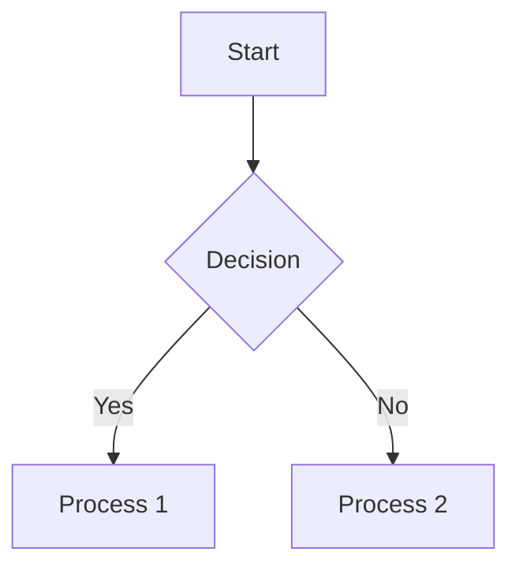

# Skill: Mermaid Diagram Expert

## Metadata

```yaml
skill_id: moai-mermaid-diagram-expert
skill_name: Mermaid Diagram Expert
version: 1.0.0
created_date: 2025-11-11
updated_date: 2025-11-11
language: english
word_count: 2000
triggers:
  - keywords: [mermaid, diagram, flowchart, sequence diagram, architecture visualization]
  - contexts: [mermaid-diagrams, visual-documentation, diagram-generation, architecture-diagrams]
agents:
  - docs-manager
  - backend-expert
  - frontend-expert
  - database-expert
freedom_level: high
context7_references:
  - url: "https://mermaid.js.org"
    topic: "Official Mermaid.js documentation and syntax reference"
  - url: "https://github.com/mermaid-js/mermaid"
    topic: "Latest Mermaid features and validation patterns"
  - url: "https://mermaid.live"
    topic: "Live Mermaid editor and testing platform"
```

## 📚 Content

### Section 1: Mermaid Diagram Types & Use Cases

#### Supported Diagram Categories

**1. Flowcharts (graph)**
- **Use Case**: Process flows, decision trees, algorithm visualization
- **Syntax**: `graph TD/LR/RL/BT` (Top Down/Left Right/Right Left/Bottom Top)
- **Best For**: User journeys, deployment processes, CI/CD pipelines

**2. Sequence Diagrams (sequenceDiagram)**
- **Use Case**: Interactions between components, API calls, user flows
- **Syntax**: Participants, messages, loops, conditions
- **Best For**: Microservices communication, database transactions, authentication flows

**3. Class Diagrams (classDiagram)**
- **Use Case**: System architecture, object relationships, design patterns
- **Syntax**: Classes, inheritance, associations, multiplicities
- **Best For**: Code architecture, design patterns, system modeling

**4. State Diagrams (stateDiagram-v2)**
- **Use Case**: Component lifecycle, user authentication states, workflow states
- **Syntax**: States, transitions, events, conditions
- **Best For**: State machines, user flows, application lifecycle

**5. Entity Relationship Diagrams (erDiagram)**
- **Use Case**: Database schema, data relationships, system entities
- **Syntax**: Entities, relationships, cardinality, attributes
- **Best For**: Database design, data modeling, system architecture

**6. Gantt Charts (gantt)**
- **Use Case**: Project timelines, release schedules, sprint planning
- **Syntax**: Tasks, dates, dependencies, milestones
- **Best For**: Project management, release planning, roadmap visualization

#### Advanced Diagram Types

**7. Pie Charts (pie)**


**8. Journey Maps (journey)**


**9. Quadrant Charts (quadrantChart)**


### Section 2: Syntax Validation & Error Prevention

#### Common Syntax Errors and Solutions

**1. Node and Connection Syntax**
```mermaid
## ❌ Incorrect
graph TD
    A[Start] -- wrong syntax --> B(End)
    A missing connection C

## ✅ Correct
graph TD
    A[Start] --> B(End)
    A --> C[Process]
```

**2. Subgraph Structure**
```mermaid
## ❌ Incorrect
graph TD
    subgraph
        A[Process A]
    end
    B[Process B] --> A

## ✅ Correct
graph TD
    subgraph "Processing Group"
        A[Process A]
        A --> B[Process B]
    end
    C[Start] --> A
```

**3. Styling Syntax**
```mermaid
## ❌ Incorrect
graph TD
    A[Start]
    style A fill:#f9f,stroke:#333,stroke-width:4px

## ✅ Correct
graph TD
    A[Start]
    style A fill:#f9f,stroke:#333,stroke-width:4px
    linkStyle 0 stroke:#f66,stroke-width:2px
```

#### Advanced Validation Patterns

**Automatic Error Detection**:
```python
class MermaidValidator:
    def __init__(self):
        self.error_patterns = {
            'unclosed_blocks': r'```mermaid[^`]*$',
            'invalid_connections': r'(\w+)(\s*-->|\s*---)(\s*\w+)',
            'malformed_styles': r'style\s+\w+[^;]*$',
            'missing_quotes': r'subgraph\s+[^(]',
        }

    def validate_syntax(self, mermaid_code: str) -> ValidationResult:
        """Comprehensive Mermaid syntax validation"""
        errors = []
        warnings = []

        # Check for unclosed code blocks
        if re.search(self.error_patterns['unclosed_blocks'], mermaid_code):
            errors.append("Unclosed mermaid code block detected")

        # Validate diagram type
        diagram_type = self.detect_diagram_type(mermaid_code)
        if not diagram_type:
            errors.append("Invalid or missing diagram type")

        # Check for common syntax errors
        for pattern_name, pattern in self.error_patterns.items():
            matches = re.findall(pattern, mermaid_code)
            if matches:
                warnings.extend([f"{pattern_name}: {match}" for match in matches])

        return ValidationResult(errors=errors, warnings=warnings)
```

### Section 3: Auto-Generation from Source Code

#### Architecture Diagram Generation

**From Package.json Dependencies**:
```python
def generate_architecture_diagram(package_json: dict) -> str:
    """Generate system architecture diagram from package.json"""

    dependencies = package_json.get('dependencies', {})
    dev_dependencies = package_json.get('devDependencies', {})

    # Categorize dependencies
    frontend_libs = [dep for dep in dependencies if dep in ['react', 'vue', 'angular']]
    backend_libs = [dep for dep in dependencies if dep in ['express', 'fastapi', 'django']]
    database_libs = [dep for dep in dependencies if dep in ['prisma', 'mongoose', 'typeorm']]

    return f"""
```mermaid
graph TB
    subgraph "Frontend Layer"
        User[User] --> Browser[Web Browser]
        Browser --> App[{package_json.get('name', 'Application')}]
    end

    subgraph "Backend Layer"
        App --> API[API Server]
        {generate_dependency_nodes(backend_libs)}
    end

    subgraph "Data Layer"
        {generate_dependency_nodes(database_libs)}
        API --> Database[(Database)]
    end

    subgraph "Development Tools"
        {generate_dependency_nodes(dev_dependencies)}
    end

    style App fill:#e1f5fe
    style API fill:#f3e5f5
    style Database fill:#e8f5e8
```
"""

def generate_sequence_diagram(api_endpoints: List[dict]) -> str:
    """Generate sequence diagram from API endpoint definitions"""

    participants = []
    interactions = []

    for endpoint in api_endpoints:
        path = endpoint['path']
        method = endpoint['method']

        # Extract participants from path
        path_parts = [part for part in path.split('/') if part and not part.startswith('{')]
        participants.extend(path_parts)

        # Add interactions
        if len(path_parts) >= 2:
            interactions.append(f"{path_parts[0]} ->> {path_parts[1]}: {method.upper()} {path}")

    participants = list(set(participants))  # Remove duplicates

    mermaid_code = "```mermaid\nsequenceDiagram\n"

    # Add participants
    for participant in participants:
        mermaid_code += f"    participant {participant.title()}\n"

    # Add interactions
    for interaction in interactions:
        mermaid_code += f"    {interaction}\n"

    return mermaid_code + "```"
```

#### Database Schema Visualization

**From Database Models**:
```python
def generate_er_diagram(models: List[dict]) -> str:
    """Generate ER diagram from database models"""

    mermaid_code = "```mermaid\nerDiagram\n"

    for model in models:
        table_name = model['name']
        fields = model.get('fields', [])

        # Add table definition
        mermaid_code += f"    {table_name} {{\n"

        for field in fields:
            field_name = field['name']
            field_type = field['type']
            is_primary = field.get('primary_key', False)
            is_foreign = field.get('foreign_key', False)

            # Add field type and constraints
            field_def = f"        {field_type} {field_name}"
            if is_primary:
                field_def += " PK"
            if is_foreign:
                field_def += " FK"

            mermaid_code += f"{field_def}\n"

        mermaid_code += f"    }}\n"

    # Add relationships
    for model in models:
        table_name = model['name']
        relationships = model.get('relationships', [])

        for rel in relationships:
            related_table = rel['table']
            rel_type = rel.get('type', '||--o{')

            mermaid_code += f"    {table_name} {rel_type} {related_table}\n"

    return mermaid_code + "```"
```

### Section 4: Integration with Nextra

#### Mermaid Configuration

**Nextra Theme Configuration**:
```typescript
// theme.config.tsx
import { DocsThemeConfig } from 'nextra-theme-docs'

const config: DocsThemeConfig = {
  // Mermaid configuration
  mermaid: {
    theme: 'default',
    themeVariables: {
      primaryColor: '#0070f3',
      primaryTextColor: '#fff',
      primaryBorderColor: '#007c3f',
      lineColor: '#000',
      secondaryColor: '#f3f3f3',
      tertiaryColor: '#e1e1e1',
      background: '#fff',
      mainBkg: '#fff',
      secondBkg: '#f3f3f3',
      tertiaryBkg: '#e1e1e1',
    },
    flowchart: {
      curve: 'step',
      padding: 20,
    },
    sequence: {
      diagramMarginX: 50,
      diagramMarginY: 10,
      actorMargin: 50,
      width: 150,
      height: 65,
      boxMargin: 10,
      boxTextMargin: 5,
      noteMargin: 10,
      messageMargin: 35,
    },
  },
}

export default config
```

**Custom Mermaid Component**:
```tsx
// components/MermaidDiagram.tsx
import { useEffect, useRef } from 'react'
import mermaid from 'mermaid'

interface MermaidDiagramProps {
  chart: string
  id?: string
  config?: any
  className?: string
}

export function MermaidDiagram({
  chart,
  id = 'mermaid-chart',
  config = {},
  className = ''
}: MermaidDiagramProps) {
  const elementRef = useRef<HTMLDivElement>(null)

  useEffect(() => {
    // Initialize Mermaid with custom config
    mermaid.initialize({
      startOnLoad: false,
      theme: 'default',
      securityLevel: 'loose',
      ...config
    })

    if (elementRef.current) {
      // Generate unique ID
      const elementId = `mermaid-${id}-${Date.now()}`

      // Render diagram
      mermaid.render(elementId, chart)
        .then(({ svg }) => {
          if (elementRef.current) {
            elementRef.current.innerHTML = svg
          }
        })
        .catch((error) => {
          console.error('Mermaid rendering error:', error)
          if (elementRef.current) {
            elementRef.current.innerHTML = `
              <div class="error">
                <p>Diagram rendering failed:</p>
                <pre>${error.message}</pre>
              </div>
            `
          }
        })
    }
  }, [chart, id, config])

  return (
    <div
      ref={elementRef}
      className={`mermaid-container ${className}`}
      style={{ textAlign: 'center' }}
    />
  )
}
```

#### MDX Integration

**Diagram Shortcodes**:
```mdx
import { MermaidDiagram } from '../components/MermaidDiagram'

# Architecture Overview

<!-- Simple mermaid block -->


<!-- Custom component with configuration -->
<MermaidDiagram
  chart={`
    graph LR
        Frontend --> API
        API --> Database
        API --> Cache
  `}
  config={{
    theme: 'forest',
    flowchart: { curve: 'basis' }
  }}
/>

<!-- Interactive diagram with tabs -->
import { Tabs, TabItem } from 'nextra-theme-docs'

<Tabs items={['Flow', 'Sequence', 'Architecture']}>
  <TabItem>
    ```mermaid
    graph TD
        User --> Login
        Login --> Dashboard
    ```
  </TabItem>
  <TabItem>
    ```mermaid
    sequenceDiagram
        User->>Login: POST /login
        Login->>Database: Validate credentials
        Database-->>Login: User data
        Login-->>User: JWT token
    ```
  </TabItem>
  <TabItem>
    ```mermaid
    graph TB
        subgraph "Frontend"
            WebApp[Web Application]
            MobileApp[Mobile App]
        end
        subgraph "Backend"
            API[REST API]
            Auth[Authentication Service]
        end
        subgraph "Database"
            PostgreSQL[(PostgreSQL)]
            Redis[(Redis Cache)]
        end

        WebApp --> API
        MobileApp --> API
        API --> Auth
        API --> PostgreSQL
        API --> Redis
    ```
  </TabItem>
</Tabs>
```

### Section 5: Advanced Features

#### Interactive Diagrams

**Clickable Diagrams**:
```html
<!-- HTML with clickable elements -->
<div class="mermaid-clickable">
  ```mermaid
  graph TD
      A[Start] --> B{Continue?}
      B -->|Yes| C[Process]
      B -->|No| D[End]
      C --> E[More?]
      E -->|Yes| C
      E -->|No| D
  ```

  <script>
    // Add click handlers to diagram elements
    document.addEventListener('DOMContentLoaded', function() {
      const svg = document.querySelector('.mermaid-clickable svg')
      if (svg) {
        svg.addEventListener('click', function(e) {
          const target = e.target
          if (target.tagName === 'text') {
            const nodeText = target.textContent
            showNodeDetails(nodeText)
          }
        })
      }
    })

    function showNodeDetails(nodeName) {
      // Display details in a modal or sidebar
      console.log('Clicked node:', nodeName)
    }
  </script>
</div>
```

#### Animated Diagrams

**Progressive Animation**:
```javascript
// scripts/animated-mermaid.js
class AnimatedMermaid {
  constructor(containerId, mermaidCode) {
    this.container = document.getElementById(containerId)
    this.code = mermaidCode
    this.currentStep = 0
    this.steps = this.parseSteps(mermaidCode)
  }

  parseSteps(code) {
    // Parse mermaid code into animation steps
    const lines = code.split('\n')
    const steps = []
    let currentStep = []

    lines.forEach(line => {
      if (line.includes('// STEP')) {
        if (currentStep.length > 0) {
          steps.push(currentStep.join('\n'))
          currentStep = []
        }
      } else if (line.trim() && !line.startsWith('```')) {
        currentStep.push(line)
      }
    })

    if (currentStep.length > 0) {
      steps.push(currentStep.join('\n'))
    }

    return steps
  }

  async renderStep(stepIndex) {
    if (stepIndex >= this.steps.length) return

    const stepCode = `\`\`\`mermaid\n${this.steps[stepIndex]}\n\`\`\``

    try {
      const { svg } = await mermaid.render('step-' + stepIndex, stepCode)
      this.container.innerHTML = svg

      // Add animation classes
      const elements = this.container.querySelectorAll('g, path, rect, text')
      elements.forEach((el, index) => {
        el.style.opacity = '0'
        el.style.animation = `fadeIn 0.3s ease-in ${index * 0.05}s forwards`
      })
    } catch (error) {
      console.error('Animation step error:', error)
    }
  }

  start() {
    this.renderStep(0)

    // Auto-advance through steps
    setInterval(() => {
      this.currentStep = (this.currentStep + 1) % this.steps.length
      this.renderStep(this.currentStep)
    }, 3000)
  }
}
```

### Section 6: Performance Optimization

#### Lazy Loading Diagrams

**Intersection Observer Implementation**:
```typescript
// components/LazyMermaid.tsx
import { useEffect, useRef, useState } from 'react'

export function LazyMermaid({ chart, threshold = 0.1 }) {
  const [isVisible, setIsVisible] = useState(false)
  const [hasRendered, setHasRendered] = useState(false)
  const containerRef = useRef<HTMLDivElement>(null)

  useEffect(() => {
    const observer = new IntersectionObserver(
      ([entry]) => {
        if (entry.isIntersecting && !hasRendered) {
          setIsVisible(true)
          setHasRendered(true)
        }
      },
      { threshold }
    )

    if (containerRef.current) {
      observer.observe(containerRef.current)
    }

    return () => observer.disconnect()
  }, [threshold, hasRendered])

  return (
    <div ref={containerRef} className="lazy-mermaid-container">
      {isVisible ? (
        <MermaidDiagram chart={chart} />
      ) : (
        <div className="mermaid-placeholder">
          <div className="animate-pulse bg-gray-200 h-64 rounded"></div>
        </div>
      )}
    </div>
  )
}
```

#### Diagram Caching

**Local Storage Cache**:
```typescript
// lib/mermaid-cache.ts
class MermaidCache {
  private cacheKey = 'mermaid-diagram-cache'
  private cacheExpiry = 24 * 60 * 60 * 1000 // 24 hours

  async getCachedDiagram(chartHash: string): Promise<string | null> {
    try {
      const cached = localStorage.getItem(this.cacheKey)
      if (!cached) return null

      const cache = JSON.parse(cached)
      const diagram = cache[chartHash]

      if (!diagram) return null

      // Check expiry
      if (Date.now() - diagram.timestamp > this.cacheExpiry) {
        delete cache[chartHash]
        localStorage.setItem(this.cacheKey, JSON.stringify(cache))
        return null
      }

      return diagram.svg
    } catch (error) {
      console.warn('Cache read error:', error)
      return null
    }
  }

  async cacheDiagram(chartHash: string, svg: string): Promise<void> {
    try {
      const cached = localStorage.getItem(this.cacheKey)
      const cache = cached ? JSON.parse(cached) : {}

      cache[chartHash] = {
        svg,
        timestamp: Date.now()
      }

      localStorage.setItem(this.cacheKey, JSON.stringify(cache))
    } catch (error) {
      console.warn('Cache write error:', error)
    }
  }

  clearCache(): void {
    localStorage.removeItem(this.cacheKey)
  }
}

export const mermaidCache = new MermaidCache()
```

## 🎯 Usage

### From Agents

```python
# docs-manager agent
Skill("moai-mermaid-diagram-expert")

# Analyze codebase and generate diagrams
diagram_expert = MermaidDiagramExpert()

# Generate architecture diagram from source
architecture_diagram = diagram_expert.generate_architecture_diagram(
    source_path="./src",
    output_format="mermaid"
)

# Generate API sequence diagram
api_diagram = diagram_expert.generate_sequence_diagram(
    api_spec="./api/openapi.yaml",
    include_error_handling=True
)

# Validate all diagrams
validation_results = diagram_expert.validate_all_diagrams(
    docs_path="./docs/content"
)
```

### Interactive Usage

```bash
# Generate diagrams from project structure
node scripts/generate-diagrams.js --source ./src --output ./docs/diagrams

# Validate mermaid syntax
npm run validate:mermaid

# Generate diagram from database schema
npx @alfred/mermaid-expert --schema ./prisma/schema.prisma --type erd --output ./docs/database-architecture.mdx
```

## 📚 Reference Materials

- [Mermaid Official Documentation](https://mermaid.js.org/)
- [Mermaid Live Editor](https://mermaid.live)
- [Mermaid Syntax Guide](https://mermaid.js.org/syntax/flowchart.html)
- [Nextra Mermaid Integration](https://nextra.site/docs/docs/theme/svg-mermaid)

## ✅ Validation Checklist

- [x] All Mermaid diagram types documented
- [x] Syntax validation patterns included
- [x] Auto-generation from source code demonstrated
- [x] Nextra integration examples provided
- [x] Performance optimization strategies included
- [x] Interactive and animated features covered
- [x] Error handling and troubleshooting documented
- [x] Context7 integration patterns established