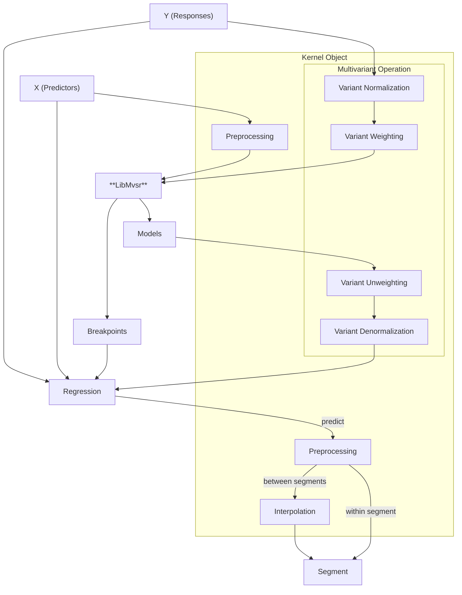

# Python API

<!--hide-in-docs-->
This describes the Python API of the MVSR-project. Consider reading the [general documentation](../../README.md).

<!--hide-in-docs-->
If you use this project to analyze you data, consider [citing our paper](../../README.md#license-and-contribution).

<!--hide-in-docs-->
[ `examples/plot.py`](examples/plot.py)

## Installation

The easiest way is to use the provided, precompiled python packages from [PyPI](https://pypi.org/project/mvsr/) using pip or uv:

```shell
pip install mvsr  # mvsr[matplotlib] for plotting support
```

The prebuilt wheels, as well as a source distribution are also available on the [release page](https://github.com/Loesgar/mvsr/releases).
We provide these packages for all common systems, namely ARM (aarch64) and x86 (x86_64) for Linux, Windows and MacOS.

If your system is not supported, you will have to [build the library yourself](#manual-building).
The only needed dependency is numpy (optionally matplotlib for convenient plotting).

## Usage

There are two APIs, `mvsr` (high-level) and `libmvsr` (low-level).
The low-level API is not documented, but it closely resembles the exported C-API from the core library.
The direct usage of the low-level API is discouraged, the following documentation will focus on the high-level API.

Mainly only one function (mvsr) is used.
The following snippet shows a minimal working example.

```python
from mvsr import mvsr

regression = mvsr(
    [1,2,3,4,5,6],   # predictor values (x) of samples (one dimension)
    [1,2,3,8,7,6],   # response values (y) of samples (one variant)
    2                # number of desired segments (k)
)

y = regression(4.5)       # calculate predicted response value at x=4.5,
print(f'f(4.5) = {y}')    # should be 7.5
                                        
for segment in regression:              # iterate over segments

    (x_start, x_end) = segment.range    # get the x range of the segment
    print(f'Segment in range {x_start} <= x <= {x_end}:')

    y = segment(4.5)                    # calculate what this segment would
    print(f'  f_seg(4.5) = {y}')        # predict for x = 4.5 prints(4.5 and 7.5)

```

The `mvsr` function computes the piecewise predictor function and returns a `Regression` object, which allows iterating over segments and variants, as well as evaluating the predictor function.
It can also optionally be used for easy, pretty plotting using matplotlib.
<!--hide-in-docs-->
The functions to handle the regression object are listed in the [API Reference](https://loesgar.github.io/mvsr/stable/lang/python/api-reference), a practical use case is shown in the [plotting example](examples/plot.py).

### Parameters

This is a short formal description of the interactions of all parameters of the `mvsr` function.
The first three arguments were already used in the last snipped: the predictor values (x), the response values (y) and the desired amount of segments (k).

#### Predictor Values `x`

This is always a sorted list of predictor values of an arbitrary type.
These values are preprocessed by a kernel object.
By default the `Poly` kernel is used to enable piecewise linear regression.
This behavior can be changed by changing the kernel to `Poly(0)` (piecewise constant), `Poly(d)` (piecewise polynomial of degree `d`) or `Raw` (provide your own Vandermonde-Matrix).
You can even provide a [custom kernel](#custom-kernel) by yourself.

The Poly Kernel also supports multiple input dimensions.
This is achieved by supplying an iterable type (e.g. a list) for each input sample.
Notice that some functionality (e.g. calculating a response value) relies on being able to compare the predictor values.
If you do not want to implement a comparison function for you type, consider using the sortkey parameter.

#### Response Values `y`

This parameter is an iterable (e.g. a list) of numbers.
There must be exactly one response value for each predictor value.

It is also possible to provide a list of response value lists.
All these response value lists must contain the same amount of values.
This results in a mulit-variant segmented regression (in simple terms, there are multiple response values for every single predictor value, see the [plotting example](examples/plot.py)).
All variants share the same breakpoints, i.e. their segments start and end at the same positions.
If the variants should not share the breakpoint positions, it is recommended to conduct a dedicated segmented regression for each variant.

#### Segment Count `k`

The amount of desired output segments.
Future versions will enable automatic deduction of this parameter.

#### Named Parameters

Named parameters must always be provided as keyword arguments.

**`kernel`**<br>
This enables to use an own kernel object.
Its `model_interpolation` parameter also enables tweaking the behavior in between the segments (see [Interpolation](#interpolation)).

**`algorithm`**<br>
This defines how the regression algorithm works.
There are two options, a very fast and accurate heuristic (`Algorithm.GREEDY`) and a dynamic program (`Algorithm.DP`).
Most of the time the heuristic is recommended, especially for large sample sets, since its accuracy increases in these cases.
However, the dynamic program guarantees to find the solution with the smallest error relative to the provided sample set.
In some use cases with few samples this can be worth the high resource consumption.
Notice that compute time and amount of memory needed for DP scale much worse with a growing number of samples.
If not amount of samples, but the compute time is the limiting factor, we *always* recommend using more samples with the greedy approach instead of less samples with the dynamic program.
For an in-depth analysis and an explanation of the algorithms see [our research paper](../../README.md#license-and-contribution).
Per default the algorithm is chosen based on the number of input samples, effective input dimensions, and the desired amount segments.

**`score`**<br>
This parameter defines how the amount of segments is determined, if [parameter k](#Segment Count) is not uniquely defined.
It is not yet supported.

**`normalize`**<br>
Defines whether the data is normalized (see feature scaling).
If True, min-max normalization is performed on the response values before the regression is calculated.
The resulting regression models are denormalized in the result, making this process completely transparent.
This option is recommended if multiple variants are used, by default it is only enabled for mult-variant regression.

**`weighting`**<br>
This parameter is an iterable type, containing as many values as there are variants (output dimensions).
It multiplies the response values with the corresponding weight after normalization (if applied).
As a result, minimizing the error of a variant with a higher weight becomes more important.
The placement of the breakpoints depends more heavily on the variants with higher weights.
The resulting models are *unweighted*, making this process transparent, similar to normalization.
It is not recommended to apply weighting without normalization.
By default weighting for every variant is `1.0`.

**`dtype`**<br>
A numpy type for the underlying regression calculation.
Currently we support `numpy.float32` and `numpy.float64`.
These two types are the only two exported by the underlying C-API at this point in time.
Depending on your hardware `numpy.float32` can be faster, but is less accurate.
If you want to use a custom type for the underlying calculation, consider using the low-level C++ API directly.

**`keepdims`**<br>
Defines whether an array will be returned as a response value if only one variant is in use.
It can be useful when doing additional calculations with the response value(s).
Notice that this value will internally be always set to `False` if you use the `Regression.variants` property, since the resulting objects can never contain multiple variants.
By default this parameter is `False`.

**`sortkey`**<br>
A callable (e.g. a function) taking one predictor value as an input.
It is used to be able to handle complex, non-comparable types as predictor values.
The function must return a value that can be compared.
This is necessary in order to determine which segment a predictor value belongs to.
The [predictor value list](#predictor-values-x) must also be in sorted order relative to the resulting key, otherwise the behavior is undefined.
By default this value is `None` and behaves as if the input value is returned.

## Advanced Usage

In order to implement custom data preprocessing, it is necessary to understand the order of the processing steps.
The graphic below displays this dataflow.



### Interpolation

Predicting useful values between segments depends on many attributes, like the used data type, data source, continuity of the function at the breakpoint, etc.
To enable a higher level of versatility, the implemented kernels implement a default interpolation functionality.
The `model_interpolation` parameter of `Kernel.Raw` objects is a function with two input parameters, a single predictor value and a list of (normally two) neighboring segments.
The return value of this function should be a list defining a weighting value for each of the input segments at the given predictor value.
Normally these values should add up to 1.0.
The following functions are already implemented:

**`Interpolate.closest`**<br>
This is the default behavior for Raw Kernels.
It always uses the segment that is closest to the predictor value.
To determine the closest segment, the Euclidean distance to all samples is measured, and the segment of the closest sample is used.

**`Interpolate.left`**<br>
This function always uses the left segment until the next one begins.

**`Interpolate.right`**<br>
This function always uses the right segment until the next one begins.

**`Interpolate.linear`**<br>
This function implements lerping between between two segment models.

**`Interpolate.smooth`**<br>
This is a typical function for continuous transition between two segments.
It is based on a cubic function ($3x^2-2x^3$) and is comparable to known ease-in, ease-out smoothing functions.
It is similar to linear interpolation (lerp), but less harsh at the edges of the segments.

You can also provide an own function.
This is demonstrated in the [plotting example](examples/plot.py).

Notice, that the Poly kernel is also able to use a `model_interpolation` function, but by default will instead linearly interpolate between the last sample of the previous segment and the first sample of the next one.
Such functionality can be implemented with a custom kernel.

### Custom Kernel

There are multiple use cases to implement an own Kernel.
For example:

 1. Special predictor value data type:
    If you use a data type that can not easily be extended, needs special preprocessing or can not be assigned a suitable sortkey function, you can implement your own data preprocessing.
 2. Custom normalization:
    If you need a special form of normalization, you can implement your own `normalize` and `denormalize` functions.
 3. Custom interpolation:
    If a special form of interpolation is needed for you use case, which is not achievable with a `model_interpolate` function, you can provide an own `interpolate` function.
    This is e.g. done by the Poly Kernel to enable linear interpolation between two samples.

If you decide to implement your own kernel function, it is strongly recommended to inherit an existing kernel.
The Poly kernel is itself inheriting the behavior of the Raw kernel.
This enables reusing the existing features.

The Raw kernel implements the model interpolation functionality (by passing through the `model_interpolation` parameter), min-max normalization and denormalization (by defining the x-dimension that is subject to translation, in addition to the scaling), and preprocessing of a Vandermonde matrix.
The Poly kernel additionally implements data preprocessing for polynomial regression and a special interpolation between the samples.

## Manual Building

### Build Requirements

- [`uv`](https://docs.astral.sh/uv/getting-started/installation/)
- the [`nix package manager`](https://nixos.org/download) **OR** [`cmake`](https://cmake.org/) + a C++ compiler ([`gcc`](https://gcc.gnu.org/) / [`clang`](https://clang.llvm.org/) / [`msvc`](https://visualstudio.microsoft.com/vs/features/cplusplus/))

Clone the repository, navigate to `lang/python` and run:

```shell
uv build
```
