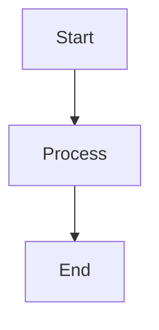

# 📚 Modern Documentation Strategy for Ontologia

> **🎯 PURPOSE**: Define clear, user-centric documentation structure that reflects current architecture and serves different audiences effectively.

## 🎯 Documentation Audiences & Personas

### 👨‍💻 **Framework Developers**
**Purpose**: Contribute to core ontologia engine
**Needs**: Architecture, patterns, testing, contribution guidelines
**Level**: Expert/Technical

### 🧬 **Ontology Designers**
**Purpose**: Create business domain ontologies
**Needs**: Schema design, business rules, validation, templates
**Level**: Intermediate/Domain

### 🏢 **Client Implementers**
**Purpose**: Deploy and customize ontologia for customers
**Needs**: Installation, configuration, deployment, security
**Level**: Operational/DevOps

### 📊 **Business Users**
**Purpose**: Use ontologia for data analysis and insights
**Needs**: Query writing, data exploration, dashboards
**Level**: User/Business

## 📁 Modern Documentation Structure

```
docs/
├── 📖 README.md                    # Documentation overview
├── 🏠 index.md                     # Landing page (user-centric)
├── 🚀 getting-started/            # User onboarding journey
│   ├── overview.md               # What is ontologia?
│   ├── quick-start.md            # 5-minute setup
│   ├── first-ontology.md         # Create your first ontology
│   ├── basic-queries.md          # Query your data
│   └── next-steps.md             # Where to go next
├── 🧬 ontology-design/           # Business domain design
│   ├── schema-basics.md          # Objects, links, properties
│   ├── business-rules.md         # Validation and constraints
│   ├── design-patterns.md        # Common ontology patterns
│   ├── best-practices.md         # Design guidelines
│   └── examples/                 # Real-world examples
│       ├── customer-management.md
│       ├── product-catalog.md
│       └── order-processing.md
├── 🏗️ framework-development/     # Core engine development
│   ├── architecture.md           # System architecture
│   ├── contribution-guide.md     # How to contribute
│   ├── coding-standards.md       # Code style and patterns
│   ├── testing-strategy.md       # Testing approach
│   ├── performance-guide.md      # Performance optimization
│   └── api-reference/            # Technical API docs
│       ├── overview.md
│       ├── metamodel-api.md
│       ├── instances-api.md
│       ├── actions-api.md
│       └── query-api.md
├── 🚀 deployment/                # Installation and operations
│   ├── installation.md           # Install ontologia
│   ├── configuration.md          # Configure system
│   ├── multi-tenancy.md          # Multi-tenant setup
│   ├── security.md               # Security hardening
│   ├── monitoring.md             # System monitoring
│   └── troubleshooting.md        # Common issues
├── 🔧 integration/               # External system integration
│   ├── databases.md              # Database connectors
│   ├── bi-tools.md               # BI tool integration
│   ├── apis.md                   # REST/GraphQL APIs
│   ├── webhooks.md               # Webhook configuration
│   └── etl-pipelines.md          # ETL pipeline patterns
├── 📚 reference/                 # Comprehensive reference
│   ├── cli-reference.md          # Complete CLI guide
│   ├── configuration-reference.md # All configuration options
│   ├── error-codes.md            # Error handling
│   ├── changelog.md              # Version history
│   └── glossary.md               # Terminology
├── 🎓 tutorials/                 # Step-by-step tutorials
│   ├── beginner/                 # New user tutorials
│   │   ├── setup-development.md
│   │   ├── create-simple-ontology.md
│   │   └── explore-data.md
│   ├── intermediate/             # Advanced user tutorials
│   │   ├── complex-schemas.md
│   │   ├── custom-actions.md
│   │   └── performance-tuning.md
│   └── advanced/                 # Expert tutorials
│       ├── custom-extensions.md
│       ├── plugin-development.md
│       └── contributing-to-core.md
├── 📖 guides/                    # Practical guides
│   ├── migration/                # Migration guides
│   │   ├── from-relational.md
│   │   ├── from-graph-db.md
│   │   └── version-upgrades.md
│   ├── optimization/             # Performance guides
│   │   ├── query-optimization.md
│   │   ├── schema-optimization.md
│   │   └── resource-tuning.md
│   └── business/                 # Business-focused guides
│       ├── data-governance.md
│       ├── compliance.md
│       └── collaboration.md
├── 🏛️ architecture/              # Architecture documentation
│   ├── overview.md               # High-level architecture
│   ├── multi-tenancy-strategy.md # Multi-tenant design
│   ├── security-model.md         # Security architecture
│   ├── performance-model.md      # Performance characteristics
│   ├── scalability.md            # Scaling considerations
│   └── decision-records/         # ADRs
│       ├── 001-architecture-decisions.md
│       ├── 002-multi-tenancy.md
│       └── 003-testing-strategy.md
└── 📦 archive/                   # Historical documentation
    ├── legacy-guides/            # Old implementation guides
    ├── project-history.md        # Project evolution
    └── deprecated-features.md    # Deprecated functionality
```

## 🎯 Content Strategy by Audience

### 👨‍💻 **Framework Developers**
```markdown
🏗️ framework-development/
├── architecture.md              # System design
├── contribution-guide.md        # How to contribute
├── testing-strategy.md          # Testing approach
├── api-reference/               # Technical APIs
└── decision-records/            # Architecture decisions
```

### 🧬 **Ontology Designers**
```markdown
🧬 ontology-design/
├── schema-basics.md             # Core concepts
├── business-rules.md            # Validation
├── design-patterns.md           # Common patterns
├── examples/                    # Real examples
└── best-practices.md            # Guidelines
```

### 🏢 **Client Implementers**
```markdown
🚀 deployment/
├── installation.md              # Setup instructions
├── configuration.md             # System config
├── multi-tenancy.md             # Tenant setup
├── security.md                  # Security setup
└── monitoring.md                # Operations
```

### 📊 **Business Users**
```markdown
🚀 getting-started/
├── quick-start.md               # Fast setup
├── first-ontology.md            # First project
├── basic-queries.md             # Data exploration
└── 🎓 tutorials/beginner/       # Learning path
```

## 📝 Content Standards

### 📋 **Document Template**
```markdown
---
title: "Document Title"
description: "Brief description for SEO and navigation"
audience: ["developer", "designer", "operator", "user"]
level: ["beginner", "intermediate", "advanced"]
tags: ["architecture", "api", "tutorial", "guide"]
estimated_read_time: "10 min"
last_updated: "2024-10-26"
---

# Document Title

> **🎯 Purpose**: Clear statement of what this document accomplishes
> **👥 Audience**: Who this document is for
> **⏱️ Prerequisites**: What readers should know first

## Overview
Brief summary of what will be covered.

## Prerequisites
- [ ] Requirement 1
- [ ] Requirement 2

## Main Content
Structured content with clear headings.

### Code Examples
```python
# Clear, commented examples
def example_function():
    """Example with explanation"""
    pass
```

### Diagrams


## Summary
Key takeaways and next steps.

## Related Content
- [Related Document](link.md)
- [API Reference](../api-reference/overview.md)

## Feedback
> **💡 Help us improve**: [Create an issue](https://github.com/kevinqz/ontologia/issues/new?template=documentation-feedback.md)
```

### 🎨 **Writing Guidelines**

#### **✅ Do's**
- Use clear, concise language
- Include practical examples
- Add diagrams for complex concepts
- Provide code snippets that work
- Include troubleshooting sections
- Link to related content
- Update last_modified date

#### **❌ Don'ts**
- Use overly technical jargon for user docs
- Include implementation details in user guides
- Write outdated information
- Create walls of text without structure
- Assume prior knowledge without prerequisites

### 📊 **Content Quality Metrics**

#### **📈 Success Indicators**
- **Time to First Success**: < 5 minutes for quick start
- **Search Success Rate**: > 80% find what they need
- **User Feedback**: Positive feedback on clarity
- **Link Health**: < 5% broken links
- **Content Freshness**: Updated within 6 months

#### **🔍 Quality Checklist**
- [ ] Title is clear and descriptive
- [ ] Audience and level are specified
- [ ] Prerequisites are listed
- [ ] Examples are tested and working
- [ ] Diagrams are included where helpful
- [ ] Related content is linked
- [ ] Troubleshooting section exists
- [ ] Last updated date is current

## 🚀 Implementation Strategy

### **Phase 1: Content Audit (Week 1)**
```bash
# Audit existing content
scripts/audit-docs.py
├── Identify outdated content
├── Map content to new structure
├── Flag duplicate content
└── Create migration plan
```

### **Phase 2: Structure Migration (Week 2)**
```bash
# Create new directory structure
mkdir -p docs/{getting-started,ontology-design,framework-development,deployment,integration,reference,tutorials,guides,architecture,archive}

# Move and rename existing content
mv docs/GETTING_STARTED.md docs/getting-started/quick-start.md
mv docs/ARCHITECTURE.md docs/framework-development/architecture.md
mv docs/API_REFERENCE.md docs/framework-development/api-reference/overview.md
```

### **Phase 3: Content Creation (Weeks 3-4)**
```bash
# Create missing essential content
docs/getting-started/overview.md          # NEW
docs/ontology-design/schema-basics.md     # NEW
docs/deployment/installation.md           # NEW
docs/tutorials/beginner/                   # NEW
```

### **Phase 4: Review and Refine (Week 5)**
```bash
# Content review process
- Technical review by developers
- Usability testing with new users
- Link validation and testing
- Final quality assurance
```

## 🛠️ Tooling and Automation

### **📋 Content Validation**
```yaml
# .github/workflows/docs-validation.yml
name: 📚 Documentation Validation
on: [push, pull_request]

jobs:
  validate-docs:
    runs-on: ubuntu-latest
    steps:
      - uses: actions/checkout@v4
      - name: Check link health
        run: markdown-link-check docs/
      - name: Validate structure
        run: python scripts/validate-docs.py
      - name: Check content quality
        run: python scripts/check-content-quality.py
```

### **🔄 Automated Updates**
```python
# scripts/update-content-metadata.py
def update_last_modified():
    """Update last_modified date in all docs"""
    for doc in find_markdown_files():
        doc.metadata['last_updated'] = datetime.now().isoformat()
        doc.save()
```

### **📊 Content Analytics**
```python
# scripts/content-analytics.py
def generate_content_report():
    """Generate content quality and usage report"""
    return {
        "total_pages": count_pages(),
        "outdated_pages": find_outdated_content(),
        "missing_prerequisites": find_missing_prerequisites(),
        "broken_links": check_link_health(),
        "coverage_by_audience": analyze_audience_coverage()
    }
```

## 🎯 Success Metrics

### **📈 Quantitative Metrics**
- **Documentation Coverage**: 100% of APIs documented
- **User Success Rate**: > 90% complete quick start successfully
- **Search Effectiveness**: > 85% find answers in < 3 searches
- **Content Freshness**: 95% of content updated in last 6 months
- **Link Health**: < 2% broken links

### **📊 Qualitative Metrics**
- **User Feedback**: Positive feedback on clarity and usefulness
- **Contributor Experience**: Easy to contribute and update content
- **Consistency**: Consistent style and structure across all docs
- **Accessibility**: Content accessible to all skill levels

---

## 🎯 **Benefits of This Documentation Strategy**

1. **👥 User-Centric**: Content organized by audience needs
2. **🎯 Clear Purpose**: Each document has defined audience and goals
3. **📈 Scalable**: Structure grows with project complexity
4. **🔄 Maintainable**: Clear processes for keeping content fresh
5. **🔍 Discoverable**: Intuitive navigation and search
6. **📊 Measurable**: Quality metrics and success indicators

**🚀 This comprehensive strategy ensures documentation that serves users effectively and scales with the project!**
