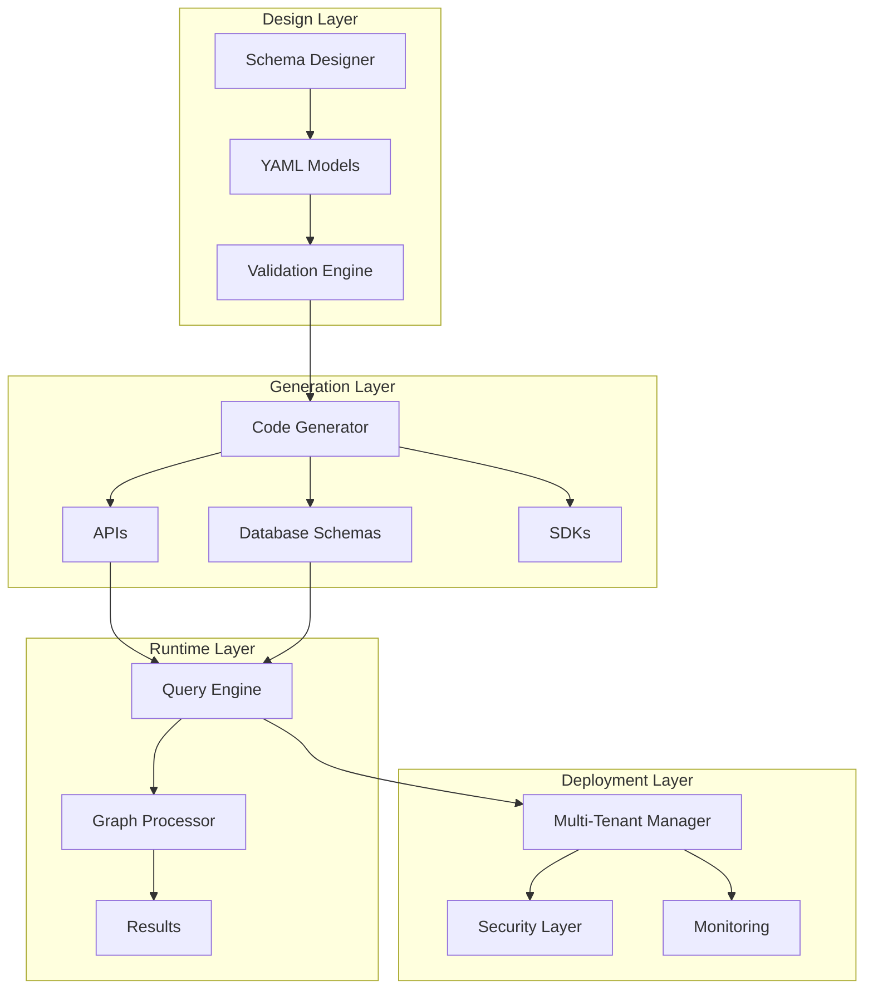

# 🧬 Ontologia Platform

> **🎯 Purpose**: Unify schema management, code generation, and runtime graph evaluation in a single, scalable platform.

## 🌟 What is Ontologia?

Ontologia is an **ontology-as-code platform** that enables organizations to:

- **🏗️ Design** business domain models with objects, links, and properties
- **🔧 Generate** APIs, SDKs, and database schemas automatically
- **⚡ Query** complex graph relationships with simple SQL
- **🚀 Deploy** multi-tenant architectures at scale
- **📊 Analyze** data with integrated BI and analytics tools

## 🎯 Who Uses Ontologia?

### 🧬 **Ontology Designers**
Create business domain models without writing code
- Define objects, links, and business rules
- Validate schemas automatically
- Generate documentation and APIs

### 🏢 **Client Implementers**
Deploy and manage ontologia for customers
- Multi-tenant setup and configuration
- Security monitoring and compliance
- Performance optimization and scaling

### 👨‍💻 **Framework Developers**
Extend and contribute to the core platform
- Architecture design and patterns
- API development and testing
- Performance optimization

### 📊 **Business Users**
Explore and analyze data through intuitive interfaces
- Write queries without SQL expertise
- Create dashboards and reports
- Collaborate on data governance

## 🚀 Quick Start

### **5-Minute Setup**
```bash
# Install ontologia
pip install ontologia

# Create your first ontology
ontologia init my-first-ontology
cd my-first-ontology

# Define a simple schema
cat > schema.yaml << EOF
object_types:
  Customer:
    properties:
      name: {type: string, required: true}
      email: {type: string, format: email}

link_types:
  Customer_Knows:
    source: Customer
    target: Customer
EOF

# Generate API and database
ontologia build

# Start development server
ontologia serve
```

### **What You Get**
- ✅ **REST API** for your domain models
- ✅ **Database schema** with proper relationships
- ✅ **Query interface** for complex graph queries
- ✅ **Documentation** generated automatically
- ✅ **Type-safe SDK** for your programming language

## 📚 Choose Your Path

### 🌱 **I'm New to Ontologies**
Start with our beginner-friendly tutorials:
1. [📖 Getting Started Overview](getting-started/overview.md)
2. [⚡ Quick Start Guide](getting-started/quick-start.md)
3. [🧬 Create Your First Ontology](getting-started/first-ontology.md)

### 🏗️ **I Want to Design Business Models**
Learn ontology design patterns:
1. [🧬 Schema Basics](ontology-design/schema-basics.md)
2. [📋 Business Rules](ontology-design/business-rules.md)
3. [🎨 Design Patterns](ontology-design/design-patterns.md)

### 🚀 **I Need to Deploy for Production**
Set up production-grade deployment:
1. [📦 Installation Guide](deployment/installation.md)
2. [⚙️ Configuration](deployment/configuration.md)
3. **🏢 Multi-Tenancy**](deployment/multi-tenancy.md)

### 🔧 **I Want to Extend the Platform**
Contribute to the framework:
1. [🏗️ Architecture Overview](framework-development/architecture.md)
2. [🤝 Contribution Guide](framework-development/contribution-guide.md)
3. [🧪 Testing Strategy](framework-development/testing-strategy.md)

## 🎯 Key Features

### **🏗️ Schema-First Development**
Define your data model once, generate everything:
- **Objects**: Business entities with properties
- **Links**: Relationships between entities
- **Actions**: Dynamic operations and workflows
- **Rules**: Validation and business logic

### **⚡ Runtime Graph Engine**
Query complex relationships with simple syntax:
```sql
-- Find all customers who bought products in the electronics category
SELECT c.name, p.name, p.price
FROM Customer c
JOIN Customer_Purchases cp ON c.id = cp.source_id
JOIN Product p ON cp.target_id = p.id
WHERE p.category = 'electronics'
  AND cp.purchase_date >= '2024-01-01'
```

### **🏢 Multi-Tenant Architecture**
Isolate data and configurations per tenant:
- **Data Isolation**: Separate databases per tenant
- **Configuration**: Tenant-specific schemas and rules
- **Security**: Role-based access control
- **Scaling**: Independent scaling per tenant

### **🔧 Developer Experience**
Modern tooling for productive development:
- **CLI**: Command-line interface for all operations
- **APIs**: REST and GraphQL endpoints
- **SDKs**: Type-safe client libraries
- **Testing**: Comprehensive testing framework

## 📊 Real-World Use Cases

### **🛒 E-commerce Platform**
```yaml
# Product catalog and customer management
object_types:
  Customer, Product, Order, Category
link_types:
  Customer_Places, Order_Contains, Product_Belongs_To
```

### **🏥 Healthcare System**
```yaml
# Patient records and medical relationships
object_types:
  Patient, Doctor, Hospital, Treatment
link_types:
  Patient_Sees, Doctor_Works_At, Patient_Receives
```

### **🏦 Financial Services**
```yaml
# Banking relationships and transactions
object_types:
  Account, Customer, Transaction, Product
link_types:
  Customer_Owns, Account_Transfers_To, Transaction_Involves
```

## 🎯 Architecture Highlights



## 🛠️ Technology Stack

- **🏗️ Core**: Python, SQLModel, FastAPI
- **🗄️ Database**: PostgreSQL, SQLite, DuckDB
- **🔍 Query**: SQL with graph extensions
- **🚀 Deployment**: Docker, Kubernetes, Temporal
- **📊 Analytics**: dbt, Apache Arrow
- **🧪 Testing**: Pytest, Factory Boy
- **📚 Documentation**: MkDocs, Mermaid

## 🎯 Next Steps

### **🌱 Learn the Basics**
[📖 Start with Getting Started](getting-started/overview.md)

### **🧬 Design Your First Ontology**
[🎨 Try Schema Design Guide](ontology-design/schema-basics.md)

### **🚀 Deploy to Production**
[📦 See Deployment Guide](deployment/installation.md)

### **🤝 Join the Community**
- [💬 GitHub Discussions](https://github.com/kevinqz/ontologia/discussions)
- [🐛 Report Issues](https://github.com/kevinqz/ontologia/issues)
- [📖 Read Documentation](https://ontologia.readthedocs.io)

---

> **💡 Help us improve**: Found something unclear? [Create an issue](https://github.com/kevinqz/ontologia/issues/new?template=documentation-feedback.md) or [contribute to the docs](framework-development/contribution-guide.md).

**🚀 Ready to build your first ontology? [Start here!](getting-started/quick-start.md)**
