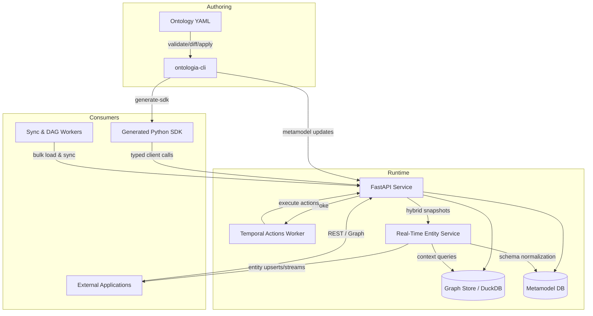

# Architecture Overview

Ontologia is composed of four collaborating planes: **Ontology as Code (OaC)** tooling, the **REST
API**, **execution backends**, and **client SDKs**. The diagram below summarises the major flows.

## Component Responsibilities

| Component | Responsibility | Key Modules |
| --- | --- | --- |
| **ontologia-cli** | Validates YAML schemas, plans server diffs, applies changes, and generates the static SDK. | `ontologia_cli/main.py` |
| **FastAPI service** | Hosts the metamodel, object, link, and action APIs. Implements validation, traversal, and analytics. | `api/v2/routers/*`, `api/services/*` |
| **Edge service** | Maintains low-latency entity state, publishes gRPC streams, bridges hot state with historical context, and journals updates. | `ontologia_edge/`, `api/services/hybrid_snapshot_service.py`, `api/dependencies/realtime.py` |
| **Registro / Metamodel DB** | Persists ontology definitions, schema metadata, and interface contracts. | `registro/`, `api/services/metamodel_service.py` |
| **Graph storage** | Stores object instances and link edges (DuckDB + dbt pipelines by default). | `example_project/dbt_project/`, `scripts/prepare_duckdb_raw.py` |
| **Temporal worker** | Executes long-running or asynchronous actions declared in the ontology. | `scripts/run_temporal_worker.py` |
| **Generated SDK** | Provides typed object models, link proxies, actions namespace, and fluent query DSL. | `ontologia_sdk/` |

## Data Flow

Developers update YAML under `ontologia/` (in a sandbox created via `ontologia-cli genesis`), then run `ontologia-cli` to validate the
   schema, preview diffs, apply updates, and regenerate the Python SDK.
Ingestion: dbt models under `templates/project/dbt_project/` produce curated tables; `run_pipeline.sh` (or Dagster) pushes data into
   the Ontologia API, creating or updating objects and links.
3. **Runtime queries:** Applications use the generated SDK (or the REST API directly) to traverse
   links, execute actions, query aggregates, and consume streaming updates from the real-time
   service.
4. **Actions:** When an action is triggered, the API enqueues work in Temporal. Workers execute the
   action and callback into Ontologia to persist state changes.
5. **Hybrid views:** The `/realtime/entities/{entityId}` endpoint merges the in-memory entity state
   with historical context so operators and services can reason about both hot and cold data.

## Deployment Considerations

- The API can be deployed as a container behind a load balancer. Horizontal scaling requires a
  shared metadata database and graph store.
- Temporal is optional but recommended for non-trivial action workloads. Feature flags in
  `ENVIRONMENT.md` allow toggling Temporal integration.
- The edge service runs in-process with the API by default; for edge deployments it can be
  hosted separately and pointed at the same metamodel and analytical stores.
- The documentation site can be hosted via GitHub Pages or an internal web server by running
  `mkdocs build` in CI.

For deeper implementation notes, review the legacy [ARCHITECTURE.md](../ARCHITECTURE.md) (which now
redirects here) and the ADRs listed in the [Decision Records](../archive/adrs.md) page.

## Real-Time Roadmap Status

### Phase 1 – Hybrid Context Enrichment (Complete)

- Introduced an `EntityManager` journal that records every state transition for replay and audit.
- Added the `RealTimeEnricher` to reconcile hot updates with historical context fetched from the analytical graph.
- Exposed unified snapshots via `/v2/ontologies/{ontologyApiName}/realtime/entities/{entityId}` and corresponding service wiring.
- Covered the enrichment pipeline with unit tests to guarantee schema normalization and journaling behaviour.

### Phase 2 – Edge Runtime & Replication (Complete)

- Packaged `ontologia_realtime` as a deployable runtime with SQLite persistence and bootstrap routines.
- Added composable journals, including a JSONL append-only log, a persistent entity store, and an event stream fan-out.
- Implemented gRPC-based peer replication with metadata propagation, TLS support, and deduplication safeguards.
- Plumbed the FastAPI service to lazily start the runtime from environment configuration and to orchestrate lifecycle hooks.
- Extended the test suite to validate cold-start recovery and replication scenarios.

### Phase 3 – Decision Intelligence & Simulation (Complete)

- Introduced a declarative decision engine with YAML-defined rules, reusable conditions, and prioritized actions.
- Deployed a background `DecisionService` that consumes the journal event stream, emits actions to sinks, and records JSONL audits.
- Added a deterministic `DecisionSimulator` for scenario planning and regression testing of rulesets.
- Exposed runtime configuration for decision rules, action logging, and replication-aware filtering through environment variables.
- Expanded unit coverage to validate rule evaluation, service dispatch, and simulator workflows.

### Phase 4 – Operator Experience (Complete)

- Delivered a streaming WebSocket (`/v2/ontologies/{ontology}/realtime/ws`) for dashboards to consume hot entity events with optional filters.
- Added `/v2/ontologies/{ontology}/realtime/events` to replay journal entries for recents views and historical scrubbing.
- Enhanced the runtime with multi-subscriber event fan-out, journal replay helpers, and graceful subscriber lifecycle management.
- Extended the decision layer with an async webhook sink, environment-driven configuration, and JSONL/webhook action logging.
- Documented CLI/runtime environment variables enabling operator notifications, rule auditing, and edge dashboard connectivity.
