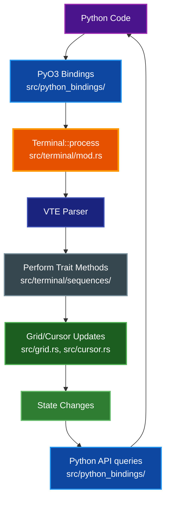
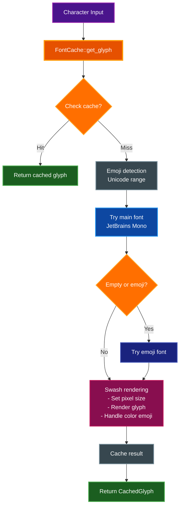
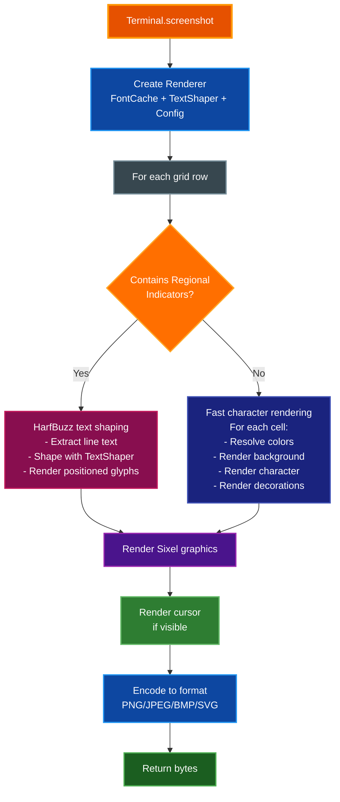
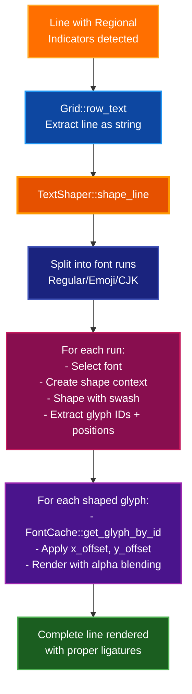
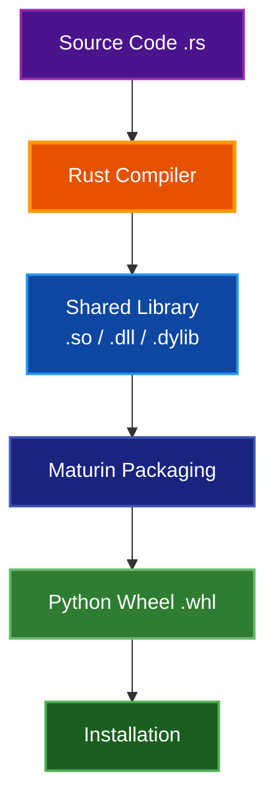

# Architecture Documentation

This document describes the internal architecture of par-term-emu-core-rust.

## Table of Contents

- [Overview](#overview)
- [Core Components](#core-components)
  - [1. Color](#1-color)
  - [2. Cell](#2-cell)
  - [3. Cursor](#3-cursor)
  - [4. Grid](#4-grid)
  - [5. Terminal](#5-terminal)
- [ANSI Sequence Processing](#ansi-sequence-processing)
- [Data Flow](#data-flow)
- [Python Bindings](#python-bindings)
- [Memory Management](#memory-management)
- [Performance Considerations](#performance-considerations)
- [Extension Points](#extension-points)
- [Testing Strategy](#testing-strategy)
- [Dependencies](#dependencies)
- [Build Process](#build-process)
- [Debugging](#debugging)
- [Contributing](#contributing)
- [References](#references)

## Overview

par-term-emu-core-rust is a terminal emulator library written in Rust with Python bindings. It uses the VTE (Virtual Terminal Emulator) crate for ANSI sequence parsing and PyO3 for Python interoperability.

## Core Components

### 1. Color

**Location:** `src/color.rs`

Represents colors in various formats:

- **Named Colors**: 16 basic ANSI colors (black, red, green, etc.)
- **Indexed Colors**: 256-color palette (0-255)
- **RGB Colors**: 24-bit true color (r, g, b)

All colors can be converted to RGB for rendering.

```rust
pub enum Color {
    Named(NamedColor),
    Indexed(u8),
    Rgb(u8, u8, u8),
}
```

### 2. Cell

**Location:** `src/cell.rs`

Represents a single character cell in the terminal grid. Each cell contains:

- A character (Unicode)
- Foreground color
- Background color
- Text attributes (bold, italic, underline, etc.)

```rust
pub struct Cell {
    pub c: char,
    pub fg: Color,
    pub bg: Color,
    pub underline_color: Option<Color>,  // SGR 58/59
    pub flags: CellFlags,
}
```

### 3. Cursor

**Location:** `src/cursor.rs`

Tracks the cursor state:

- Position (col, row)
- Visibility (shown/hidden)

Provides methods for cursor movement and positioning.

### 4. Grid

**Location:** `src/grid.rs`

Manages the 2D terminal buffer:

- Main screen buffer (cols × rows)
- Scrollback buffer (configurable size)
- Scrolling operations
- Cell access and manipulation
- Resize handling

The grid uses a flat Vec for efficient storage and access:

```rust
pub struct Grid {
    cols: usize,
    rows: usize,
    cells: Vec<Cell>,              // Row-major order
    scrollback_cells: Vec<Cell>,   // Flat circular buffer
    scrollback_start: usize,       // Circular buffer head
    scrollback_lines: usize,       // Current scrollback count
    max_scrollback: usize,
    wrapped: Vec<bool>,            // Line wrap tracking
    scrollback_wrapped: Vec<bool>, // Scrollback wrap tracking
}
```

### 5. Terminal

**Location:** `src/terminal/mod.rs` (modular implementation)

The main terminal emulator that ties everything together, organized into submodules:
- `notification.rs` - Notification types from OSC sequences
- `sequences/` - VTE sequence handlers (CSI, OSC, ESC, DCS)
- `graphics.rs` - Sixel graphics management
- `colors.rs` - Color configuration
- `write.rs` - Character writing logic

Features:

- Owns the grid and cursor
- Implements the VTE `Perform` trait for ANSI parsing
- Manages terminal state (colors, attributes)
- Handles all terminal operations

### 6. Supporting Modules

**Mouse Handling** (`src/mouse.rs`)
- Mouse event types and button tracking
- Mouse mode management (Normal, Button, Any)
- Mouse encoding formats (SGR, UTF-8, URXVT)

**Shell Integration** (`src/shell_integration.rs`)
- OSC 133 prompt/command/output markers
- Command execution tracking
- Integration with modern shells (fish, zsh, bash)

**Sixel Graphics** (`src/sixel.rs`)
- Sixel image parser and decoder
- Graphics storage and positioning
- Half-block and pixel rendering modes

**Utility Modules**
- `ansi_utils.rs` - ANSI sequence parsing and generation helpers
- `color_utils.rs` - Color conversion and manipulation utilities
- `text_utils.rs` - Text processing and Unicode handling
- `html_export.rs` - HTML export functionality for terminal content
- `debug.rs` - Debug utilities and logging helpers

**PTY Support**
- `pty_session.rs` - PTY session management with portable-pty
- `pty_error.rs` - PTY-specific error types

```rust
pub struct Terminal {
    // Screen management
    grid: Grid,
    alt_grid: Grid,
    alt_screen_active: bool,

    // Cursor state
    cursor: Cursor,
    alt_cursor: Cursor,
    saved_cursor: Option<Cursor>,

    // Text attributes
    fg: Color,
    bg: Color,
    underline_color: Option<Color>,
    flags: CellFlags,

    // Terminal modes
    mouse_mode: MouseMode,
    mouse_encoding: MouseEncoding,
    focus_tracking: bool,
    bracketed_paste: bool,
    synchronized_updates: bool,
    auto_wrap: bool,
    origin_mode: bool,
    application_cursor: bool,

    // Advanced features
    shell_integration: ShellIntegration,
    hyperlinks: HashMap<u32, String>,
    graphics: Vec<SixelGraphic>,
    keyboard_flags: u16,

    // Margins and regions
    scroll_region_top: usize,
    scroll_region_bottom: usize,
    left_margin: usize,
    right_margin: usize,
    use_lr_margins: bool,

    // ... additional state ...
}
```

## ANSI Sequence Processing

The terminal uses the VTE crate for parsing ANSI escape sequences:


The `Terminal` struct implements the `Perform` trait with these methods:

- `print(char)`: Handle printable characters
- `execute(byte)`: Handle C0 control codes (newline, tab, etc.)
- `csi_dispatch()`: Handle CSI sequences (cursor movement, colors, etc.)
- `osc_dispatch()`: Handle OSC sequences (terminal title, etc.)

## Data Flow



## Python Bindings

The Python bindings are organized in `src/python_bindings/` with multiple submodules:
- `terminal.rs` - PyTerminal struct and its implementation
- `pty.rs` - PyPtyTerminal struct and its implementation (PTY support)
- `types.rs` - Data types (PyAttributes, PyScreenSnapshot, PyShellIntegration, PyGraphic)
- `enums.rs` - Enum types (PyCursorStyle, PyUnderlineStyle)
- `conversions.rs` - Type conversions and parsing utilities

The main Python module is defined in `src/lib.rs`, which exports the `_native` module.

```rust
#[pyclass(name = "Terminal")]
pub struct PyTerminal {
    inner: crate::terminal::Terminal,
}
```

All public methods are wrapped with `#[pymethods]` and provide:

- Type conversion (Rust ↔ Python)
- Error handling (Result → PyResult)
- Pythonic API design

## Memory Management

- **Rust Side**: Owned data structures with automatic memory management
- **Python Side**: Python objects wrapping Rust data
- **Zero-copy**: Where possible, data is referenced rather than copied
- **Scrollback**: Limited by `max_scrollback` to prevent unbounded growth

## Performance Considerations

### Efficient Grid Storage

- Flat Vec for cache-friendly access
- Row-major order for sequential line access
- Minimal allocations during normal operation

### ANSI Parsing

- VTE crate provides fast, zero-allocation parsing
- State machine approach for streaming input

### Python Boundary

- Minimize Python/Rust crossings
- Batch operations where possible
- Return references instead of copying when safe

## Extension Points

### Adding New ANSI Sequences

1. Add handler in the appropriate sequence module:
   - CSI sequences: `src/terminal/sequences/csi.rs`
   - OSC sequences: `src/terminal/sequences/osc.rs`
   - ESC sequences: `src/terminal/sequences/esc.rs`
   - DCS sequences: `src/terminal/sequences/dcs.rs`
2. Update grid/cursor state as needed
3. Add tests

### New Color Formats

1. Add variant to `Color` enum in `src/color.rs`
2. Implement `to_rgb()` conversion
3. Update color handling in `src/terminal/sequences/csi.rs`

### Additional Cell Attributes

1. Add flag to `CellFlags` in `src/cell.rs`
2. Update SGR handling in `src/terminal/sequences/csi.rs`
3. Expose in Python API if needed (in `src/python_bindings/`)

## Testing Strategy

### Rust Tests

- Unit tests in each module
- Integration tests for full sequences
- Property-based tests for invariants

### Python Tests

- API contract tests
- Example-based tests
- Edge case handling

## Implemented Features

The terminal emulator includes comprehensive VT100/VT220/VT320/VT420 compatibility with modern protocol support:

### Core Features ✅

1. **Alt Screen Buffer** - Fully implemented with modes 47, 1047, 1049
2. **Tab Stops** - Complete tab stop management (HTS, TBC, CHT, CBT)
3. **Line Wrapping** - Auto-wrap mode (DECAWM) with delayed wrap
4. **Hyperlinks** - Full OSC 8 hyperlink support with deduplication
5. **Sixel Graphics** - Complete Sixel implementation with half-block rendering
6. **Wide Character Support** - Unicode, emoji, and CJK characters

### Modern Protocols ✅

1. **Mouse Tracking** - All modes (Normal, Button, Any) and encodings (SGR, UTF-8, URXVT)
2. **Bracketed Paste** - Mode 2004 for safe paste handling
3. **Synchronized Updates** - Mode 2026 for flicker-free rendering
4. **Kitty Keyboard Protocol** - Enhanced keyboard reporting with flag management
5. **Shell Integration** - OSC 133 for prompt/command/output markers
6. **Clipboard** - OSC 52 read/write with security controls

### VT Compatibility ✅

- VT100/VT220/VT320 - Complete compatibility
- VT420 - Rectangle operations (DECFRA, DECCRA, DECSERA)
- Left/Right Margins - DECLRMM/DECSLRM support
- Cursor Styles - DECSCUSR with all styles
- Device Queries - DA, DSR, CPR, DECRQM

## Future Enhancements

### Potential Improvements

1. **Unicode Normalization**: Proper grapheme cluster handling for combining marks
2. **Performance**: SIMD optimizations for bulk cell operations
3. **Character Sets**: G0/G1/G2/G3 selection (low priority - UTF-8 handles most cases)

### API Enhancements

1. **Cell Iterators**: Efficient row/region iteration without copying
2. **Diff API**: Change detection for efficient incremental rendering
3. **Event Callbacks**: Async callbacks for title change, resize, bell, etc.
4. **Async Support**: Fully async Python API for non-blocking operation

## Screenshot Module

### Architecture (`src/screenshot/`)

The screenshot module provides high-quality rendering of terminal content to various image formats:

#### Components

1. **Configuration** (`config.rs`)
   - **Purpose**: Screenshot configuration and format options
   - **Features**:
     - Image format selection (PNG, JPEG, BMP, SVG)
     - Font size and padding configuration
     - Sixel rendering mode options
     - Quality settings for lossy formats

2. **Font Cache** (`font_cache.rs`)
   - **Library**: Swash (pure Rust font library)
   - **Purpose**: Loads and caches font glyphs for efficient rendering
   - **Features**:
     - Embedded JetBrains Mono font (no external dependencies)
     - Embedded Noto Emoji font for emoji support
     - Automatic emoji font fallback (Apple Color Emoji, Segoe UI Emoji)
     - Color emoji rendering with RGBA output
     - Glyph caching for performance (by character, size, bold, italic)
     - Glyph-by-ID rendering for shaped text
   - **Embedded Fonts**: `JetBrainsMono-Regular.ttf`, `NotoEmoji-Regular.ttf`

3. **Text Shaper** (`shaper.rs`)
   - **Library**: Swash (integrated text shaping)
   - **Purpose**: Handles complex text rendering with ligatures and multi-codepoint sequences
   - **Features**:
     - Flag emoji support via Regional Indicator ligatures (🇺🇸 🇨🇳 🇯🇵)
     - Multi-font support (Regular, Emoji, CJK) with automatic selection
     - Positioned glyph output with advance/offset information
     - Font run segmentation for mixed-script text
     - Pure Rust implementation (no C dependencies)

4. **Renderer** (`renderer.rs`)
   - **Purpose**: Converts terminal grid to image pixels
   - **Features**:
     - Hybrid rendering: character-based (fast) + line-based shaping (complex emoji)
     - Regional Indicator detection for automatic text shaping
     - Full text attribute support (bold, italic, underline styles, colors)
     - Cursor rendering (block, underline, bar styles)
     - Sixel graphics rendering (pixels and half-block modes)
     - Alpha blending for smooth text and graphics
     - Pure Rust rendering pipeline (no C dependencies)

5. **Utilities** (`utils.rs`)
   - **Purpose**: Helper functions for screenshot rendering
   - **Features**:
     - Color conversion and blending utilities
     - Text measurement and positioning helpers
     - Regional Indicator detection for emoji flags

6. **Error Handling** (`error.rs`)
   - **Purpose**: Screenshot-specific error types
   - **Features**:
     - Comprehensive error variants for font, rendering, and encoding failures
     - Integration with standard error handling

7. **Format Support** (`formats/`)
   - **Modules**: `mod.rs`, `png.rs`, `jpeg.rs`, `bmp.rs`, `svg.rs`
   - **Raster formats**: PNG, JPEG, BMP (via `image` crate)
   - **Vector format**: SVG (custom implementation for scalable text)

### Font Rendering Pipeline



### Bitmap Font Handling

Color emoji fonts (like NotoColorEmoji) are bitmap-only fonts that:
- Cannot be scaled to arbitrary sizes
- Have fixed sizes (typically 32, 64, 72, 96, 109, 128, 136 pixels)
- Require special handling during size selection

The implementation automatically:
1. Attempts requested size
2. Falls back to closest available fixed size
3. Renders with swash's color emoji support
4. Outputs RGBA for consistent image processing

### Rendering Pipeline



### Text Shaping Pipeline (Flag Emoji)



## Dependencies

### Rust

Core dependencies:
- `pyo3`: Python bindings
- `vte`: ANSI parser
- `unicode-width`: Character width calculation
- `portable-pty`: PTY support
- `base64`: Base64 encoding/decoding
- `bitflags`: Bit flag management

Screenshot/rendering support:
- `image`: Image encoding/decoding (PNG, JPEG, BMP)
- `swash`: Pure Rust font rendering and text shaping with color emoji support

Platform-specific:
- `libc`: Unix system calls (Unix only)

### Python

- `maturin`: Build system for PyO3 bindings
- `pytest`: Testing framework (dev dependency)

> **Note**: This is a core library. For a full-featured TUI application built on this library, see the sister project [par-term-emu-tui-rust](https://github.com/paulrobello/par-term-emu-tui-rust) ([PyPI](https://pypi.org/project/par-term-emu-tui-rust/)), which uses the Textual framework.

## Build Process



## Debugging

### Rust Side

```bash
# Enable debug logging
RUST_LOG=debug cargo test

# Use rust-lldb/gdb
rust-lldb target/debug/test_binary
```

### Python Side

```python
# Inspect terminal state
print(repr(term))
print(term.content())
print(term.cursor_position())

# Check individual cells
for row in range(term.size()[1]):
    for col in range(term.size()[0]):
        char = term.get_char(col, row)
        print(f"({col},{row}): {char}")
```

## Contributing

When contributing, please:

1. Add tests for new features
2. Update documentation
3. Follow Rust style guidelines (`cargo fmt`)
4. Pass clippy lints (`cargo clippy`)
5. Ensure Python API remains intuitive

## References

- [VTE Crate Documentation](https://docs.rs/vte/) - ANSI parser library
- [PyO3 Guide](https://pyo3.rs/) - Rust-Python bindings
- [xterm Control Sequences](https://invisible-island.net/xterm/ctlseqs/ctlseqs.html) - Comprehensive reference
- [ANSI Escape Sequences](https://en.wikipedia.org/wiki/ANSI_escape_code) - Wikipedia overview
- [VT100 Reference](https://vt100.net/) - Historical VT100 documentation

## See Also

- [VT_FEATURE_PARITY.md](VT_FEATURE_PARITY.md) - Complete VT feature support matrix
- [ADVANCED_FEATURES.md](ADVANCED_FEATURES.md) - Advanced features guide
- [BUILDING.md](BUILDING.md) - Build and installation instructions
- [SECURITY.md](SECURITY.md) - Security considerations for PTY usage
- [README.md](../README.md) - Project overview and API reference
