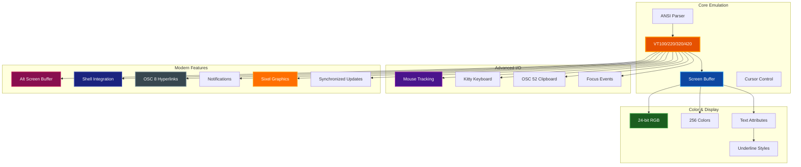

# Advanced Features

Comprehensive guide to advanced terminal emulation features in par-term-emu-core-rust.

## Table of Contents

- [Overview](#overview)
- [True Color Support](#true-color-support)
- [Alternate Screen Buffer](#alternate-screen-buffer)
- [Mouse Reporting](#mouse-reporting)
- [Bracketed Paste Mode](#bracketed-paste-mode)
- [Focus Tracking](#focus-tracking)
- [OSC 52 Clipboard Operations](#osc-52-clipboard-operations)
- [OSC 8 Hyperlinks](#osc-8-hyperlinks)
- [Notifications (OSC 9/777)](#notifications-osc-9777)
- [Shell Integration](#shell-integration)
- [Sixel Graphics](#sixel-graphics)
- [Synchronized Updates](#synchronized-updates)
- [Kitty Keyboard Protocol](#kitty-keyboard-protocol)
- [Underline Styles](#underline-styles)
- [VT420 Rectangle Operations](#vt420-rectangle-operations)
- [Unicode Support](#unicode-support)
- [Buffer Export](#buffer-export)
- [Complete Example](#complete-example)
- [Related Documentation](#related-documentation)

## Overview

par-term-emu-core-rust provides comprehensive terminal emulation with VT100/VT220/VT320/VT420 compatibility and modern terminal features including true color, alternate screen buffer, mouse support, clipboard operations, hyperlinks, and graphics rendering.

### Feature Architecture



## True Color Support

par-term-emu-core-rust supports 24-bit RGB (true color) terminal output for 16.7 million colors.

### Usage

```python
from par_term_emu_core_rust import Terminal

term = Terminal(80, 24)

# Set foreground color to orange (RGB: 255, 128, 0)
term.process_str("\x1b[38;2;255;128;0mOrange text\x1b[0m\n")

# Set background color to purple (RGB: 128, 0, 255)
term.process_str("\x1b[48;2;128;0;255mPurple background\x1b[0m\n")

# Both foreground and background
term.process_str("\x1b[38;2;255;255;0;48;2;0;0;128mYellow on blue\x1b[0m\n")
```

### Supported Color Modes

- **16 basic colors**: `\x1b[30-37m` (foreground), `\x1b[40-47m` (background)
- **16 bright colors**: `\x1b[90-97m` (foreground), `\x1b[100-107m` (background)
- **256-color palette**: `\x1b[38;5;<n>m` (foreground), `\x1b[48;5;<n>m` (background)
- **24-bit RGB**: `\x1b[38;2;<r>;<g>;<b>m` (foreground), `\x1b[48;2;<r>;<g>;<b>m` (background)

## Alternate Screen Buffer

The alternate screen buffer allows applications to use a separate screen without affecting the primary buffer. This is commonly used by full-screen applications like vim, less, and tmux.

### Usage

```python
term = Terminal(80, 24)

# Write to primary screen
term.process_str("Main terminal content\n")

# Switch to alternate screen
term.process_str("\x1b[?1049h")

# The alt screen is now active and empty
term.process_str("This is the alternate screen\n")

# Switch back to primary screen
term.process_str("\x1b[?1049l")

# Primary screen content is restored
```

### API

```python
# Check if alt screen is active
if term.is_alt_screen_active():
    print("Using alternate screen")
```

### Use Cases

- Text editors (vim, nano, emacs)
- Pagers (less, more, man)
- Terminal multiplexers (tmux, screen)
- TUI applications
- Interactive prompts

## Mouse Reporting

par-term-emu-core-rust supports multiple mouse tracking protocols, allowing applications to receive mouse events.

### Mouse Modes

| Mode | Description | Enable | Disable |
|------|-------------|--------|---------|
| Off | No mouse tracking (default) | - | `\x1b[?1000l` |
| X10 | Press events only (legacy) | `\x1b[?9h` | `\x1b[?9l` |
| Normal | Press and release | `\x1b[?1000h` | `\x1b[?1000l` |
| Button Event | Press, release, and motion while pressed | `\x1b[?1002h` | `\x1b[?1002l` |
| Any Event | All mouse motion | `\x1b[?1003h` | `\x1b[?1003l` |

### Mouse Encoding Formats

| Format | Description | Enable |
|--------|-------------|--------|
| Default | X11 encoding (limited to 223x223) | Default |
| UTF-8 | Extended coordinates | `\x1b[?1005h` |
| SGR | Modern format (recommended) | `\x1b[?1006h` |
| URXVT | Alternative format | `\x1b[?1015h` |

### Usage

```python
term = Terminal(80, 24)

# Enable normal mouse tracking with SGR encoding
term.process_str("\x1b[?1000h\x1b[?1006h")

# Check current mode
print(f"Mouse mode: {term.mouse_mode()}")  # "normal"

# Simulate a mouse click
event_bytes = term.simulate_mouse_event(
    button=0,    # 0=left, 1=middle, 2=right
    col=10,      # Column (0-based)
    row=5,       # Row (0-based)
    pressed=True # True=press, False=release
)

print(f"Mouse event: {event_bytes}")  # b'\x1b[<0;11;6M'
```

### Mouse Event Format (SGR)

- **Press**: `\x1b[<{button};{col};{row}M`
- **Release**: `\x1b[<{button};{col};{row}m`

### Use Cases

- Clickable UI elements
- Text selection
- Drag and drop
- Context menus
- Interactive visualizations

## Bracketed Paste Mode

Bracketed paste mode wraps pasted text with special escape sequences, allowing applications to distinguish between typed and pasted text.

### Usage

```python
term = Terminal(80, 24)

# Enable bracketed paste
term.process_str("\x1b[?2004h")

# Check if enabled
if term.bracketed_paste():
    print("Bracketed paste is active")

    # Get the sequences (returned as bytes objects)
    start = term.get_paste_start()  # Returns: b'\x1b[200~'
    end = term.get_paste_end()      # Returns: b'\x1b[201~'
```

### How It Works

Without bracketed paste:
```
user pastes: echo "line 1"\necho "line 2"
shell receives: echo "line 1"<Enter>echo "line 2"<Enter>
result: Both commands execute immediately
```

With bracketed paste:
```
user pastes: echo "line 1"\necho "line 2"
shell receives: \x1b[200~echo "line 1"\necho "line 2"\x1b[201~
result: Shell knows it's a paste, can handle specially
```

### Benefits

1. **Security**: Prevents accidental command execution
2. **Multi-line editing**: Paste code without line-by-line execution
3. **Better UX**: Syntax highlighting, indentation preservation
4. **Special character handling**: Tabs and control characters preserved

### Use Cases

- Safe multi-line command pasting
- Code snippet pasting
- Configuration file content
- SQL queries
- Scripts and functions

## Focus Tracking

Focus tracking allows applications to be notified when the terminal gains or loses focus.

### Usage

```python
term = Terminal(80, 24)

# Enable focus tracking
term.process_str("\x1b[?1004h")

# Get focus events (returned as bytes objects)
focus_in = term.get_focus_in_event()   # Returns: b'\x1b[I'
focus_out = term.get_focus_out_event() # Returns: b'\x1b[O'
```

### Use Cases

- Pause animations when terminal loses focus
- Update status when regaining focus
- Refresh display on focus
- Conserve resources when not focused

## OSC 52 Clipboard Operations

OSC 52 enables clipboard operations that work over SSH without requiring X11 forwarding, making it ideal for remote terminal sessions.

### Usage

```python
term = Terminal(80, 24)

# Enable clipboard read (disabled by default for security)
term.set_allow_clipboard_read(True)

# Copy text to clipboard
term.process_str("\x1b]52;c;SGVsbG8gV29ybGQh\x07")  # base64 encoded "Hello World!"

# Get clipboard content
clipboard_text = term.clipboard()
print(f"Clipboard: {clipboard_text}")

# Query clipboard (sends request to application)
term.process_str("\x1b]52;c;?\x07")
```

### Security Considerations

- Clipboard read is **disabled by default** to prevent security issues
- Use `set_allow_clipboard_read(True)` to enable reading
- Only enable when necessary for your use case

### Use Cases

- Copy/paste over SSH without X11 forwarding
- Remote server clipboard access
- Terminal multiplexer clipboard sync (tmux, screen)
- IDE/editor integration
- Automated testing scenarios

> **🔒 Security:** Always validate clipboard content before processing sensitive data

## OSC 8 Hyperlinks

OSC 8 provides clickable hyperlinks in terminal output with full support including TUI rendering.

### Usage

```python
term = Terminal(80, 24)

# Create a hyperlink
term.process_str("\x1b]8;;https://example.com\x07Click here\x1b]8;;\x07\n")

# Check if a cell contains a hyperlink
url = term.get_hyperlink(0, 0)  # Get URL at column 0, row 0
if url:
    print(f"Link found: {url}")
```

### Format

```
\x1b]8;<params>;<url>\x07<link text>\x1b]8;;\x07
```

- `<params>`: Optional parameters (usually empty)
- `<url>`: Complete URL (http://, https://, file://, etc.)
- `<link text>`: Visible text to display
- Final `\x1b]8;;\x07`: Terminates the hyperlink

### Use Cases

- CLI tool output with documentation links
- Log files with issue tracker references
- TUI applications with clickable navigation
- Error messages with help links
- Git commit output with PR/issue links

> **✅ Tip:** Works in iTerm2, WezTerm, and modern terminal emulators with TUI support

## Notifications (OSC 9/777)

Desktop-style notification support for alerting users about events, completions, or errors.

### OSC 9 (Simple Format)

```python
term = Terminal(80, 24)

# Simple notification (message only)
term.process_str("\x1b]9;Build completed successfully!\x07")

# Retrieve notifications
notifications = term.drain_notifications()
for title, message in notifications:
    print(f"{title}: {message}")
```

### OSC 777 (Structured Format)

```python
# Notification with title and message
term.process_str("\x1b]777;notify;Build Status;Compilation successful\x07")

# Get notifications without removing them
notifications = term.take_notifications()

# Check if notifications pending
if term.has_notifications():
    notifications = term.drain_notifications()
```

### Use Cases

- Long-running command completion alerts
- CI/CD pipeline status updates
- Background process notifications
- Error/warning alerts
- System monitoring alerts
- Test completion notices

> **📝 Note:** Works with iTerm2, ConEmu, and other terminal emulators supporting notification protocols

## Shell Integration

Shell integration (OSC 133) allows terminals to understand the structure of shell prompts and command output.

### Markers

| Marker | Description | Sequence |
|--------|-------------|----------|
| A | Prompt start | `\x1b]133;A\x07` |
| B | Command input start | `\x1b]133;B\x07` |
| C | Command execution start | `\x1b]133;C\x07` |
| D | Command finished | `\x1b]133;D;{exit_code}\x07` |

### Usage

```python
term = Terminal(80, 24)

# Prompt start
term.process_str("\x1b]133;A\x07")
term.process_str("$ ")

# Command input
term.process_str("\x1b]133;B\x07")
term.process_str("ls -la")

# Command execution
term.process_str("\x1b]133;C\x07\n")
term.process_str("total 42\nfile1.txt\nfile2.txt\n")

# Command finished with exit code
term.process_str("\x1b]133;D;0\x07")

# Check state
state = term.shell_integration_state()
print(f"In prompt: {state.in_prompt}")
print(f"In command input: {state.in_command_input}")
print(f"In command output: {state.in_command_output}")
print(f"Current command: {state.current_command}")
print(f"Last exit code: {state.last_exit_code}")
print(f"CWD: {state.cwd}")
```

### Working Directory Tracking

```python
# Set current working directory
term.process_str("\x1b]7;/home/user/project\x07")

state = term.shell_integration_state()
print(f"CWD: {state.cwd}")  # "/home/user/project"
```

### Benefits

1. **Jump to prompts**: Navigate command history easily
2. **Command status**: Visual indicators for success/failure
3. **Smart selection**: Click to select commands or output
4. **Command rerun**: Right-click to rerun commands
5. **Directory tracking**: Open new tabs in same directory
6. **Duration tracking**: Measure command execution time

### Supported Terminals

- iTerm2
- VS Code integrated terminal
- WezTerm
- Other modern terminals with OSC 133 support

## Sixel Graphics

Sixel graphics protocol support for displaying images in the terminal with DCS format and half-block rendering.

### Usage

```python
term = Terminal(80, 30)

# Load and display a Sixel image (DCS format)
with open("image.sixel", "rb") as f:
    sixel_data = f.read()
    term.process(sixel_data)

# Check graphics at specific row
graphics = term.graphics_at_row(5)
for graphic in graphics:
    col, row = graphic.position
    print(f"Graphic at row {row}, col {col}")
    print(f"Size: {graphic.width}x{graphic.height} pixels")

# Get total graphics count
count = term.graphics_count()
print(f"Total graphics: {count}")

# Clear all graphics
term.clear_graphics()
```

### Use Cases

- Display charts and graphs in terminal
- Preview images without GUI
- Data visualization
- Logo/banner display
- Terminal-based image viewers

> **📝 Note:** Uses half-block rendering for compatibility with character-based displays

## Synchronized Updates

Synchronized updates (DEC 2026) enable flicker-free terminal rendering by batching screen updates.

### Usage

```python
term = Terminal(80, 24)

# Enable synchronized updates
term.process_str("\x1b[?2026h")

# Perform multiple updates
term.process_str("\x1b[2J")  # Clear screen
term.process_str("\x1b[1;1HLine 1\n")
term.process_str("Line 2\n")
term.process_str("Line 3\n")

# Flush all updates at once (flicker-free)
term.flush_synchronized_updates()

# Disable synchronized updates
term.process_str("\x1b[?2026l")
```

### Benefits

1. **Eliminates flicker** during complex screen updates
2. **Improves performance** by reducing redraws
3. **Smoother animations** in TUI applications
4. **Batch processing** of multiple escape sequences

### Use Cases

- TUI frameworks (Textual, Rich, etc.)
- Game rendering in terminal
- Dashboard updates
- Live data visualization
- Progress bar animations

## Kitty Keyboard Protocol

Progressive enhancement for keyboard handling with flags for disambiguation and event reporting.

### Usage

```python
term = Terminal(80, 24)

# Set keyboard protocol flags
# Flags: 1=disambiguate, 2=report events, 4=alternate keys, 8=report all, 16=associated text
flags = 1 | 2  # Disambiguate + report events
term.set_keyboard_flags(flags, mode=1)  # mode: 0=disable, 1=set, 2=lock

# Query current flags
term.query_keyboard_flags()
responses = term.drain_responses()
print(f"Keyboard responses: {responses}")

# Get current flags
current_flags = term.keyboard_flags()
print(f"Active flags: {current_flags}")

# Push flags to stack
term.push_keyboard_flags(flags)

# Pop flags from stack
term.pop_keyboard_flags(count=1)
```

### Flag Meanings

| Flag | Value | Description |
|------|-------|-------------|
| Disambiguate | 1 | Distinguish special keys (Ctrl+I vs Tab) |
| Report Events | 2 | Report key press and release events |
| Alternate Keys | 4 | Enable alternate key representations |
| Report All | 8 | Report all text/special keys |
| Associated Text | 16 | Include associated text with events |

### Use Cases

- Advanced key binding in editors
- Distinguishing Ctrl+I from Tab
- Capturing key release events
- Full keyboard event handling in TUI apps
- Game controls in terminal

> **📝 Note:** Flags are maintained separately for main and alternate screen buffers

## Underline Styles

Modern underline styles (SGR 4:x) for text decoration beyond basic underlining.

### Styles

```python
term = Terminal(80, 24)

# No underline
term.process_str("\x1b[4:0mNo underline\x1b[0m\n")

# Straight underline (default)
term.process_str("\x1b[4:1mStraight underline\x1b[0m\n")
term.process_str("\x1b[4mAlso straight\x1b[0m\n")

# Double underline
term.process_str("\x1b[4:2mDouble underline\x1b[0m\n")

# Curly underline (spell check, errors)
term.process_str("\x1b[4:3mCurly underline\x1b[0m\n")

# Dotted underline
term.process_str("\x1b[4:4mDotted underline\x1b[0m\n")

# Dashed underline
term.process_str("\x1b[4:5mDashed underline\x1b[0m\n")

# Colored underline (if supported)
term.process_str("\x1b[4:1;58:2:255:0:0mRed underline\x1b[0m\n")
```

### Use Cases

- Spell checking indicators (curly underline)
- Grammar errors (different style from spelling)
- Hyperlink styling (dotted/dashed)
- Emphasis variations (double underline)
- Syntax highlighting in editors

> **✅ Tip:** Combine with underline color (SGR 58) for rich text decoration

## VT420 Rectangle Operations

VT420 rectangle operations provide advanced text editing capabilities that work on rectangular regions of the screen, enabling efficient manipulation of specific areas without affecting surrounding content.

### Overview

Rectangle operations are powerful tools for:
- Filling regions with specific characters
- Copying rectangular text blocks
- Erasing specific areas
- Modifying attributes in rectangular regions
- Verifying screen content with checksums

All rectangle coordinates are 1-indexed (following VT convention).

### Fill Rectangular Area (DECFRA)

Fill a rectangle with a specific character using current text attributes.

```python
from par_term_emu_core_rust import Terminal

term = Terminal(80, 24)

# Set attributes for the fill
term.process_str("\x1b[1;31m")  # Bold red

# Fill rectangle from (5,10) to (10,40) with 'X' (ASCII 88)
# ESC [ Pc ; Pt ; Pl ; Pb ; Pr $ x
term.process_str("\x1b[88;5;10;10;40$x")

term.process_str("\x1b[0m")  # Reset
```

**Parameters:**
- `Pc`: Character code (e.g., 88='X', 42='*', 32=' ')
- `Pt`: Top row (1-indexed)
- `Pl`: Left column (1-indexed)
- `Pb`: Bottom row (1-indexed)
- `Pr`: Right column (1-indexed)

### Copy Rectangular Area (DECCRA)

Copy a rectangular region to a different location on screen.

```python
# Copy rectangle from (2,5) to (8,25) to position (12,5)
# ESC [ Pts ; Pls ; Pbs ; Prs ; Pps ; Ptd ; Pld ; Ppd $ v
term.process_str("\x1b[2;5;8;25;1;12;5;1$v")
```

**Parameters:**
- `Pts`, `Pls`, `Pbs`, `Prs`: Source rectangle (top, left, bottom, right)
- `Pps`: Source page (use 1 for current screen)
- `Ptd`, `Pld`: Destination (top, left)
- `Ppd`: Destination page (use 1 for current screen)

**Use Cases:**
- Duplicating text blocks
- Moving UI elements
- Copying menu items
- Implementing undo/redo buffers

### Erase Rectangular Areas

Two types of erase operations with different behaviors:

#### DECSERA - Selective Erase (Respects Protection)

```python
# Selectively erase rectangle (skips protected characters)
# ESC [ Pt ; Pl ; Pb ; Pr $ {
term.process_str("\x1b[5;10;15;60${")
```

#### DECERA - Unconditional Erase

```python
# Erase rectangle unconditionally (ignores protection)
# ESC [ Pt ; Pl ; Pb ; Pr $ z
term.process_str("\x1b[5;10;15;60$z")
```

**Difference:**
- **DECSERA** (`${`): Respects character protection (set via DECSCA)
- **DECERA** (`$z`): Erases all characters regardless of protection

### Change Attributes in Rectangle (DECCARA)

Apply SGR attributes to text in a rectangular region without changing the text itself.

```python
# Make text in rectangle bold and underlined
# ESC [ Pt ; Pl ; Pb ; Pr ; Ps $ r
term.process_str("\x1b[5;10;15;60;1;4$r")
```

**Supported Attributes:**
- `0`: Reset attributes
- `1`: Bold
- `4`: Underline
- `5`: Blink
- `7`: Reverse video
- `8`: Hidden

**Example - Highlight Code Block:**

```python
term = Terminal(80, 30)

# Write code
term.process_str("def hello():\n")
term.process_str("    print('Hello')\n")
term.process_str("    return True\n")

# Apply bold to the entire function (rows 1-3, cols 1-20)
term.process_str("\x1b[1;1;3;20;1$r")
```

### Reverse Attributes in Rectangle (DECRARA)

Toggle (reverse) specific attributes in a rectangular region.

```python
# Toggle bold attribute in rectangle
# ESC [ Pt ; Pl ; Pb ; Pr ; Ps $ t
term.process_str("\x1b[5;10;15;60;1$t")
```

**Reversible Attributes:**
- `0`: All attributes
- `1`: Bold
- `4`: Underline
- `5`: Blink
- `7`: Reverse video
- `8`: Hidden

**Behavior:**
- If attribute is **set**, it's **cleared**
- If attribute is **cleared**, it's **set**

### Request Checksum of Rectangle (DECRQCRA)

Calculate and retrieve a 16-bit checksum of a rectangular area for verification.

```python
# Request checksum of rectangle
# ESC [ Pi ; Pg ; Pt ; Pl ; Pb ; Pr * y
term.process_str("\x1b[42;1;5;10;15;60*y")

# Get response: DCS 42 ! ~ xxxx ST
responses = term.drain_responses()
for response in responses:
    print(f"Checksum response: {response}")
```

**Parameters:**
- `Pi`: Request ID (echoed in response)
- `Pg`: Page number (use 1 for current screen)
- `Pt`, `Pl`, `Pb`, `Pr`: Rectangle coordinates

**Response Format:** `DCS Pi ! ~ xxxx ST`
- `Pi`: Request ID (from request)
- `xxxx`: 16-bit checksum (4 hex digits)

**Use Cases:**
- Verifying screen updates
- Testing terminal emulation accuracy
- Detecting screen corruption
- Automated testing

### Select Attribute Change Extent (DECSACE)

Control how DECCARA and DECRARA apply attributes - either in stream mode (wrapping at line boundaries) or rectangle mode (strict boundaries).

```python
# Set rectangle mode (default, strict boundaries)
# ESC [ Ps * x
term.process_str("\x1b[2*x")

# Apply attributes in rectangle mode
term.process_str("\x1b[5;10;15;60;1$r")

# Set stream mode (wraps at line boundaries)
term.process_str("\x1b[1*x")

# Apply attributes in stream mode
term.process_str("\x1b[5;10;15;60;1$r")
```

**Modes:**
- `Ps = 0` or `1`: **Stream mode** - attributes flow with text, wrapping at line boundaries
- `Ps = 2`: **Rectangle mode** (default) - strict rectangular boundaries

### Complete Example - Text Editor Highlighting

```python
from par_term_emu_core_rust import Terminal

term = Terminal(80, 30)

# Draw a simple code editor interface
term.process_str("\x1b[2J\x1b[H")  # Clear and home

# Write some code
code = """
def calculate(x, y):
    result = x + y
    return result

value = calculate(10, 20)
print(f"Result: {value}")
"""

term.process_str(code)

# Highlight function definition (rows 2-4, bold yellow)
term.process_str("\x1b[38;2;255;255;0m")  # Yellow foreground
term.process_str("\x1b[2;1;4;25;1$r")     # Apply bold to function

# Highlight variable name (row 6, reverse video)
term.process_str("\x1b[6;1;6;25;7$r")     # Reverse video

# Fill a margin indicator (column 80, rows 1-30)
term.process_str("\x1b[124;1;80;30;80$x")  # Fill with '|' (ASCII 124)

# Get checksum of highlighted area
term.process_str("\x1b[1;1;2;1;6;30*y")
responses = term.drain_responses()
print(f"Checksum: {responses}")

print(term.content())
```

### Use Cases

**Text Editors:**
- Syntax highlighting rectangles
- Block selection and editing
- Column editing mode
- Visual block mode (vim)

**UI Applications:**
- Drawing borders and boxes
- Clearing menu areas
- Highlighting selections
- Status bar updates

**Games and Visualization:**
- Drawing game boards
- Clearing play areas
- Updating score regions
- Animation frames

**Testing and Verification:**
- Checksums for regression testing
- Screen update validation
- Terminal emulation testing

### Compatibility Notes

- All rectangle operations use 1-indexed coordinates (VT convention)
- Coordinates are clamped to screen boundaries
- DECCARA and DECRARA behavior affected by DECSACE mode
- Character protection (DECSCA) affects DECSERA but not DECERA
- Page parameters default to 1 (current screen/page)

## Unicode Support

par-term-emu-core-rust has full Unicode support, including:

### Wide Characters

Characters that occupy two terminal columns:
- **CJK characters**: 你好, こんにちは, 안녕하세요
- **Emoji**: 😀 🎉 🚀 ❤️
- **Fullwidth characters**: ＡＢＣ１２３

```python
term = Terminal(80, 24)

# Wide characters are properly handled
term.process_str("Hello 世界 🌍\n")

# The cursor advances by 2 for wide characters
term.process_str("😀")  # Cursor advances by 2 columns
```

### Character Support

- **Basic Latin**: A-Z, a-z, 0-9
- **Latin Extended**: àáâã, ñ, ç, etc.
- **Greek**: αβγδ, ΑΒΓ∆
- **Cyrillic**: абвг, АБВГ
- **Arabic**: العربية
- **Hebrew**: עברית
- **CJK**: 中文, 日本語, 한국어
- **Emoji**: 😀🎉🚀❤️💯
- **Symbols**: ←→↑↓, ✓✗, ★☆
- **Math**: ∀∃∅∞∑∏√∫
- **Box drawing**: ┌─┐│└┘

### Normalization

The terminal handles:
- Combining characters (e.g., é = e + ́)
- Emoji modifiers (skin tones, gender variants)
- Zero-width joiners
- Variation selectors

### Example

```python
from par_term_emu_core_rust import Terminal

term = Terminal(100, 30)

# Mix of different scripts
term.process_str("English, 中文, 日本語, 한국어, العربية\n")

# Emoji
term.process_str("😀 😃 😄 😁 😆 😅 🤣 😂\n")

# Box drawing
term.process_str("┌─────────┐\n")
term.process_str("│ Hello! │\n")
term.process_str("└─────────┘\n")

# Colored emoji
term.process_str("\x1b[31m❤️ 🔴 🌹\x1b[0m\n")
```

## Buffer Export

**Feature:** Export entire terminal buffer (scrollback + current screen) as plain text or with ANSI styling.

### Overview

Buffer export allows you to save the complete terminal session including all scrollback history. Two export modes are available:

1. **Plain text export** (`export_text()`) - Clean text without any styling or escape sequences
2. **Styled export** (`export_styled()`) - Full ANSI sequences preserved for color and formatting

### Usage

#### Plain Text Export

Export the entire buffer as plain text, stripping all formatting:

```python
from par_term_emu_core_rust import Terminal

term = Terminal(80, 24, scrollback=1000)

# Generate some content
for i in range(100):
    term.process_str(f"\x1b[1;{31 + i % 7}mLine {i}\x1b[0m\n")

# Export as plain text (no styling)
plain_text = term.export_text()

# Save to file
with open("session.txt", "w") as f:
    f.write(plain_text)
```

**Characteristics:**
- All ANSI escape sequences removed
- Colors and text attributes stripped
- Trailing spaces trimmed from each line
- Wrapped lines properly handled (no newline between wrapped segments)
- Empty lines preserved
- Graphics (Sixel, etc.) excluded

#### Styled Export

Export the entire buffer with all ANSI styling preserved:

```python
from par_term_emu_core_rust import Terminal

term = Terminal(80, 24, scrollback=1000)

# Generate styled content
term.process_str("\x1b[1;31mError:\x1b[0m Connection failed\n")
term.process_str("\x1b[1;33mWarning:\x1b[0m Retrying...\n")
term.process_str("\x1b[1;32mSuccess:\x1b[0m Connected\n")

# Export with ANSI styling
styled_text = term.export_styled()

# Save to file (viewable with cat or less -R)
with open("session.ansi", "w") as f:
    f.write(styled_text)
```

**Characteristics:**
- Full ANSI escape sequences for colors and text attributes
- Efficient generation (only emits changes, not redundant escapes)
- Trailing spaces trimmed from each line
- Wrapped lines properly handled
- Preserves bold, italic, underline, colors, etc.
- Graphics (Sixel) excluded (use styled text only)

### PTY Session Export

Buffer export works seamlessly with PTY sessions to capture interactive shell output:

```python
from par_term_emu_core_rust import PtyTerminal
import time

with PtyTerminal(80, 24, scrollback=5000) as pty:
    pty.spawn_shell()

    # Run some commands
    pty.write_str("ls -la --color=always\n")
    time.sleep(0.5)

    pty.write_str("git status\n")
    time.sleep(0.5)

    pty.write_str("neofetch\n")
    time.sleep(1)

    # Export entire session with colors
    session_log = pty.export_styled()

    # Save session log
    with open("shell_session.log", "w") as f:
        f.write(session_log)

    # Also save plain text version
    plain_log = pty.export_text()
    with open("shell_session.txt", "w") as f:
        f.write(plain_log)
```

### Use Cases

#### Session Logging

Record terminal sessions for later review:

```python
# Development debugging
with PtyTerminal(120, 40, scrollback=10000) as pty:
    pty.spawn_shell()
    # ... interactive work ...

    # Save full session with colors
    with open(f"session_{datetime.now().isoformat()}.log", "w") as f:
        f.write(pty.export_styled())
```

#### Automated Testing

Capture test output for comparison or archival:

```python
term = Terminal(80, 24)
run_tests(term)  # Function that writes test output

# Compare against expected output
actual = term.export_text()
expected = open("expected_output.txt").read()
assert actual == expected
```

#### Documentation Generation

Extract terminal output for documentation:

```python
term = Terminal(100, 30)
term.process_str("$ mycommand --help\n")
# ... command output ...

# Export for inclusion in docs
help_text = term.export_text()
with open("docs/cli-help.txt", "w") as f:
    f.write(help_text)
```

#### Clipboard Integration

Copy entire terminal session to clipboard:

```python
import pyperclip

term = Terminal(80, 24)
# ... work in terminal ...

# Copy plain text to clipboard
pyperclip.copy(term.export_text())
```

### API Reference

Both `Terminal` and `PtyTerminal` classes provide:

- **`export_text() -> str`**
  - Returns entire buffer (scrollback + current screen) as plain text
  - No styling, colors, or graphics
  - Suitable for processing, searching, or archival

- **`export_styled() -> str`**
  - Returns entire buffer with ANSI escape sequences
  - Full color and text attribute preservation
  - Viewable with standard tools (`cat`, `less -R`, `bat`)
  - Suitable for session replay or visual archival

### Performance Notes

- Pre-allocated buffers minimize allocations
- Efficient string building optimized for large outputs
- Styled export only emits escape sequence changes (not redundant)
- Both methods handle large scrollback buffers efficiently (10K+ lines)

## Complete Example

Comprehensive example combining multiple advanced features:

```python
from par_term_emu_core_rust import Terminal

# Create terminal with scrollback
term = Terminal(80, 30, scrollback=1000)

# Enable all advanced features
term.process_str("\x1b[?1049h")                    # Alternate screen buffer
term.process_str("\x1b[?1000h")                    # Normal mouse tracking
term.process_str("\x1b[?1006h")                    # SGR mouse encoding
term.process_str("\x1b[?2004h")                    # Bracketed paste mode
term.process_str("\x1b[?1004h")                    # Focus tracking
term.process_str("\x1b[?2026h")                    # Synchronized updates
term.process_str("\x1b]7;file:///home/user\x07")  # Set current directory
term.set_allow_clipboard_read(True)               # Enable clipboard operations

# Set keyboard protocol for advanced key handling
term.set_keyboard_flags(1 | 2, mode=1)  # Disambiguate + report events

# Draw a colorful TUI with various features
term.process_str("\x1b[2J\x1b[H")  # Clear screen and home cursor

# Title bar with hyperlink
term.process_str("\x1b[48;2;50;50;50m")  # Dark gray background
term.process_str("\x1b[1m\x1b[38;2;100;200;255m")  # Bold bright blue
term.process_str(" Terminal Features Demo ")
term.process_str("\x1b]8;;https://github.com/paulrobello/par-term-emu-core-rust\x07")
term.process_str("(Documentation)")
term.process_str("\x1b]8;;\x07")  # End hyperlink
term.process_str("\x1b[0m\n\n")

# Menu with different underline styles
term.process_str("\x1b[38;2;100;200;255m╔══════════════════════╗\x1b[0m\n")
term.process_str("\x1b[38;2;100;200;255m║\x1b[0m   \x1b[1mMenu Options\x1b[0m 📋   \x1b[38;2;100;200;255m║\x1b[0m\n")
term.process_str("\x1b[38;2;100;200;255m╠══════════════════════╣\x1b[0m\n")
term.process_str("\x1b[38;2;100;200;255m║\x1b[0m \x1b[4:1m1. Basic Feature\x1b[0m  \x1b[38;2;100;200;255m║\x1b[0m\n")
term.process_str("\x1b[38;2;100;200;255m║\x1b[0m \x1b[4:2m2. Advanced Mode\x1b[0m \x1b[38;2;100;200;255m║\x1b[0m\n")
term.process_str("\x1b[38;2;100;200;255m║\x1b[0m \x1b[4:3m3. Beta Feature\x1b[0m  \x1b[38;2;100;200;255m║\x1b[0m\n")
term.process_str("\x1b[38;2;100;200;255m║\x1b[0m \x1b[38;2;255;100;100m4. Exit ❌\x1b[0m       \x1b[38;2;100;200;255m║\x1b[0m\n")
term.process_str("\x1b[38;2;100;200;255m╚══════════════════════╝\x1b[0m\n")

# Flush synchronized updates for flicker-free rendering
term.flush_synchronized_updates()

# Simulate mouse click at menu position
mouse_event = term.simulate_mouse_event(
    button=0,    # Left button
    col=5,       # Column position
    row=5,       # Row position
    pressed=True # Button press
)

# Get clipboard content
if term.clipboard():
    print(f"Clipboard: {term.clipboard()}")

# Check focus state
if term.focus_tracking():
    focus_in = term.get_focus_in_event()
    focus_out = term.get_focus_out_event()
    print(f"Focus events configured: IN={focus_in}, OUT={focus_out}")

# Get shell integration state
si_state = term.shell_integration_state()
if si_state.in_prompt:
    print(f"Currently in prompt")
if si_state.cwd:
    print(f"Current directory: {si_state.cwd}")

# Check keyboard protocol
flags = term.keyboard_flags()
print(f"Keyboard protocol flags: {flags}")

# Check mouse mode
mouse_mode = term.mouse_mode()
print(f"Mouse tracking mode: {mouse_mode}")

# Get terminal dimensions
cols, rows = term.size()
print(f"Terminal size: {cols}x{rows}")

# Get cursor position
cursor_col, cursor_row = term.cursor_position()
print(f"Cursor at: ({cursor_col}, {cursor_row})")

# Check if alt screen is active
if term.is_alt_screen_active():
    print("Using alternate screen buffer")

# Clean up and return to primary screen
term.process_str("\x1b[?2026l")  # Disable synchronized updates
term.process_str("\x1b[?1004l")  # Disable focus tracking
term.process_str("\x1b[?2004l")  # Disable bracketed paste
term.process_str("\x1b[?1006l")  # Disable SGR mouse
term.process_str("\x1b[?1000l")  # Disable mouse tracking
term.process_str("\x1b[?1049l")  # Return to primary screen

print("\nFeature demonstration complete!")
```

### Output

The example demonstrates:

1. **Alternate Screen Buffer**: Full-screen TUI without affecting main terminal
2. **True Color**: RGB colors for visual appeal
3. **Mouse Tracking**: SGR encoding for reliable mouse events
4. **Bracketed Paste**: Safe multi-line text handling
5. **Focus Tracking**: Application awareness of focus changes
6. **Synchronized Updates**: Flicker-free rendering
7. **Shell Integration**: Current directory tracking
8. **OSC 8 Hyperlinks**: Clickable documentation link
9. **Kitty Keyboard**: Advanced keyboard protocol
10. **Underline Styles**: Different underline types for menu items
11. **Unicode Support**: Emoji and box-drawing characters

> **📝 Note:** See [examples/](../examples/) directory for more focused demonstrations of individual features

## Related Documentation

- [README.md](../README.md) - Main documentation and API reference
- [QUICKSTART.md](../QUICKSTART.md) - Getting started guide
- [ARCHITECTURE.md](ARCHITECTURE.md) - Internal architecture
- [SECURITY.md](SECURITY.md) - Security guidelines for PTY usage
- [VT_FEATURE_PARITY.md](VT_FEATURE_PARITY.md) - Complete VT compatibility matrix
- [examples/](../examples/) - Example scripts and demonstrations

## References

- [XTerm Control Sequences](https://invisible-island.net/xterm/ctlseqs/ctlseqs.html)
- [ANSI Escape Codes](https://en.wikipedia.org/wiki/ANSI_escape_code)
- [iTerm2 Proprietary Escape Codes](https://iterm2.com/documentation-escape-codes.html)
- [VS Code Terminal Shell Integration](https://code.visualstudio.com/docs/terminal/shell-integration)
