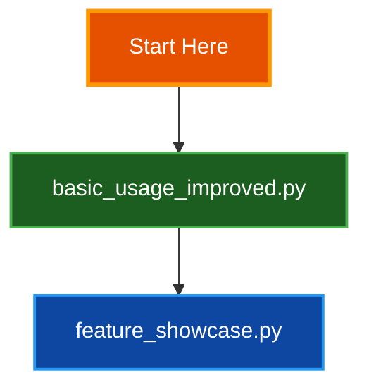
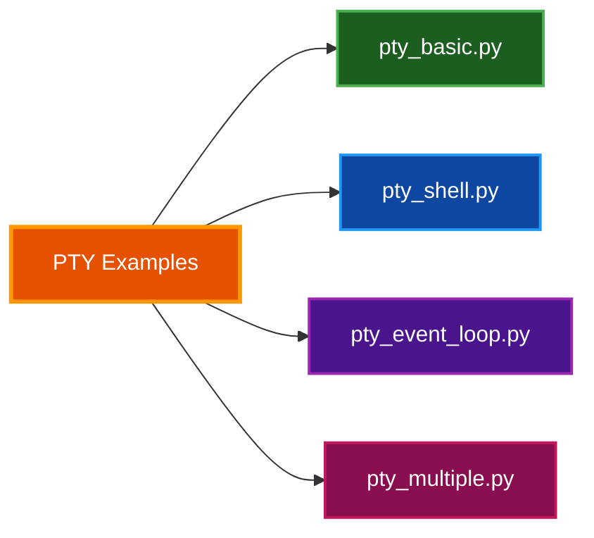
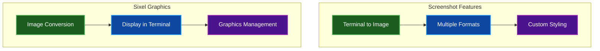
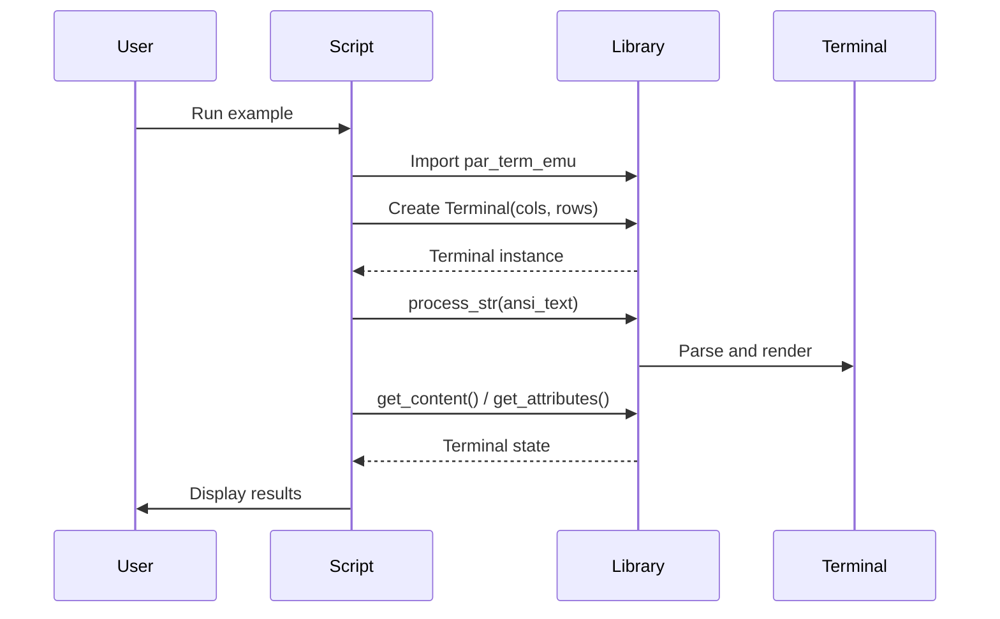

# Examples Documentation

Comprehensive collection of example scripts demonstrating the features and capabilities of the par-term-emu terminal emulator library.

## Table of Contents
- [Overview](#overview)
- [Prerequisites](#prerequisites)
- [Example Categories](#example-categories)
  - [Getting Started](#getting-started)
  - [Terminal Features](#terminal-features)
  - [PTY (Pseudo-Terminal) Examples](#pty-pseudo-terminal-examples)
  - [Advanced Features](#advanced-features)
  - [Graphics and Visual](#graphics-and-visual)
  - [Testing and Utilities](#testing-and-utilities)
- [Running Examples](#running-examples)
- [Example Index](#example-index)
- [Related Documentation](#related-documentation)

## Overview

This directory contains 32 example scripts organized by functionality. Each example demonstrates specific features of the terminal emulator, from basic text rendering to advanced features like Sixel graphics, PTY sessions, and protocol implementations.

**Purpose:** Provide practical, runnable examples for developers integrating par-term-emu into their applications

**Target Audience:**
- Developers learning the library
- Users evaluating terminal emulator features
- Contributors testing functionality

## Prerequisites

**Required:**
```bash
# Python 3.13+ with uv package manager
uv --version

# Build the library (from project root)
make dev
```

**Optional Dependencies:**
```bash
# For TUI examples
uv pip install textual

# For image/Sixel examples
uv pip install Pillow

# For clipboard operations (Linux)
sudo apt install xclip  # or wl-clipboard for Wayland
```

## Example Categories

### Getting Started

**Purpose:** Learn basic terminal emulation concepts and API usage



| Script | Description | Complexity |
|--------|-------------|------------|
| `basic_usage_improved.py` | Terminal creation, text processing, attribute inspection | Beginner |
| `feature_showcase.py` | Comprehensive demo of all major features | Intermediate |

### Terminal Features

**Purpose:** Demonstrate VT100/VT220/VT320/VT420 terminal emulation features

#### Display and Formatting

| Script | Feature | Description |
|--------|---------|-------------|
| `colors_demo.py` | Color Support | 16 basic colors, 256-color palette, 24-bit true color |
| `text_attributes.py` | Text Styling | Bold, italic, underline, blink, reverse, strikethrough |
| `test_underline_styles.py` | Modern Underlines | Six underline styles (straight, double, curly, dotted, dashed) |
| `unicode_emoji.py` | Unicode Support | CJK characters, emoji, wide characters, combining chars |
| `cursor_movement.py` | Cursor Control | Positioning, visibility, cursor styles (DECSCUSR) |

#### Screen Management

| Script | Feature | Description |
|--------|---------|-------------|
| `alt_screen.py` | Alternate Screen | Full-screen apps (vim, less, htop) screen buffer switching |
| `scrollback_demo.py` | Scrollback Buffer | History management, resize handling |

#### Advanced VT Features

| Script | Feature | Description |
|--------|---------|-------------|
| `rectangle_operations.py` | VT420 Rectangles | DECFRA (fill), DECCRA (copy), DECSERA (erase) operations |
| `synchronized_updates.py` | DEC 2026 Mode | Flicker-free rendering with atomic updates |
| `shell_integration.py` | OSC 133 | Shell prompt/command/output marking for modern terminals |
| `hyperlink_demo.py` | OSC 8 Hyperlinks | Clickable URLs in terminal output |
| `notifications.py` | OSC 9/777 | Desktop notifications from terminal apps |

#### Input and Selection

| Script | Feature | Description |
|--------|---------|-------------|
| `bracketed_paste.py` | Paste Safety | Prevents command execution on paste (mode 2004) |
| `mouse_tracking.py` | Mouse Events | Click, drag, scroll with SGR encoding (mode 1006) |
| `test_kitty_keyboard.py` | Kitty Protocol | Enhanced keyboard reporting with flags API |

#### Clipboard Integration

| Script | Feature | Description |
|--------|---------|-------------|
| `test_osc52_clipboard.py` | OSC 52 Protocol | Remote clipboard access over SSH without X11 |
| `test_tui_clipboard.py` | TUI Clipboard | Selection, copy/paste in Textual applications |

### PTY (Pseudo-Terminal) Examples

**Purpose:** Demonstrate interactive shell sessions and process management



| Script | Complexity | Description |
|--------|------------|-------------|
| `pty_basic.py` | Beginner | Simple command execution with PTY |
| `pty_shell.py` | Beginner | Interactive shell session management |
| `pty_event_loop.py` | Intermediate | Efficient update tracking with generation counters |
| `pty_custom_env.py` | Intermediate | Environment variables and working directory control |
| `pty_multiple.py` | Advanced | Concurrent PTY session management |
| `pty_resize.py` | Advanced | Dynamic terminal resizing with SIGWINCH |
| `pty_mouse_events.py` | Advanced | Mouse event forwarding in PTY sessions |
| `pty_with_par_term.py` | Intermediate | Using custom par-term terminfo definition |

> **📝 Note:** PTY examples require proper terminal setup. See `terminfo/README.md` for custom terminfo installation.

### Advanced Features

**Purpose:** Showcase cutting-edge terminal capabilities

#### Graphics

| Script | Feature | Description |
|--------|---------|-------------|
| `test_sixel_simple.py` | Sixel Basics | Simple Sixel graphics parsing and storage |
| `test_sixel_display.py` | Sixel Display | Image conversion and clear operations |
| `display_image_sixel.py` | Image Utility | Convert and display images in Sixel format (CLI tool) |
| `screenshot_demo.py` | Screenshot API | Render terminal to PNG/JPEG/BMP images |

> **⚠️ Warning:** Sixel graphics require terminals with Sixel support (xterm, mlterm, WezTerm, etc.)

### Graphics and Visual

**Purpose:** Demonstrate visual rendering capabilities



**Screenshot Examples:**
- Color and styling preservation
- Unicode and emoji rendering
- Multiple output formats (PNG, JPEG, BMP)
- Custom font and size configuration

**Sixel Examples:**
- Image to Sixel conversion
- Color palette quantization
- Graphics display and management

### Testing and Utilities

**Purpose:** Helper modules and interactive testing tools

| Script | Type | Description |
|--------|------|-------------|
| `render_utils.py` | Utility Module | Helper functions for colored terminal output rendering |

## Running Examples

### Basic Usage

```bash
# From project root
cd examples

# Run any example
uv run python basic_usage_improved.py

# Examples with dependencies
uv run python --with Pillow screenshot_demo.py
```

### Example Execution Flow



### Common Patterns

#### Creating a Terminal
```python
from par_term_emu_core_rust import Terminal

# Create 80x24 terminal with scrollback
term = Terminal(80, 24, scrollback=100)
```

#### Processing ANSI Sequences
```python
# Write colored text
term.process_str("\x1b[31mRed text\x1b[0m\n")

# Alternative: process bytes
term.process(b"\x1b[32mGreen text\x1b[0m\n")
```

#### Reading Terminal State
```python
# Get plain text content
content = term.content()

# Get specific line
line = term.get_line(0)

# Get cell attributes
attrs = term.get_attributes(col=0, row=0)
fg_color = term.get_fg_color(col=0, row=0)  # Returns (r, g, b)
```

#### PTY Sessions
```python
from par_term_emu_core_rust import PtyTerminal

# Create PTY terminal
term = PtyTerminal(80, 24)

# Spawn interactive shell
term.spawn_shell()

# Or spawn specific command
term.spawn("/bin/ls", args=["-la"])

# Write input
term.write_str("echo 'hello'\n")

# Check for updates
if term.has_updates_since(last_generation):
    content = term.content()
    last_generation = term.update_generation()
```

## Example Index

### Quick Reference Table

| Category | Example Script | Key Features Demonstrated |
|----------|---------------|---------------------------|
| **Basic** | `basic_usage_improved.py` | Terminal creation, ANSI processing, state inspection |
| | `feature_showcase.py` | Comprehensive feature overview |
| **Display** | `colors_demo.py` | 16/256/24-bit colors |
| | `text_attributes.py` | SGR attributes (bold, italic, etc.) |
| | `test_underline_styles.py` | SGR 4:x underline styles |
| | `unicode_emoji.py` | Wide chars, CJK, emoji |
| | `cursor_movement.py` | Cursor positioning and styles |
| **Screen** | `alt_screen.py` | Alternate buffer (mode 1049) |
| | `scrollback_demo.py` | History management |
| | `synchronized_updates.py` | Atomic updates (mode 2026) |
| **VT Features** | `rectangle_operations.py` | DECFRA/DECCRA/DECSERA |
| | `shell_integration.py` | OSC 133 prompt marking |
| | `hyperlink_demo.py` | OSC 8 clickable links |
| | `notifications.py` | OSC 9/777 desktop alerts |
| **Input** | `bracketed_paste.py` | Paste mode 2004 |
| | `mouse_tracking.py` | Mouse modes (1000/1002/1003) |
| | `test_kitty_keyboard.py` | Enhanced keyboard protocol |
| **Clipboard** | `test_osc52_clipboard.py` | Remote clipboard (OSC 52) |
| | `test_tui_clipboard.py` | TUI selection and paste |
| **PTY Basic** | `pty_basic.py` | Simple command execution |
| | `pty_shell.py` | Interactive shell |
| | `pty_event_loop.py` | Update tracking pattern |
| **PTY Advanced** | `pty_custom_env.py` | Environment control |
| | `pty_multiple.py` | Concurrent sessions |
| | `pty_resize.py` | SIGWINCH handling |
| | `pty_mouse_events.py` | Mouse forwarding |
| | `pty_with_par_term.py` | Custom terminfo |
| **Graphics** | `test_sixel_simple.py` | Sixel parsing basics |
| | `test_sixel_display.py` | Image display |
| | `display_image_sixel.py` | Image converter utility |
| | `screenshot_demo.py` | Terminal to image |
| **Utilities** | `render_utils.py` | Rendering helpers |

### By Protocol/Feature

**VT Modes:**
- Mode 2004 (Bracketed Paste): `bracketed_paste.py`
- Mode 1049 (Alt Screen): `alt_screen.py`
- Mode 1000/1002/1003 (Mouse): `mouse_tracking.py`
- Mode 1006 (SGR Mouse): `mouse_tracking.py`, `pty_mouse_events.py`
- Mode 2026 (Sync Update): `synchronized_updates.py`

**OSC Sequences:**
- OSC 8 (Hyperlinks): `hyperlink_demo.py`
- OSC 9 (Notifications): `notifications.py`
- OSC 52 (Clipboard): `test_osc52_clipboard.py`
- OSC 133 (Shell Integration): `shell_integration.py`
- OSC 777 (Notifications): `notifications.py`

**DEC Sequences:**
- DECFRA/DECCRA/DECSERA: `rectangle_operations.py`
- DECSCUSR: `cursor_movement.py`, `feature_showcase.py`

**Graphics:**
- Sixel (DCS): `test_sixel_simple.py`, `test_sixel_display.py`, `display_image_sixel.py`
- Screenshot: `screenshot_demo.py`

## Related Documentation

- [Project README](../README.md) - Main library documentation and API reference
- [ARCHITECTURE.md](../docs/ARCHITECTURE.md) - Internal architecture and design
- [ADVANCED_FEATURES.md](../docs/ADVANCED_FEATURES.md) - Advanced terminal features
- [VT_FEATURE_PARITY.md](../docs/VT_FEATURE_PARITY.md) - VT sequence compatibility matrix
- [FONTS.md](../docs/FONTS.md) - Font configuration for screenshot features
- [Custom Terminfo](../terminfo/README.md) - Installing par-term terminfo definition

---

> **✅ Tip:** Start with `basic_usage_improved.py` to understand core concepts, then explore `feature_showcase.py` for a comprehensive overview before diving into specific feature examples.

> **📝 Note:** All examples are tested and maintained. If you encounter issues, please report them at [GitHub Issues](https://github.com/paulrobello/par-term-emu-core-rust/issues).
