# Font Support for Screenshots

The screenshot functionality includes an **embedded JetBrains Mono font**, so no font installation is required for basic usage. The library automatically works out-of-the-box on all platforms.

## Table of Contents
- [Overview](#overview)
- [Embedded Font (Default)](#embedded-font-default)
- [Emoji & CJK Fallback Fonts](#emoji--cjk-fallback-fonts)
- [Installation Options (Optional)](#installation-options-optional)
  - [Option 1: Install System Fonts](#option-1-install-system-fonts-recommended-for-emojicjk)
  - [Option 2: Download Font with Helper Script](#option-2-download-font-with-helper-script-legacy)
  - [Option 3: Specify a Custom Font](#option-3-specify-a-custom-font)
  - [Option 4: Download Fonts Manually](#option-4-download-fonts-manually)
- [Docker/Container Environments](#dockercontainer-environments)
- [Troubleshooting](#troubleshooting)

## Overview

**No installation required!** Screenshots work immediately with the embedded font.

However, you may want to install additional fonts for:
- **Emoji rendering**: System emoji fonts provide better color emoji support
- **CJK characters**: System CJK fonts provide comprehensive character coverage
- **Custom styling**: Use your preferred monospace font

## Embedded Font (Default)

**JetBrains Mono Regular** (OFL-1.1 license, ~274 KB) is bundled with the library and provides:
- Programming ligatures (=>, !=, >=, etc.)
- Full box drawing character support (┌─┐│└┘)
- Excellent Unicode coverage
- Clean, modern design optimized for code

The embedded font is used automatically when no `font_path` is specified:

```python
term.screenshot()  # Uses embedded JetBrains Mono - no setup needed!
```

## Emoji & CJK Fallback Fonts

The library uses a smart fallback system to render all characters correctly:

```mermaid
graph TD
    Start[Render Character]
    CheckChar{Character Type?}

    Main[Use Main Font<br/>JetBrains Mono or font_path]
    EmojiSearch[Search System Emoji Fonts]
    CJKSearch[Search System CJK Fonts]
    EmojiFallback[Embedded Noto Emoji<br/>Monochrome]
    Tofu[Render as Tofu Box □]

    Start --> CheckChar
    CheckChar -->|Regular ASCII| Main
    CheckChar -->|Emoji 😀| EmojiSearch
    CheckChar -->|CJK 中文| CJKSearch

    EmojiSearch -->|Found| Main
    EmojiSearch -->|Not Found| EmojiFallback

    CJKSearch -->|Found| Main
    CJKSearch -->|Not Found| Tofu

    style Start fill:#e65100,stroke:#ff9800,stroke-width:3px,color:#ffffff
    style Main fill:#1b5e20,stroke:#4caf50,stroke-width:2px,color:#ffffff
    style EmojiSearch fill:#0d47a1,stroke:#2196f3,stroke-width:2px,color:#ffffff
    style CJKSearch fill:#0d47a1,stroke:#2196f3,stroke-width:2px,color:#ffffff
    style EmojiFallback fill:#4a148c,stroke:#9c27b0,stroke-width:2px,color:#ffffff
    style Tofu fill:#ff6f00,stroke:#ffa726,stroke-width:2px,color:#ffffff
    style CheckChar fill:#37474f,stroke:#78909c,stroke-width:2px,color:#ffffff
```



For emoji and CJK characters, the library automatically searches for system fonts in this order:

**Emoji fonts** (for color emoji):
- macOS: Apple Color Emoji, Arial Unicode
- Linux: NotoColorEmoji, NotoEmoji, DejaVuSans
- Windows: Segoe UI Emoji, Segoe UI Symbol
- Embedded fallback: Noto Emoji Regular (monochrome, ~419 KB)

**CJK fonts** (for Chinese, Japanese, Korean):
- macOS: Arial Unicode, PingFang, Hiragino Sans GB, AppleSDGothicNeo
- Linux: NotoSansCJK, DejaVuSans
- Windows: MS Gothic, MS YaHei, Malgun Gothic

If system fonts aren't available, emoji/CJK characters will render using the embedded fallback fonts or as tofu boxes (□).

## Installation Options (Optional)

Installation is **optional** - the embedded font works great! Only install additional fonts if you need better emoji/CJK support or want to use a custom font.

### Option 1: Install System Fonts (Recommended for Emoji/CJK)

Install fonts on Linux for better emoji and CJK character support:

#### Linux (Debian/Ubuntu)
```bash
# For emoji support
sudo apt install fonts-noto-color-emoji

# For CJK support
sudo apt install fonts-noto-cjk

# Or install DejaVu fonts (good general coverage)
sudo apt install fonts-dejavu-core
```

#### Linux (Fedora/RHEL)
```bash
# For emoji support
sudo dnf install google-noto-emoji-color-fonts

# For CJK support
sudo dnf install google-noto-sans-cjk-fonts

# Or DejaVu fonts
sudo dnf install dejavu-sans-mono-fonts
```

#### Linux (Arch)
```bash
# For emoji support
sudo pacman -S noto-fonts-emoji

# For CJK support
sudo pacman -S noto-fonts-cjk

# Or DejaVu fonts
sudo pacman -S ttf-dejavu
```

#### macOS
System fonts (Apple Color Emoji, Arial Unicode, etc.) are pre-installed. No action needed for emoji/CJK support.

#### Windows
System fonts (Segoe UI Emoji, MS Gothic, etc.) are pre-installed. No action needed for emoji/CJK support.

### Option 2: Download Font with Helper Script (Legacy)

> **Note**: This script is **no longer necessary** since JetBrains Mono is now embedded. It's kept for users who specifically want the Hack font.

The script downloads Hack font (MIT licensed) to your user fonts directory:

```bash
./scripts/install_font.sh
```

This downloads and installs Hack font to `~/.local/share/fonts/` and updates the font cache. You can then use it with:

```python
term.screenshot(font_path="~/.local/share/fonts/Hack-Regular.ttf")
```

### Option 3: Specify a Custom Font

You can use any TTF/OTF monospace font by specifying its path:

```python
# Use a custom font
term.screenshot(font_path="/path/to/your/font.ttf")

# Or use embedded default (JetBrains Mono)
term.screenshot()  # No font_path needed!
```

### Option 4: Download Fonts Manually

Download any monospace font you prefer:

- **Hack**: https://github.com/source-foundry/Hack (MIT License)
- **Inconsolata**: https://fonts.google.com/specimen/Inconsolata (OFL)
- **JetBrains Mono**: https://www.jetbrains.com/lp/mono/ (OFL)
- **Fira Code**: https://github.com/tonsky/FiraCode (OFL)

Then place the `.ttf` file somewhere accessible and specify its path:

```python
term.screenshot(font_path="/path/to/downloaded/font.ttf")
```

## Docker/Container Environments

**No setup required!** The embedded JetBrains Mono font works in Docker containers out-of-the-box.

For better emoji/CJK support in containers, optionally install system fonts:

```dockerfile
# Optional: Add emoji and CJK fonts for better character coverage
RUN apt-get update && \
    apt-get install -y \
        fonts-noto-color-emoji \
        fonts-noto-cjk && \
    rm -rf /var/lib/apt/lists/*

# Or minimal approach - just DejaVu for basic coverage
RUN apt-get update && apt-get install -y fonts-dejavu-core && rm -rf /var/lib/apt/lists/*
```

The library will work with or without these fonts - they only improve emoji/CJK rendering.

## Troubleshooting

### Screenshots work without any font installation

The library includes an embedded JetBrains Mono font. You should **never** see a "No system monospace font found" error. If you do, please file a bug report!

### Emoji or CJK characters appear as boxes (□)

This is normal if you don't have system emoji/CJK fonts installed. Solutions:

1. **Install system fonts** (see [Option 1](#option-1-install-system-fonts-recommended-for-emojicjk) above)
2. **Accept the limitation** - The embedded Noto Emoji fallback provides monochrome emoji
3. **Use a comprehensive font** - Specify a font with good emoji/CJK coverage via `font_path`

### Check available fonts

```bash
# Linux - List available monospace fonts
fc-list :mono

# macOS - List system fonts
ls /System/Library/Fonts/

# Check if specific fonts are installed
fc-list | grep -i "noto\|emoji\|cjk"
```

### Font priority order

The library searches for fonts in this order:

1. **Main text font**: `font_path` parameter → Embedded JetBrains Mono
2. **Emoji fallback**: System color emoji fonts → Embedded Noto Emoji (monochrome)
3. **CJK fallback**: System CJK fonts → Main font (may show tofu boxes)
