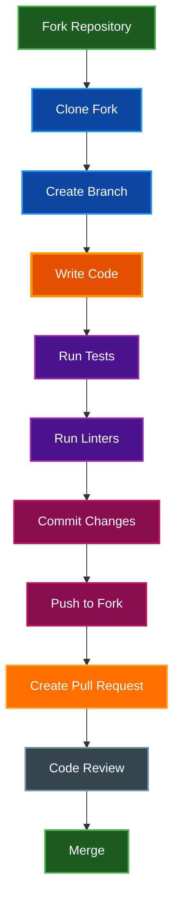

# Contributing to Par Term Emu TUI Rust

Thank you for your interest in contributing! This guide will help you get started with development and ensure high-quality contributions.

## Table of Contents
- [Quick Start](#quick-start)
- [Development Setup](#development-setup)
- [Code Quality Standards](#code-quality-standards)
- [Development Workflow](#development-workflow)
- [Testing](#testing)
- [Documentation](#documentation)
- [Pull Request Process](#pull-request-process)
- [Code Style Guide](#code-style-guide)
- [Related Documentation](#related-documentation)

## Quick Start

### Prerequisites

- Python 3.12 or higher
- uv package manager
- Git

### Setup Development Environment

```bash
# Clone repository
git clone https://github.com/paulrobello/par-term-emu-tui-rust.git
cd par-term-emu-tui-rust

# Install dependencies
uv sync

# Install pre-commit hooks (recommended)
uv run pre-commit install
```

## Development Setup

### Initial Setup

```bash
# 1. Fork the repository on GitHub

# 2. Clone your fork
git clone https://github.com/YOUR_USERNAME/par-term-emu-tui-rust.git
cd par-term-emu-tui-rust

# 3. Add upstream remote
git remote add upstream https://github.com/paulrobello/par-term-emu-tui-rust.git

# 4. Install dependencies
uv sync

# 5. Install development tools
uv run pre-commit install
```

### Development Tools

| Tool | Purpose | Command |
|------|---------|---------|
| **ruff** | Formatting and linting | `uv run ruff check` |
| **pyright** | Type checking | `uv run pyright` |
| **pytest** | Testing | `uv run pytest` |
| **pre-commit** | Git hooks | `uv run pre-commit run` |

### Project Structure

```
par-term-emu-tui-rust/
├── src/
│   └── par_term_emu_tui_rust/
│       ├── __init__.py
│       ├── app.py                    # Main application
│       ├── config.py                 # Configuration management
│       ├── messages.py               # Message definitions
│       ├── themes.py                 # Theme system
│       ├── terminal_widget/          # Terminal widget
│       │   ├── __init__.py
│       │   ├── terminal_widget.py   # Main widget
│       │   ├── rendering.py         # Rendering engine
│       │   └── selection.py         # Selection handling
│       ├── widgets/                  # Custom widgets
│       │   ├── flash_line.py
│       │   └── status_bar.py
│       └── install_scripts/          # Installation scripts
├── tests/                           # Test suite
├── docs/                           # Documentation
├── pyproject.toml                  # Project configuration
├── Makefile                        # Build automation
└── README.md                       # Project overview
```

## Code Quality Standards

All contributions must pass these quality checks:

### Formatting

```bash
# Format code with ruff
make fmt-python

# Or manually
uv run ruff format src/ tests/
```

### Linting

```bash
# Lint code with ruff
make lint-python

# Or manually
uv run ruff check --fix src/ tests/
```

### Type Checking

```bash
# Type check with pyright
make typecheck

# Or manually
uv run pyright src/ tests/
```

### Testing

```bash
# Run all tests
make test

# Or manually
uv run pytest
```

### All Checks

```bash
# Run all quality checks
make checkall
```

### Pre-commit Hooks

**Recommended:** Install pre-commit hooks to automate quality checks:

```bash
# Install hooks
uv run pre-commit install

# Run manually
uv run pre-commit run --all-files
```

Pre-commit automatically runs before each commit:
- Code formatting (ruff format)
- Linting (ruff check)
- Type checking (pyright)
- Trailing whitespace removal
- YAML validation

## Development Workflow

### Workflow Diagram



### Step-by-Step Process

**1. Create feature branch:**
```bash
# Update main branch
git checkout main
git pull upstream main

# Create feature branch
git checkout -b feature/your-feature-name
```

**2. Make changes:**
```bash
# Edit files
$EDITOR src/par_term_emu_tui_rust/app.py

# Test changes
make run
```

**3. Run quality checks:**
```bash
# Format code
make fmt-python

# Run all checks
make checkall
```

**4. Commit changes:**
```bash
# Stage changes
git add -A

# Commit (pre-commit hooks run automatically)
git commit -m "feat: add new feature"
```

**5. Push and create PR:**
```bash
# Push to your fork
git push origin feature/your-feature-name

# Create pull request on GitHub
```

## Testing

### Running Tests

```bash
# Run all tests
uv run pytest

# Run specific test file
uv run pytest tests/test_config.py

# Run with coverage
uv run pytest --cov=src --cov-report=term-missing

# Run with verbose output
uv run pytest -v
```

### Writing Tests

**Test structure:**
```python
import pytest
from pathlib import Path
from par_term_emu_tui_rust.config import Config

def test_config_loading() -> None:
    """Test configuration file loading."""
    # Arrange
    config_path = Path("test_config.yaml")

    # Act
    config = Config.load(config_path)

    # Assert
    assert config is not None
    assert config.theme == "dark-background"

@pytest.fixture
def sample_config() -> dict[str, str]:
    """Fixture for test configuration."""
    return {
        "theme": "solarized-dark",
        "scrollback_lines": 10000
    }

def test_with_fixture(sample_config: dict[str, str]) -> None:
    """Test using fixture."""
    assert sample_config["theme"] == "solarized-dark"
```

### Test Requirements

- All tests must pass
- New features require tests
- Bug fixes should include regression tests
- Aim for >80% code coverage
- Tests should be fast (<10 seconds per test)

## Documentation

### Documentation Standards

All documentation must follow the [Documentation Style Guide](docs/DOCUMENTATION_STYLE_GUIDE.md).

**Key requirements:**
- Use Mermaid diagrams (never ASCII art)
- Dark backgrounds with white text in diagrams
- Include table of contents for documents >500 words
- Specify language in all code blocks
- No line numbers in file references

### Updating Documentation

**When to update docs:**
- Adding new features
- Changing existing behavior
- Fixing bugs that affect usage
- Adding configuration options

**Documentation files:**
```bash
# Main documentation
docs/QUICK_START.md           # Getting started guide
docs/INSTALLATION.md          # Installation instructions
docs/FEATURES.md              # Feature descriptions
docs/USAGE.md                 # Usage guide
docs/KEY_BINDINGS.md          # Keyboard/mouse reference
docs/SCREENSHOTS.md           # Screenshot guide
docs/TROUBLESHOOTING.md       # Common issues
docs/CONFIG_REFERENCE.md      # Configuration reference
docs/ARCHITECTURE.md          # System design
docs/DEBUG.md                 # Debugging guide

# Root documentation
README.md                     # Project overview
CONTRIBUTING.md               # This file
```

### Documentation Checklist

- [ ] Update relevant documentation files
- [ ] Add examples for new features
- [ ] Update configuration reference if needed
- [ ] Test all code examples
- [ ] Verify all links work
- [ ] Follow style guide formatting

## Pull Request Process

### Before Submitting

**Checklist:**
- [ ] Code follows style guide
- [ ] All tests pass (`make test`)
- [ ] Linting passes (`make lint-python`)
- [ ] Type checking passes (`make typecheck`)
- [ ] Documentation updated
- [ ] Commit messages follow convention
- [ ] Branch is up to date with main

### PR Template

```markdown
## Description
Brief description of changes

## Type of Change
- [ ] Bug fix
- [ ] New feature
- [ ] Breaking change
- [ ] Documentation update

## Testing
Describe testing performed

## Checklist
- [ ] Tests pass
- [ ] Linting passes
- [ ] Type checking passes
- [ ] Documentation updated
- [ ] Commit messages follow convention
```

### Commit Message Convention

Follow [Conventional Commits](https://www.conventionalcommits.org/):

```
<type>(<scope>): <subject>

[optional body]

[optional footer]
```

**Types:**
- `feat` - New feature
- `fix` - Bug fix
- `docs` - Documentation changes
- `style` - Code style changes
- `refactor` - Code refactoring
- `test` - Test additions/changes
- `chore` - Maintenance tasks
- `perf` - Performance improvements

**Examples:**
```bash
feat(terminal): add cursor blink support
fix(clipboard): resolve paste issue on Linux
docs(readme): update installation instructions
refactor(config): simplify configuration loading
test(selection): add word selection tests
```

### Review Process

**What reviewers look for:**
1. Code quality and style compliance
2. Test coverage
3. Documentation completeness
4. Performance implications
5. Breaking changes
6. Security considerations

**Timeline:**
- Initial review: 1-3 days
- Follow-up reviews: 1-2 days
- Merge after approval: Same day

## Code Style Guide

### Python Standards

**Python version:** 3.12+

**Type annotations:**
```python
# Use built-in generics
def process_items(items: list[str]) -> dict[str, int]:
    """Process items and return counts."""
    return {item: len(item) for item in items}

# Use union operator
def get_value(key: str) -> str | None:
    """Get value or None if not found."""
    return cache.get(key)
```

**Docstrings (Google style):**
```python
def complex_function(param1: str, param2: int) -> bool:
    """Brief description of function.

    Longer description if needed, explaining behavior,
    edge cases, and important details.

    Args:
        param1: Description of param1
        param2: Description of param2

    Returns:
        Description of return value

    Raises:
        ValueError: When param2 is negative
    """
    if param2 < 0:
        raise ValueError("param2 must be non-negative")
    return bool(param1) and param2 > 0
```

**File I/O:**
```python
from pathlib import Path

# Always specify encoding
def read_config(path: Path) -> str:
    """Read configuration file."""
    return path.read_text(encoding="utf-8")

def write_config(path: Path, content: str) -> None:
    """Write configuration file."""
    path.write_text(content, encoding="utf-8")
```

**Imports:**
```python
# Standard library
from pathlib import Path
import sys

# Third-party
import yaml
from textual.app import App

# Local
from par_term_emu_tui_rust.config import Config
from par_term_emu_tui_rust.terminal_widget import TerminalWidget
```

### Code Organization

**Class structure:**
```python
class TerminalWidget(Widget):
    """Terminal widget for Textual.

    Attributes:
        terminal: The terminal emulator instance
        config: Configuration object
    """

    # Class variables
    DEFAULT_CSS = """..."""

    def __init__(self, config: Config) -> None:
        """Initialize terminal widget."""
        super().__init__()
        self.config = config
        self.terminal = Terminal()

    def on_mount(self) -> None:
        """Called when widget is mounted."""
        self._setup_terminal()

    def _setup_terminal(self) -> None:
        """Setup terminal emulator (private method)."""
        # Implementation
        pass
```

## Related Documentation

- [Quick Start Guide](docs/QUICK_START.md) - Get started quickly
- [Installation Guide](docs/INSTALLATION.md) - Installation help
- [Architecture](docs/ARCHITECTURE.md) - System design
- [Debug Guide](docs/DEBUG.md) - Debugging help
- [Documentation Style Guide](docs/DOCUMENTATION_STYLE_GUIDE.md) - Doc standards
- [Configuration Reference](docs/CONFIG_REFERENCE.md) - All settings

## License

By contributing, you agree that your contributions will be licensed under the MIT License.
