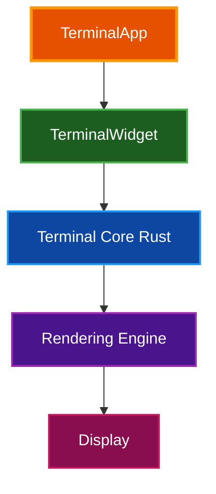

# Par Term Emu TUI Rust

[](https://pypi.org/project/par_term_emu_tui_rust/)
[](https://pypi.org/project/par_term_emu_tui_rust/)


A modern terminal emulator TUI built with [Textual](https://textual.textualize.io/) and [par-term-emu-core-rust](https://github.com/paulrobello/par-term-emu-core-rust), featuring efficient rendering, comprehensive ANSI support, and advanced terminal features.


[](https://buymeacoffee.com/probello3)

## Quick Start

```bash
# Clone and install
git clone https://github.com/paulrobello/par-term-emu-tui-rust.git
cd par-term-emu-tui-rust
uv sync

# Install components (recommended)
par-term-emu-tui-rust install all

# Run the TUI
make run
```

See the [Quick Start Guide](docs/QUICK_START.md) for detailed instructions.

## Features

- **Efficient Rendering** - Textual Line API for optimal performance
- **Full ANSI Support** - 16/256/true color, bold, italic, underline, and more
- **Scrollback Buffer** - Navigate history with keyboard and mouse
- **Mouse Support** - Text selection, clickable URLs, and mouse tracking
- **Hyperlinks** - OSC 8 hyperlinks and auto-detected plain text URLs
- **Notifications** - OSC 9/777 notification support with toast messages
- **Shell Integration** - Working directory tracking, prompt navigation
- **Screenshots** - Multiple formats (PNG, SVG, HTML) with auto-capture
- **Themes** - 12 built-in themes with custom theme support
- **Clipboard** - Cross-platform copy/paste with OSC 52 support

See [Features](docs/FEATURES.md) for complete feature documentation.

## Documentation

### Getting Started
- [Quick Start Guide](docs/QUICK_START.md) - Get up and running in 5 minutes
- [Installation Guide](docs/INSTALLATION.md) - Detailed installation instructions
- [Usage Guide](docs/USAGE.md) - Command-line options and workflows

### Reference
- [Features](docs/FEATURES.md) - Complete feature descriptions
- [Key Bindings](docs/KEY_BINDINGS.md) - Keyboard shortcuts and mouse actions
- [Configuration Reference](docs/CONFIG_REFERENCE.md) - All configuration options
- [Screenshots Guide](docs/SCREENSHOTS.md) - Screenshot functionality

### Advanced
- [Architecture](docs/ARCHITECTURE.md) - System design and implementation
- [Debug Guide](docs/DEBUG.md) - Debugging and development
- [Troubleshooting](docs/TROUBLESHOOTING.md) - Common issues and solutions
- [Contributing](CONTRIBUTING.md) - Development setup and guidelines

## Installation

### Prerequisites

- Python 3.12 or higher
- uv package manager
- Terminal with true color support

### Install from Source

```bash
# Clone repository
git clone https://github.com/paulrobello/par-term-emu-tui-rust.git
cd par-term-emu-tui-rust

# Install dependencies
uv sync

# Install all components
par-term-emu-tui-rust install all
```

See [Installation Guide](docs/INSTALLATION.md) for detailed instructions.

## Basic Usage

```bash
# Run with default shell
par-term-emu-tui-rust

# Use custom shell
par-term-emu-tui-rust --shell /bin/zsh

# Apply theme
par-term-emu-tui-rust --theme solarized-dark

# Take screenshot
par-term-emu-tui-rust --screenshot 3 --auto-quit 5
```

### Key Bindings

| Shortcut | Action |
|----------|--------|
| **Ctrl+Shift+Q** | Quit application |
| **Ctrl+Shift+S** | Take screenshot |
| **Ctrl+Shift+C** | Copy selection |
| **Shift+PageUp/Down** | Scroll history |
| **Shift+Home/End** | Jump to top/bottom |

See [Key Bindings](docs/KEY_BINDINGS.md) for complete reference.

## Configuration

Configuration file location: `~/.config/par-term-emu-tui-rust/config.yaml`

**Create default configuration:**
```bash
par-term-emu-tui-rust --init-config
```

**Essential settings:**
```yaml
# Theme
theme: "dark-background"

# Scrollback
scrollback_lines: 10000

# Clipboard
auto_copy_selection: true
middle_click_paste: true

# Screenshots
screenshot_format: "png"
```

See [Configuration Reference](docs/CONFIG_REFERENCE.md) for all options.

## Technology

- **Python** 3.12+ - Application logic
- **Textual** - TUI framework
- **par-term-emu-core-rust** - Terminal emulation (Rust)
- **PyYAML** - Configuration
- **pyperclip** - Clipboard support
- **xdg-base-dirs** - XDG compliance

## Architecture



See [Architecture](docs/ARCHITECTURE.md) for detailed system design.

## Contributing

Contributions are welcome! Please read the [Contributing Guide](CONTRIBUTING.md) for:

- Development setup
- Code quality standards
- Testing requirements
- Pull request process

### Development Setup

```bash
# Clone repository
git clone https://github.com/paulrobello/par-term-emu-tui-rust.git
cd par-term-emu-tui-rust

# Install dependencies
uv sync

# Install pre-commit hooks
uv run pre-commit install

# Run quality checks
make checkall
```

## Resources

- [GitHub Repository](https://github.com/paulrobello/par-term-emu-tui-rust)
- [Issue Tracker](https://github.com/paulrobello/par-term-emu-tui-rust/issues)
- [Discussions](https://github.com/paulrobello/par-term-emu-tui-rust/discussions)
- [Textual Documentation](https://textual.textualize.io/)
- [par-term-emu-core-rust](https://github.com/paulrobello/par-term-emu-core-rust)

## Troubleshooting

For common issues and solutions, see the [Troubleshooting Guide](docs/TROUBLESHOOTING.md).

**Quick diagnostics:**
```bash
# Enable debug logging
par-term-emu-tui-rust --debug

# Test with minimal config
par-term-emu-tui-rust --auto-quit 2
```

## License

This project is licensed under the MIT License - see the [LICENSE](LICENSE) file for details.

## Author

Paul Robello - probello@gmail.com

## Acknowledgments

- Built with [Textual](https://textual.textualize.io/)
- Terminal emulation by [par-term-emu-core-rust](https://github.com/paulrobello/par-term-emu-core-rust)
- Inspired by modern terminal emulators (iTerm2, Alacritty, Wezterm)
