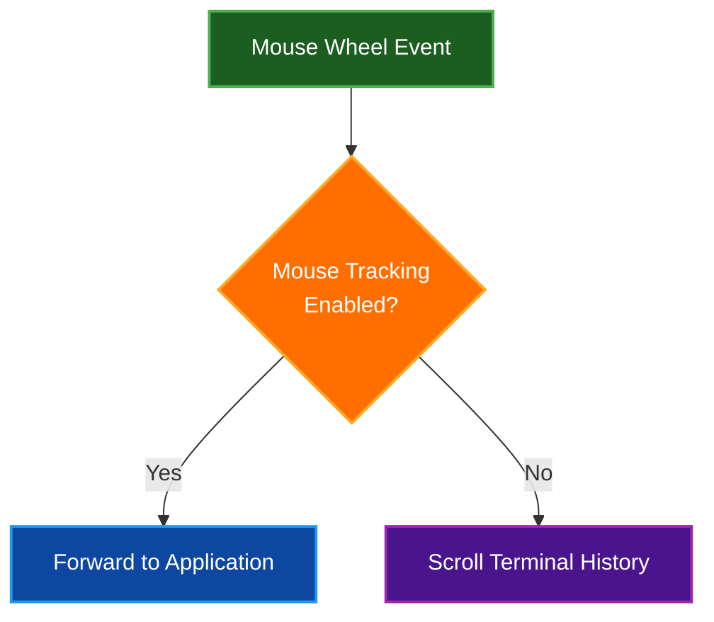
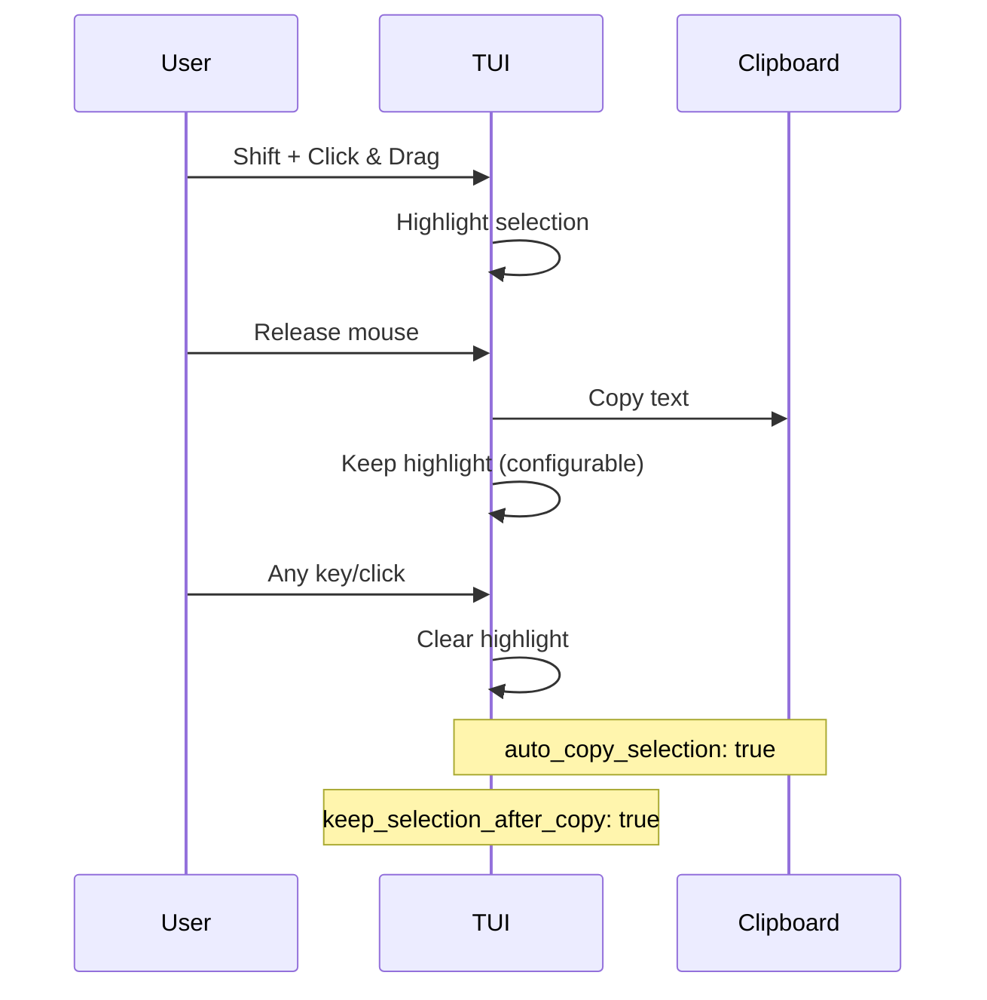

# Key Bindings Reference

Complete reference for keyboard shortcuts and mouse interactions in Par Term Emu TUI Rust.

## Table of Contents
- [Keyboard Shortcuts](#keyboard-shortcuts)
- [Mouse Actions](#mouse-actions)
- [Text Selection](#text-selection)
- [Scrollback Navigation](#scrollback-navigation)
- [Clipboard Operations](#clipboard-operations)
- [Special Keys](#special-keys)
- [Application-Specific Bindings](#application-specific-bindings)
- [Customization](#customization)
- [Related Documentation](#related-documentation)

## Keyboard Shortcuts

### Global Shortcuts

| Shortcut | Action | Description |
|----------|--------|-------------|
| **Ctrl+Shift+Q** | Quit application | Exit the TUI immediately |
| **Ctrl+Shift+S** | Take screenshot | Capture current terminal view |
| **Ctrl+Shift+C** | Copy selection | Copy selected text to clipboard |
| **Ctrl+Shift+V** | Paste | Paste clipboard content to terminal |
| **Alt+Ctrl+Shift+C** | Edit config | Open config file editor dialog |

### Navigation Shortcuts

| Shortcut | Action | Description |
|----------|--------|-------------|
| **Ctrl+Shift+PageUp** | Scroll up | Scroll up one page in history |
| **Ctrl+Shift+PageDown** | Scroll down | Scroll down one page in history |
| **Shift+Home** | Jump to top | Jump to top of scrollback |
| **Shift+End** | Jump to bottom | Jump to bottom (live output) |

## Mouse Actions

### Basic Mouse Operations

| Action | Result | Description |
|--------|--------|-------------|
| **Left Click** | Position cursor | Move cursor to click position |
| **Middle Click** | Paste | Paste clipboard (PRIMARY on Linux) |
| **Mouse Wheel Up** | Scroll up | Scroll up in history (when tracking off) |
| **Mouse Wheel Down** | Scroll down | Scroll down in history (when tracking off) |

### Mouse Wheel Behavior



**Configuration:**
```yaml
mouse_wheel_scroll_lines: 3  # Lines per wheel tick
```

### Click Actions on Special Elements

| Element | Action | Result |
|---------|--------|--------|
| **URL (OSC 8)** | Click | Open URL in browser |
| **Plain URL** | Click | Open URL in browser |
| **URL (with modifier)** | Modifier+Click | Open URL (if configured) |

## Text Selection

### Selection Methods

| Method | Keys | Selection Type |
|--------|------|----------------|
| **Rectangular** | Shift + Click & Drag | Arbitrary text region |
| **Word** | Double-Click | Word at cursor |
| **Line** | Triple-Click | Entire line |
| **Extend** | Shift + Click | Extend selection |

### Selection Behavior Flow



### Word Selection

**Double-click selects word based on word boundaries:**

**Default word characters:** `/-+\~_.`

**Example selections:**

| Text | Selected |
|------|----------|
| `hello-world` | `hello-world` (entire word) |
| `user@example.com` | `user` or `example` or `com` |
| `/path/to/file` | `/path/to/file` (entire path) |
| `~/.config` | `~/.config` (entire path) |

**Configuration:**
```yaml
word_characters: "/-+\\~_."  # Default (paths)
# For URLs: "-_.~:/?#[]@!$&'()*+,;="
```

### Line Selection

**Triple-click behavior:**

- **Wrapped lines enabled**: Selects complete logical line (follows wrapping)
- **Wrapped lines disabled**: Selects only visible screen line

**Configuration:**
```yaml
triple_click_selects_wrapped_lines: true
```

### Selection Copy Behavior

**Auto-copy settings:**
```yaml
auto_copy_selection: true           # Copy on selection release
keep_selection_after_copy: true     # Keep highlighting after copy
copy_trailing_newline: false        # Include \n in line copy
```

## Scrollback Navigation

### Keyboard Navigation

| Shortcut | Distance | Description |
|----------|----------|-------------|
| **Ctrl+Shift+PageUp** | 1 page | Scroll up by terminal height |
| **Ctrl+Shift+PageDown** | 1 page | Scroll down by terminal height |
| **Shift+Home** | To top | Jump to oldest scrollback line |
| **Shift+End** | To bottom | Jump to live output |

### Mouse Navigation

| Action | Distance | Description |
|--------|----------|-------------|
| **Wheel Up** | 3 lines | Scroll up (configurable) |
| **Wheel Down** | 3 lines | Scroll down (configurable) |

### Scrollback Indicators

**Visual feedback:**
- Position indicator in status bar
- Scroll position relative to total history
- Live output indicator when at bottom

### Scrollback Limits

```yaml
scrollback_lines: 10000         # Maximum history lines
max_scrollback_lines: 100000    # Safety limit for unlimited
```

## Clipboard Operations

### Copy Methods

| Method | Shortcut | Description |
|--------|----------|-------------|
| **Auto-copy** | Selection release | Automatic on selection end |
| **Manual copy** | Ctrl+Shift+C | Copy current selection |
| **Word copy** | Double-click | Select and copy word |
| **Line copy** | Triple-click | Select and copy line |

### Paste Methods

| Method | Shortcut | Description |
|--------|----------|-------------|
| **Keyboard paste** | Ctrl+Shift+V | Paste clipboard content |
| **Middle click** | Middle button | Paste (PRIMARY on Linux) |
| **Application paste** | Shift+Insert | Forwarded to application |

### Clipboard Integration

**System clipboard:**
```yaml
expose_system_clipboard: true  # Allow OSC 52 clipboard access
```

**Paste safety:**
```yaml
paste_warn_size: 100000       # Warn before large paste
paste_chunk_size: 0           # Chunk large pastes (0 = disabled)
paste_chunk_delay_ms: 10      # Delay between chunks
```

## Special Keys

### Function Keys

| Key | Sent As | Description |
|-----|---------|-------------|
| **F1-F12** | `ESC O P` - `ESC O [` | Function key sequences |
| **Shift+F1-F12** | Modified sequences | Shifted function keys |
| **Ctrl+F1-F12** | Modified sequences | Control function keys |

### Navigation Keys

| Key | Sent As | Description |
|-----|---------|-------------|
| **Home** | `ESC [ H` or `ESC O H` | Move to beginning |
| **End** | `ESC [ F` or `ESC O F` | Move to end |
| **Insert** | `ESC [ 2 ~` | Insert mode |
| **Delete** | `ESC [ 3 ~` | Delete character |
| **PageUp** | `ESC [ 5 ~` | Page up |
| **PageDown** | `ESC [ 6 ~` | Page down |

### Arrow Keys

| Key | Application Mode | Normal Mode |
|-----|------------------|-------------|
| **Up** | `ESC O A` | `ESC [ A` |
| **Down** | `ESC O B` | `ESC [ B` |
| **Right** | `ESC O C` | `ESC [ C` |
| **Left** | `ESC O D` | `ESC [ D` |

### Control Key Combinations

| Combination | Sent As | Common Use |
|-------------|---------|------------|
| **Ctrl+C** | `^C` (0x03) | Interrupt process |
| **Ctrl+D** | `^D` (0x04) | EOF / Exit |
| **Ctrl+Z** | `^Z` (0x1A) | Suspend process |
| **Ctrl+L** | `^L` (0x0C) | Clear screen |
| **Ctrl+W** | `^W` (0x17) | Delete word |
| **Ctrl+U** | `^U` (0x15) | Delete line |

## Application-Specific Bindings

### When Mouse Tracking Enabled

Applications like vim, less, tmux can enable mouse tracking. When enabled:

| Action | Behavior |
|--------|----------|
| **Mouse clicks** | Forwarded to application |
| **Mouse wheel** | Forwarded to application |
| **Selection** | Requires Shift modifier |
| **Copy** | Requires Ctrl+Shift+C |

### Example Applications

**Vim with mouse:**
```vim
:set mouse=a  " Enable mouse in all modes
```

**Tmux with mouse:**
```bash
tmux set -g mouse on
```

**Less with mouse:**
```bash
less --mouse  # Enable mouse wheel scrolling
```

## Customization

### Modifier Keys for URLs

Control when URLs are clickable:

```yaml
url_modifier: "none"   # Options: none, ctrl, shift, alt
```

| Setting | Click Behavior |
|---------|----------------|
| `none` | Click URL directly |
| `ctrl` | Ctrl+Click to open |
| `shift` | Shift+Click to open |
| `alt` | Alt+Click to open |

### Focus Behavior

```yaml
focus_follows_mouse: false  # Auto-focus on mouse hover
```

### Middle Click Behavior

```yaml
middle_click_paste: true   # Paste on middle click
```

**Platform differences:**
- **Linux**: Pastes PRIMARY selection (last text selected with mouse)
- **macOS/Windows**: Pastes standard clipboard

### Visual Bell

```yaml
visual_bell_enabled: true  # Show bell icon on BEL character
```

**Behavior:**
- When enabled, a bell icon (🔔) appears in the header when the terminal receives a BEL character (`\x07`)
- The icon automatically disappears on the next keyboard or mouse input
- Provides visual feedback without audio distraction

## Related Documentation

- [Quick Start Guide](QUICK_START.md) - Get started quickly
- [Features](FEATURES.md) - Complete feature list
- [Usage Guide](USAGE.md) - Command-line options
- [Configuration Reference](CONFIG_REFERENCE.md) - All settings
- [Mouse Support Details](FEATURES.md#mouse-support) - Extended mouse documentation
- [Clipboard Integration](FEATURES.md#clipboard-integration) - Clipboard features
