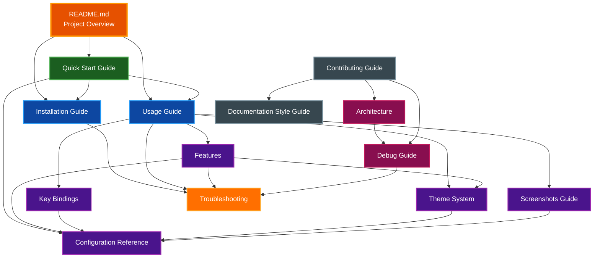

# Documentation Index

Complete documentation for Par Term Emu TUI Rust.

## Getting Started

Start here if you're new to Par Term Emu TUI Rust:

1. **[Quick Start Guide](QUICK_START.md)** - Get up and running in 5 minutes
   - Installation
   - First run
   - Basic configuration
   - Essential commands

2. **[Installation Guide](INSTALLATION.md)** - Detailed installation instructions
   - Prerequisites
   - Installation steps
   - Component installation (terminfo, shell integration, fonts)
   - Verification and troubleshooting

3. **[Usage Guide](USAGE.md)** - Command-line options and workflows
   - Running the TUI
   - Command-line options
   - Theme management
   - Common workflows

## Reference Documentation

Detailed reference for all features and configuration:

1. **[Features](FEATURES.md)** - Complete feature descriptions
   - Core features
   - Terminal emulation
   - Scrollback buffer
   - Mouse support
   - Hyperlinks
   - Notifications
   - Clipboard integration
   - Shell integration
   - Theme system

2. **[Key Bindings](KEY_BINDINGS.md)** - Keyboard shortcuts and mouse actions
   - Keyboard shortcuts
   - Mouse actions
   - Text selection
   - Scrollback navigation
   - Clipboard operations
   - Special keys

3. **[Configuration Reference](CONFIG_REFERENCE.md)** - All configuration options
   - Selection & clipboard
   - Scrollback & cursor
   - Paste enhancement
   - Mouse & focus
   - Security settings
   - Theme & colors
   - Notifications
   - Screenshots
   - Shell behavior

4. **[Theme System](THEMES.md)** - Color themes and customization
   - Using themes
   - Built-in themes (12 themes)
   - Creating custom themes
   - Theme file format
   - Theme application

5. **[Screenshots Guide](SCREENSHOTS.md)** - Screenshot functionality
   - Taking screenshots
   - Screenshot formats (PNG, SVG, HTML, etc.)
   - Directory selection
   - Configuration
   - Automated screenshots
   - Best practices

## Advanced Documentation

For developers and advanced users:

1. **[Architecture](ARCHITECTURE.md)** - System design and implementation
   - System overview
   - Component architecture
   - Terminal widget design
   - Rendering pipeline
   - Event handling
   - State management

2. **[Debug Guide](DEBUG.md)** - Debugging and development
   - Debug mode
   - Logging
   - Troubleshooting development issues
   - Performance profiling

3. **[Troubleshooting](TROUBLESHOOTING.md)** - Common issues and solutions
   - Installation issues
   - Runtime errors
   - Display problems
   - Performance issues
   - Feature-specific issues
   - Platform-specific issues

4. **[Documentation Style Guide](DOCUMENTATION_STYLE_GUIDE.md)** - Standards for documentation
   - Document structure
   - Writing style
   - Diagram standards
   - Color scheme
   - Code examples

## Contributing

For contributors and developers:

1. **[Contributing Guide](../CONTRIBUTING.md)** - Development setup and guidelines
   - Quick start
   - Development setup
   - Code quality standards
   - Development workflow
   - Testing
   - Pull request process

## Documentation Map

## Quick Navigation

### By Task

**I want to...**

- **Get started quickly** → [Quick Start Guide](QUICK_START.md)
- **Install the TUI** → [Installation Guide](INSTALLATION.md)
- **Learn all features** → [Features](FEATURES.md)
- **See keyboard shortcuts** → [Key Bindings](KEY_BINDINGS.md)
- **Configure settings** → [Configuration Reference](CONFIG_REFERENCE.md)
- **Choose or create themes** → [Theme System](THEMES.md)
- **Take screenshots** → [Screenshots Guide](SCREENSHOTS.md)
- **Fix a problem** → [Troubleshooting](TROUBLESHOOTING.md)
- **Understand the design** → [Architecture](ARCHITECTURE.md)
- **Contribute code** → [Contributing Guide](../CONTRIBUTING.md)
- **Write documentation** → [Documentation Style Guide](DOCUMENTATION_STYLE_GUIDE.md)

### By User Type

**New Users:**
1. [Quick Start Guide](QUICK_START.md)
2. [Features](FEATURES.md)
3. [Key Bindings](KEY_BINDINGS.md)

**Power Users:**
1. [Usage Guide](USAGE.md)
2. [Configuration Reference](CONFIG_REFERENCE.md)
3. [Screenshots Guide](SCREENSHOTS.md)

**Developers:**
1. [Contributing Guide](../CONTRIBUTING.md)
2. [Architecture](ARCHITECTURE.md)
3. [Debug Guide](DEBUG.md)

**Technical Writers:**
1. [Documentation Style Guide](DOCUMENTATION_STYLE_GUIDE.md)
2. All documentation files for examples

## Documentation Standards

All documentation follows the [Documentation Style Guide](DOCUMENTATION_STYLE_GUIDE.md):

- ✅ Mermaid diagrams (never ASCII art)
- ✅ Dark backgrounds with white text
- ✅ Table of contents for documents >500 words
- ✅ Language specified in code blocks
- ✅ No line numbers in file references
- ✅ Consistent formatting and structure

## External Resources

- [Textual Documentation](https://textual.textualize.io/)
- [par-term-emu-core-rust](https://github.com/paulrobello/par-term-emu-core-rust)
- [GitHub Repository](https://github.com/paulrobello/par-term-emu-tui-rust)
- [Issue Tracker](https://github.com/paulrobello/par-term-emu-tui-rust/issues)
- [Discussions](https://github.com/paulrobello/par-term-emu-tui-rust/discussions)
