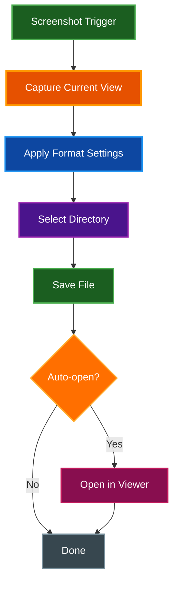
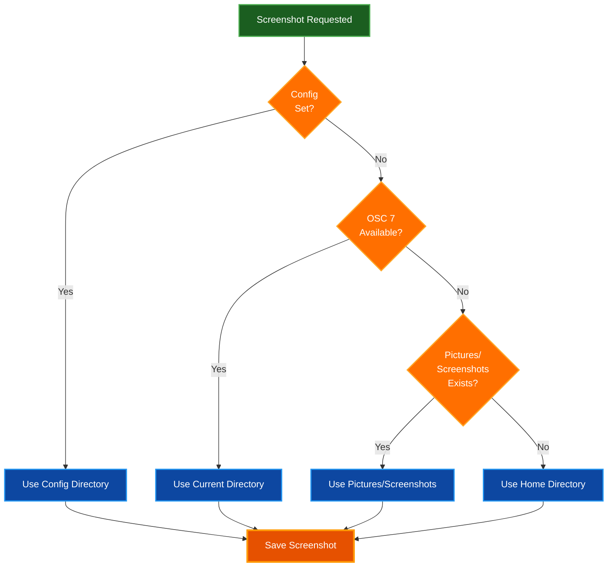

# Screenshot Guide

Complete guide to capturing, configuring, and managing terminal screenshots in Par Term Emu TUI Rust.

## Table of Contents
- [Overview](#overview)
- [Taking Screenshots](#taking-screenshots)
- [Screenshot Formats](#screenshot-formats)
- [Directory Selection](#directory-selection)
- [Configuration](#configuration)
- [Automated Screenshots](#automated-screenshots)
- [Best Practices](#best-practices)
- [Troubleshooting](#troubleshooting)
- [Related Documentation](#related-documentation)

## Overview

Par Term Emu TUI Rust includes built-in screenshot functionality for capturing terminal output in multiple formats.

### Features

- **Multiple formats**: PNG, JPEG, BMP, SVG, HTML
- **Smart directory selection**: Automatic location detection
- **Timestamped filenames**: Organized screenshot management
- **Current view capture**: Captures exactly what's visible
- **Scrollback support**: Screenshot includes current scroll position
- **Auto-open option**: View screenshots immediately after capture

## Taking Screenshots

### Manual Screenshot

**Keyboard shortcut:**
```
Ctrl+Shift+S
```

**Behavior:**
1. Captures current terminal view
2. Saves to configured directory
3. Displays confirmation message
4. Optionally opens in default viewer

### Automated Screenshot

**Command-line option:**
```bash
# Take screenshot after 3 seconds
par-term-emu-tui-rust --screenshot 3

# Screenshot and auto-open
par-term-emu-tui-rust --screenshot 3 --open-screenshot

# Screenshot with specific command
par-term-emu-tui-rust --command "neofetch" --screenshot 2
```

### Screenshot Workflow



## Screenshot Formats

### PNG (Default)

**Best for:** General terminal screenshots, documentation

**Characteristics:**
- Lossless compression
- Excellent text clarity
- Reasonable file size
- Wide compatibility

**Configuration:**
```yaml
screenshot_format: "png"
```

**File size:** ~50-200 KB (typical)

### JPEG

**Best for:** Large screenshots, minimal file size

**Characteristics:**
- Lossy compression
- Smaller file size
- Quality configurable
- Slight text artifacts

**Configuration:**
```yaml
screenshot_format: "jpeg"
```

**File size:** ~20-80 KB (typical)

### BMP

**Best for:** Uncompressed raw capture

**Characteristics:**
- Uncompressed
- Perfect quality
- Large file size
- Limited use cases

**Configuration:**
```yaml
screenshot_format: "bmp"
```

**File size:** ~500 KB - 2 MB (typical)

### SVG

**Best for:** Scalable documentation, presentations

**Characteristics:**
- Vector format
- Infinitely scalable
- Selectable text
- Preserves formatting

**Configuration:**
```yaml
screenshot_format: "svg"
```

**File size:** ~100-300 KB (typical)

**Features:**
- Text remains selectable
- Perfect scaling at any size
- Ideal for web documentation
- Preserves hyperlinks

### HTML

**Best for:** Web sharing, interactive viewing

**Characteristics:**
- Full HTML document
- Inline CSS styles
- Browser-viewable
- Selectable text

**Configuration:**
```yaml
screenshot_format: "html"
```

**File size:** ~50-150 KB (typical)

**Features:**
- View in any web browser
- Copy text from screenshot
- Preserves all formatting
- Includes color styling

### Format Comparison

| Format | Size | Quality | Scalable | Selectable Text | Use Case |
|--------|------|---------|----------|-----------------|----------|
| **PNG** | Medium | Excellent | No | No | General screenshots |
| **JPEG** | Small | Good | No | No | Space-constrained |
| **BMP** | Large | Perfect | No | No | Raw capture |
| **SVG** | Medium | Perfect | Yes | Yes | Documentation |
| **HTML** | Small | Perfect | Yes | Yes | Web sharing |

## Directory Selection

### Smart Directory Selection

Screenshot directory is selected in this priority order:

1. **Configured directory** (if set in config)
2. **Current working directory** (from OSC 7 shell integration)
3. **XDG_PICTURES_DIR/Screenshots** or `~/Pictures/Screenshots`
4. **Home directory** as fallback



### Configure Custom Directory

**Permanent configuration:**
```yaml
screenshot_directory: ~/Documents/Screenshots
```

**Create directory if needed:**
```bash
mkdir -p ~/Documents/Screenshots
```

### Filename Format

Screenshots use timestamped filenames:

```
terminal_screenshot_YYYYMMDD_HHMMSS.<format>
```

**Examples:**
- `terminal_screenshot_20251116_153045.png`
- `terminal_screenshot_20251116_153050.svg`
- `terminal_screenshot_20251116_153055.html`

## Configuration

### Complete Screenshot Settings

```yaml
# ============================================================================
# Screenshot
# ============================================================================

# Directory to save screenshots
# When not set (null), uses smart directory selection:
# 1. Shell's current working directory (from OSC 7)
# 2. XDG_PICTURES_DIR/Screenshots
# 3. ~/Pictures/Screenshots
# 4. Home directory
# Default: null
screenshot_directory: null

# File format for screenshots
# Supported formats:
#   - png: Lossless, best for text (default)
#   - jpeg: Smaller file size, lossy compression
#   - bmp: Uncompressed, large file size
#   - svg: Vector format, infinitely scalable with selectable text
#   - html: Full HTML document with inline styles, viewable in browsers
# Default: "png"
screenshot_format: "png"

# Automatically open screenshot after capture
# When enabled, opens the screenshot file with the system's default viewer
# (macOS: open, Linux: xdg-open, Windows: start) immediately after capturing.
# Default: false
open_screenshot_after_capture: false
```

## Automated Screenshots

### CI/CD Integration

**Test suite screenshots:**
```bash
#!/bin/bash
# capture-test-screenshots.sh

# Array of test scenarios
declare -a scenarios=(
    "ls -la"
    "cat example.txt"
    "tree -L 2"
)

# Capture each scenario
for i in "${!scenarios[@]}"; do
    par-term-emu-tui-rust \
        --command "${scenarios[$i]}" \
        --screenshot 2 \
        --auto-quit 4

    # Rename screenshot with descriptive name
    latest=$(ls -t terminal_screenshot_*.png | head -1)
    mv "$latest" "test_scenario_${i}.png"
done
```

### Theme Comparison

**Capture all themes:**
```bash
#!/bin/bash
# capture-all-themes.sh

themes=("dark-background" "solarized-dark" "high-contrast" "pastel-dark")

for theme in "${themes[@]}"; do
    par-term-emu-tui-rust \
        --theme "$theme" \
        --command "echo 'Theme: $theme'" \
        --screenshot 2 \
        --auto-quit 4

    # Wait for screenshot
    sleep 1

    # Rename with theme name
    latest=$(ls -t terminal_screenshot_*.png | head -1)
    mv "$latest" "theme_${theme}.png"
done
```

### Documentation Generation

**Generate documentation screenshots:**
```bash
#!/bin/bash
# docs-screenshots.sh

# Configure for documentation
cat > /tmp/screenshot-config.yaml <<EOF
screenshot_format: "svg"
screenshot_directory: ./docs/images
theme: "solarized-light"
EOF

# Capture features
features=(
    "Selection Demo:echo 'Select this text'"
    "Color Demo:curl -s https://misc.flogisoft.com/bash/colors.txt | bash"
    "Scrollback Demo:seq 1 100"
)

for feature in "${features[@]}"; do
    name="${feature%%:*}"
    cmd="${feature#*:}"

    par-term-emu-tui-rust \
        --config /tmp/screenshot-config.yaml \
        --command "$cmd" \
        --screenshot 3 \
        --auto-quit 5
done
```

## Best Practices

### Screenshot Quality

**For documentation:**
```yaml
screenshot_format: "svg"        # Scalable, selectable text
theme: "solarized-light"        # High contrast, readable
```

**For social media:**
```yaml
screenshot_format: "png"        # Wide compatibility
theme: "solarized-dark"         # Visually appealing
```

**For archival:**
```yaml
screenshot_format: "bmp"        # No compression loss
```

### Font Considerations

**Install Hack font for consistent rendering:**
```bash
par-term-emu-tui-rust install font
```

**Benefits:**
- Consistent character width
- Clear distinction between similar characters
- Extended Unicode support
- Professional appearance

### Terminal Size

**Optimal sizes for different uses:**

| Use Case | Columns | Rows | Aspect Ratio |
|----------|---------|------|--------------|
| **Documentation** | 80 | 24 | Classic |
| **Wide code** | 120 | 30 | Wide |
| **Compact** | 80 | 20 | Square |
| **Demo** | 100 | 30 | Balanced |

**Set size before screenshot:**
```bash
# Resize terminal window before running
# Most terminals: Cmd/Ctrl + [0/-/+]
```

## Troubleshooting

### Screenshot Not Saving

**Check permissions:**
```bash
# Verify write access
touch ~/Pictures/Screenshots/test.txt
rm ~/Pictures/Screenshots/test.txt
```

**Create directory:**
```bash
mkdir -p ~/Pictures/Screenshots
```

**Check disk space:**
```bash
df -h ~
```

### Font Rendering Issues

**Install Hack font:**
```bash
par-term-emu-tui-rust install font

# Rebuild font cache (Linux)
fc-cache -f -v
```

**Verify font installation:**
```bash
fc-list | grep Hack
```

### Format-Specific Issues

**SVG not opening:**
```bash
# Specify SVG viewer
open -a Safari screenshot.svg      # macOS
xdg-open screenshot.svg            # Linux
```

**HTML not displaying colors:**
- Open in modern browser (Chrome, Firefox, Safari)
- Check browser CSS support

### Auto-Open Not Working

**macOS:**
```bash
# Verify default app
open screenshot.png
```

**Linux:**
```bash
# Verify xdg-open
xdg-open screenshot.png

# Or specify viewer
eog screenshot.png    # GNOME
gwenview screenshot.png  # KDE
```

**Windows:**
```powershell
# Verify default association
start screenshot.png
```

## Related Documentation

- [Quick Start Guide](QUICK_START.md) - Get started quickly
- [Features](FEATURES.md) - Complete feature list
- [Usage Guide](USAGE.md) - Command-line options
- [Configuration Reference](CONFIG_REFERENCE.md) - All settings
- [Installation Guide](INSTALLATION.md) - Font installation
