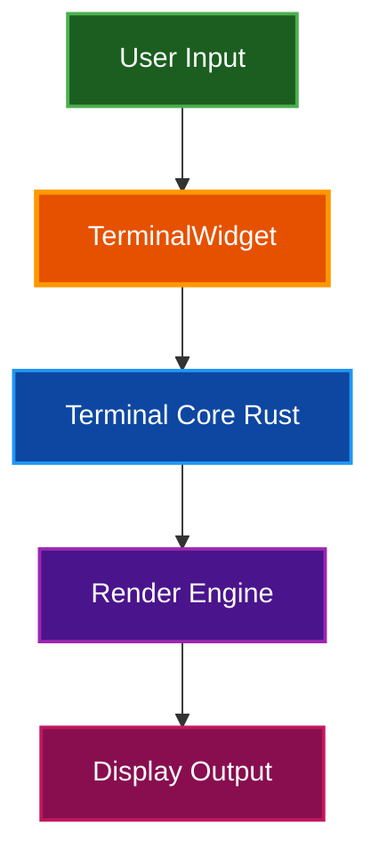
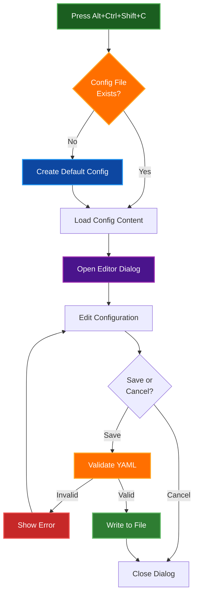

# Features

Comprehensive overview of Par Term Emu TUI Rust features and capabilities.

## Table of Contents
- [Overview](#overview)
- [Core Features](#core-features)
- [Configuration Editor](#configuration-editor)
- [Terminal Emulation](#terminal-emulation)
- [Scrollback Buffer](#scrollback-buffer)
- [Mouse Support](#mouse-support)
- [Hyperlinks](#hyperlinks)
- [Notifications](#notifications)
- [Clipboard Integration](#clipboard-integration)
- [Visual Bell](#visual-bell)
- [Cursor Customization](#cursor-customization)
- [Shell Integration](#shell-integration)
- [Theme System](#theme-system)
- [Related Documentation](#related-documentation)

## Overview

Par Term Emu TUI Rust is a modern terminal emulator TUI built with Textual and par-term-emu-core-rust. It combines efficient rendering with comprehensive terminal emulation features.

### Technology Stack

| Component | Technology | Purpose |
|-----------|-----------|---------|
| **UI Framework** | Textual | Text-based user interface |
| **Terminal Core** | par-term-emu-core-rust | Terminal emulation engine (Rust) |
| **Language** | Python 3.12+ | Application logic and glue code |
| **Configuration** | PyYAML | YAML-based configuration |
| **Clipboard** | pyperclip | Cross-platform clipboard support |
| **Paths** | xdg-base-dirs | XDG Base Directory compliance |

## Core Features

### Custom Terminal Widget

A Textual widget that wraps `par_term_emu.Terminal`:

- **Efficient Rendering**: Uses Textual's Line API for optimal performance
- **Partial Updates**: Only re-renders changed lines
- **Dynamic Sizing**: Adapts to terminal window resize
- **Color Accuracy**: Full 24-bit RGB color support
- **Text Attributes**: Bold, italic, underline, strikethrough, dim



### Responsive Design

- **Automatic Resize**: Terminal dimensions update on window resize
- **Layout Management**: CSS-based component positioning
- **Auto-focus**: Terminal widget receives focus on startup
- **Status Bar**: Optional status bar with directory tracking

## Configuration Editor

### Interactive Config Editor

A built-in modal dialog for editing configuration files directly within the TUI:

**Key Features:**
- **Syntax Highlighting**: YAML syntax highlighting with Monokai theme
- **Live Validation**: Real-time YAML syntax checking before saving
- **Auto-Creation**: Automatically creates config file with defaults if it doesn't exist
- **Smart Editor**: TextArea-based editor with line numbers and tab indentation
- **Error Handling**: Clear error messages for invalid YAML syntax

**Access:**
- Press **Alt+Ctrl+Shift+C** while TUI is running
- Opens `~/.config/par-term-emu-tui-rust/config.yaml`

**Keyboard Shortcuts:**
- `Ctrl+S` - Save changes and close dialog
- `Escape` - Cancel and discard changes
- Standard text editing (arrow keys, home/end, etc.)

**Use Cases:**
- Quick configuration adjustments without leaving TUI
- First-time setup with auto-generated defaults
- Testing configuration changes on the fly
- Safe editing with syntax validation



**Implementation:**
- Located in `src/par_term_emu_tui_rust/dialogs/config_edit_dialog.py`
- Uses Textual's ModalScreen and TextArea widgets
- Integrates with TuiConfig for default value generation
- Flash messages for user feedback on save/error

## Terminal Emulation

### ANSI Support

**Color capabilities:**
- 16-color ANSI palette
- 256-color extended palette
- 24-bit true color (RGB)
- Custom color themes

**Text formatting:**
- **Bold** text rendering
- *Italic* text rendering
- Underline text rendering
- ~~Strikethrough~~ text rendering
- Dim text rendering
- Reverse video

### Control Sequences

**Supported sequences:**
- **CSI** - Control Sequence Introducer
- **OSC** - Operating System Commands
- **DCS** - Device Control String
- **DECSCUSR** - Cursor style control
- **SGR** - Select Graphic Rendition
- **CUP** - Cursor positioning

**Cursor control:**
- Position (absolute and relative)
- Save and restore position
- Style (block, underline, bar)
- Blink control
- Visibility toggle

## Scrollback Buffer

Navigate through terminal history to view previous output.

### Scrollback Features

**Keyboard navigation:**
- `Shift+PageUp` - Scroll up one page
- `Shift+PageDown` - Scroll down one page
- `Shift+Home` - Jump to top of history
- `Shift+End` - Jump to bottom (live output)

**Mouse navigation:**
- Mouse wheel scrolling (when mouse tracking disabled)
- Smooth scrolling through history
- Position maintained during new output

**Automatic behavior:**
- At bottom: New content auto-scrolls into view
- Scrolled up: Position maintained as new output arrives
- Preserves all formatting (colors, attributes, wide characters)

### Configuration

```yaml
# Scrollback settings
scrollback_lines: 10000          # Maximum history lines (0 = unlimited)
max_scrollback_lines: 100000     # Safety limit for unlimited mode
mouse_wheel_scroll_lines: 3      # Lines per wheel tick
```

## Mouse Support

### Text Selection

**Selection modes:**

| Action | Selection Type | Description |
|--------|---------------|-------------|
| **Shift + Click & Drag** | Rectangular | Select arbitrary text region |
| **Double-Click** | Word | Select word at cursor |
| **Triple-Click** | Line | Select entire line |

**Selection behavior:**
- **Auto-copy**: Selection automatically copied to clipboard
- **Keep selection**: Highlighting persists after copy (configurable)
- **Word boundaries**: Configurable word characters
- **Wrapped lines**: Triple-click follows line wrapping (configurable)

### Mouse Actions

**Click actions:**
- **Left click**: Position cursor, start selection
- **Middle click**: Paste clipboard content
- **Right click**: Context menu (future enhancement)

**Mouse tracking:**
- Applications can enable mouse tracking (vim, tmux, etc.)
- Events forwarded to application when tracking enabled
- Falls back to selection mode when tracking disabled

### Configuration

```yaml
# Mouse settings
middle_click_paste: true                      # Paste on middle click
focus_follows_mouse: false                    # Auto-focus on hover
word_characters: "/-+\\~_."                   # Word boundary characters
triple_click_selects_wrapped_lines: true      # Follow wrapping
```

## Hyperlinks

Click URLs to open in your default browser.

### Hyperlink Types

**OSC 8 hyperlinks:**
```bash
# Embedded hyperlink with text
echo -e '\e]8;;https://example.com\e\\Click me!\e]8;;\e\\'
```

**Plain text URLs:**
- Automatically detected patterns
- Supported schemes: `http://`, `https://`, `ftp://`, `file://`, etc.
- Smart URL parsing

### Configuration

```yaml
# Hyperlink settings
clickable_urls: true                    # Enable URL clicking
link_color: [100, 150, 255]            # RGB color for links
url_modifier: "none"                    # Modifier key: none, ctrl, shift, alt
```

**Modifier options:**
- `none` - Click URLs directly
- `ctrl` - Require Ctrl+Click
- `shift` - Require Shift+Click
- `alt` - Require Alt+Click

## Notifications

Terminal applications can display desktop-style notifications.

### Notification Types

**OSC 9 - Simple notifications:**
```bash
# Basic notification
echo -e '\x1b]9;Build completed!\x1b\\'
```

**OSC 777 - Titled notifications:**
```bash
# Notification with title
echo -e '\x1b]777;notify;Build Status;Compilation successful\x1b\\'
```

### Display Behavior

- Toast messages appear in top-right corner
- Auto-dismiss after timeout
- Non-intrusive overlay
- Stack multiple notifications

### Configuration

```yaml
# Notification settings
show_notifications: true        # Enable/disable notifications
notification_timeout: 5         # Display duration in seconds
```

## Clipboard Integration

Cross-platform clipboard support for seamless copy/paste.

### Clipboard Features

**Copy methods:**
- Auto-copy on selection release
- Ctrl+Shift+C manual copy
- Double-click word copy
- Triple-click line copy

**Paste methods:**
- Middle-click paste (Linux: PRIMARY selection)
- Ctrl+Shift+V keyboard paste
- Paste confirmation for large content

### OSC 52 Support

Applications can access clipboard:

```yaml
# Clipboard settings
expose_system_clipboard: true   # Allow OSC 52 clipboard read
```

> **🔒 Security:** Disable `expose_system_clipboard` to prevent applications from reading clipboard

### Configuration

```yaml
# Clipboard settings
auto_copy_selection: true              # Auto-copy on selection
keep_selection_after_copy: true        # Keep highlighting after copy
expose_system_clipboard: true          # Allow OSC 52 access
copy_trailing_newline: false           # Include newline in line copy
paste_chunk_size: 0                    # Chunk size for large pastes (0 = disabled)
paste_chunk_delay_ms: 10               # Delay between chunks
paste_warn_size: 100000                # Warn before pasting large content
```

## Visual Bell

The terminal supports visual bell notifications that display a bell icon in the header when applications send a bell character (BEL/\x07).

### Bell Behavior

**Bell Trigger:**
- Terminal applications send BEL character (`\x07`)
- Examples: `echo -e "\a"`, `printf "\007"`, system alerts
- Common in shells for completion alerts, errors, or notifications

**Visual Indicator:**
- Bell icon (🔔) appears in the header
- Persists until user interaction (any key press or mouse click)
- Non-intrusive visual feedback
- No audio component (visual only)

**User Interaction:**
- Bell clears on next keyboard input
- Bell clears on any mouse click
- Allows user to acknowledge notification naturally

### Configuration

```yaml
# Visual bell settings
visual_bell_enabled: true   # Enable visual bell indicator (default: true)
```

### Use Cases

**Development:**
- Build completion notifications
- Test failure alerts
- Long-running process completion

**System Administration:**
- Command execution alerts
- Log monitoring notifications
- Background task completion

**Shell Integration:**
- Prompt customization
- Error highlighting
- Interactive tool notifications

> **💡 Tip:** The visual bell provides non-disruptive notification without audio alerts, making it ideal for quiet work environments or when audio is disabled.

## Cursor Customization

### Cursor Styles

**Blinking cursors:**
- `BlinkingBlock` - Solid blinking block
- `BlinkingUnderline` - Blinking underline
- `BlinkingBar` - Vertical blinking bar

**Steady cursors:**
- `SteadyBlock` - Always-visible block
- `SteadyUnderline` - Always-visible underline
- `SteadyBar` - Always-visible vertical bar

### Configuration

```yaml
# Cursor settings
cursor_style: "blinking_block"    # Default cursor appearance
cursor_blink_enabled: false       # Enable cursor blinking
cursor_blink_rate: 0.5           # Blink interval in seconds
```

> **📝 Note:** Applications can change cursor style via DECSCUSR sequences. The TUI respects application-set styles.

## Shell Integration

Enhanced features through shell integration scripts.

### Features Provided

**Current working directory:**
- Tracked via OSC 7 sequences
- Displayed in status bar
- Used for screenshot directory selection

**Prompt navigation:**
- Mark prompt locations
- Jump between prompts
- Navigate command history

**Command status:**
- Track command success/failure
- Display exit codes
- Highlight errors

### Installation

```bash
# Install for current shell
par-term-emu-tui-rust install shell-integration

# Install for specific shell (bash, zsh, or fish)
par-term-emu-tui-rust install shell-integration zsh

# Install for all shells
par-term-emu-tui-rust install shell-integration --all
```

**Supported shells:**
- Bash
- Zsh
- Fish

## Theme System

### Built-in Themes

| Theme | Description | Best For |
|-------|-------------|----------|
| `dark-background` | Classic dark terminal | General use (default) |
| `high-contrast` | High contrast colors | Accessibility |
| `iterm2-dark` | iTerm2 Dark theme | Terminal emulation |
| `light-background` | Classic light terminal | Bright environments |
| `pastel-dark` | Soft pastel on dark | Reduced eye strain |
| `regular` | Regular theme | Balanced colors |
| `smoooooth` | Smooth dark theme | Easy on eyes |
| `solarized` | Solarized theme | Consistent scheme |
| `solarized-dark` | Solarized Dark | Consistent color scheme |
| `solarized-light` | Solarized Light | Bright, balanced |
| `tango-dark` | Tango Dark | GNOME-style |
| `tango-light` | Tango Light | GNOME-style light |

### Theme Components

Each theme defines:
- 16 ANSI palette colors
- Background and foreground colors
- Cursor and cursor text colors
- Selection background and text colors
- Hyperlink color
- Bold text color
- Cursor guide color
- Underline color
- Badge color
- Match/search highlight color

### Theme Management

**List themes:**
```bash
par-term-emu-tui-rust --list-themes
```

**Apply theme:**
```bash
# Temporary (session only)
par-term-emu-tui-rust --theme solarized-dark

# Permanent (save to config)
par-term-emu-tui-rust --apply-theme solarized-dark
```

**Custom themes:**
```bash
# Export current theme
par-term-emu-tui-rust --export-theme my-theme

# Edit my-theme.yaml to customize

# Apply custom theme
par-term-emu-tui-rust --apply-theme-from my-theme.yaml
```

## Related Documentation

- [Quick Start Guide](QUICK_START.md) - Get started quickly
- [Installation Guide](INSTALLATION.md) - Install and setup
- [Usage Guide](USAGE.md) - Command-line options and usage
- [Key Bindings](KEY_BINDINGS.md) - Keyboard and mouse reference
- [Configuration Reference](CONFIG_REFERENCE.md) - All settings
- [Screenshots Guide](SCREENSHOTS.md) - Screenshot functionality
