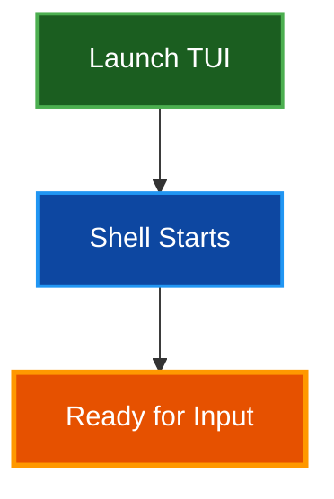

# Quick Start Guide

Get started with Par Term Emu TUI Rust in under 5 minutes. This guide covers installation, basic configuration, and running your first terminal session.

## Table of Contents
- [Prerequisites](#prerequisites)
- [Installation](#installation)
- [First Run](#first-run)
- [Basic Configuration](#basic-configuration)
- [Essential Commands](#essential-commands)
- [Common Tasks](#common-tasks)
- [Next Steps](#next-steps)
- [Troubleshooting](#troubleshooting)
- [Related Documentation](#related-documentation)

## Prerequisites

Before installing Par Term Emu TUI Rust, ensure you have:

- **Python 3.12 or higher** - Check with `python --version`
- **uv package manager** - Install from [astral.sh/uv](https://astral.sh/uv)
- **Terminal with true color support** - Most modern terminals (iTerm2, Alacritty, Wezterm, etc.)

## Installation

### Quick Install

Install the TUI and all dependencies in one command:

```bash
# Clone the repository
git clone https://github.com/paulrobello/par-term-emu-tui-rust.git
cd par-term-emu-tui-rust

# Install dependencies
uv sync

# Or use make
make install
```

### Post-Installation Setup

Install recommended components for enhanced functionality:

```bash
# Install all components (recommended)
par-term-emu-tui-rust install all
```

This installs:
- **Terminfo definition** - Optimal terminal compatibility
- **Shell integration** - Enhanced features (working directory tracking, prompt navigation)
- **Hack font** - For screenshot support

> **📝 Note:** You can also install components individually. See [Installation Guide](INSTALLATION.md) for details.

## First Run

Launch the TUI in your default shell:

```bash
# Using make (recommended)
make run

# Using installed script
uv run par-term-emu-tui-rust

# As Python module
uv run python -m par_term_emu_tui_rust
```

You should see a terminal interface with:
- Welcome message and examples
- ANSI color demonstrations
- Interactive shell prompt



## Basic Configuration

### Create Default Configuration

Generate a configuration file with recommended settings:

```bash
# Create config file in XDG directory
par-term-emu-tui-rust --init-config
```

Configuration location: `~/.config/par-term-emu-tui-rust/config.yaml`

### Essential Settings

**Option 1: Use the built-in config editor (recommended):**

While the TUI is running, press **Alt+Ctrl+Shift+C** to open the interactive config editor. This provides:
- Syntax highlighting for YAML
- Live validation of config syntax
- Auto-creation of config file if it doesn't exist
- Easy keyboard shortcuts (Ctrl+S to save, Escape to cancel)

**Option 2: Edit manually:**

Edit your config file directly with these recommended settings:

```yaml
# Clipboard & Selection
auto_copy_selection: true
keep_selection_after_copy: true

# Scrollback
scrollback_lines: 10000

# Theme
theme: "dark-background"

# Notifications
show_notifications: true
notification_timeout: 5

# Screenshots
screenshot_format: "png"
screenshot_directory: null  # Auto-detect best location
```

> **✅ Tip:** Use `--dump-config` to view current settings without editing.

## Essential Commands

### Key Bindings

| Keys | Action |
|------|--------|
| **Ctrl+Shift+Q** | Quit application |
| **Ctrl+Shift+S** | Take screenshot |
| **Ctrl+Shift+C** | Copy selection |
| **Alt+Ctrl+Shift+C** | Edit config |
| **Ctrl+Shift+PageUp/Down** | Scroll history |
| **Shift+Home/End** | Jump to top/bottom |

### Mouse Actions

| Action | Result |
|--------|--------|
| **Shift + Click & Drag** | Select text |
| **Double-Click** | Select word |
| **Triple-Click** | Select line |
| **Click URL** | Open in browser |
| **Mouse Wheel** | Scroll history (when mouse tracking off) |
| **Middle Click** | Paste clipboard |

## Common Tasks

### Change Theme

**Temporary (session only):**
```bash
# Use theme for this session
par-term-emu-tui-rust --theme solarized-dark
```

**Permanent:**
```bash
# Apply theme to config file
par-term-emu-tui-rust --apply-theme solarized-dark
```

**List available themes:**
```bash
par-term-emu-tui-rust --list-themes
```

Available themes: `dark-background`, `high-contrast`, `iterm2-dark`, `light-background`, `pastel-dark`, `regular`, `smoooooth`, `solarized`, `solarized-dark`, `solarized-light`, `tango-dark`, `tango-light`

### Take Screenshots

**Manual screenshot:**
- Press **Ctrl+Shift+S** during session
- Files saved to configured directory or current working directory
- Timestamped filename: `terminal_screenshot_20251116_153045.png`

**Automated screenshot:**
```bash
# Screenshot after 3 seconds, quit after 5
par-term-emu-tui-rust --screenshot 3 --auto-quit 5
```

**Change format:**
```yaml
# In config.yaml
screenshot_format: "svg"  # Options: png, jpeg, bmp, svg, html
```

### Custom Shell

Run with a specific shell:

```bash
# Use zsh
par-term-emu-tui-rust --shell /bin/zsh

# Use fish
par-term-emu-tui-rust --shell /usr/bin/fish

# Run specific command
par-term-emu-tui-rust --command "neofetch"
```

### Enable Debug Logging

```bash
# Enable debug logging to timestamped file
par-term-emu-tui-rust --debug

# Logs location: debug_logs/terminal_debug_YYYYMMDD_HHMMSS.log
```

## Next Steps

### Learn More Features

Explore advanced features:
- **Scrollback buffer** - Navigate terminal history efficiently
- **Hyperlink support** - Click URLs (OSC 8 and plain text)
- **Notifications** - Terminal application notifications (OSC 9/777)
- **Cursor styles** - Blinking and steady cursor modes
- **Mouse support** - Full mouse tracking for applications

See [README.md](../README.md) for comprehensive feature documentation.

### Customize Your Setup

**Create custom theme:**
```bash
# Export current theme
par-term-emu-tui-rust --export-theme my-theme

# Edit my-theme.yaml to customize colors
# Apply your theme
par-term-emu-tui-rust --apply-theme-from my-theme.yaml
```

**Configure shell integration:**
```bash
# Install for your shell
par-term-emu-tui-rust install shell-integration

# Restart shell to activate
exec $SHELL
```

Shell integration provides:
- Current directory in status bar
- Prompt navigation
- Command status tracking

### Extend the TUI

For developers:
- Review [ARCHITECTURE.md](ARCHITECTURE.md) for system design
- See [Contributing](../CONTRIBUTING.md) for development setup
- Explore [ARCHITECTURE.md](ARCHITECTURE.md) for technical implementation details

## Troubleshooting

### TUI Won't Start

**Check Python version:**
```bash
python --version
# Should be 3.12 or higher
```

**Reinstall dependencies:**
```bash
uv sync
```

### Colors Not Displaying

**Verify terminal support:**
```bash
# Check TERM variable
echo $TERM

# Test true color
printf "\x1b[38;2;255;100;0mTRUECOLOR\x1b[0m\n"
```

**Set TERM variable:**
```bash
export TERM=xterm-256color
```

### Shell Integration Not Working

**Verify installation:**
```bash
# Check installation files exist
ls ~/.config/par-term-emu-tui-rust/shell-integration/
```

**Re-install shell integration:**
```bash
par-term-emu-tui-rust install shell-integration --all
exec $SHELL
```

### Screenshots Failing

**Install Hack font:**
```bash
par-term-emu-tui-rust install font
```

**Check screenshot directory permissions:**
```bash
# Verify write access to screenshot directory
touch ~/Pictures/Screenshots/test.txt
rm ~/Pictures/Screenshots/test.txt
```

### Performance Issues

**Reduce scrollback buffer:**
```yaml
# In config.yaml
scrollback_lines: 1000  # Reduce from 10000
```

**Disable cursor blinking:**
```yaml
# In config.yaml
cursor_blink_enabled: false
```

## Related Documentation

- [README](../README.md) - Complete feature documentation
- [Configuration Reference](CONFIG_REFERENCE.md) - All configuration options
- [Architecture](ARCHITECTURE.md) - System design and implementation
- [Features](FEATURES.md) - Comprehensive feature descriptions
- [Debug Guide](DEBUG.md) - Debugging and development
- [Documentation Style Guide](DOCUMENTATION_STYLE_GUIDE.md) - Contributing to docs

## Summary

You're now ready to use Par Term Emu TUI Rust! This quick start covered:

1. **Installation** - Set up the TUI and dependencies
2. **Configuration** - Created and customized config file
3. **Essential commands** - Key bindings and mouse actions
4. **Common tasks** - Themes, screenshots, and shell customization

For advanced features and detailed documentation, see the [README](../README.md).

> **✅ Tip:** Join the discussion at [GitHub Discussions](https://github.com/paulrobello/par-term-emu-tui-rust/discussions) to ask questions and share tips!
