# Class Diagram - pob-api-extended

This document contains Mermaid class diagrams for all classes in the pob-api-extended project, including their attributes, properties, and methods.

## Main API Classes

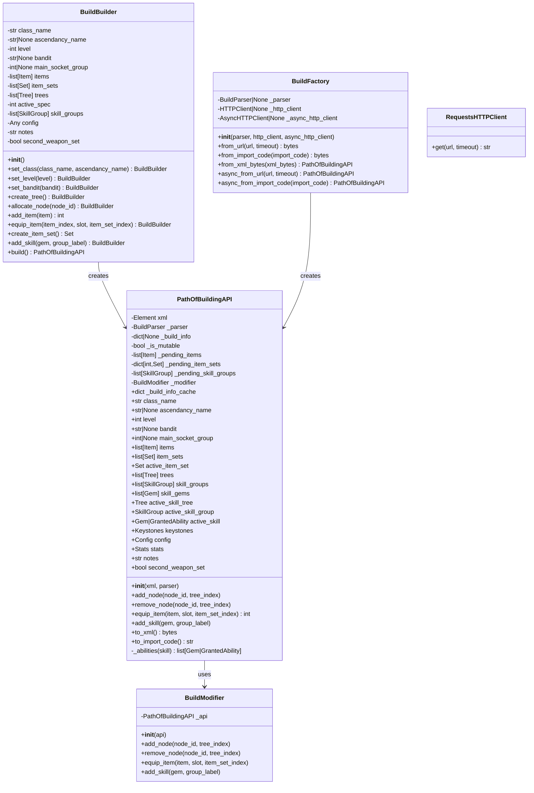

## Data Models

```mermaid
classDiagram
    class Ability {
        <<abstract>>
        +str name
        +bool enabled
        +int level
    }

    class Gem {
        +str name
        +bool enabled
        +int level
        +int quality
        +bool support
        +__post_init__()
    }

    class GrantedAbility {
        +str name
        +bool enabled
        +int level
        +int|None quality
        +bool support
    }

    class SkillGroup {
        +bool enabled
        +str label
        +int|None active
        +list[Gem|GrantedAbility] abilities
    }

    class Tree {
        +str url
        +list[int] nodes
        +dict[int,int] sockets
    }

    class Item {
        +str rarity
        +str name
        +str base
        +str uid
        +bool shaper
        +bool elder
        +bool crafted
        +int|None quality
        +GroupOfSocketGroups|None sockets
        +int level_req
        +int item_level
        +int|None implicit
        +str text
        +__post_init__()
        +__str__() str
    }

    class Set {
        +int|None weapon1
        +int|None weapon1_as1
        +int|None weapon1_as2
        +int|None weapon1_swap
        +int|None weapon1_swap_as1
        +int|None weapon1_swap_as2
        +int|None weapon2
        +int|None weapon2_as1
        +int|None weapon2_as2
        +int|None weapon2_swap
        +int|None weapon2_swap_as1
        +int|None weapon2_swap_as2
        +int|None helmet
        +int|None helmet_as1
        +int|None helmet_as2
        +int|None body_armour
        +int|None body_armour_as1
        +int|None body_armour_as2
        +int|None gloves
        +int|None gloves_as1
        +int|None gloves_as2
        +int|None boots
        +int|None boots_as1
        +int|None boots_as2
        +int|None amulet
        +int|None ring1
        +int|None ring2
        +int|None belt
        +int|None belt_as1
        +int|None belt_as2
        +int|None flask1
        +int|None flask2
        +int|None flask3
        +int|None flask4
        +int|None flask5
    }

    class Keystones {
        +bool acrobatics
        +bool ancestral_bond
        +bool arrow_dancing
        +bool avatar_of_fire
        +bool blood_magic
        +bool chaos_inoculation
        +bool conduit
        +bool crimson_dance
        +bool eldritch_battery
        +bool elemental_equilibrium
        +bool ghost_reaver
        +bool iron_grip
        +bool iron_reflexes
        +bool mind_over_matter
        +bool minion_instability
        +bool mortal_conviction
        +bool necromantic_aegis
        +bool pain_attunement
        +bool perfect_agony
        +bool phase_acrobatics
        +bool point_blank
        +bool resolute_technique
        +bool runebinder
        +bool unwavering_stance
        +bool vaal_pact
        +bool wicked_ward
        +bool zealots_oath
        +__iter__()
    }

    class Config {
        +int resistance_penalty
        +str|None ignite_mode
        +int|None detonate_dead_corpse_life
        +int|None enemy_level
        +float|None enemy_physical_hit_damage
        +int|None enemy_physical_damage_reduction
        +int|None enemy_fire_resist
        +int|None enemy_cold_resist
        +int|None enemy_lightning_resist
        +int|None enemy_chaos_resist
        +bool|str enemy_boss
        +bool enemy_rare_or_unique
        +bool enemy_in_close_range
        +bool enemy_moving
        +bool enemy_on_full_life
        +bool enemy_on_low_life
        +bool enemy_cursed
        +bool enemy_bleeding
        +bool enemy_poisoned
        +int|None enemy_number_of_poison_stacks
        +bool enemy_maimed
        +bool enemy_hindered
        +bool enemy_blinded
        +bool enemy_taunted
        +bool enemy_burning
        +bool enemy_ignited
        +bool enemy_chilled
        +bool enemy_frozen
        +bool enemy_shocked
        +int|None enemy_number_of_freeze_shock_ignite
        +bool enemy_intimidated
        +bool enemy_unnerved
        +bool enemy_covered_in_ash
        +bool enemy_hit_by_fire_damage
        +bool enemy_hit_by_cold_damage
        +bool enemy_hit_by_lightning_damage
        +bool is_stationary
        +bool is_moving
        +bool on_full_life
        +bool on_low_life
        +bool on_full_energy_shield
        +bool has_energy_shield
        +bool minions_on_full_life
        +int|None number_of_nearby_allies
        +int|None number_of_nearby_enemies
        +int|None number_of_nearby_corpses
        +bool only_one_nearby_enemy
        +bool on_consecrated_ground
        +bool on_burning_ground
        +bool on_chilled_ground
        +bool on_shocked_ground
        +bool burning
        +bool ignited
        +bool chilled
        +bool frozen
        +bool shocked
        +bool bleeding
        +bool poisoned
        +int|None number_of_poison_stacks
        +bool lucky_crits
        +int|None number_of_times_skill_has_chained
        +int|None projectile_distance
        +bool use_power_charges
        +int|None max_power_charges
        +bool use_frenzy_charges
        +int|None max_frenzy_charges
        +bool use_endurance_charges
        +int|None max_endurance_charges
        +bool use_siphoning_charges
        +int|None max_siphoning_charges
        +bool use_challenger_charges
        +int|None max_challenger_charges
        +bool use_blitz_charges
        +int|None max_blitz_charges
        +bool use_inspiration_charges
        +int|None max_inspiration_charges
        +bool focus
        +bool onslaught
        +bool unholy_might
        +bool phasing
        +bool fortify
        +bool tailwind
        +bool adrenaline
        +bool divinity
        +bool rage
        +bool leeching
        +bool leeching_life
        +bool leeching_energy_shield
        +bool leeching_mana
        +bool using_flask
        +bool has_totem
        +bool hit_recently
        +bool crit_recently
        +bool skill_crit_recently
        +bool non_crit_recently
        +bool killed_recently
        +int|None number_of_enemies_killed_recently
        +bool totems_killed_recently
        +int|None number_of_totems_killed_recently
        +bool minions_killed_recently
        +int|None number_of_minions_killed_recently
        +bool killed_affected_by_dot
        +int|None number_of_shocked_enemies_killed_recently
        +bool frozen_enemy_recently
        +bool shattered_enemy_recently
        +bool ignited_enemy_recently
        +bool shocked_enemy_recently
        +int|None number_of_poisons_applied_recently
        +bool been_hit_recently
        +bool been_crit_recently
        +bool been_savage_hit_recently
        +bool hit_by_fire_damage_recently
        +bool hit_by_cold_damage_recently
        +bool hit_by_lightning_damage_recently
        +bool blocked_recently
        +bool blocked_attack_recently
        +bool blocked_spell_recently
        +bool energy_shield_recharge_started_recently
        +str|bool pendulum_of_destruction
        +str|bool elemental_conflux
        +bool bastion_of_hope
        +bool her_embrace
        +bool used_skill_recently
        +bool attacked_recently
        +bool cast_spell_recently
        +bool used_fire_skill_recently
        +bool used_cold_skill_recently
        +bool used_minion_skill_recently
        +bool used_movement_skill_recently
        +bool used_vaal_skill_recently
        +bool used_warcry_recently
        +bool used_warcry_in_past_8_seconds
        +int|None number_of_mines_detonated_recently
        +int|None number_of_traps_triggered_recently
        +bool consumed_corpses_recently
        +int|None number_of_corpses_consumed_recently
        +bool taunted_enemy_recently
        +bool blocked_hit_from_unique_enemy_in_past_ten_seconds
        +InitVar[int] character_level
        +__post_init__(character_level)
    }

    class Stats {
        +float|None average_hit
        +float|None average_damage
        +float|None cast_speed
        +float|None attack_speed
        +float|None trap_throwing_speed
        +float|None trap_cooldown
        +float|None mine_laying_speed
        +float|None totem_placement_speed
        +float|None pre_effective_crit_chance
        +float|None crit_chance
        +float|None crit_multiplier
        +int|None hit_chance
        +float|None total_dps
        +float|None total_dot
        +float|None bleed_dps
        +float|None ignite_dps
        +float|None ignite_damage
        +float|None total_dps_with_ignite
        +float|None average_damage_with_ignite
        +float|None poison_dps
        +float|None poison_damage
        +float|None total_dps_with_poison
        +float|None average_damage_with_poison
        +float|None decay_dps
        +float|None skill_cooldown
        +float|None area_of_effect_radius
        +float|None mana_cost
        +float|None mana_cost_per_second
        +float|None strength
        +float|None strength_required
        +float|None dexterity
        +float|None dexterity_required
        +float|None intelligence
        +float|None intelligence_required
        +float|None life
        +float|None life_increased
        +float|None life_unreserved
        +float|None life_unreserved_percent
        +float|None life_regen
        +float|None life_leech_rate_per_hit
        +float|None life_leech_gain_per_hit
        +float|None mana
        +float|None mana_increased
        +float|None mana_unreserved
        +float|None mana_unreserved_percent
        +float|None mana_regen
        +float|None mana_leech_rate_per_hit
        +float|None mana_leech_gain_per_hit
        +float|None total_degen
        +float|None net_life_regen
        +float|None net_mana_regen
        +float|None energy_shield
        +float|None energy_shield_increased
        +float|None energy_shield_regen
        +float|None energy_shield_leech_rate_per_hit
        +float|None energy_shield_leech_gain_per_hit
        +float|None evasion
        +float|None evasion_increased
        +float|None melee_evade_chance
        +float|None projectile_evade_chance
        +float|None armour
        +float|None armour_increased
        +float|None physical_damage_reduction
        +float|None effective_movement_speed_modifier
        +float|None block_chance
        +float|None spell_block_chance
        +float|None spell_suppression_chance
        +float|None attack_dodge_chance
        +float|None spell_dodge_chance
        +float|None fire_resistance
        +float|None cold_resistance
        +float|None lightning_resistance
        +float|None chaos_resistance
        +float|None fire_resistance_over_cap
        +float|None cold_resistance_over_cap
        +float|None lightning_resistance_over_cap
        +float|None chaos_resistance_over_cap
        +float|None power_charges
        +float|None power_charges_maximum
        +float|None frenzy_charges
        +float|None frenzy_charges_maximum
        +float|None endurance_charges
        +float|None endurance_charges_maximum
        +float|None active_totem_limit
        +float|None active_minion_limit
        +float|None rage
        +float|None physical_maximum_hit_taken
        +float|None fire_maximum_hit_taken
        +float|None cold_maximum_hit_taken
        +float|None lightning_maximum_hit_taken
        +float|None chaos_maximum_hit_taken
        +float|None total_effective_health_pool
        +__init__(**kwargs)
    }

    Ability <|-- Gem
    Ability <|-- GrantedAbility
    PathOfBuildingAPI --> Item : contains
    PathOfBuildingAPI --> Set : contains
    PathOfBuildingAPI --> Tree : contains
    PathOfBuildingAPI --> SkillGroup : contains
    PathOfBuildingAPI --> Keystones : contains
    PathOfBuildingAPI --> Config : contains
    PathOfBuildingAPI --> Stats : contains
    SkillGroup --> Gem : contains
    SkillGroup --> GrantedAbility : contains
    Set --> Item : references
    Tree --> Item : references (jewels)
```

## Calculation Engine Classes

```mermaid
classDiagram
    class CalculationEngine {
        -ModifierSystem modifiers
        -DamageCalculator damage_calc
        -DefenseCalculator defense_calc
        -ResourceCalculator resource_calc
        -SkillStatsCalculator skill_stats_calc
        -MinionCalculator minion_calc
        -PartyCalculator party_calc
        -MirageCalculator mirage_calc
        -PantheonTools pantheon_tools
        +__init__(modifier_system, damage_calculator, defense_calculator, resource_calculator, skill_stats_calculator, minion_calculator, party_calculator, mirage_calculator, pantheon_tools)
        +load_build(build_data)
        +calculate_all_stats(build_data) Stats
        -_load_passive_tree_modifiers(build_data)
        -_load_item_modifiers(build_data)
        -_load_skill_modifiers(build_data)
        -_load_config_modifiers(build_data)
        -_load_pantheon_modifiers(build_data)
    }

    class ModifierSystem {
        -list[Modifier] _modifiers
        +__init__()
        +add_modifier(modifier)
        +add_modifiers(modifiers)
        +get_modifiers(stat, context) list[Modifier]
        +calculate_stat(stat, base_value, context) float
        +clear()
    }

    class Modifier {
        +str stat
        +float value
        +ModifierType mod_type
        +str source
        +dict conditions
        +applies(context) bool
    }

    class ModifierType {
        <<enumeration>>
        FLAT
        INCREASED
        REDUCED
        MORE
        LESS
        BASE
        FLAG
        MULTIPLIER
    }

    class DamageType {
        <<class>>
        PHYSICAL
        FIRE
        COLD
        LIGHTNING
        CHAOS
        ELEMENTAL
    }

    class DamageBreakdown {
        +float physical
        +float fire
        +float cold
        +float lightning
        +float chaos
        +total() float
        +elemental() float
    }

    class DamageCalculator {
        -ModifierSystem modifiers
        +__init__(modifier_system)
        +calculate_base_damage(skill_name, context) DamageBreakdown
        +calculate_damage_conversion(build_data) dict
        +calculate_extra_damage(build_data) dict
        +calculate_damage_multipliers(build_data) dict
        +calculate_crit_damage(build_data) dict
        +calculate_total_dps_with_dot(skill_name, context) tuple
        +calculate_dot_damage(build_data) dict
    }

    class DefenseStats {
        +float life
        +float mana
        +float energy_shield
        +float armour
        +float evasion
        +float block_chance
        +float spell_block_chance
        +float spell_suppression_chance
        +float fire_resistance
        +float cold_resistance
        +float lightning_resistance
        +float chaos_resistance
    }

    class DefenseCalculator {
        -ModifierSystem modifiers
        +__init__(modifier_system)
        +calculate_life(context) float
        +calculate_mana(context) float
        +calculate_energy_shield(context) float
        +calculate_armour(context) float
        +calculate_evasion(context) float
        +calculate_resistances(context) dict
        +calculate_block_chance(context) float
        +calculate_dodge_chance(context) float
        +calculate_spell_suppression(context) float
        +calculate_maximum_hit_taken(context) float
        +calculate_effective_health_pool(context) float
        +calculate_regen(context) dict
        +calculate_leech(context) dict
    }

    class ResourceCalculator {
        -ModifierSystem modifiers
        +__init__(modifier_system)
        +calculate_mana_cost(skill_name, context) float
        +calculate_mana_cost_per_second(skill_name, context) float
        +calculate_life_reservation(context) float
        +calculate_mana_reservation(context) float
        +calculate_unreserved_resources(context) dict
        +calculate_net_recovery(context) dict
    }

    class SkillStatsCalculator {
        -ModifierSystem modifiers
        +__init__(modifier_system)
        +calculate_area_of_effect_radius(skill_name, base_radius, context) float
        +calculate_projectile_count(skill_name, base_count, context) int
        +calculate_projectile_speed(skill_name, base_speed, context) float
        +calculate_skill_cooldown(skill_name, base_cooldown, context) float
    }

    class MinionStats {
        +float damage_physical
        +float damage_fire
        +float damage_cold
        +float damage_lightning
        +float damage_chaos
        +float life
        +float energy_shield
        +float armour
        +float evasion
        +float attack_speed
        +float cast_speed
        +float movement_speed
        +float crit_chance
        +float crit_multiplier
        +float accuracy
        +float fire_resistance
        +float cold_resistance
        +float lightning_resistance
        +float chaos_resistance
        +float dps
        +total_damage() float
    }

    class MinionCalculator {
        -ModifierSystem modifiers
        +__init__(modifier_system)
        +calculate_minion_damage(base_damage, context) dict
        +calculate_minion_life(context) float
        +calculate_minion_speed(context) float
        +calculate_minion_stats(context) MinionStats
    }

    class PartyMember {
        +str name
        +list[str]|None auras
        +list[str]|None buffs
        +list[str]|None support_gems
        +float aura_effectiveness
        +__post_init__()
    }

    class PartyCalculator {
        -ModifierSystem modifiers
        -list[PartyMember] _members
        +AURA_EFFECTS dict
        +__init__(modifier_system)
        +add_party_member(member)
        +remove_party_member(member)
        +get_party_bonuses() dict
        +apply_party_modifiers(context)
    }

    class MirageStats {
        +str name
        +int count
        +float damage_multiplier
        +float speed_multiplier
        +float dps
        +DamageBreakdown|None breakdown
    }

    class MirageCalculator {
        -ModifierSystem modifiers
        -DamageCalculator damage_calc
        +__init__(modifiers, damage_calc)
        +calculate_mirage_archer(skill_name, context) MirageStats|None
        +calculate_mirage_stats(build_data) MirageStats
        +calculate_mirage_damage(build_data) dict
    }

    class PenetrationCalculator {
        -ModifierSystem modifiers
        +__init__(modifier_system)
        +calculate_effective_resistance(base_resistance, resistance_reduction, penetration, context) float
        +calculate_fire_resistance(base_resistance, context) float
        +calculate_cold_resistance(base_resistance, context) float
        +calculate_lightning_resistance(base_resistance, context) float
        +calculate_chaos_resistance(base_resistance, context) float
    }

    class PantheonSoul {
        +str name
        +list[str] mods
    }

    class PantheonGod {
        +str name
        +list[PantheonSoul] souls
    }

    class PantheonTools {
        -ModifierSystem modifiers
        -ItemModifierParser parser
        +__init__(modifier_system)
        +apply_soul_mod(god)
        +apply_pantheon(major_god, minor_god)
        +create_god(name, souls_data) PantheonGod
    }

    CalculationEngine --> ModifierSystem : uses
    CalculationEngine --> DamageCalculator : uses
    CalculationEngine --> DefenseCalculator : uses
    CalculationEngine --> ResourceCalculator : uses
    CalculationEngine --> SkillStatsCalculator : uses
    CalculationEngine --> MinionCalculator : uses
    CalculationEngine --> PartyCalculator : uses
    CalculationEngine --> MirageCalculator : uses
    CalculationEngine --> PantheonTools : uses
    ModifierSystem --> Modifier : contains
    Modifier --> ModifierType : uses
    DamageCalculator --> ModifierSystem : uses
    DamageCalculator --> DamageBreakdown : returns
    DefenseCalculator --> ModifierSystem : uses
    DefenseCalculator --> DefenseStats : returns
    ResourceCalculator --> ModifierSystem : uses
    SkillStatsCalculator --> ModifierSystem : uses
    MinionCalculator --> ModifierSystem : uses
    MinionCalculator --> MinionStats : returns
    PartyCalculator --> ModifierSystem : uses
    PartyCalculator --> PartyMember : contains
    MirageCalculator --> ModifierSystem : uses
    MirageCalculator --> DamageCalculator : uses
    MirageCalculator --> MirageStats : returns
    MirageStats --> DamageBreakdown : contains
    PenetrationCalculator --> ModifierSystem : uses
    PantheonTools --> ModifierSystem : uses
    PantheonTools --> PantheonGod : uses
    PantheonGod --> PantheonSoul : contains
    JewelParser --> JewelType : uses
    LegionJewelHelper --> LegionJewelType : uses
    LegionJewelHelper --> LegionJewelData : creates
```

## Parser Classes

```mermaid
classDiagram
    class BuildParser {
        <<interface>>
        +parse_build_info(xml_element) dict
        +parse_skills(xml_element) list
        +parse_items(xml_element) list
        +parse_trees(xml_element) list
    }

    class DefaultBuildParser {
        +parse_build_info(xml_element) dict
        +parse_skills(xml_element) list
        +parse_items(xml_element) list
        +parse_trees(xml_element) list
    }

    class BuildInfoParser {
        +parse(xml_root) dict
    }

    class SkillsParser {
        +parse_skill_groups(xml_root) list[dict]
    }

    class ItemsParser {
        +parse_items(xml_root) list[dict]
        +parse_item_sets(xml_root) list[dict]
    }

    class TreesParser {
        +parse_trees(xml_root) list[dict]
    }

    class ItemModifierParser {
        +parse_line(line, source) list[Modifier]
        +parse_item_text(item_text, source, skip_unique_parsing) list[Modifier]
        -_normalize_stat_name(stat_text) str
        -_normalize_damage_stat(damage_type, prefix) str
    }

    class SkillModifierParser {
        +parse_skill_gem(gem_name, gem_level, gem_quality) list[Modifier]
        +parse_support_gem(gem_name, gem_level, gem_quality, supported_skill) list[Modifier]
        +parse_skill_group(skill_group) list[Modifier]
    }

    class PassiveTreeParser {
        +parse_tree(nodes) list[Modifier]
        +parse_jewel_socket(socket_id, jewel_item, allocated_nodes) list[Modifier]
        +parse_keystone(keystone_name) list[Modifier]
    }

    class ConfigModifierParser {
        +parse_config(config) list[Modifier]
    }

    class UniqueItemParser {
        +parse_unique_item(item_name, item_text, skip_regular_parsing) list[Modifier]
    }

    class JewelType {
        <<class>>
        NORMAL
        RADIUS
        CONVERSION
        TIMELESS
    }

    class JewelParser {
        +RADIUS_JEWEL_PATTERNS list
        +CONVERSION_JEWEL_PATTERNS list
        +TIMELESS_JEWEL_PATTERNS list
        +detect_jewel_type(jewel_text) str
        +parse_radius_jewel(socket_id, jewel_item, allocated_nodes) list[Modifier]
        +parse_conversion_jewel(socket_id, jewel_item, allocated_nodes) list[Modifier]
        +parse_timeless_jewel(socket_id, jewel_item, allocated_nodes) list[Modifier]
        +parse_jewel(jewel_item, socket_id, allocated_nodes) list[Modifier]
        +get_jewel_type(jewel_item) JewelType
    }

    BuildParser <|.. DefaultBuildParser
    DefaultBuildParser --> BuildInfoParser : uses
    DefaultBuildParser --> SkillsParser : uses
    DefaultBuildParser --> ItemsParser : uses
    DefaultBuildParser --> TreesParser : uses
    ItemModifierParser --> Modifier : creates
    SkillModifierParser --> Modifier : creates
    PassiveTreeParser --> Modifier : creates
    ConfigModifierParser --> Modifier : creates
    UniqueItemParser --> Modifier : creates
    JewelParser --> Modifier : creates
```

## Builder Classes

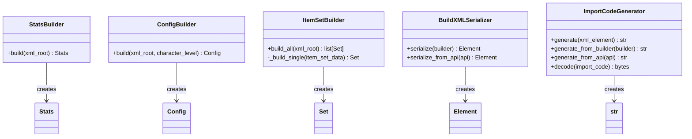

## Validator Classes

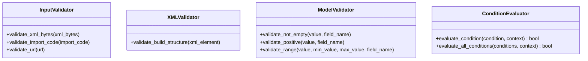

## Exception Classes

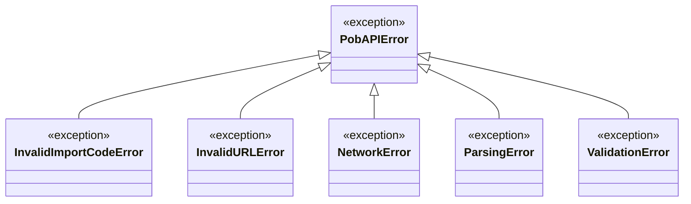

## Interface Classes (Protocols)

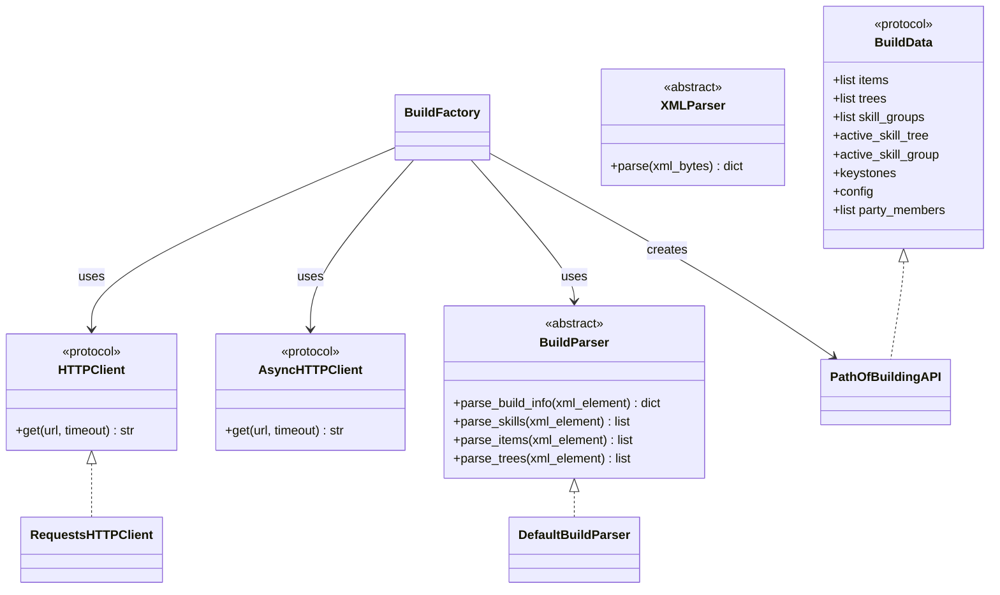

## Game Data Classes

```mermaid
classDiagram
    class PassiveNode {
        +int node_id
        +str name
        +list[str] stats
        +bool is_keystone
        +bool is_notable
        +bool is_jewel_socket
        +bool class_start
        +list[str]|None mastery_effects
        +int|None passive_skill_graph_id
        +str|None flavour_text
        +list[str] reminder_text_keys
        +list[str] passive_skill_buffs_keys
        +list[str] stat_keys
        +list[int|float] stat_values
        +str|None icon_path
        +int skill_points_granted
        +float|None x
        +float|None y
        +list[int] connections
        +bool is_mastery
        +bool is_ascendancy
    }

    class SkillGem {
        +str name
        +dict base_damage
        +float damage_effectiveness
        +float cast_time
        +float attack_time
        +float mana_cost
        +float mana_cost_percent
        +list[str] quality_stats
        +list[str] level_stats
        +bool is_attack
        +bool is_spell
        +bool is_totem
        +bool is_trap
        +bool is_mine
        +str|None game_id
        +str|None variant_id
    }

    class UniqueItem {
        +str name
        +list[str] modifiers
        +dict special_effects
        +str|None base_type
        +int|None item_level_required
    }

    class GameDataLoader {
        -dict _passive_tree_data
        -dict _skill_gem_data
        -dict _unique_item_data
        +load_passive_tree_data(data_path) dict
        +load_skill_gem_data(data_path) dict
        +load_unique_item_data(data_path) dict
        +get_passive_node(node_id) PassiveNode|None
        +get_skill_gem(gem_name) SkillGem|None
        +get_unique_item(item_name) UniqueItem|None
    }

    class PantheonGod {
        +str name
        +list[PantheonSoul] souls
    }

    class PantheonSoul {
        +str name
        +list[str] mods
    }

    class PartyMember {
        +str name
        +dict stats
        +list[Modifier] modifiers
    }

    class MinionStats {
        +float life
        +float damage
        +float speed
        +float accuracy
        +float crit_chance
        +float crit_multiplier
    }

    class MirageStats {
        +float damage
        +float speed
        +float duration
        +int count
    }

    class LegionJewelType {
        <<class>>
        GLORIOUS_VANITY
        LETHAL_PRIDE
        BRUTAL_RESTRAINT
        MILITANT_FAITH
        ELEGANT_HUBRIS
    }

    class LegionJewelData {
        +int jewel_type
        +int seed
        +int|None node_id
        +dict[int,list[str]]|None modified_nodes
        +__post_init__()
    }

    class LegionJewelHelper {
        -str|None data_directory
        -dict _lut_cache
        +__init__(data_directory)
        +_find_jewel_file(jewel_type_name) str|None
        +load_timeless_jewel(jewel_type, node_id) bool
        +get_node_modifications(jewel_type, seed, node_id) dict[int,list[str]]
    }

    GameDataLoader --> PassiveNode : loads
    GameDataLoader --> SkillGem : loads
    GameDataLoader --> UniqueItem : loads
    PantheonGod --> PantheonSoul : contains
```

## Type Definitions and Enums

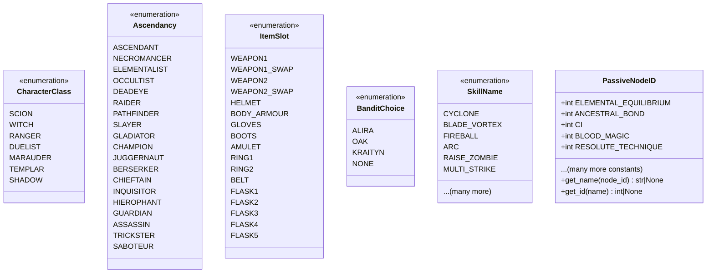

## Additional Classes

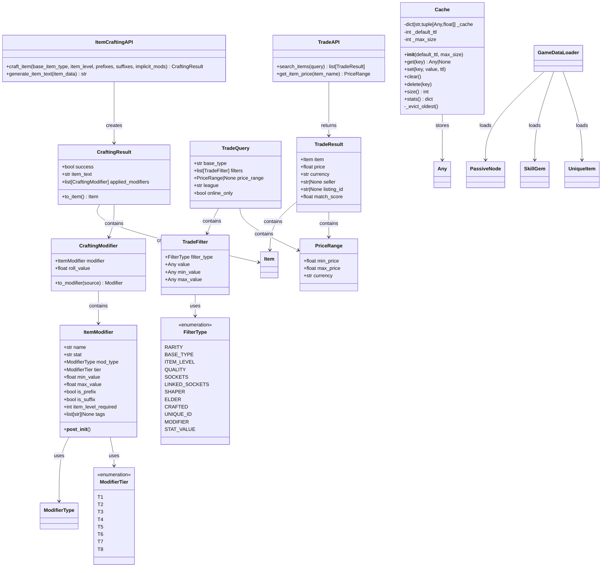

## Relationships Overview

```mermaid
classDiagram
    PathOfBuildingAPI --> BuildModifier : uses
    PathOfBuildingAPI --> BuildParser : uses
    PathOfBuildingAPI --> Item : contains
    PathOfBuildingAPI --> Set : contains
    PathOfBuildingAPI --> Tree : contains
    PathOfBuildingAPI --> SkillGroup : contains
    PathOfBuildingAPI --> Gem : contains
    PathOfBuildingAPI --> GrantedAbility : contains
    PathOfBuildingAPI --> Config : contains
    PathOfBuildingAPI --> Stats : contains
    PathOfBuildingAPI --> Keystones : contains
    BuildBuilder --> PathOfBuildingAPI : creates
    BuildFactory --> PathOfBuildingAPI : creates
    BuildFactory --> HTTPClient : uses
    BuildFactory --> AsyncHTTPClient : uses
    BuildFactory --> BuildParser : uses
    CalculationEngine --> ModifierSystem : uses
    CalculationEngine --> DamageCalculator : uses
    CalculationEngine --> DefenseCalculator : uses
    CalculationEngine --> ResourceCalculator : uses
    CalculationEngine --> SkillStatsCalculator : uses
    CalculationEngine --> MinionCalculator : uses
    CalculationEngine --> PartyCalculator : uses
    CalculationEngine --> MirageCalculator : uses
    CalculationEngine --> PantheonTools : uses
    ModifierSystem --> Modifier : contains
    Modifier --> ModifierType : uses
    DamageCalculator --> ModifierSystem : uses
    DamageCalculator --> DamageBreakdown : returns
    DefenseCalculator --> ModifierSystem : uses
    DefenseCalculator --> DefenseStats : returns
    ResourceCalculator --> ModifierSystem : uses
    SkillStatsCalculator --> ModifierSystem : uses
    MinionCalculator --> ModifierSystem : uses
    MinionCalculator --> MinionStats : returns
    PartyCalculator --> ModifierSystem : uses
    PartyCalculator --> PartyMember : contains
    MirageCalculator --> ModifierSystem : uses
    MirageCalculator --> DamageCalculator : uses
    MirageCalculator --> MirageStats : returns
    MirageStats --> DamageBreakdown : contains
    PenetrationCalculator --> ModifierSystem : uses
    PantheonTools --> ModifierSystem : uses
    PantheonTools --> PantheonGod : uses
    PantheonGod --> PantheonSoul : contains
    ItemModifierParser --> Modifier : creates
    SkillModifierParser --> Modifier : creates
    PassiveTreeParser --> Modifier : creates
    ConfigModifierParser --> Modifier : creates
    UniqueItemParser --> Modifier : creates
    JewelParser --> Modifier : creates
    JewelParser --> JewelType : uses
    LegionJewelHelper --> LegionJewelType : uses
    LegionJewelHelper --> LegionJewelData : creates
    StatsBuilder --> Stats : creates
    ConfigBuilder --> Config : creates
    ItemSetBuilder --> Set : creates
    BuildXMLSerializer --> Element : creates
    ImportCodeGenerator --> str : creates
    GameDataLoader --> PassiveNode : loads
    GameDataLoader --> SkillGem : loads
    GameDataLoader --> UniqueItem : loads
    ItemCraftingAPI --> CraftingResult : creates
    CraftingResult --> Item : creates
    CraftingResult --> CraftingModifier : contains
    CraftingModifier --> ItemModifier : contains
    ItemModifier --> ModifierType : uses
    ItemModifier --> ModifierTier : uses
    TradeAPI --> TradeResult : returns
    TradeResult --> Item : contains
    TradeResult --> PriceRange : contains
    TradeQuery --> TradeFilter : contains
    TradeQuery --> PriceRange : contains
    TradeFilter --> FilterType : uses
    SkillGroup --> Gem : contains
    SkillGroup --> GrantedAbility : contains
    Set --> Item : references
    Tree --> Item : references (jewels)
    Ability <|-- Gem
    Ability <|-- GrantedAbility
    HTTPClient <|.. RequestsHTTPClient
    BuildData <|.. PathOfBuildingAPI
    BuildParser <|.. DefaultBuildParser
    PobAPIError <|-- InvalidImportCodeError
    PobAPIError <|-- InvalidURLError
    PobAPIError <|-- NetworkError
    PobAPIError <|-- ParsingError
    PobAPIError <|-- ValidationError
    PathOfBuildingAPI --> CharacterClass : uses
    PathOfBuildingAPI --> Ascendancy : uses
    PathOfBuildingAPI --> ItemSlot : uses
    PathOfBuildingAPI --> BanditChoice : uses
    BuildBuilder --> CharacterClass : uses
    BuildBuilder --> Ascendancy : uses
    BuildBuilder --> BanditChoice : uses
    BuildModifier --> ItemSlot : uses
    SkillGroup --> SkillName : uses
    PassiveTreeParser --> PassiveNodeID : uses
```
