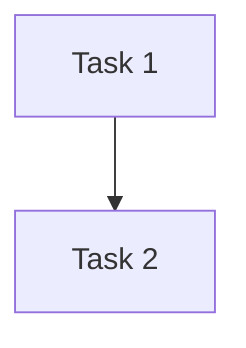

# {{ t.plan.title.replace('{phase_number}', phase_number) }}

> **{{ t.plan.subtitle }}**
>
> **{{ t.plan.sections.global_contribution }}:**
> {{ t.plan.prompts.global_contribution }}

---

## {{ t.plan.sections.overview }}

{{ t.plan.prompts.overview }}

**{{ t.common.status }}:** {{ t.common.tbd }}

<!-- Describe the overall implementation approach -->

---

## {{ t.plan.sections.tasks }}

{{ t.plan.prompts.tasks }}

### {{ t.common.status }}: {{ t.common.tbd }}

### Task 1: {{ t.common.tbd }}

**{{ t.design.sections.overview }}:** {{ t.common.tbd }}

**{{ t.plan.sections.timeline }}:** {{ t.common.tbd }}

**{{ t.plan.sections.dependencies }}:** {{ t.common.tbd }}

**{{ t.plan.sections.success_criteria }}:**
- [ ] {{ t.common.tbd }}

---

## {{ t.plan.sections.timeline }}

{{ t.plan.prompts.timeline }}

### {{ t.common.status }}: {{ t.common.tbd }}

```mermaid
gantt
    title {{ phase_number }} {{ t.plan.sections.timeline }}
    dateFormat YYYY-MM-DD
    section Tasks
    Task 1           :t1, {{ t.common.tbd }}, {{ t.common.tbd }}
```

---

## {{ t.plan.sections.dependencies }}

{{ t.plan.prompts.dependencies }}

### {{ t.common.status }}: {{ t.common.tbd }}



---

## {{ t.plan.sections.risks }}

{{ t.plan.prompts.risks }}

### {{ t.common.status }}: {{ t.common.tbd }}

### Risk 1: {{ t.common.tbd }}

**Probability:** {{ t.common.tbd }}

**Impact:** {{ t.common.tbd }}

**Mitigation:** {{ t.common.tbd }}

---

## {{ t.plan.sections.success_criteria }}

{{ t.plan.prompts.success_criteria }}

### {{ t.common.status }}: {{ t.common.tbd }}

- [ ] {{ t.common.tbd }}

---

## {{ t.plan.sections.testing }}

{{ t.plan.prompts.testing }}

### {{ t.common.status }}: {{ t.common.tbd }}

#### Unit Tests

- {{ t.common.tbd }}

#### Integration Tests

- {{ t.common.tbd }}

---

## {{ t.plan.sections.notes }}

<!-- Add any additional notes about the implementation plan -->

---

## {{ t.plan.sections.version_history }}

### v1.0 ({{ ''|now('utc', '%Y-%m-%d') }})
- {{ t.common.status }}: {{ t.common.draft }}
