# 기여 가이드 (Contributing Guide)

`pycobaltix` 프로젝트에 기여해주셔서 감사합니다! 이 문서는 개발 환경 설정부터 배포까지의 전체 프로세스를 안내합니다.

## 📋 목차

-   [개발 환경 설정](#개발-환경-설정)
-   [테스트 전략](#테스트-전략)
-   [코드 품질 관리](#코드-품질-관리)
-   [배포 사이클](#배포-사이클)
-   [기여 절차](#기여-절차)

## 🛠 개발 환경 설정

### 1. 저장소 클론 및 의존성 설치

```bash
git clone https://github.com/KAIS-Inc/pycobaltix.git
cd pycobaltix

# 개발 환경 설정
make dev-setup
```

### 2. 환경 변수 설정 (선택사항)

통합 테스트를 실행하려면 네이버 API 키가 필요합니다:

```bash
# .env 파일 생성
echo "NAVER_API_KEY_ID=your_api_key_id" > .env
echo "NAVER_API_KEY=your_api_key" >> .env
```

## 🧪 테스트 전략

### 테스트 피라미드

```
     🔺 E2E 테스트
    ────────────────
   🔺🔺 통합 테스트
  ────────────────────
 🔺🔺🔺 단위 테스트
```

### 1. 단위 테스트 (Unit Tests)

**목적**: 개별 함수/클래스의 기능 검증
**특징**:

-   외부 의존성 모킹
-   빠른 실행 속도
-   높은 커버리지 목표 (80% 이상)

```bash
# 단위 테스트 실행
make test-unit

# 특정 파일만 테스트
uv run pytest tests/unit_test_address.py -v
```

### 2. 통합 테스트 (Integration Tests)

**목적**: 실제 API와의 연동 검증
**특징**:

-   실제 네이버 API 호출
-   환경 변수 필요
-   상대적으로 느린 실행

```bash
# 통합 테스트 실행 (API 키 필요)
make test-integration

# 느린 테스트 제외하고 실행
make test-fast
```

### 3. 테스트 실행 옵션

```bash
# 모든 테스트 실행
make test-all

# 커버리지 리포트와 함께 실행
uv run pytest --cov=pycobaltix --cov-report=html

# 파일 변경 감지하여 자동 테스트
make test-watch

# 특정 마커만 실행
uv run pytest -m "unit"        # 단위 테스트만
uv run pytest -m "integration" # 통합 테스트만
uv run pytest -m "not slow"    # 느린 테스트 제외
```

## 🔍 코드 품질 관리

### 린팅 및 포매팅

```bash
# 코드 품질 종합 체크
make quality-check

# 개별 도구 실행
make lint           # 린팅
make format         # 포매팅
make type-check     # 타입 체크
make security-scan  # 보안 스캔
```

### 커밋 전 체크리스트

```bash
# 커밋 전 필수 체크
make pre-commit

# 푸시 전 종합 체크
make pre-push
```

## 🚀 배포 사이클

### 1. 개발 단계

```mermaid
graph LR
    A[개발] --> B[단위테스트]
    B --> C[린팅/포매팅]
    C --> D[타입체크]
    D --> E[커밋]
```



### 2. 통합 단계

```mermaid
graph LR
    A[PR 생성] --> B[CI 실행]
    B --> C[단위테스트]
    C --> D[통합테스트]
    D --> E[보안스캔]
    E --> F[코드리뷰]
    F --> G[머지]
```



### 3. 배포 단계


### 배포 명령어

```bash
# 로컬에서 빌드 테스트
make build

# 테스트 PyPI에 배포
make publish-test

# 실제 PyPI에 배포 (주의!)
make publish
```

## 📝 기여 절차

### 1. 이슈 생성 또는 확인

-   새로운 기능이나 버그 수정 전에 이슈를 생성하거나 기존 이슈를 확인
-   이슈에서 구현 방향에 대해 논의

### 2. 브랜치 생성

```bash
# feature 브랜치 생성
git checkout -b feature/your-feature-name

# bugfix 브랜치 생성
git checkout -b bugfix/your-bug-description
```

### 3. 개발 및 테스트

```bash
# 개발 중 지속적인 테스트
make test-unit

# 커밋 전 체크
make pre-commit
```

### 4. Pull Request 생성

-   제목: 명확하고 간결한 변경 사항 설명
-   내용: 변경 이유, 구현 방법, 테스트 방법 포함
-   관련 이슈 번호 명시

### 5. 코드 리뷰 및 머지

-   CI/CD 파이프라인 통과 확인
-   리뷰어의 피드백 반영
-   승인 후 머지

## 🎯 테스트 작성 가이드라인

### 단위 테스트 작성 규칙

1. **파일명**: `unit_test_*.py`
2. **클래스명**: `TestClassName`
3. **메서드명**: `test_specific_behavior`
4. **마커 사용**: `@pytest.mark.unit`

```python
@pytest.mark.unit
class TestMyClass:
    def test_initialization(self):
        """초기화 테스트"""
        obj = MyClass(param="test")
        assert obj.param == "test"

    def test_method_with_mock(self, mock_dependency):
        """의존성 모킹 테스트"""
        # given
        mock_dependency.return_value = "mocked"
        obj = MyClass()

        # when
        result = obj.method_using_dependency()

        # then
        assert result == "expected"
        mock_dependency.assert_called_once()
```

### 통합 테스트 작성 규칙

1. **파일명**: `integration_test_*.py`
2. **마커 사용**: `@pytest.mark.integration`, `@pytest.mark.slow`
3. **환경 변수**: 실제 API 키 필요 시 skip 처리

```python
@pytest.mark.integration
@pytest.mark.slow
class TestAPIIntegration:
    @pytest.fixture(scope="class")
    def api_client(self):
        api_key = os.getenv("API_KEY")
        if not api_key:
            pytest.skip("API 키가 필요합니다")
        return APIClient(api_key)

    def test_real_api_call(self, api_client):
        """실제 API 호출 테스트"""
        result = api_client.call_api("test_data")
        assert result is not None
```

## 🚨 주의사항

### 보안

-   API 키를 커밋에 포함하지 마세요
-   민감한 정보는 환경 변수로 관리
-   `.env` 파일은 `.gitignore`에 포함

### 성능

-   통합 테스트는 실제 API 호출하므로 적절한 간격 유지
-   테스트 데이터는 최소한으로 유지
-   느린 테스트는 `@pytest.mark.slow` 마커 사용

### 코드 스타일

-   ruff를 사용한 자동 포매팅 준수
-   타입 힌트 사용 권장
-   한국어 주석/docstring 허용

## 📞 문의

궁금한 점이 있으시면 이슈를 생성하거나 메인테이너에게 연락해주세요.

---

**Happy Coding! 🎉**
