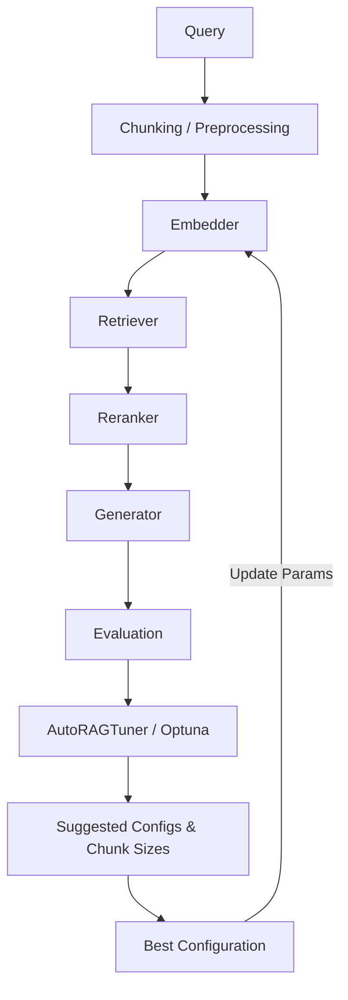

# Ragmint

<p align="center">
  
</p>


**Ragmint** (Retrieval-Augmented Generation Model Inspection & Tuning) is a modular, developer-friendly Python library for **evaluating, optimizing, and tuning RAG (Retrieval-Augmented Generation) pipelines**.

It provides a complete toolkit for **retriever selection**, **embedding model tuning**, **automated RAG evaluation**, and **config-driven prebuilding** of pipelines with support for **Optuna-based Bayesian optimization**, **Auto-RAG tuning**, **chunking**, and **explainability** through Gemini or Claude.

---

## ✨ Features

- ✅ **Automated hyperparameter optimization** (Grid, Random, Bayesian via Optuna).
- 🤖 **Auto-RAG Tuner** — dynamically recommends retriever–embedding pairs based on corpus size and document statistics, **suggests multiple chunk sizes with overlaps**, and can **test configurations to identify the best-performing RAG setup**.
- 🧮 **Validation QA Generator** — automatically creates QA datasets from a corpus for evaluating and tuning RAG pipelines when no labeled data is available.
- 🧠 **Explainability Layer** — interprets RAG performance via Gemini or Claude APIs.
- 🏆 **Leaderboard Tracking** — stores and ranks experiment runs via JSON or external DB.
- 🔍 **Built-in RAG evaluation metrics** — faithfulness, recall, BLEU, ROUGE, latency.
- 📦 **Chunking system** — automatic or configurable `chunk_size` and `overlap` for documents with multiple suggested pairs.  
- ⚙️ **Retrievers** — FAISS, Chroma, scikit-learn.  
- 🧩 **Embeddings** — Hugging Face.
- 💾 **Caching, experiment tracking, and reproducibility** out of the box.
- 🧰 **Clean modular structure** for easy integration in research and production setups.
- 🏗️ **Langchain Prebuilder** — prepares pipelines, applies chunking, embeddings, and vector store creation automatically.
- ⚙️ **Config Adapter (LangchainConfigAdapter)** — normalizes configuration, fills defaults, validates retrievers.

---

## 🚀 Quick Start

### Installation

```bash
git clone https://github.com/andyolivers/ragmint.git
cd ragmint
pip install -e .
python -m ragmint.app
```

> The `-e` flag installs Ragmint in editable (development) mode.  
> Requires **Python ≥ 3.9**.

### Installation via PyPI

```bash
pip install ragmint
```

---

### 2️⃣ Run a RAG Optimization Experiment

```bash
python ragmint/main.py --config configs/default.yaml --search bayesian
```

Example `configs/default.yaml`:
```yaml
retriever: faiss
embedding_model: text-embedding-3-small
chunk_size: 500
overlap: 100
reranker:
  mode: mmr
  lambda_param: 0.5
optimization:
  search_method: bayesian
  n_trials: 20
```

---

### 3️⃣ Manual Pipeline Usage

```python
from ragmint.prebuilder import PreBuilder
from ragmint.tuner import RAGMint

# Prebuild pipeline (chunking, embeddings, vector store)
prebuilder = PreBuilder(
    docs_path="data/docs/",
    config_path="configs/default.yaml"
)
pipeline = prebuilder.build_pipeline()

# Initialize RAGMint with prebuilt components
rag = RAGMint(pipeline=pipeline)

# Run optimization
best, results = rag.optimize(validation_set=None, metric="faithfulness", trials=3)
print("Best configuration:", best)

```
---
# 🧩 Embeddings and Retrievers

**Ragmint** supports a flexible set of embeddings and retrievers, allowing you to adapt easily to various **RAG architectures**.

---
## 🧩 Chunking System

* **Automatically splits documents** into chunks with `chunk_size` and `overlap` parameters.
* **Supports default values** if not provided in configuration.
* **Optimized** for downstream **retrieval and embeddings**.
* **Enables adaptive chunking strategies** in future releases.
---
## 🧮 Validation QA Generator

The **QA Generator** module automatically creates **question–answer (QA) validation datasets** from any corpus of `.txt` documents.  
This dataset can be used to **evaluate and tune RAG pipelines** inside Ragmint when no labeled data is available.

### ✨ Key Capabilities

- 🔁 **Batch processing** — splits large corpora into batches to prevent token overflows and API timeouts.

- 🧠 **Topic-aware question estimation** — dynamically determines how many questions to generate per document based on:
  - Document length (logarithmic scaling)
  - Topic diversity (via `SentenceTransformer` + `KMeans` clustering)

- 🤖 **LLM-powered QA synthesis** — generates factual QA pairs using **Gemini** or **Claude** models.

- 💾 **Automatic JSON export** — saves the generated dataset to `experiments/validation_qa.json` (configurable).

### ⚙️ Usage

You can run the generator directly from the command line:

```bash
python -m ragmint.qa_generator --density 0.005
```

### 💡 Example: Using in Python

```python
from ragmint.qa_generator import generate_validation_qa

generate_validation_qa(
    docs_path="data/docs",                          # Folder with .txt documents
    output_path="experiments/validation_qa.json",   # Output JSON file
    llm_model="gemini-2.5-flash-lite",              # or "claude-3-opus-20240229"
    batch_size=5,                                   # Number of docs per LLM call
    sleep_between_batches=2,                        # Wait time between calls (seconds)
    min_q=3,                                        # Minimum questions per doc
    max_q=25                                        # Maximum questions per doc
)
```
✅ The generator supports both Gemini and Claude models.  
Set your API key in a `.env` file or via environment variables:
```
export GOOGLE_API_KEY="your_gemini_key"
export ANTHROPIC_API_KEY="your_claude_key"
```

---
## 🧩 Langchain Config Adapter

* **Ensures consistent configuration** across pipeline components.
* **Normalizes retriever and embedding names** (e.g., `faiss`, `sentence-transformers/...`).
* **Adds default chunk parameters** when missing.
* **Validates retriever backends** and **raises clear errors** for unsupported options.

---
## 🧩 Langchain Prebuilder

**Automates pipeline preparation:**
1. Reads documents
2. Applies chunking
3. Creates embeddings
4. Initializes retriever / vector store
5. Returns ready-to-use pipeline** for RAGMint or custom usage.

---

## 🔤 Available Embeddings (Hugging Face)

You can select from the following models:

* `sentence-transformers/all-MiniLM-L6-v2` — **lightweight**, general-purpose
* `sentence-transformers/all-mpnet-base-v2` — **higher accuracy**, slower
* `BAAI/bge-base-en-v1.5` — **multilingual**, dense embeddings
* `intfloat/multilingual-e5-base` — ideal for **multilingual corpora**


### Configuration Example

Use the following format in your config file to specify the embedding model:

```yaml
embedding_model: sentence-transformers/all-MiniLM-L6-v2
```
---

## 🔍 Available Retrievers

**Ragmint** integrates multiple **retrieval backends** to suit different needs:

| Retriever | Description |
| :--- | :--- |
| **FAISS** | Fast vector similarity search; efficient for dense embeddings |
| **Chroma** | Persistent vector DB; works well for incremental updates |
| **scikit-learn (NearestNeighbors)** | Lightweight, zero-dependency local retriever |


### Configuration Example

To specify the retriever in your configuration file, use the following format:

```yaml
retriever: faiss
```

---

## 🧪 Dataset Options

Ragmint can automatically load evaluation datasets for your RAG pipeline:

| Mode | Example | Description |
|------|----------|-------------|
| 🧱 **Default** | `validation_set=None` | Uses built-in `experiments/validation_qa.json` |
| 📁 **Custom File** | `validation_set="data/my_eval.json"` | Load your own QA dataset (JSON or CSV) |
| 🌐 **Hugging Face Dataset** | `validation_set="squad"` | Automatically downloads benchmark datasets (requires `pip install datasets`) |

### Example

```python
from ragmint.tuner import RAGMint

ragmint = RAGMint(
    docs_path="data/docs/",
    retrievers=["faiss", "chroma"],
    embeddings=["text-embedding-3-small"],
    rerankers=["mmr"],
)

# Use built-in default
ragmint.optimize(validation_set=None)

# Use Hugging Face benchmark
ragmint.optimize(validation_set="squad")

# Use your own dataset
ragmint.optimize(validation_set="data/custom_qa.json")
```

---

## 🧠 Auto-RAG Tuner

The **AutoRAGTuner** automatically analyzes your corpus and recommends retriever–embedding combinations based on corpus statistics (size and average document length). It also **suggests multiple chunk sizes with overlaps** to improve retrieval performance.

Beyond recommendations, it can **run full end-to-end testing** of the suggested configurations and **identify the best-performing RAG setup** for your dataset.


```python
from ragmint.autotuner import AutoRAGTuner

# Initialize with your documents
tuner = AutoRAGTuner(docs_path="data/docs/")

# Recommend configurations and suggest chunk sizes
recommendation = tuner.recommend(num_chunk_pairs=5)
print("Initial recommendation:", recommendation)

# Run full auto-tuning on validation set
best_config, results = tuner.auto_tune(validation_set="data/validation.json", trials=5)
print("Best configuration after testing:", best_config)
print("All trial results:", results)
```
---
## 🧠 Gradio Dashboard
Ragmint includes a visual dashboard to AutoTune and analyze RAG pipelines.

<p align="center">
  
</p>
<p align="center">
  
</p>

---

## 🏆 Leaderboard Tracking

Track and visualize your best experiments across runs.

```python
from ragmint.leaderboard import Leaderboard

# Initialize local leaderboard
leaderboard = Leaderboard(storage_path="leaderboard.jsonl")

# Retrieve top 5 runs
print("\n🏅 Top 5 Experiments:")
for result in leaderboard.top_results(limit=5):
    print(f"{result['run_id']} | Score: {result['best_score']:.2f} | Model: {result['model']}")
```

---

## 🧠 Explainability with Gemini / Claude

Compare RAG configurations and receive **natural language insights** on why one performs better.

```python
from ragmint.autotuner import AutoRAGTuner
from ragmint.explainer import explain_results

tuner = AutoRAGTuner(docs_path="data/docs/")
best, results = tuner.auto_tune(
    validation_set='data/docs/validation_qa.json',
    metric="faithfulness",
    trials=5,
    search_type='bayesian'
)

analysis = explain_results(best, results, corpus_stats=tuner.corpus_stats)
print(analysis)
```

> Set your API keys in a `.env` file or via environment variables:
> ```
> export GEMINI_API_KEY="your_gemini_key"
> export ANTHROPIC_API_KEY="your_claude_key"
> ```

---

## 🧩 Folder Structure

```
ragmint/
├── core/
│   ├── pipeline.py
│   ├── retriever.py
│   ├── reranker.py
│   ├── embeddings.py
│   ├── chunking.py
│   └── evaluation.py
├── integration/
│   ├── config_adapter.py
│   └── langchain_prebuilder.py
├── autotuner.py
├── explainer.py
├── leaderboard.py
├── tuner.py
├── utils/
├── configs/
├── experiments/
├── tests/
└── main.py
```

---

## 🧪 Running Tests

```bash
pytest -v
```

To include integration tests with Gemini or Claude APIs:
```bash
pytest -m integration
```

---

## ⚙️ Configuration via `pyproject.toml`

Your `pyproject.toml` includes all required dependencies:

```toml
[project]
name = "ragmint"
version = "0.1.0"
dependencies = [
  # Core ML + Embeddings
  "numpy<2.0.0",
  "pandas>=2.0",
  "scikit-learn>=1.3",
  "sentence-transformers>=2.2.2",

  # Retrieval backends
  "chromadb>=0.4",
  "faiss-cpu; sys_platform != 'darwin'",       # For Linux/Windows
  "faiss-cpu==1.7.4; sys_platform == 'darwin'", # Optional fix for macOS MPS
  "rank-bm25>=0.2.2",                          # For BM25 retriever

  # Optimization & evaluation
  "optuna>=3.0",
  "tqdm",
  "colorama",

  # RAG evaluation and data utils
  "pyyaml",
  "python-dotenv",

  # Explainability and LLM APIs
  "openai>=1.0.0",
  "google-generativeai>=0.8.0",
  "anthropic>=0.25.0",

  # Integration / storage
  "supabase>=2.4.0",

  # Testing
  "pytest",

  # LangChain integration layer
  "langchain>=0.2.5",
  "langchain-community>=0.2.5",
  "langchain-text-splitters>=0.2.1"
]
```

---

## 📊 Example Experiment Workflow

1. Define your retriever, embedding, and reranker setup  
2. Launch optimization (Grid, Random, Bayesian) or AutoTune  
3. Compare performance with explainability  
4. Persist results to leaderboard for later inspection  

---

## 🧬 Architecture Overview



---

## 📘 Example Output

```
[INFO] Starting Auto-RAG Tuning
[INFO] Suggested retriever=Chroma, embedding_model=sentence-transformers/all-MiniLM-L6-v2
[INFO] Suggested chunk-size candidates: [(380, 80), (420, 100), (350, 70), (400, 90), (360, 75)]
[INFO] Running full evaluation on validation set with 5 trials
[INFO] Trial 1 finished: faithfulness=0.82, latency=0.40s
[INFO] Trial 2 finished: faithfulness=0.85, latency=0.44s
...
[INFO] Best configuration after testing: {'retriever': 'Chroma', 'embedding_model': 'sentence-transformers/all-MiniLM-L6-v2', 'chunk_size': 400, 'overlap': 90, 'strategy': 'sentence'}
```
---
## 🧾 Citation
If you use **Ragmint** in your research, please cite:
```markdown
@software{oliveira2025ragmint,
  author = {André Oliveira},
  title = {Ragmint: Retrieval-Augmented Generation Model Inspection & Tuning},
  year = {2025},
  url = {https://github.com/andyolivers/ragmint},
  license = {Apache-2.0}
}
```

---

<p align="center">
  <sub>Built with ❤️ by <a href="https://andyolivers.com">André Oliveira</a> | Apache 2.0 License</sub>
</p>
